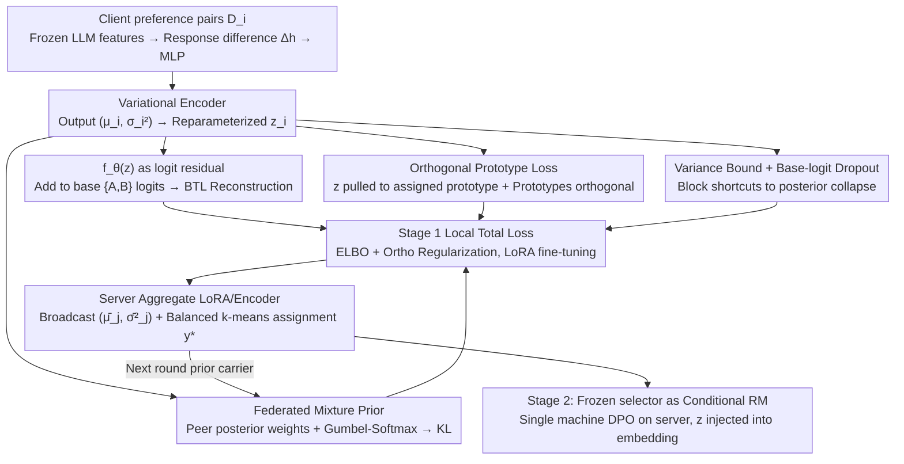

# Federated Variational Preference Alignment with Gumbel-Softmax Prior for Personalized User Preferences

**Conference**: ICML 2026  
**arXiv**: [2605.30873](https://arxiv.org/abs/2605.30873)  
**Code**: TBD  
**Area**: Alignment RLHF / Federated Learning / LLM Personalization  
**Keywords**: Federated Preference Alignment, Variational Inference, Gumbel-Softmax Mixture Prior, Posterior Collapse, Personalized RLHF

## TL;DR
This paper proposes FedVPA-GP: Under the privacy constraints of Federated Learning (FL), it models each client's preference as a continuous latent variable $z$ using a "client mixture prior + Gumbel-Softmax learnable weights + orthogonal prototype loss." This fundamentally fixes the "posterior collapse" encountered when directly applying VPL to FL, enabling a single reward model to switch dynamically between conflicting preferences such as "helpful" and "harmless."

## Background & Motivation
**Background**: Current mainstream LLM alignment pipelines (RLHF / DPO / IPO / KTO) assume that preference data can be centralized to train a global reward model. To bypass privacy and compliance constraints, federated schemes like FedDPO and FedBiscuit have recently emerged, allowing RLHF to be completed locally on clients by exchanging only gradients or lightweight selectors.

**Limitations of Prior Work**: All these federated schemes assume that human preferences can be fitted by a single (monolithic) reward function. However, datasets like HH-RLHF have shown that the demands for "helpful" and "harmless" are directly contradictory in many scenarios. Averaging heterogeneous preferences across clients into a consensus model creates a non-existent "lowest common denominator," failing to satisfy either objective effectively.

**Key Challenge**: Personalization requires building a preference representation for each user/client. However, in an FL setting, each client has extremely few samples and highly heterogeneous distributions (in extreme cases, seeing only "helpful" or only "harmless" preferences). If centralized Variational Preference Learning (VPL) is applied directly, the KL regularization term overwhelms the reconstruction term, pulling the posterior distribution back to $\mathcal{N}(0, I)$. This leads to classic "posterior collapse," where the latent variable $z$ loses information and the personalization mechanism fails (as shown in Figure 2(a), where the $z_{\text{VPL}}$ of FedVPL is completely clustered together).

**Goal**: To enable local variational inference for each client in a way that is (a) stable (not broken by data sparsity) and (b) decoupled (distinct preference modes are clearly separated in the latent space), without exchanging raw preference data.

**Key Insight**: "Local sparsity" is essentially a "lack of global context," and the group distribution in FL can serve as a dynamic prior. Instead of transmitting raw data, the system transmits posterior statistics $(\bar\mu_j, \bar\sigma_j^2)$, allowing each client to treat "others' posteriors" as its own prior. By adding a geometric constraint that explicitly forces prototypes to be orthogonal, the encoder is forced to map different preferences into distinct subspaces.

**Core Idea**: Replace the standard Gaussian prior with a "weighted mixture of peer posteriors" and use Gumbel-Softmax to make the mixture weights learnable for each client. Then, use an orthogonal prototype loss to anchor the "helpful mode" and "harmless mode" onto orthogonal directions in the latent space, simultaneously resolving "training instability" and "posterior collapse."

## Method

### Overall Architecture
FedVPA-GP follows the two-stage paradigm of FedBiscuit (federated training of a lightweight selector followed by conditional RLHF on the server), but replaces the core selector with a variational module. The base LLM (Qwen-2 0.5B / Gemma-2B) remains frozen throughout, with only approximately 0.18% of the parameters being trainable, encoding each client's preference into a continuous latent variable $z$. The crux of the method is preventing posterior collapse through three interlocking designs: Federated Mixture Prior, Orthogonal Prototype Loss, and Variance Bound + Base-logit Dropout, which stabilize training and separate conflicting preferences on sparse and heterogeneous federated data.

### Key Designs

**1. Federated Mixture Prior + Gumbel-Softmax Learnable Weights: Using "Others' Posteriors" as My Prior**

Moving the fixed standard Gaussian prior $\mathcal{N}(0,I)$ of VPL to FL is equivalent to having "no global guidance." When local data is sparse, the KL term flattens the posterior back to the origin. FedVPA-GP reformulates the prior as a weighted mixture of peer posteriors $p_{\text{mixture}}^{(i)}(z) = \sum_{j \in \mathcal{S}} w_j \mathcal{N}_j(z)$, where each $\mathcal{N}_j$ is the posterior uploaded by peer $j$ in the previous round—exchanging only $(\bar\mu_j, \bar\sigma_j^2)$, totaling 256 bytes, significantly smaller than LoRA adapters. Weights cannot be simply averaged, as clients with conflicting preferences would drag each other down. Thus, Gumbel-Softmax reparameterization $w_j = \mathrm{softmax}((\log\pi_j + g_j)/\tau)$ is used, allowing $\pi_j$ to be learned end-to-end with the KL term. Each client maintains its own $\{\pi_j\}$ without federated averaging, preserving a local strategy of "which peers to trust." This allows clients with similar preference modes to provide priors for each other while shielding different modes, automatically implementing "neighbor filtering." The KL term $\mathbb{D}_{KL}(q_i \,\|\, p_{\text{mixture}}^{(i)})$ is evaluated stably via log-sum-exp.

**2. Orthogonal Prototype Loss: Anchoring a Discrete Skeleton into Continuous Latent Space**

KL regularization alone cannot guarantee the separation of conflicting modes—t-SNE of FedVPL shows all $z$ tangled together. This method maintains $M$ learnable prototypes $\{\mathbf{p}_m\}_{m=1}^M$, initialized via QR decomposition to ensure they are strictly orthogonal and far from the origin. After each round of server aggregation, balanced $k$-means is used on the client means to assign a prototype label $y_i^*$ (in HH-RLHF, $M=2$, corresponding to the helpful/harmless axes). An additional local loss is added: $\mathcal{L}_{\text{ortho}}(z) = \|z - \mathbf{p}_{y_i^*}\|_2^2 + \gamma\|\mathbf{P}\mathbf{P}^T - \mathbf{I}_M\|_F^2$. The first term pulls the current sample's $z$ toward its assigned prototype, while the second prevents prototypes from collapsing into each other. This explicitly injects the inductive bias that "preference modes are finite discrete structures" into the continuous latent space. This provides the encoder with a clear geometric attractor to combat posterior collapse and provides a clear addressable $z$ for the Stage 2 conditional policy. Increasing $M$ corresponds to finer-grained preference spectrums.

**3. Variance Bound + Base-logit Dropout: Blocking the Two Escape Routes of Posterior Collapse**

The VAE community has long observed that KL is a target "easy to cheat"—if $q$ equals $p$, KL becomes 0, and $z$ carries no information. This work adds two engineering safeguards: first, a hard truncation on the encoder's log-variance output $\log\sigma_i^2 \leftarrow \min(\log\sigma_i^2, \log\sigma_{\max}^2)$, preventing the encoder from "cheaply matching the prior" by simply blowing up $\sigma$. Second, when the base LLM already has a strong prior signal for $\{A,B\}$ (common in small models like Qwen-2 0.5B), a Bernoulli dropout ($p_{\text{logit}}=0.5$) is applied to the base choice-logits. This forces $f_\theta(z)$ to take independent responsibility for prediction on those steps, pushing gradients back into $z$. For Gemma-2B, where the base signal is weaker, $p_{\text{logit}}=0$ is used. These two tactics block the shortcuts of "increasing variance" and "relying on the base model," layering with the previous designs to form a complete anti-collapse system.

### Main Results
GPT-4o judge Win-rate (%) on HH-RLHF, Non-IID split (50% clients only helpful, 50% only harmless).

| Base | Method | 10 Clients H/Hm | 50 Clients H/Hm | 100 Clients H/Hm |
|------|------|----------------|----------------|------------------|
| Qwen-2 0.5B | FedDPO | 48.12 / 77.34 | 43.05 / 69.22 | 41.48 / 67.15 |
| Qwen-2 0.5B | FedBiscuit | 48.85 / 75.12 | 44.21 / 71.45 | 42.33 / 69.42 |
| Qwen-2 0.5B | FedVPL (naive) | 62.24 / 84.56 | 54.18 / 78.12 | 53.05 / 77.34 |
| Qwen-2 0.5B | **FedVPA-GP** | **66.45 / 89.21** | **58.32 / 84.05** | **55.18 / 82.31** |
| Gemma-2B | FedDPO | 52.34 / 83.12 | 44.15 / 78.45 | 41.22 / 75.33 |
| Gemma-2B | FedBiscuit | 51.65 / 82.45 | 46.21 / 78.12 | 43.44 / 76.05 |
| Gemma-2B | FedVPL (naive) | 66.82 / 89.15 | 56.41 / 84.34 | 53.25 / 80.42 |
| Gemma-2B | **FedVPA-GP** | **73.21 / 96.34** | **64.48 / 95.12** | **60.15 / 92.45** |

FedVPA-GP achieves Pareto improvements across both models and all client scales (rather than trading one objective for another). As the number of clients increases and local data becomes sparser, all baselines drop significantly, while the drop in this method is minimized, verifying the "anti-sparsity" effect of the mixture prior.

### Ablation Study

| Configuration | Key Metrics | Description |
|------|---------|------|
| FedVPL (naive) | 62.24 / 84.56 (Qwen, N=10) | Std Gaussian prior + no ortho, acts as lower bound |
| FedVPL + Ortho | Between FedVPL and full model | Ortho loss only, alleviates posterior collapse |
| FedVPL + GB Prior | Between FedVPL and full model | Mixture prior only, stabilizes training under sparsity |
| Full FedVPA-GP | 66.45 / 89.21 (Qwen, N=10) | Synergy of both yields best trade-off |

Generalization to unseen clients (20 clients, 10 train / 10 test): FedVPA-GP scored 63.16 / 91.23 on Unseen, nearly identical to Seen (65.28 / 94.25). In contrast, FedVPL dropped sharply from 56.23 / 83.82 on Seen to 49.25 / 75.21 on Unseen, indicating that the learned latent space is continuous and semantic, adapting to new users via inference alone.

### Key Findings
- **Visual Verification of Posterior Collapse**: Figure 3's t-SNE shows red and blue points tangled in FedVPL throughout training, while FedVPA-GP separates the two types of latent variables around orthogonal prototypes (∗) within a few rounds, validating the synergy between "global context from mixture priors" and "geometric skeleton from orthogonal loss."
- **Zero-Cost Personalization Deployment**: The variational module has only ~0.9M parameters (0.18% of the base), and single-round communication adds only 256 bytes ($\bar\mu, \bar\sigma^2$ at 32-dim each). Training latency is only 1.18× FedDPO, meaning any federated alignment pipeline using LoRA can directly replace its selector with this method.
- **Systemic Flaws of Monolithic Reward Models**: Helpful win-rate for FedDPO/FedBiscuit on Qwen-2 stagnates or even decreases as client numbers increase, essentially "canceled out" by heterogeneous preferences. This proves that "averaging first" is the wrong paradigm for preference-conflict scenarios.

## Highlights & Insights
- **Turning FL's "Weakness" into a "Prior"**: FL is usually seen as a disaster for VPL (local sparsity + heterogeneity). This paper turns the "group posterior" into the most natural dynamic prior—requiring no raw data exchange while filling the gap in global perspective for individual clients.
- **Gumbel-Softmax on Prior Mixture Weights**: This makes the choice of "which peers to trust" an end-to-end learnable discrete selection, equivalent to embedding a "soft clustering" layer within variational inference. It is more robust than manual similarity metrics (like cosine or client clustering) and transferable to any federated task requiring personalized neighbor selection.
- **Orthogonal Prototype Loss + Balanced k-means**: The authors are explicitly declaring an inductive bias that "preference spaces are discrete modes with continuous fine-tuning." Orthogonal prototypes ensure independence between modes, while continuous $z$ captures individual differences.
- **Double Insurance Against Collapse**: Variance truncation and base-logit dropout are non-obvious but critical engineering details, reminding us to always check for trivial solutions when designing variational models.

## Limitations & Future Work
- On HH-RLHF, $M=2$ corresponds perfectly to the helpful/harmless axes. The authors did not fully verify if balanced $k$-means label assignment remains stable when $M$ is large or preference dimensions are more granular.
- The latent variable $z$ is a 32-dimensional "black box." The paper does not provide a unified interface for "how to select $z$ for new users during deployment."
- Experiments were conducted on base models ≤2B. On 70B-scale models where base logits are already extremely strong, it is unverified whether $p_{\text{logit}}$ needs to be further increased or $\beta, \lambda$ re-searched.
- From a privacy perspective, transmitting $(\bar\mu_j, \bar\sigma_j^2)$ might still leak preference statistics. Applying this to DP-FedAvg scenarios would require adding noise and re-analyzing the coupling with the KL term.

## Related Work & Insights
- **vs FedBiscuit (Wu et al., 2024)**: Both train a lightweight binary selector with a frozen base. However, FedBiscuit uses a monolithic reward, whereas this paper upgrades the selector to a conditional variational model.
- **vs FedDPO (Ye et al., 2024)**: FedDPO federates DPO gradients. This paper federates the "posterior of preference latents," leaving expensive strategy DPO for the server—a decoupling superior in communication and stability.
- **vs Variational Preference Learning (Poddar et al., 2024)**: Original VPL assumes pooled data. This paper answers "how VPL survives in FL" by attributing posterior instability to "lack of prior."
- **vs Multi-objective alignment / Model merging**: Those methods combine weights or objectives, while this paper combines in the latent dimension, which is parameter-efficient and naturally supports switching preferences via $z$.

## Rating
- Novelty: ⭐⭐⭐⭐ Adapting VPL to FL with mixture priors and orthogonal prototypes is a well-posed and novel solution.
- Experimental Thoroughness: ⭐⭐⭐ Results across 2 models and 3 scales with unseen client ablation are good, but limited to HH-RLHF and $M=2$.
- Writing Quality: ⭐⭐⭐⭐ Clear motivation and complete pseudocode ensure good reproducibility.
- Value: ⭐⭐⭐⭐ Addresses both "conflict preferences in federated alignment" and "variational stability in FL," offering significant insights for personalized, privacy-preserving LLM alignment.

<!-- RELATED:START -->

## Related Papers

- [\[ICML 2026\] Differentially Private Preference Data Synthesis for Large Language Model Alignment](differentially_private_preference_data_synthesis_for_large_language_model_alignm.md)
- [\[ICML 2026\] From Volume to Value: Preference-Aligned Memory Construction for On-Device RAG](from_volume_to_value_preference-aligned_memory_construction_for_on-device_rag.md)
- [\[ICML 2026\] Fair Dataset Distillation via Cross-Group Barycenter Alignment](fair_dataset_distillation_via_cross-group_barycenter_alignment.md)
- [\[NeurIPS 2025\] Brain-like Variational Inference](../../NeurIPS2025/ai_safety/brain-like_variational_inference.md)
- [\[ICML 2026\] Decoupled Training with Local Reinforcement Fine-Tuning in Federated Learning](decoupled_training_with_local_reinforcement_fine-tuning_in_federated_learning.md)

<!-- RELATED:END -->
