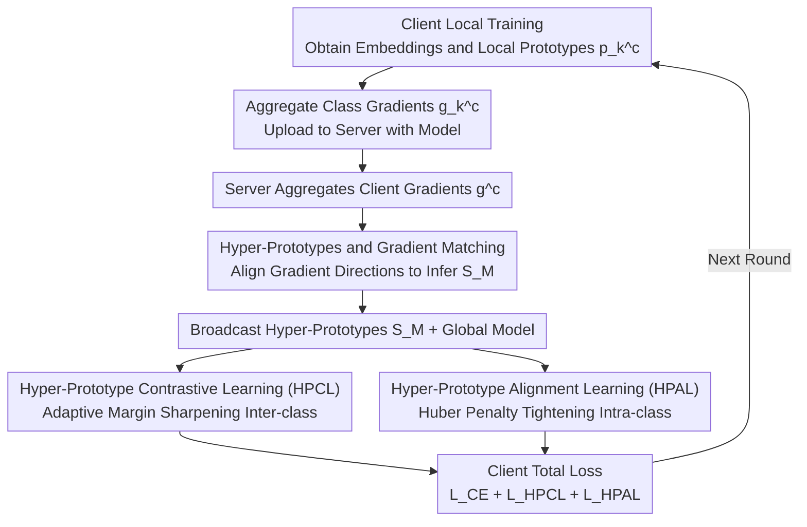

# FedHPro: Federated Hyper-Prototype Learning via Gradient Matching

**Conference**: ICML 2026  
**arXiv**: [2605.13475](https://arxiv.org/abs/2605.13475)  
**Code**: https://github.com/mala-lab/FedHPro (Available)  
**Area**: Federated Learning / Privacy Protection / Prototype Learning  
**Keywords**: Federated Learning, Data Heterogeneity, Hyper-Prototype, Gradient Matching, Contrastive Learning

## TL;DR
To address the "inheritance of client bias by global prototypes" in prototype-based federated learning, this paper proposes a set of learnable global hyper-prototypes. These hyper-prototypes simulate prototypes from centralized training via gradient matching on the server side. Combined with client-side contrastive learning and alignment loss, this approach significantly improves accuracy in heterogeneous scenarios.

## Background & Motivation

**Background**: Federated Learning (FL) enables collaborative training by sharing models instead of data, but non-IID data remains a core challenge. Prototype-based methods (FedProto, FedTGP, FedSA) align representation spaces across clients by transmitting class-wise feature means as "semantic anchors," becoming a mainstream approach to mitigate heterogeneity.

**Limitations of Prior Work**: Existing prototype methods follow a two-step route: "calculating prototypes on clients, then averaging on the server." This is essentially *prototype-level* aggregation. This route directly transfers client biases into the global signal—while class separation is clear in simple domains (MNIST), clusters overlap severely in difficult domains (SVHN/SYN), leading to the misclustering of boundary samples.

**Key Challenge**: The ideal approach is to train a unified representation space using all real samples from all clients and then calculate prototypes—yet this is prohibited by FL privacy constraints. Consequently, global prototypes can only "indirectly" reflect biased client data; whether through averaging or refining semantic anchors, the cycle of "client bias → global prototype bias" persists.

**Goal**: Decomposed into (a) how the server constructs a global signal that "approximates centralized training prototypes" and (b) how clients use this signal to simultaneously pull intra-class samples closer and push inter-class samples apart.

**Key Insight**: The authors observe an interesting fact—while the server cannot access real samples, it can receive the gradient $\mathbf{g}_k^c$ of the prototype relative to the real samples from each client. If a set of learnable vectors is initialized on the server and their gradients under a virtual classification loss are matched to the direction of $\mathbf{g}_k^c$, these vectors will follow the optimization trajectory that "would have been taken if real samples were present," indirectly absorbing the semantics of the real data.

**Core Idea**: Replace "statistical averaging" of global prototypes with "hyper-prototypes learned via gradient matching," and use them to drive two complementary objectives: inter-class contrastive and intra-class alignment.

## Method

### Overall Architecture
FedHPro aims to break the cycle where "global prototypes inherit client bias." Since raw samples cannot be transmitted to train clean centralized prototypes, the server uses learnable hyper-prototypes to "approximate" the behavior of centralized prototypes. Specifically, beyond standard FedAvg, clients upload class-aggregated gradients. The server iteratively refines a set of hyper-prototype tensors through gradient matching, then broadcasts them along with the global model to construct contrastive and alignment objectives on the client side. The process forms a "client → server → client" loop within one communication round.

### Key Designs

**1. Hyper-Prototypes and Gradient Matching: Gradients as Proxies for "Invisible Samples"**

Directly averaging local prototypes inevitably transfers statistical biases to the global signal, causing cluster overlap in difficult domains (SVHN/SYN). This paper changes the perspective: although the server lacks real samples, it can obtain the gradient of the prototype relative to real samples for each class $c$ on each client $k$: $\mathbf{g}_k^c = \tfrac{1}{n_k^c}\sum \nabla_{z_i}\mathcal{L}_k(x_i,y_i)$. After aggregation to $\mathbf{g}^c$, the server initializes learnable vectors $\{\mathbf{s}_i^c\}_{i=1}^{|\mathcal{I}|}$ for each class, calculates their own gradients $\mathbf{g}_{HP}^c$ under a virtual cross-entropy loss $\mathcal{L}_{vir}$, and minimizes $\mathcal{L}_{GM}=1-\cos(\mathbf{g}^c,\mathbf{g}_{HP}^c)$. This forces hyper-prototypes to evolve along the path real samples would have pushed the prototypes. This replaces prototype-level statistical averaging with sample-level gradient proxies, characterizing class semantics more faithfully. Experiments on Digits show the L2 distance between hyper-prototypes and centralized prototypes is significantly smaller than that of FedAvg/FedProto.

**2. Hyper-Prototype Contrastive Learning (HPCL): Inter-class Sharpening via Adaptive Margin**

With hyper-prototypes, clients pull each embedding toward hyper-prototypes of the same class and push away those of different classes. The challenge is determining the margin—a fixed margin may be too large for balanced clients and too small for long-tail clients. This paper adapts the margin to the client's representation scale: the average Euclidean distance between all pairs of local prototypes $d_k=\tfrac{1}{(\mathbb{C}-1)^2}\sum D_{L_2}(\mathbf{p}_k^{c_1},\mathbf{p}_k^{c_2})$ is used as a client-specific margin. The similarity $s(z_i,\mathcal{S}_M^c)$ between sample $z_i$ and the hyper-prototype set $\mathcal{S}_M^c$ is the average cosine similarity across all $|\mathcal{I}|$ vectors. The final loss is $\mathcal{L}_{HPCL}=\log\big(1+\sum_{\mathcal{S}_M^j\in\mathcal{N}_M^c}\exp((s(z_i,\mathcal{S}_M^j)+d_k)/\tau)/\exp(s(z_i,\mathcal{S}_M^c)/\tau)\big)$. This aligns boundary sharpening intensity with the "difficulty" of the client's data.

**3. Hyper-Prototype Alignment Learning (HPAL): Balancing Robustness and Precision via Huber Penalty**

Separation alone is insufficient; classes must be compact and consistent across clients. Thus, samples are pulled toward the average hyper-prototype $\mathcal{H}_M^c$ of their class. Instead of pure L2 loss, which is sensitive to outliers and can destabilize early training, this paper employs a dimension-wise Huber loss: it behaves like L2 (smooth) when the absolute difference $\le 1$ ($ \tfrac12(z_{i(q)}-\mathcal{H}_{M(q)}^c)^2 $) and like L1 (robust) otherwise ($ |z_{i(q)}-\mathcal{H}_{M(q)}^c|-\tfrac12 $). This fits the rhythm of "coarse alignment early, fine convergence later."

### Loss & Training
The server optimizes hyper-prototypes using $\mathcal{L}_{GM}$ ($M=30$ inner iterations). The total client objective is $\mathcal{L}=\mathcal{L}_{CE}+\mathcal{L}_{HPCL}+\mathcal{L}_{HPAL}$. Parameters include temperature $\tau=0.05$, hyper-prototype set size $|\mathcal{I}|=5$, 100 communication rounds, 10 local epochs, and SGD with $lr=0.01$. The paper proves a convergence rate of $R>\Theta\big(\tfrac{\mathcal{L}_0-\min\mathcal{L}^*}{E\eta\,\boldsymbol{\varepsilon}}\big)$ under non-convex conditions.

## Key Experimental Results

### Main Results
Covering label skew, quantity skew, and domain skew across 9 datasets and 8 SOTA baselines.

| Dataset/Scenario | Metric | Ours | Prev. SOTA | Gain |
|--------|------|------|----------|------|
| CIFAR10 NID1$_{0.5}$ | Acc | 89.56 | 88.09 (FedGMKD) | +1.47 |
| CIFAR10-LT $\rho=100$ | Acc | 64.75 | 62.48 (FedSA) | +2.27 |
| Office-Caltech Avg | Acc | 64.52 | 60.57 (FedSA) | +3.95 |
| TinyImageNet NID2 | Acc | 40.52 | 38.76 (FedRCL) | +1.76 |

### Ablation Study

| Configuration | Digits Avg | Office-Caltech Avg |
|------|---------|------|
| FedAvg (Baseline) | 78.82 | 55.42 |
| HPCL Only | 83.58 | 60.92 |
| HPAL Only | 83.94 | 61.34 |
| HPCL+HPAL (Full) | **84.80** | **64.52** |
| Replace Hyper-Prototype with Global Prototype $\mathbb{P}$ | 81.35 | 59.69 |

### Key Findings
- **Pluggability of Hyper-Prototypes**: Replacing global prototypes in FedProto / FedTGP / FedGMKD / FedSA with the proposed hyper-prototypes leads to consistent improvements (e.g., +1.2-3.2 in the SYN domain), proving the independent value of gradient matching.
- **Complementarity of HPCL and HPAL**: Each used alone increases accuracy by 4-5 points; using both adds another point. This suggests that "separation" and "compactness" require distinct objectives.
- **Optimal Hyper-parameters**: $|\mathcal{I}|=5$ and $M=30$ provide the best trade-off. Excessive $|\mathcal{I}|$ destabilizes optimization, and $M>30$ yields diminishing returns.

## Highlights & Insights
- **Gradients as a Privacy-Safe "Knowledge Interface"**: Translating the "cannot transmit raw samples" constraint into "can we transmit gradients" and using gradient matching to turn the server into a simulator is a clever paradigm shift, granting the server "pseudo-centralized" training capabilities.
- **Client-Adaptive Margin**: Converting the margin from a hyper-parameter into a function of the client's representation scale $d_k$ is a universal trick for handling heterogeneous clients, transferable to any metric-learning-based FL method.
- **Multiple Vectors per Class ($|\mathcal{I}|=5$)**: Using a set of vectors instead of a single prototype explicitly assigns "semantic sub-patterns" of each class to different vectors, mitigating the limitation of single-prototype descriptive power.

## Limitations & Future Work
- Uplink communication requires sending class-aggregated gradients $\mathbf{g}_k\in\mathbb{R}^{\mathbb{C}\times d}$, which incurs an overhead of ~0.4 MB for datasets with many classes (e.g., TinyImageNet with 200 classes).
- Gradients as transmitted objects might pose higher information leakage risks than prototypes, which is not discussed regarding DP or encryption performance.
- $\mathcal{L}_{GM}$ uses cosine similarity instead of L2, matching direction but not magnitude. The impact of gradient magnitude differences between majority and minority classes on hyper-prototype scaling is not fully analyzed.
- While Table A9 explores model heterogeneity, HPCL/HPAL still depends on a shared feature dimension $d$. Aligning feature spaces across architectures (e.g., ViT vs ConvNet) remains an open problem.

## Related Work & Insights
- **vs FedProto (AAAI'22)**: Both use prototypes as global signals. FedProto averages local prototypes; Ours learns hyper-prototypes via gradient matching, bypassing the "local bias → global bias" propagation chain, yielding a 9-point gain in the SYN domain.
- **vs FedSA (AAAI'25)**: FedSA also refines global anchors but at the prototype level. Ours updates at the sample level (via gradients), making the structure closer to centralized training.
- **vs FedTGP (AAAI'24)**: FedTGP introduces trainable global prototypes and adaptive-margin contrastive learning. This work moves "trainability" down to the gradient matching level and proposes a client-specific margin $d_k$ that is more granular than FedTGP's global margin.
- **Inspiration**: Gradient matching is a tool from Dataset Condensation. Applying it to FL suggests that any scenario where "raw samples are inaccessible but gradients are available" can benefit, such as cross-silo GNN training or cross-device RecSys.

## Rating
- Novelty: ⭐⭐⭐⭐ Introducing gradient matching to FL prototype methods is refreshing, though both components are established tools.
- Experimental Thoroughness: ⭐⭐⭐⭐⭐ 8 datasets × 3 heterogeneity scenarios × 8 baselines, with extensive appendix experiments on model heterogeneity, text modality, and fairness.
- Writing Quality: ⭐⭐⭐⭐ Figures 1-2 clarify the motivation well. Section 4 is slightly long, and HPCL formulas could be more concise.
- Value: ⭐⭐⭐⭐ Hyper-prototypes are modular and improve various prototype-based FL methods, offering direct value for practical FL deployments.

<!-- RELATED:START -->

## Related Papers

- [\[CVPR 2026\] FedDAP: Domain-Aware Prototype Learning for Federated Learning under Domain Shift](../../CVPR2026/ai_safety/feddap_domain-aware_prototype_learning_for_federated_learning_under_domain_shift.md)
- [\[ICML 2026\] Gradient Transformer: Learning to Generate Updates for LLMs](gradient_transformer_learning_to_generate_updates_for_llms.md)
- [\[ICML 2026\] Two Blind Spots in Machine Unlearning: Over-Unlearning and Prototype Re-learning Attacks](unlearnings_blind_spots_over-unlearning_and_prototypical_relearning_attack.md)
- [\[ICML 2026\] Decoupled Training with Local Reinforcement Fine-Tuning in Federated Learning](decoupled_training_with_local_reinforcement_fine-tuning_in_federated_learning.md)
- [\[ICML 2026\] Frequency Matching in Spiking Neural Networks for mmWave Sensing](frequency_matching_in_spiking_neural_networks_for_mmwave_sensing.md)

<!-- RELATED:END -->
