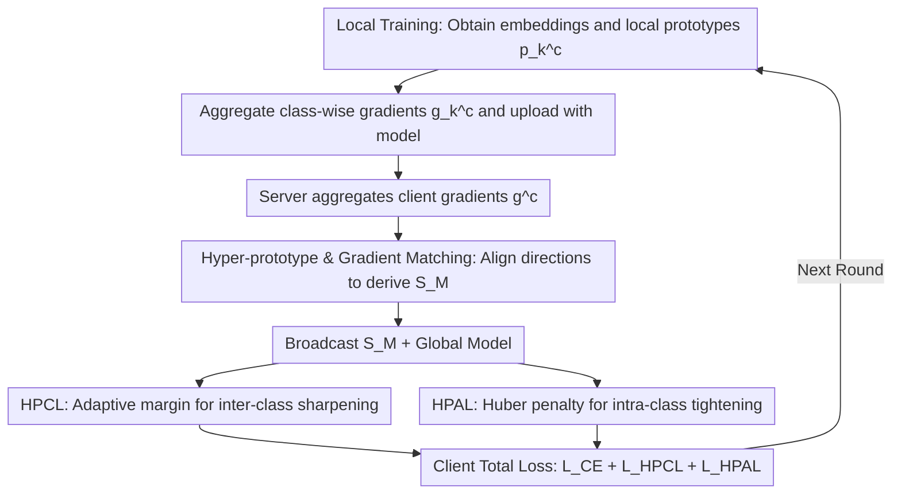

# FedHPro: Federated Hyper-Prototype Learning via Gradient Matching

**Conference**: ICML 2026  
**arXiv**: [2605.13475](https://arxiv.org/abs/2605.13475)  
**Code**: https://github.com/mala-lab/FedHPro (Available)  
**Area**: Federated Learning / Privacy Protection / Prototype Learning  
**Keywords**: Federated Learning, Data Heterogeneity, Hyper-Prototype, Gradient Matching, Contrastive Learning

## TL;DR
Addressing the issue in prototype-based Federated Learning where "direct averaging of local prototypes inherits client biases," this paper introduces a set of learnable global hyper-prototypes. These hyper-prototypes simulate prototypes from centralized training on the server side via gradient matching. Combined with client-side contrastive learning and alignment loss, this approach significantly improves accuracy in heterogeneous scenarios.

## Background & Motivation

**Background**: Federated Learning (FL) enables joint training by sharing models instead of data, but non-IID data remains its core challenge. Prototype-based methods (FedProto, FedTGP, FedSA) have become a mainstream strategy for mitigating heterogeneity by transmitting the mean features of each class as "semantic anchors" to align representation spaces across different clients.

**Limitations of Prior Work**: Existing prototype-based methods follow a two-step route: "calculate prototypes on the client, then average them on the server," which is essentially *prototype-level* aggregation. This approach directly transfers client biases to the global signals. While inter-class boundaries remain relatively clear in simple domains (e.g., MNIST), class clusters overlap severely in difficult domains (e.g., SVHN/SYN), leading to the misclustering of boundary samples.

**Key Challenge**: The ideal approach would be to train a unified representation space using actual samples from all clients and then calculate prototypes—yet this is precisely what FL privacy constraints prohibit. Consequently, global prototypes can only "indirectly" reflect the biased data of each client. Neither simple averaging nor refining semantic anchors can break the cycle of "client bias $\rightarrow$ global prototype bias."

**Goal**: The target is decomposed into: (a) how the server can construct a global signal that "approximates centralized training prototypes"; and (b) how clients can use this signal to simultaneously pull intra-class samples closer and push inter-class categories further apart.

**Key Insight**: The authors observe an interesting fact: although the server cannot access real samples, it can obtain the gradient $\mathbf{g}_k^c$ of the prototype relative to the real samples on each client. If the server initializes a set of learnable vectors and aligns their gradient directions—generated under a virtual classification loss—with $\mathbf{g}_k^c$, these vectors will follow the optimization trajectory that "real samples would have taken," thereby indirectly absorbing the semantics of the real data.

**Core Idea**: Replace "statistical averaging" of global prototypes with "hyper-prototypes learned via gradient matching," and use them to drive two complementary objectives: inter-class contrast and intra-class alignment.

## Method

### Overall Architecture
FedHPro aims to break the "global prototypes inheriting client bias" cycle. Since raw samples cannot be transmitted to train clean centralized prototypes, the server uses learnable hyper-prototypes to "approximate" what centralized prototypes should look like. Specifically, in addition to standard FedAvg, clients upload class-aggregated gradients. The server iteratively refines a set of hyper-prototype tensors through gradient matching, which are then broadcast along with the global model to clients to construct two additional objectives: contrastive and alignment losses. The process forms a "client $\rightarrow$ server $\rightarrow$ client" loop within one communication round.

### Key Designs

**1. Hyper-prototypes and Gradient Matching: Gradients as Proxies for "Invisible Samples"**

Directly averaging local prototypes inevitably transfers the statistical bias of clients to global signals, causing cluster overlap in difficult domains (SVHN/SYN). This paper shifts the perspective: while the server lacks real samples, it can access the gradient of the prototype relative to real samples for each class $c$ on each client $k$, denoted as $\mathbf{g}_k^c = \tfrac{1}{n_k^c}\sum \nabla_{z_i}\mathcal{L}_k(x_i,y_i)$. After aggregation, the server obtains $\mathbf{g}^c$. The server initializes learnable vectors $\{\mathbf{s}_i^c\}_{i=1}^{|\mathcal{I}|}$ for each class, calculates their own gradients $\mathbf{g}_{HP}^c$ under a virtual cross-entropy loss $\mathcal{L}_{vir}$, and minimizes $\mathcal{L}_{GM}=1-\cos(\mathbf{g}^c,\mathbf{g}_{HP}^c)$. This allows hyper-prototypes to evolve along the direction "real samples would have pushed the prototypes." This replaces prototype-level statistical averaging with sample-level gradient proxies, more faithfully characterizing class semantics.

**2. Hyper-Prototype Contrastive Learning (HPCL): Strengthening Inter-class Boundaries with Adaptive Margins**

With hyper-prototypes, clients push embeddings toward the same-class hyper-prototype and away from others to enhance separation. The challenge lies in determining the margin size; a fixed margin may be too large for balanced clients or too small for long-tail clients. This paper adapts the margin to the client's representation scale: the average Euclidean distance $d_k=\tfrac{1}{(\mathcal{C}-1)^2}\sum D_{L_2}(\mathbf{p}_k^{c_1},\mathbf{p}_k^{c_2})$ between all local prototypes of that client is used as a specific margin. The similarity $s(z_i,\mathcal{S}_M^c)$ between sample $z_i$ and the hyper-prototype set $\mathcal{S}_M^c$ is the average cosine similarity across all $|\mathcal{I}|$ vectors. The final loss is $\mathcal{L}_{HPCL}=\log\big(1+\sum_{\mathcal{S}_M^j\in\mathcal{N}_M^c}\exp((s(z_i,\mathcal{S}_M^j)+d_k)/\tau)/\exp(s(z_i,\mathcal{S}_M^c)/\tau)\big)$.

**3. Hyper-Prototype Alignment Learning (HPAL): Balancing Robustness and Precision with Huber Penalty**

Separation alone is insufficient; intra-class compactness and cross-client consistency are required. Thus, samples are pulled toward the mean hyper-prototype $\mathcal{H}_M^c$ of their class. Instead of pure L2 loss, which is sensitive to outliers and can destabilize training, the Huber loss is applied dimension-wise: when the absolute difference is $\le 1$, it uses $\tfrac{1}{2}(z_{i(q)}-\mathcal{H}_{M(q)}^c)^2$ for smoothness (like L2); otherwise, it uses $|z_{i(q)}-\mathcal{H}_{M(q)}^c|-\tfrac{1}{2}$ for robustness (like L1). This fits the rhythm of "coarse alignment in early stages and fine-grained convergence in later stages."

### Loss & Training
The server optimizes hyper-prototypes using $\mathcal{L}_{GM}$ ($M=30$ inner iterations). The total client-side objective is $\mathcal{L}=\mathcal{L}_{CE}+\mathcal{L}_{HPCL}+\mathcal{L}_{HPAL}$. Parameters include temperature $\tau=0.05$, hyper-prototype set size $|\mathcal{I}|=5$, 100 communication rounds, 10 local epochs, and SGD lr=0.01. The paper also proves a convergence rate of $R>\Theta\big(\tfrac{\mathcal{L}_0-\min\mathcal{L}^*}{E\eta\,\boldsymbol{\varepsilon}}\big)$ under non-convex conditions.

## Key Experimental Results

### Main Results
Covering label skew, quantity skew, and domain skew across 9 datasets compared against 8 SOTA baselines.

| Dataset/Scenario | Metric | Ours | Prev. SOTA | Gain |
|------------------|--------|------|------------|------|
| CIFAR10 NID1$_{0.5}$ | Acc | 89.56 | 88.09 (FedGMKD) | +1.47 |
| CIFAR10-LT $\rho=100$ | Acc | 64.75 | 62.48 (FedSA) | +2.27 |
| Office-Caltech Avg | Acc | 64.52 | 60.57 (FedSA) | +3.95 |
| TinyImageNet NID2 | Acc | 40.52 | 38.76 (FedRCL) | +1.76 |

### Ablation Study

| Configuration | Digits Avg | Office-Caltech Avg |
|---------------|------------|--------------------|
| FedAvg (Baseline) | 78.82 | 55.42 |
| HPCL only | 83.58 | 60.92 |
| HPAL only | 83.94 | 61.34 |
| HPCL+HPAL (Full) | **84.80** | **64.52** |
| Replace HP with Global Prototype $\mathbb{P}$ | 81.35 | 59.69 |

### Key Findings
- **Plug-and-play Capability**: Replacing the global prototypes in FedProto / FedTGP / FedGMKD / FedSA with the proposed hyper-prototypes consistently leads to performance gains (1.2-3.2% in the SYN domain), proving the independent value of gradient matching.
- **Complementarity**: HPCL and HPAL are nearly complementary; using each individually yields a 4-5% increase, while combined they offer further improvement, indicating that "separation" and "compactness" require distinct objectives.
- **Optimal Trade-off**: $|\mathcal{I}|=5$ and $M=30$ provide the best balance. Increasing $|\mathcal{I}|$ excessively destabilizes optimization, and $M>30$ yields diminishing returns.

## Highlights & Insights
- **Gradients as Privacy-Safe "Knowledge Interfaces"**: The authors translate the constraint "FL cannot transmit raw samples" into "Can we transmit gradients instead?" and use gradient matching to turn the server into a simulator. This clever paradigm shift grants the server "pseudo-centralized" training capabilities.
- **Client-Adaptive Margin**: Transforming the margin from a hyper-parameter into a function of the client's representation scale ($d_k$) is a generic trick for handling heterogeneous clients that can be migrated to any metric-learning-based FL method.
- **Multi-vector Hyper-prototypes ($|\mathcal{I}|=5$)**: Using multiple vectors per class rather than a single one explicitly assigns "semantic sub-patterns" of each class to different vectors, mitigating the inherent limitations of a single prototype's descriptive power.

## Limitations & Future Work
- Upstream communication includes an aggregated gradient $\mathbf{g}_k\in\mathbb{R}^{\mathcal{C}\times d}$. With a high number of classes (e.g., 200 in TinyImageNet), this adds an overhead of approximately 0.4 MB.
- Gradients may pose a higher risk of information leakage than prototypes; the paper does not discuss performance under DP (Differential Privacy) or encryption.
- $\mathcal{L}_{GM}$ utilizes cosine similarity rather than L2, meaning it matches direction but not magnitude. The impact of gradient magnitude differences between majority and minority classes on hyper-prototype scales is not fully analyzed.
- Although model heterogeneity experiments exist, HPCL/HPAL still depend on a shared feature dimension $d$. Aligning feature spaces across architectures (e.g., ViT vs. ConvNet) remains an open problem.

## Related Work & Insights
- **vs. FedProto (AAAI'22)**: Both use prototypes as global signals, but FedProto directly averages local prototypes. FedHPro uses gradient matching to bypass the "local bias $\rightarrow$ global bias" chain, improving by 9 points in the SYN domain.
- **vs. FedSA (AAAI'25)**: FedSA also aims to "refine global anchors" but remains at the prototype-level; FedHPro is sample-level (via gradients), making its structure closer to centralized training.
- **vs. FedTGP (AAAI'24)**: FedTGP introduces trainable global prototypes. FedHPro sinks this "trainability" to the gradient matching level and proposes a client-specific margin $d_k$ that is more granular than FedTGP’s global margin.
- **Insight**: Gradient matching, originally a tool for Dataset Condensation, proves effective in FL. This suggests that any scenario where "raw samples are inaccessible but gradients are available" (e.g., cross-institution GNNs, cross-device RecSys) can benefit from this approach.

## Rating
- **Novelty**: ⭐⭐⭐⭐ Introducing gradient matching to FL prototype methods is a fresh perspective, though gradient matching and contrastive learning are established tools.
- **Experimental Thoroughness**: ⭐⭐⭐⭐⭐ Comprehensive evaluation across 8 datasets, 3 heterogeneity scenarios, and 8 baselines, including extended experiments on model heterogeneity and text modalities.
- **Writing Quality**: ⭐⭐⭐⭐ Figures 1-2 clearly explain the motivation. Some sections are slightly wordy, and HPCL formulas could be more concise.
- **Value**: ⭐⭐⭐⭐ The plug-and-play nature of hyper-prototypes for various prototype-based FL methods provides direct value for practical FL system deployments.

<!-- RELATED:START -->

## Related Papers

- [\[CVPR 2026\] FedDAP: Domain-Aware Prototype Learning for Federated Learning under Domain Shift](../../CVPR2026/ai_safety/feddap_domain-aware_prototype_learning_for_federated_learning_under_domain_shift.md)
- [\[ICML 2026\] Frequency Matching in Spiking Neural Networks for mmWave Sensing](frequency_matching_in_spiking_neural_networks_for_mmwave_sensing.md)
- [\[ICML 2026\] Flatness-Aware Stochastic Gradient Langevin Dynamics](flatness-aware_stochastic_gradient_langevin_dynamics.md)
- [\[CVPR 2026\] ProxyFL: A Proxy-Guided Framework for Federated Semi-Supervised Learning](../../CVPR2026/ai_safety/proxyfl_a_proxy-guided_framework_for_federated_semi-supervised_learning.md)
- [\[ICML 2026\] Regret-Based Federated Causal Discovery with Unknown Interventions](regret-based_federated_causal_discovery_with_unknown_interventions.md)

<!-- RELATED:END -->
