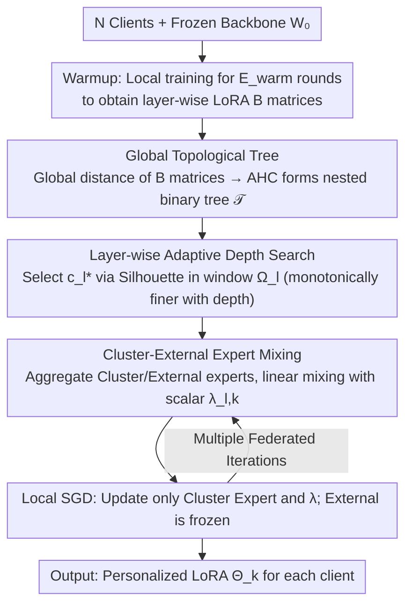

# FedTreeLoRA: Reconciling Statistical and Functional Heterogeneity in Federated LoRA Fine-Tuning

**Conference**: ICML2026  
**arXiv**: [2603.13282](https://arxiv.org/abs/2603.13282)  
**Code**: To be confirmed  
**Area**: llm_safety (Federated Learning / Privacy-Preserving Fine-Tuning)  
**Keywords**: Federated Learning, LoRA, Personalized Fine-Tuning, Hierarchical Clustering, Heterogeneity  

## TL;DR
To address the disconnect in existing federated LoRA methods between "client statistical heterogeneity" and "LLM layer functional heterogeneity," FedTreeLoRA employs a global hierarchical clustering tree with layer-wise adaptive depth search. This allows shallow layers to prioritize sharing while deep layers differentiate progressively. On GLUE and FLAN, it improves average metrics from 91.19 / 61.77 to 92.36 / 63.19 with minimal parameter overhead.

## Background & Motivation

**Background**: The combination of LoRA and Federated Learning has become standard for privacy-preserving LLM fine-tuning. Research typically falls into two categories: training a global LoRA (FedIT, SLoRA) or achieving personalization through dual-modules (FedDPA, FedALT) or client clustering (FedLEASE).

**Limitations of Prior Work**: Existing methods implicitly rely on a **Flat-Model Assumption**—whether utilizing dual modules or clustering, LoRA is treated as a monolithic block, assuming the decision of "whether to share" applies uniformly across all layers.

**Key Challenge**: The authors identify two facts via motivational experiments: (1) **Vertical Heterogeneity**—aggregating only shallow layers is significantly more effective than aggregating deep layers; forced aggregation of deep layers can even underperform purely local training, as deep layers handle semantic/task specialization and are highly sensitive to client data distribution shifts. (2) **The two types of heterogeneity are coupled**—higher similarity in client data allows for a deeper "safe sharing depth," whereas higher heterogeneity shifts the optimal sharing boundary toward shallow layers. Consequently, the flat assumption is inherently suboptimal.

**Goal**: To design a mechanism that enables **layer-specific** decisions for "to what depth should clients share" while maintaining cross-layer topological consistency (to avoid semantic discontinuity caused by repeatedly regrouping clients in adjacent layers).

**Key Insight**: Model "client relationships" as a **global hierarchical tree**—where the root represents full sharing, leaves represent full personalization, and intermediate cuts correspond to specific grouping schemes. Each Transformer layer selects exactly one cut on this tree (under a monotonicity constraint where granularity increases with depth), ensuring both topological consistency and layer-wise adaptively.

**Core Idea**: A global tree is constructed using **agglomerative hierarchical clustering on client LoRA $B$ matrices**. For each Transformer layer, the optimal cluster count $c_l^*$ is identified via Silhouette scores within a window (searching from the previous layer's granularity up to $K$ additional clusters). This framework effectively couples both "horizontal and vertical" heterogeneity dimensions.

## Method

### Overall Architecture
In a federated system with $N$ clients, each holding private data $\mathcal{D}_k$ and sharing a frozen backbone $W_0$, the goal is to learn personalized LoRA parameters $\boldsymbol{\Theta}_k$. The core Mechanism of FedTreeLoRA involves a warmup phase to condense client relationships into a **global hierarchical tree** $\mathcal{T}$ (Root = fully shared, Leaves = fully personalized). Subsequently, each Transformer layer independently selects a "cut" on this tree—shallow layers select coarse cuts near the root (multi-client sharing), while deep layers select fine cuts near leaves (individual specialization), following a monotonic development. For each cut, two sets of LoRA experts are aggregated per layer and mixed using a learnable scalar for the forward pass.

### Key Designs

**1. Global Topological Tree: Embedding Candidate Groupings into a Tree**

Allowing each layer to cluster independently leads to "topological drift," where adjacent layers might group clients as $\{1,2\},\{3,4\}$ and $\{1,3\},\{2,4\}$ respectively, breaking the semantic continuity of the forward pass. FedTreeLoRA establishes a global skeleton first. During warmup, each client performs $E_{warm}$ rounds of local training to obtain $\{A_{l,k}, B_{l,k}\}$. **Only $B$ matrices** are used to compute client distances—following observations by Tian et al. (2024) that $B$ encodes task specialization while $A$ tends toward shared features. The global distance $D^{global}_{i,j}$ is the average distance across all layers $D^{global}_{i,j} = \frac{1}{L}\sum_l \text{dist}(B_{l,i}, B_{l,j})$ (using Frobenius distance). Agglomerative Hierarchical Clustering (AHC) then condenses $D^{global}$ into a binary tree $\mathcal{T}$. The crucial property is that any cut on $\mathcal{T}$ corresponds to a valid grouping, and adjacent cuts are **nested**, ensuring specialized paths remain monotonic.

**2. Layer-wise Adaptive Depth Search: Coarse Shallow and Fine Deep**

Since "safe sharing depth" is a function of data heterogeneity, the sharing boundary must be layer-specific. This step selects the optimal cluster count $c_l^*$ for each Transformer layer $l$. It computes a **layer-specific** distance matrix $D^{(l)}_{i,j} = \text{dist}(B_{l,i}, B_{l,j})$ and constrains the search space to a window $\Omega_l = \{c \in \mathbb{Z} \mid c_{l-1}^* \leq c < \min(N, c_{l-1}^* + K)\}$. The lower bound $c_{l-1}^*$ enforces monotonicity. The scoring function is:

$$\phi(c; D^{(l)}) = \begin{cases} \tau, & c = 1 \\ \text{Sil}(P_c, D^{(l)}), & c \geq 2 \end{cases}$$

Where $c=1$ uses a threshold $\tau$ as a prior bias toward global sharing, and $c \geq 2$ uses the Silhouette coefficient. $\tau$ ensures a layer only splits if heterogeneity is strong enough to justify it.

**3. Cluster-External Expert Mixing: Projecting Topology into Parameters**

Given the grouping $P_{c_l^*}$ for layer $l$, client $k$ identifies its cluster group $\mathcal{S}_k^{(l)}$ and the group of all other clients $\mathcal{R}_k^{(l)}$. Two experts are aggregated: the Cluster Expert $\bar{\Phi}_{l,k}^{\text{clus}} = \frac{1}{|\mathcal{S}_k^{(l)}|}\sum_{j \in \mathcal{S}_k^{(l)}} \Phi_{l,j}$ for peer-group consensus, and the External Expert $\bar{\Phi}_{l,k}^{\text{ext}} = \frac{1}{|\mathcal{R}_k^{(l)}|}\sum_{j \in \mathcal{R}_k^{(l)}} \Phi_{l,j}$ as a global knowledge channel. The forward pass linearly mixes these using a **learnable scalar** $\lambda_{l,k} \in [0,1]$ per layer per client:

$$h_l(x) = W_{0,l}x + \lambda_{l,k}(\bar{B}^{\text{clus}}\bar{A}^{\text{clus}}x) + (1-\lambda_{l,k})(\bar{B}^{\text{ext}}\bar{A}^{\text{ext}}x)$$

Local training updates only the Cluster Expert and $\lambda$, while the External Expert is frozen. This scalar mixing keeps additional parameters at approximately $0.020\%$ with negligible communication overhead.

### Loss & Training
Each client performs local SGD for $E$ steps on the Cluster Expert $(\bar{A}^{\text{clus}}_{l,k}, \bar{B}^{\text{clus}}_{l,k})$ and scalar $\lambda_{l,k}$. Theoretical analysis under standard federated assumptions ($\sigma$-smoothness, bounded gradients, and LoRA matrix boundedness) proves an $\mathcal{O}(1/\sqrt{T})$ convergence rate, consistent with FedAvg, indicating that the tree-structured aggregation does not hinder convergence.

## Key Experimental Results

### Main Results

**NLU (RoBERTa-Large, 20 clients, Dirichlet $\alpha=0.5$, Average Acc. on 4 GLUE tasks, rank=4)**

| Method | % Param | MNLI | QNLI | SST2 | QQP | Average | Gain |
|------|---------|------|------|------|-----|---------|----------|
| FedIT | 0.1107% | 83.18 | 87.03 | 93.65 | 84.93 | 87.20 | - |
| FedSA | 0.1107% | 83.63 | 91.32 | 95.87 | 89.33 | 90.04 | +2.84 |
| FedDPA | 0.1107% | 83.97 | 91.31 | 95.72 | 89.74 | 90.19 | +2.99 |
| FedALT | 0.1383% | 84.03 | 90.77 | 96.16 | 89.27 | 90.06 | +2.86 |
| FedLEASE | 0.1521% | 86.21 | 92.56 | 95.63 | 90.36 | 91.19 | +3.99 |
| **Ours** | **0.1107%** | **88.15** | **93.37** | **96.56** | **91.35** | **92.36** | **+5.16** |

**NLG (LLaMA-2-7B 8-bit, 8 clients, ROUGE-1 on 4 FLAN tasks, rank=8)**

| Method | % Param | Text Edit | Struct2Text | Sentiment | Reasoning | Average | Gain |
|------|---------|-----------|-------------|-----------|-----------|---------|----------|
| FedIT | 0.0622% | 59.84 | 51.71 | 44.53 | 74.42 | 57.62 | - |
| FedDPA | 0.0622% | 64.33 | 54.18 | 48.13 | 75.55 | 60.55 | +2.93 |
| FedALT | 0.0699% | 67.61 | 54.06 | 48.57 | 76.84 | 61.77 | +4.15 |
| FedLEASE | 0.0895% | 66.31 | 54.80 | 49.32 | 76.40 | 61.71 | +4.09 |
| **Ours** | **0.0622%** | **68.63** | **55.59** | **51.27** | **77.27** | **63.19** | **+5.57** |

FedTreeLoRA achieves SOTA performance while maintaining the lowest parameter budget (comparable to FedIT and lower than FedLEASE).

### Ablation Study

| Configuration | Avg. Acc | Description |
|------|----------|------|
| Fixed $k=1$ (FedIT equivalent) | 87.20 | Underfits deep layer heterogeneity |
| Fixed $k=4$ | 91.45 | Coarse-grained fixed clustering |
| Fixed $k=8$ | 90.74 | Fine-grained fixed clustering hurts shallow layers |
| Layer-wise Adaptive $c_l^*$ | **92.36** | Full FedTreeLoRA |
| Independent layer-wise clustering | 89.47 | Topological drift reduces performance |
| Cluster-Only (Isolationist) | 91.40 | Still outperforms FedLEASE |
| MoE Router instead of $\lambda$ | 92.02 | +25% parameters with lower performance |
| **Scalar-Mixed (Ours)** | **92.36** | Optimal cost-performance ratio |

### Key Findings
- **Topological alignment is the primary performance driver**: The "Isolationist" variant (Cluster-Only) already outperforms the strongest baseline, FedLEASE, suggesting that correct layer-wise clustering is more critical than complex routing.
- **The global tree ensures stability**: Removing the global skeleton leads to a performance drop of nearly 3 points, confirming the necessity of cross-layer topological alignment.
- **Fixed-depth strategies suboptimal**: Adaptive search outperformed all fixed-depth configurations ($k=1, 4, 8$), validating that "one-size-fits-all" granularity damages model performance.

## Highlights & Insights
- **Deconstruction of Federated Heterogeneity**: The paper explicitly differentiates between horizontal (distribution) and vertical (layer) heterogeneity, proving through experiments that "safe sharing depth" is a function of data similarity.
- **Elegant AHC + Monotonic Cut approach**: Utilizing a global tree as a candidate space with constrained cuts allows for layer-wise adaptively while preserving consistency—a technique transferable to various multi-task/multi-client scenarios.
- **Topology Over Capacity**: The fact that simple scalar mixing outperforms complex MoE routers suggests the bottleneck in federated LoRA is "grouping accuracy" rather than expert parameter capacity.

## Limitations & Future Work
- The theoretical convergence rate is standard ($\mathcal{O}(1/\sqrt{T})$) and does not explicitly quantify the theoretical gain provided by the tree structure.
- The requirement for a multi-round warmup to compute distance matrices complicates scenarios with dynamic client participation.
- Dependence on the $B$ matrix as the sole distance metric relies on specific prior observations; comparative studies with $A$ or $BA$ products could be more comprehensive.
- Optimal settings for $\tau$ and $K$ depend on client count and heterogeneity, but the paper provides limited operational guidelines for these hyperparameters.

## Related Work & Insights
- **vs FedLEASE**: Unlike the "flat" clustering in FedLEASE, FedTreeLoRA enables nested clustering with layer-specific cuts and uses light scalar mixing, reducing parameters while improving performance.
- **vs FedDPA / FedALT**: While dual-branch methods assume uniform sharing across layers, FedTreeLoRA continuous-levels this decision.
- **vs FedPer / LG-FedAvg**: FedTreeLoRA extends the "shallow-shared, deep-personalized" philosophy to Transformer LoRA by automating the cluster count and cut-layer identification.

## Rating
- Novelty: ⭐⭐⭐⭐
- Experimental Thoroughness: ⭐⭐⭐⭐
- Writing Quality: ⭐⭐⭐⭐
- Value: ⭐⭐⭐⭐

<!-- RELATED:START -->

## Related Papers

- [\[ICML 2026\] Decoupled Training with Local Reinforcement Fine-Tuning in Federated Learning](decoupled_training_with_local_reinforcement_fine-tuning_in_federated_learning.md)
- [\[ICCV 2025\] LoRA-FAIR: Federated LoRA Fine-Tuning with Aggregation and Initialization Refinement](../../ICCV2025/ai_safety/lora-fair_federated_lora_fine-tuning_with_aggregation_and_initialization_refinem.md)
- [\[ICML 2026\] PFT: Phonon Fine-tuning for Machine Learned Interatomic Potentials](pft_phonon_fine-tuning_for_machine_learned_interatomic_potentials.md)
- [\[ICML 2026\] TCAP: Tri-Component Attention Profiling for Unsupervised Backdoor Detection in MLLM Fine-Tuning](tcap_tri-component_attention_profiling_for_unsupervised_backdoor_detection_in_ml.md)
- [\[ICML 2026\] Towards Fine-Grained Robustness: Attention-Guided Test-Time Prompt Tuning for Vision-Language Models](towards_fine-grained_robustness_attention-guided_test-time_prompt_tuning_for_vis.md)

<!-- RELATED:END -->
