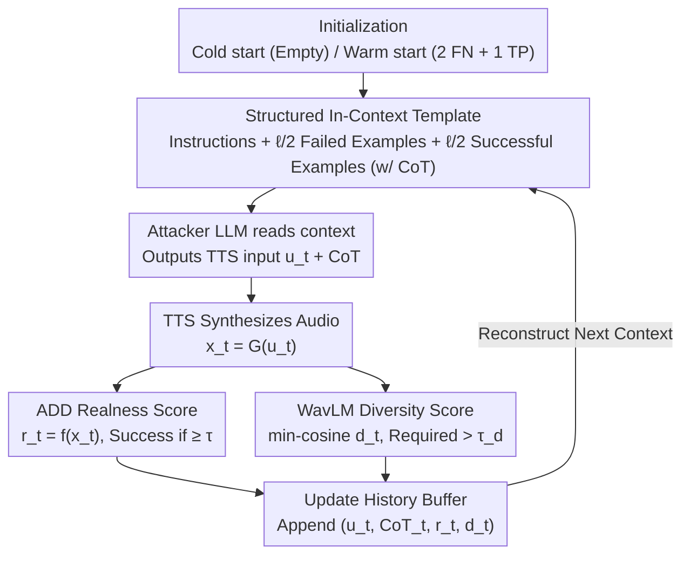

# FoeGlass: Simple In-Context Learning Is Enough for Red Teaming Audio Deepfake Detectors

**Conference**: ICML 2026  
**arXiv**: [2606.05101](https://arxiv.org/abs/2606.05101)  
**Code**: TBD  
**Area**: AI Safety / Audio Deepfake Detection / Automated Red Teaming  
**Keywords**: Audio Deepfake Detection, Red Teaming, In-Context Learning, TTS Attack, Diversity Feedback

## TL;DR
FoeGlass transplants the "LLM red-teaming LLM" paradigm to Audio Deepfake Detection (ADD). Without fine-tuning, it utilizes in-context learning combined with realness and diversity feedback to guide a black-box reasoning LLM in generating TTS prompts that deceive detectors. Starting from a cold start, it increases the False Negative Rate (FNR) of existing detectors from 0% to up to 96%, showing high transferability across eight different ADD models.

## Background & Motivation

**Background**: Audio Deepfake Detection (ADD) is the primary defense against Text-to-Speech (TTS) abuse. Current evaluations rely on manually curated spoofing datasets like ASVspoof5 and VoxCelebSpoof, which cover various spoofing technologies, acoustic conditions, and adversarial perturbations.

**Limitations of Prior Work**: (i) Manual data collection is costly; (ii) Coverage of "challenging outputs" from a single TTS model is insufficient to identify ADD blind spots; (iii) Existing automated attacks focus on local perturbations near a reference audio (low-norm perturbation), failing to sample "natural adversarial examples" from the generative model's inherent distribution.

**Key Challenge**: To realistically evaluate ADD, one must sample natural adversarial examples—outputs that naturally deceive detectors—from the TTS distribution. However, the TTS input space is combinatorially explosive, making manual prompt engineering unscalable. Directly applying "attacker LLM fine-tuned to red-team a target LLM" to ADD faces three hurdles: scarcity of FN samples (making fine-tuning sets hard to construct), diversity collapse in RL fine-tuning (converging to a single strategy), and limited access to weights of top-tier closed-source LLMs.

**Goal**: Automatically, efficiently, and diversely sample TTS inputs that deceive ADD, assuming only black-box access to the reasoning LLM, TTS, and ADD.

**Key Insight**: The authors observe that the in-context learning capability of reasoning LLMs is sufficiently strong. By inserting "past successful/failed TTS prompts + CoT + scores + diversity feedback" into the context, the LLM can iteratively push TTS prompts toward ADD blind spots without any parameter updates.

**Core Idea**: Transform the red-teaming problem into "black-box in-context optimization": LLM generates TTS inputs $\to$ TTS synthesizes audio $\to$ ADD provides realness scores + WavLM provides min-cosine diversity feedback $\to$ feedback is fed back into the context for the next round, utilizing specific context templates to suppress mode collapse.

## Method

### Overall Architecture
FoeGlass aims to solve how to make a black-box reasoning LLM write TTS prompts that deceive ADD without fine-tuning or weight access. It formalizes red-teaming as a sampling problem: TTS is $G:\mathcal{U}\to\mathcal{X}$ (mapping text prompts/parameters to audio), ADD is a binary classifier $f:\mathcal{X}\to[0,1]$ with threshold $\tau$. Defining the expected classification score as $F(u)=\mathbb{E}[f\circ G(u)]$, the goal is to sample from $F^{-1}((\tau,1])$, the subset of TTS inputs classified as "real."

The process is an in-context loop with no weight updates: At each round $t$, the attacker LLM reads the current context and outputs a TTS input $u_t$ with its CoT; the TTS synthesizes $x_t=G(u_t)$; the ADD provides a realness score $r_t=f(x_t)$; and a diversity score $d_t = 1 - \max_{z\in w(X_\text{hist})}\langle w(x_t), z\rangle_{\cos}$ is calculated via WavLM embeddings. Finally, $(u_t, \text{CoT}_t, r_t, d_t)$ is appended to the history buffer to reconstruct the next context. The LLM, TTS, and ADD remain black boxes throughout.

### Key Designs

**1. Structured In-Context Template: Compressing red-teaming experience into context to enable online learning of ADD vulnerabilities.**

Unconditional sampling of TTS prompts yields extremely low success rates (FNR < 10% in many scenarios). FoeGlass feeds success and failure experiences back into a structured context. The context includes: (a) instruction prompts describing the task and TTS parameters (transcript, speed, temperature, style, voice) to force JSON output; (b) the most recent $\ell/2$ failed attacks with CoT and scores; (c) the $\ell/2$ successful attacks with the highest realness scores. Including CoT allows the LLM to maintain a reasoning chain rather than guessing randomly each round. This "half success + half failure" structure is more stable than using success cases alone, preventing the LLM from over-relying on a single prompt template.

**2. Realness + Diversity Dual Feedback using min-cosine: Eliminating mode collapse at the root.**

Mode collapse is common in red-teaming; once an LLM finds a successful prompt, it tends to repeat it with minor variations. FoeGlass provides two scalar signals: realness $f(x_t)$ and diversity. Diversity is usually measured by average cosine distance $d_\text{avg}$, but this can be skewed by far-away samples even if the new sample is extremely close to one historical neighbor. FoeGlass adopts the **minimum** cosine distance $d(x';X)=1-\max_{z\in w(X)}\langle w(x'),z\rangle_{\cos}$ as a hard constraint. A sample is only "diverse" if it is sufficiently far from **all** historical samples ($d>\tau_d=0.01$ using WavLM embeddings). This min-distance accurately captures "repetition," while treating diversity as feedback rather than an optimization objective preserves the LLM's agency in balancing exploration and exploitation.

**3. Cold-start / Warm-start Modes and Cross-ADD Transferability: Starting with zero known FNs and attacking multiple targets.**

Unlike fine-tuning attackers that require massive FN datasets, the in-context approach works with low data. In cold start, the history begins empty. In warm start, only 2 known FN and 1 TP examples are injected. Significant performance gains with only 3 examples suggest that the LLM learns "how to reason about blind spots" rather than memorizing specific prompts. This reasoning-based exploration targets areas of the TTS output space ignored by multiple detectors, explaining why samples optimized for one ADD readily transfer to seven others.

### Loss & Training
**Zero training**. FoeGlass is an entirely inference-time pipeline. Primary hyperparameters include context length $\ell=40$, diversity threshold $\tau_d=0.01$, and iteration count $T=500$.

## Key Experimental Results

### Main Results: Significant FNR Increases (8 ADDs × 3 TTS)

| TTS | ADD | Uncond. Sampling FNR(%) | FoeGlass Cold FNR(%) | FoeGlass Warm FNR(%) |
|---|---|---|---|---|
| VITS | VIT-VoxCeleb-ConstantQ | 42.02 | 94.04 | **96.15** |
| VITS | VIT-VoxCeleb-MFCC | 32.57 | 95.28 | **98.08** |
| Kokoro-82M | VIT-VoxCeleb-MelSpec | 0.00 | 7.52 | **39.72** |
| xTTS-v2 | VIT-VoxCeleb-ConstantQ | 2.24 | 80.72 | **96.29** |
| xTTS-v2 | VIT-VoxCeleb-MFCC | 9.16 | 71.60 | **93.13** |
| xTTS-v2 | AST-VoxCeleb | 9.68 | 48.43 | **63.30** |

The maximum absolute gain is approximately +94 percentage points. Even for ADDs trained on ASVspoof5 (which included VITS data), cold start achieves 74.2% FNR, indicating that ASVspoof5 does not cover the entire VITS output space.

### Ablation Study

| Configuration | Key Metrics | Note |
|---|---|---|
| Cold vs Warm | Warm adds +2~+30 FNR | Requires only 3 examples; no extra compute |
| Fine-tuning RawNetLite w/ FoeGlass data | 49.6% → **8.2%** acc (-41) | More robust on held-out VITS set |
| Fine-tuning AASIST (Black-box transfer) | 15.2% → **0.2%** acc (-15) | Data generated from attacking RawNetLite |
| vs ASVspoof5 TTS subset (VIT-ConstantQ) | 0.35% → 81.34% FNR | FoeGlass samples are much harder than ASVspoof5 |
| No diversity feedback | FNR drop, fewer clusters | min-cosine feedback is critical against mode collapse |

### Key Findings
- **In-context is sufficient**: Black-box prompt engineering alone pushes FNR to 90%+, demonstrating that reasoning LLMs can replace fine-tuned attackers for specialized red-teaming.
- **min-cosine > avg-cosine**: PCA and WavLM k-means visualizations show attack samples forming multiple semantic clusters, proving min-cosine feedback drives the LLM to switch between clusters.
- **High Transferability**: Samples targeting one ADD consistently outperform unconditional baselines on others, revealing shared blind spots rather than specific model vulnerabilities.
- **Mismatch Limits Attacks**: Attacking Kokoro-82M on VoxCeleb-trained ADDs is hardest (cold start FNR near 0%), suggesting distribution mismatch remains a defense factor.

## Highlights & Insights
- **In-context learning as a black-box optimizer**: The reasoning LLM with CoT and history acts as an implicit optimizer requiring no gradients or weight access.
- **The min-cosine trick**: A valuable substitute for average distance in any embedding-based diversity metric to prevent local repetition.
- **CoT in context for self-improvement**: Feeding CoT back into the context allows the LLM to self-reflect and refine reasoning without fine-tuning.
- **Data Augmentation**: FoeGlass provides high-quality "difficult samples" that are more effective for training robust detectors than standard unconditional data.

## Limitations & Future Work
- **Hyperparameter Sensitivity**: Context length $\ell$, $\tau_d$, and the choice of attacker LLM significantly impact success.
- **Embedding Dependency**: min-cosine depends on WavLM; if the embedding is insensitive to certain spoofing patterns, the feedback may fail.
- **Limited to Open-source ADDs**: Performance against industrial closed-source systems (e.g., Pindrop) is untested.
- **Misuse Risk**: FoeGlass could be used for malicious attacks; defenses like output watermarking or input anomaly detection are needed.
- **Lack of RL Comparison**: While the paper argues RL is difficult, a direct quantitative comparison with a state-of-the-art RL red-teaming baseline is missing.

## Related Work & Insights
- **vs Low-norm Perturbation**: Unlike gradient-based $\ell_p$ noise, FoeGlass samples "natural spoofing" without needing reference audio.
- **vs Diffusion-based Adversarials**: FoeGlass operates in prompt space via black-box search, avoiding the need for weight access required by latent-space optimization.
- **vs LLM Jailbreaking**: FoeGlass transfers the jailbreak paradigm to ADD by using TTS as a generative intermediary and discretizing "success" via realness scores.

## Rating
- Novelty: ⭐⭐⭐⭐ 
- Experimental Thoroughness: ⭐⭐⭐⭐ 
- Writing Quality: ⭐⭐⭐⭐ 
- Value: ⭐⭐⭐⭐ 

<!-- RELATED:START -->

## Related Papers

- [\[ICML 2026\] Stable-GFlowNet: Toward Diverse and Robust LLM Red-Teaming via Contrastive Trajectory Balance](stable-gflownet_toward_diverse_and_robust_llm_red-teaming_via_contrastive_trajec.md)
- [\[ICML 2026\] Red-Teaming Agent Execution Contexts: Open-World Security Evaluation on OpenClaw](red-teaming_agent_execution_contexts_open-world_security_evaluation_on_openclaw.md)
- [\[ICML 2026\] Culturally-Adapted Red-Teaming Across East and Southeast Asian Contexts: A Methodological and Comparative Analysis](culturally-adapted_red-teaming_across_east_and_southeast_asian_contexts_a_method.md)
- [\[CVPR 2026\] GenBreak: Red Teaming Text-to-Image Generation Using Large Language Models](../../CVPR2026/ai_safety/genbreak_red_teaming_text-to-image_generation_using_large_language_models.md)
- [\[CVPR 2026\] Red-teaming Retrieval-Augmented Diffusion Models via Poisoning Knowledge Bases](../../CVPR2026/ai_safety/red-teaming_retrieval-augmented_diffusion_models_via_poisoning_knowledge_bases.md)

<!-- RELATED:END -->
