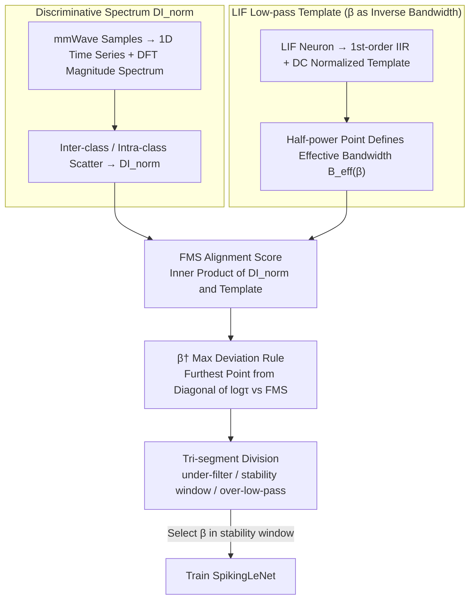

# Frequency Matching in Spiking Neural Networks for mmWave Sensing

**Conference**: ICML 2026  
**arXiv**: [2605.09983](https://arxiv.org/abs/2605.09983)  
**Code**: [GitHub](https://github.com/yudi-mars/Soul)  
**Area**: Edge Sensing / Spiking Neural Networks (SNN) / Wireless Sensing  
**Keywords**: LIF neuron, IIR low-pass filtering, mmWave sensing, discriminative spectrum, neural dynamics-data alignment

## TL;DR
This work proves from a "mechanism-data alignment" perspective that LIF spiking neurons are equivalent to first-order IIR low-pass filters. It proposes setting the membrane decay coefficient $\beta$ according to the discriminative spectrum of mmWave signals, enabling the SNN to achieve an average accuracy improvement of 6.22% and a theoretical energy reduction of 3.64× compared to ANNs across four common mmWave datasets.

## Background & Motivation
**Background**: mmWave radar is a crucial sensor for edge-side posture, gesture, and activity recognition due to its privacy-friendly nature, light resistance, and penetration capabilities. Mainstream solutions utilize ANNs like CNNs or Transformers, relying on increased depth and handcrafted pre-processing for robustness at the cost of high energy consumption and latency.

**Limitations of Prior Work**: mmWave signals are inherently sparse, irregular, and heavily contaminated by high-frequency noise from multi-path effects and phase jitter. ANNs lack an inherent temporal filtering bias, necessitating either handcrafted low-pass pre-processing (which may discard useful high-frequency discriminative information) or deeper networks for brute-force fitting, leading to unsustainable energy and latency.

**Key Challenge**: Discriminative information is often distributed in the "low-to-medium frequency bands," while noise is concentrated in high frequencies. Existing ANNs and low-pass pre-processing fail to distinguish between "useful high-frequency discriminative components" and "true high-frequency noise." Although existing SNN works demonstrate energy efficiency advantages, they rely on empirical hyperparameter tuning without clarifying "when and why SNNs outperform ANNs."

**Goal**: To answer two questions from a signal processing perspective: (1) What is the mechanism behind the SNN's advantage in mmWave sensing? (2) How should the key hyperparameter, membrane decay coefficient $\beta$, be selected based on the data spectrum?

**Key Insight**: By linearizing the discrete dynamics of LIF neurons into first-order IIR low-pass filters and quantifying the overlap between their cutoff frequencies and the discriminative spectrum of the dataset, selecting $\beta$ is transformed into a frequency-domain alignment problem.

**Core Idea**: Aligning the effective bandwidth $B_{\text{eff}}(\beta)$ of the LIF neuron with the discriminative spectrum $\Omega^\star$ of the mmWave data. "Frequency matching" is identified as the fundamental mechanism for SNN superiority in such tasks and serves as the physical criterion for selecting $\beta$.

## Method

### Overall Architecture
The paper maintains the network structure but equips "LIF neurons + LeNet-style SNN" with a set of frequency-domain analysis tools to address the empirical selection of $\beta$. The approach involves comparing both data and neurons in the frequency domain: first, measuring where discriminative information resides in each mmWave dataset using DFT; then, linearizing the LIF neuron into a low-pass filter whose bandwidth is controlled by $\beta$; and finally, using an alignment score to measure the overlap between the "filtered spectrum" and the "discriminative spectrum," categorizing the range of $\beta$ into three interpretable segments.

### Key Designs

**1. Discriminative Spectrum $\mathrm{DI}_{\text{norm}}$: Measuring where discriminative information resides**

To discuss "frequency matching," a metric is required to define the frequency distribution of discriminative information in mmWave data. For each sample $\mathbf{X}_i\in\mathbb{R}^L\times C\times H\times W$, the non-temporal dimensions are averaged into a 1D time series $\mathbf{s}_i\in\mathbb{R}^L$. After sample-wise mean subtraction and one-sided DFT to obtain the magnitude spectrum $A_i[k]$, the inter-class scatter $S_B[k]=\sum_c\pi_c(\mu_c[k]-\bar\mu[k])^2$ and intra-class scatter $S_W[k]=\sum_c\pi_c\,\mathrm{Var}_c[k]$ are estimated per frequency band. The Discriminative Index is defined as $\mathrm{DI}(\omega_k)=S_B[k]/(S_W[k]+\varepsilon)$ and normalized in the frequency domain as a probability distribution $\mathrm{DI}_{\text{norm}}$. This Fisher-style linear separability statistic reflects both energy distribution and class separability, serving as the intermediary between data truth and neuronal mechanisms.

**2. LIF Low-pass Template: Turning $\beta$ into a clean "inverse bandwidth" knob**

Beyond the data spectrum, the LIF neuron's nature as a filter must be defined. By writing the LIF dynamics as $u_{t+1}=\beta u_t+(1-\beta)I_t-v_{\text{th}}O_t$ and ignoring the reset term, it functions as a first-order IIR filter with a frequency response $H(\omega_k;\beta)=(1-\beta e^{-j\omega_k})^{-1}$. To eliminate global magnitude differences and compare "shape" only, a DC-normalized power template is defined: $\tilde H(\omega_k;\beta)=(1-\beta)^2/[(1-\beta)^2+2\beta(1-\cos\omega_k)]$. Lemma 3.2 proves that $\tilde H\in(0,1]$, $\tilde H(0;\beta)=1$, and it is non-increasing with respect to both $\omega_k$ and $\beta$—meaning a larger $\beta$ results in a narrower passband. Using the half-power point $\tilde H(\omega_c;\beta)=1/2$ to define the effective bandwidth $B_{\text{eff}}(\beta)=\omega_c$, $\beta$ is transformed from a heuristic hyperparameter into a physical control for bandwidth.

**3. FMS Alignment Score and $\beta^\dagger$ Max Deviation Rule: Segmenting $\beta$ without training**

With the data spectrum and LIF template, "frequency matching" can be quantified by the inner product, yielding the alignment score $\mathrm{FMS}_{\text{avg}}(\beta)=\sum_{\omega_k}\mathrm{DI}_{\text{norm}}(\omega_k)\tilde H(\omega_k;\beta)\in[0,1]$. This score represents the "quality of discriminative spectrum preserved by the LIF at a given $\beta$." A critical issue is that if $\beta$ is too large, the passband becomes too narrow, discarding useful high-frequency discriminative components. A geometric rule is used to locate this critical point: let $\tau=(1-\beta)^{-1}$, apply min-max normalization to both $\log\tau$ and $\mathrm{FMS}_{\text{avg}}$ to obtain $(\phi_r,\psi_r)$, and connect the endpoints to form a reference diagonal $\hat L$. The furthest point from this line is defined as $\beta^\dagger=\arg\max_r|\hat L(\phi_r)-\psi_r|$. Proposition 3.5 divides $\beta$ into: under-filter ($\beta\to 0$, noise not suppressed), stability window ($0<\beta<\beta^\dagger$, where accuracy peaks typically reside), and over-low-pass ($\beta\geq\beta^\dagger$, discriminative information discarded). Notably, $\beta^\dagger$ is determined solely by data spectrum and neural dynamics, independent of label accuracy, allowing practitioners to avoid expensive dataset-specific accuracy sweeps.

### Mechanism

Taking the AOPHand gesture dataset as an example: First, DFT is applied to all samples, revealing that discriminative energy is concentrated in the low-to-medium frequency bands while high frequencies are dominated by noise, yielding $\mathrm{DI}_{\text{norm}}$. Then, a range of candidate $\beta$ values is swept to calculate the LIF's normalized bandwidth $B_{\text{eff}}(\beta)$ and alignment score $\mathrm{FMS}_{\text{avg}}(\beta)$. By plotting $\mathrm{FMS}_{\text{avg}}$ against $\log\tau$ and finding the point of maximum deviation from the diagonal, the critical $\beta^\dagger$ is identified. Selecting $\beta$ within the stability window before $\beta^\dagger$ for training SpikingLeNet results in an optimal accuracy corresponding to a $\beta^\ast$ located to the left of $\beta^\dagger$, improving accuracy from LeNet's 60.86% to 83.70%. The entire process avoids accuracy-based scanning for $\beta$ selection.

### Loss & Training
Standard SNN training with surrogate gradients is employed. The backbone is a simple LeNet-style SpikingLeNet (≈4.19M parameters). The only additional step is pre-selecting $\beta$ for each dataset using the aforementioned frequency matching method.

## Key Experimental Results

### Main Results: Accuracy across 4 mmWave Datasets (%, mean of 3 seeds)

| Model | AOPHand | mmFiT | Pantomime | MMActivity | #Params (M) |
|------|---------|-------|-----------|------------|-------------|
| LeNet | 60.86 | 62.36 | 61.83 | 59.17 | 4.19 |
| VGG9 | 74.39 | 69.36 | 72.63 | 70.00 | 31.6 |
| ResNet50 | 72.54 | 71.84 | 73.90 | 61.67 | 23.5 |
| GRU | 67.52 | 14.11 | 75.45 | 47.50 | 0.075 |
| CNN-GRU | 61.98 | 67.80 | 72.77 | 65.00 | 0.46 |
| ViT | 21.39 | 36.40 | 42.16 | 65.83 | 2.18 |
| **SpikingLeNet** | **83.70** | **73.67** | **78.31** | **75.00** | 4.19 |

### Main Results: Theoretical Energy Consumption per Sample (μJ)

| Model | AOPHand | mmFiT | Pantomime | MMActivity |
|------|---------|-------|-----------|------------|
| LeNet | 251.08 | 251.08 | 251.10 | 251.08 |
| VGG16 | 6017.25 | 6017.26 | 6017.34 | 6017.24 |
| RNN | 7.35 | 7.35 | 7.36 | 7.35 |
| **SpikingLeNet** | **2.53** | **2.04** | **2.44** | **1.45** |

### Ablation Study

| Setup | Key Observation | Background |
|------|---------|------|
| Explicit LPF + LeNet vs SpikingLeNet | LeNet improves with filter but still lags behind | Hard frequency truncation suppresses noise but kills high-f discriminative info; LIF's "soft" LPF is superior |
| $\beta$ sweep (Fig 4) | Accuracy rises then falls; peak $\beta^\ast < \beta^\dagger$ | Directly validates the stability window prediction of Proposition 3.5 |
| $T$ sweep | Small $T$ increase $\rightarrow$ Accuracy gains then saturates | Moderate time steps stabilize predictions; primary driver is $\beta$ |
| t-SNE (Fig 3) | SNN features show clearer inter-class separation | Noise suppression via frequency matching makes feature space more discriminative |
| Multi-platform Latency | ~4× slower than LeNet on Jetson GPU; nearly matches on Darwin3 | Current GPUs treat spikes as dense kernels; neuromorphic hardware realizes sparsity benefits |

### Key Findings
- SpikingLeNet with the same LeNet backbone outperforms the strongest ANN by 6.22% on average across 4 datasets with identical parameter counts, indicating the performance gain stems from the temporal frequency bias provided by LIF, not capacity.
- SpikingLeNet's energy consumption is ~3.64× lower than the next most efficient model (RNN) and orders of magnitude lower than VGG/ResNet. This is highly suitable for always-on edge sensing equipment with hardware support.
- The optimal $\beta^\ast$ consistently appears before the theoretically derived $\beta^\dagger$, and $\mathrm{FMS}_{\text{avg}}$ is highly correlated with accuracy, confirming the "frequency matching" hypothesis across all datasets.
- Current latency bottlenecks of SNNs on GPUs are primarily systems-level artifacts. Deploying the workflow on neuromorphic chips like Darwin3 realizes the "event-driven + sparse" hardware advantage.

## Highlights & Insights
- Elevates the explanation of "why SNNs outperform ANNs on mmWave" from empirical observation to frequency-domain mechanisms, supplemented by provable lemmas and propositions.
- Translates $\beta$ as "inverse bandwidth" and provides a graphic selection rule for $\beta^\dagger$, allowing practitioners to achieve near-optimal $\beta$ without expensive sweeps. This mechanism-based tuning can be extended to other tasks with distinct frequency structures (EEG, inertial sensing, radar tracking).
- Introducing the discriminative spectrum $\mathrm{DI}_{\text{norm}}$ as a "data spectrum profiling" tool provides a lightweight yet universal method to inspect whether the "frequency bias" of various networks matches the target data, offering a new perspective for model design.

## Limitations & Future Work
- The framework is entirely built on "LIF + ignoring reset" IIR linearization. For neurons with hard reset, adaptive thresholds, or multi-state spiking, frequency analysis must be revisited.
- Experiments were conducted on a small LeNet-style backbone; whether "frequency matching" remains the primary bottleneck or is diluted by hierarchical interactions in deeper/multi-branch SNNs requires validation.
- $\beta^\dagger$ is a geometric choice based on a discrete candidate set and depends on sweep density; the optimal $\beta^\ast$ still requires post-training confirmation, as an analytical solution for the optimal $\beta$ without training was not provided.
- Latency is attributed to "system-level artifacts," but actual deployment requires quantifiable hardware-algorithm co-design paths; a single case on Darwin3 is insufficient.

## Related Work & Insights
- **vs Fang et al. (2025)**: Advances the conclusion that "LIF ≈ IIR Low-pass" into a "spectrum-data alignment" framework, providing a directly applicable criterion for parameter tuning.
- **vs Arsalan et al. 2022/2023, Hu et al. 2025, etc.**: Previous works emphasized energy efficiency or engineering improvements; this work explains the mechanism and provides reusable design principles.
- **vs Classic Low-pass Pre-processing**: Traditional hard frequency truncation discards high-frequency discriminative information; LIF's soft low-pass suppression of noise while retaining discriminative components provides experimental evidence for "Frequency Matching > Hard Truncation."

## Rating
- Novelty: ⭐⭐⭐⭐ Explaining SNN advantages in mmWave via frequency mechanisms and providing calculable $\beta$ selection rules is a novel perspective.
- Experimental Thoroughness: ⭐⭐⭐⭐ Covers 4 common datasets and multi-platform latency, though limited to LeNet backbones.
- Writing Quality: ⭐⭐⭐⭐ Clear lemmas and propositions with a complete mechanistic narrative.
- Value: ⭐⭐⭐⭐ Provides direct tuning guidance for edge SNN deployment and a template for "mechanism-data alignment" research.

<!-- RELATED:START -->

## Related Papers

- [\[CVPR 2026\] Towards Reliable Evaluation of Adversarial Robustness for Spiking Neural Networks](../../CVPR2026/ai_safety/towards_reliable_evaluation_of_adversarial_robustness_for_spiking_neural_network.md)
- [\[ICLR 2026\] Robust Spiking Neural Networks Against Adversarial Attacks](../../ICLR2026/ai_safety/robust_spiking_neural_networks_against_adversarial_attacks.md)
- [\[ICML 2026\] Singular Bayesian Neural Networks](singular_bayesian_neural_networks.md)
- [\[ICLR 2026\] Time Is All It Takes: Spike-Retiming Attacks on Event-Driven Spiking Neural Networks](../../ICLR2026/ai_safety/time_is_all_it_takes_spike-retiming_attacks_on_event-driven_spiking_neural_netwo.md)
- [\[ICLR 2026\] Robustify Spiking Neural Networks via Dominant Singular Deflation under Heterogeneous Training Vulnerability](../../ICLR2026/ai_safety/robustify_spiking_neural_networks_via_dominant_singular_deflation_under_heteroge.md)

<!-- RELATED:END -->
