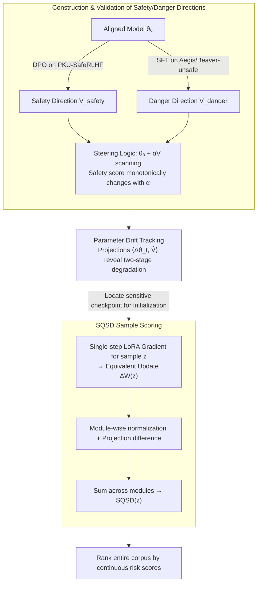

# From Parameter Dynamics to Risk Scoring: Quantifying Sample-Level Safety Degradation in LLM Fine-tuning

**Conference**: ICML 2026  
**arXiv**: [2605.04572](https://arxiv.org/abs/2605.04572)  
**Code**: https://github.com/(repo) (Available)  
**Area**: LLM Alignment / Safety / Model Compression  
**Keywords**: Safety Alignment, Fine-tuning Risk, Parameter Dynamics, Task Vectors, Sample Scoring

## TL;DR
The authors track the cumulative drift of parameters along "danger/safety directions" during LoRA fine-tuning. They discover that the underlying mechanism for alignment collapse caused by benign data is the monotonic parameter drift toward dangerous directions. Consequently, they propose SQSD, which assigns continuous risk scores to individual samples based on the projection difference of a single-step gradient along these two directions. SQSD maintains monotonic ASR rankings across 3 models and 2 datasets and demonstrates transferability across architectures, scales, and from LoRA to Full Fine-tuning.

## Background & Motivation

**Background**: Before deployment, LLMs undergo alignment (RLHF/DPO) to reject harmful requests. However, alignment proves surprisingly fragile during downstream fine-tuning; safety performance can collapse even when using as few as 100 **completely harmless** benign instruction samples. Such "benign-sample-driven alignment collapse" is more dangerous than direct attacks with harmful samples because toxicity classifiers cannot filter them out.

**Limitations of Prior Work**: Existing research on the causes of collapse follows two lines: (i) analyzing embedding drift (e.g., Vaccine) and (ii) analyzing static parameter perturbations (e.g., Booster, PEFT safety analysis). Both prioritize snapshots of pre- and post-fine-tuning states rather than tracking the process. Furthermore, they focus on perturbation magnitude rather than direction, making it difficult to distinguish "safety-related drift" from "task-related drift." Methods for selecting high-risk samples (Bi-Anchor / Self-Inf-N / LARF) follow an "extreme sample selection" route, picking only the most dangerous subsets and failing on intermediate-risk samples, leading to "boundary collapse" issues.

**Key Challenge**: Safety degradation is a **dynamic process** rather than a static perturbation and is strongly correlated with the "direction of parameter drift" rather than simple perturbation magnitude. Measuring only the magnitude mixes the effects of "task learning" and "safety destruction," making them inseparable.

**Goal**: (RQ1) Provide a mechanistic explanation for why benign fine-tuning breaks alignment; (RQ2) Within this mechanism, calculate a continuous and interpretable safety risk score for **every sample**.

**Key Insight**: Drawing on the concept of Task Vectors, the authors define two semantic anchor vectors: $V_\text{safety} = \hat\theta_\text{aligned} - \theta_0$ and $V_\text{danger} = \hat\theta_\text{harmful} - \theta_0$. They then track the cumulative drift $\Delta\theta_t = \theta_t - \theta_0$ at each fine-tuning step along these two directions, directly mapping "safety degradation" to "parameter trajectories."

**Core Idea**: Directional projections in parameter space are used both to explain the mechanism (cumulative dangerous drift driving safety collapse) and to score samples (single-step gradient projection along the danger direction minus the projection along the safety direction = the SQSD risk score for the sample).

## Method

### Overall Architecture
The study revolves around projecting "safety degradation" onto two pre-calibrated directions in the parameter space. The first part is a mechanistic analysis—constructing "safety" and "danger" semantic anchor vectors and tracking cumulative parameter drift projections along these directions during fine-tuning. The second part is sample scoring via SQSD—calculating a single-step LoRA gradient for each candidate sample to estimate the equivalent weight update, then determining if this update leans toward the "danger" or "safety" direction. The "direction-sensitive checkpoint" identified in the mechanism analysis serves as the critical initialization point for SQSD gradient calculation.

### Key Designs

**1. Construction and Validation of "Safety/Danger" Directions in Parameter Space**  
To "measure" safety degradation, a directional ruler is required. Using the Task Vector approach (direction = endpoint − start point), the authors create two semantic anchor vectors: $V_\text{safety} = \arg\min_\theta \mathcal{L}_\text{dpo}(\theta_0, D_\text{aligned}) - \theta_0$ (via DPO on PKU-SafeRLHF) and $V_\text{danger} = \arg\min_\theta \mathcal{L}_\text{sft}(\theta_0, D_\text{harmful}) - \theta_0$ (via SFT on Aegis-unsafe/BeaverTails-unsafe). Validation through a steering experiment $\theta(\alpha) = \theta_0 + \alpha V$ shows that the Safety Score increases monotonically along $V_\text{safety}$ and decreases along $V_\text{danger}$, confirming these vectors encode the intended safety semantics.

**2. Tracking Cumulative Drift Reveals Two-Stage Degradation**  
Using the defined directions, the authors track the mechanism of collapse. By calculating projections $p_\text{safety}(t) = \langle\Delta\theta_t, \hat{V}_\text{safety}\rangle$ and $p_\text{danger}(t) = \langle\Delta\theta_t, \hat{V}_\text{danger}\rangle$ at each checkpoint, they identify a non-linear two-stage pattern: in the early stage, parameters drift rapidly toward the danger direction while the Safety Score stays relatively stable; in the later stage, directional drift slows down, but the Safety Score collapses abruptly. This confirms the "safety basin" intuition—robust within the basin, catastrophic once breached—and indicates that SQSD gradients must be calculated at "direction-sensitive" parameter states.

**3. SQSD: Single-step Gradient Projection Difference as Sample Risk Score**  
SQSD applies the same directional logic to individual samples. For a sample $z$, the equivalent weight update $\Delta W(z) \approx -\eta(B_0 \nabla_A + \nabla_B A_0)$ is derived from a single-step LoRA gradient. For each LoRA module $m$, the update is normalized, and the projection difference is calculated:

$$\text{SQSD}_m(z) = \left\langle\frac{\Delta W_m(z)}{\|\Delta W_m(z)\|_2}, \hat{V}_{\text{danger},m}\right\rangle - \left\langle\frac{\Delta W_m(z)}{\|\Delta W_m(z)\|_2}, \hat{V}_{\text{safety},m}\right\rangle$$

The final score is the sum across all modules: $\text{SQSD}(z) = \sum_m \text{SQSD}_m(z)$. A first-order Taylor expansion justifies this as the relative push toward $\theta_\text{danger}$ vs. $\theta_\text{safety}$. Two critical details ensure effectiveness: module-wise normalization prevents "response length bias," and initialization must occur at a "sensitive" checkpoint identified in Design 2.

### Loss & Training
SQSD does not introduce new training objectives. LoRA fine-tuning Uses $r=8, \alpha=16$. For anchor vector construction, $lr=5\text{e-}6$ is used; for SQSD evaluation, $lr$ is increased to $5\text{e-}5$ to induce observable safety degradation. The interpretability is grounded in the approximation $\eta[\mathcal{L}(z, \theta_\text{ref}) - \mathcal{L}(z, \theta_\text{target})] \approx (\theta' - \theta_\text{ref})^\top (\theta_\text{target} - \theta_\text{ref})$.

## Key Experimental Results

### Main Results
Evaluated on 3 models (Qwen3-8B / Llama-3.1-8B-Instruct / Llama-2-7B-Chat) across 2 datasets (Dolly / Alpaca). Datasets were partitioned into five subsets (S1–S5) based on SQSD rankings (S1 = highest risk, S5 = lowest risk).

| Model + Data | S1 ASR | S5 ASR | Δ (S1-S5) | Monotonic? |
|-------------|--------|--------|-----------|-------|
| Qwen3-8B / Dolly / SQSD(Beaver) | 71.27 | 2.55 | **+68.72** | ✓ |
| Qwen3-8B / Alpaca / SQSD(Beaver) | 50.91 | 3.27 | +47.64 | ✓ |
| Llama3.1-8B / Dolly / SQSD(Beaver) | 79.82 | 4.73 | +75.09 | ✓ |
| Llama2-7B / Dolly / SQSD(Beaver) | 45.27 | 0.36 | +44.91 | ✓ |
| Reward Model baseline (Dolly avg)| 57.27 | 8.00 | 49.27 | ✗ |
| LARF baseline (Dolly avg) | 48.91 | 4.61 | 44.30 | ✗ |

SQSD maintains **strict monotonicity in 10/12 configurations** (compared to at most 1/6 for baselines). The average Δ of 49.86% outperforms the strongest baseline (Reward Model at 43.76%).

### Ablation Study

| Configuration | S1 ASR | Δ | Monotonic? |
|------|--------|---|-------|
| SQSD (full) | 71.27 | 68.72 | ✓ |
| w/o module-wise normalization | 13.09 | 12.54 | ✗ (dominated by length) |
| Danger direction only | 68.36 | 64.54 | ✗ (lacks safety constraint) |
| Safety direction only | 27.09 | 20.91 | ✗ (no danger signal) |
| Insensitive initialization | 38.36 | 37.27 | ✗ (weak projection signal) |

| Transfer Experiment | S1 | S5 | Monotonic? |
|----------|-----|-----|-------|
| Llama → Qwen | 42.55 | 1.64 | ✓ |
| Qwen → Llama | 79.64 | 28.00 | ✓ |
| Qwen-8B → 14B | 55.09 | 7.09 | ✓ |
| Qwen-8B → 32B | 28.91 | 2.00 | ✓ |
| Qwen LoRA → Full FT | 10.73 | 2.55 | ✓ |

### Key Findings
- **Module-wise normalization is essential**: Without it, response length bias overwhelms the safety signal, causing Δ to drop from 68.72 to 12.54 and destroying monotonicity.
- **Twin directions are required**: Using only the danger or safety direction fails to maintain monotonicity. The two directions calibrate each other, measuring the net risk.
- **Initialization sensitivity is a critical constraint**: SQSD must be calculated at a "direction-sensitive parameter state." Rankings fail if calculated at $\theta_0$.
- **Cross-architecture and cross-scale transferability**: SQSD captures architecture-independent sample properties, allowing one to score samples on small models and apply the rankings to larger models or full fine-tuning scenarios.

## Highlights & Insights
- **Parameter dynamics as a transformative perspective**: Moving beyond static snapshots to track "direction and distance" of drift reveals the non-linear two-stage collapse and decouples task drift from safety drift.
- **Continuous scoring vs. Extreme selection**: Unlike prior methods that only identify the top-$k$ most dangerous samples, SQSD provides a full-spectrum risk score, enabling future risk-weighted fine-tuning strategies.
- **"Safety usage" of Task Vectors**: Successfully adapts the Task Vector family (traditionally for task arithmetic) to safety alignment, supported by rigorous steering validation.
- **Practical utility of scale transfer**: SQSD reduces filtering costs by allowing high-risk data identification on 8B models for deployment on larger models (32B+).

## Limitations & Future Work
- SQSD depends heavily on the "direction sensitivity" of the initialization point; perfect consistency is not guaranteed across all configurations.
- Constructing anchor directions requires full DPO/SFT runs, which is computationally expensive. Lightweight or zero-shot construction remains an open problem.
- Experiments focus on LoRA; while transfer to Full FT is shown, the high-dimensional behavior of SQSD in Full FT might be more complex.
- The method serves as a diagnostic tool; integrating SQSD directly into "risk-aware data filtering" or "risk-weighted SFT" algorithms is the next step.

## Related Work & Insights
- **vs. Bi-Anchor / Self-Inf-N / LARF**: These methods use embedding or raw gradient similarity without directional distinction. SQSD is more direction-sensitive and provides continuous scores.
- **vs. Vaccine / Booster**: These focus on static perturbations. This paper's two-stage trajectory analysis significantly deepens the understanding of the collapse mechanism.
- **vs. LESS**: While LESS is for general influence estimation, SQSD is specialized for safety via task-vector interpretations.
- **vs. Safety Basin Theory**: The observed two-stage drift corroborates the safety basin intuition—robustness followed by a sharp breach.

## Rating
- Novelty: ⭐⭐⭐⭐ "Parameter dynamics + twin-direction projection" is a clear and effective new perspective.
- Experimental Thoroughness: ⭐⭐⭐⭐ Strong coverage across models, baselines, and transfer scenarios, though benchmark variety could be broader.
- Writing Quality: ⭐⭐⭐⭐ Highly linear and logical structure; conceptual diagrams are effective.
- Value: ⭐⭐⭐⭐ Provides both a mechanistic framework and a practical tool for safety auditing in fine-tuning.

<!-- RELATED:START -->

## Related Papers

- [\[ICML 2026\] PFT: Phonon Fine-tuning for Machine Learned Interatomic Potentials](pft_phonon_fine-tuning_for_machine_learned_interatomic_potentials.md)
- [\[ICML 2026\] Decoupled Training with Local Reinforcement Fine-Tuning in Federated Learning](decoupled_training_with_local_reinforcement_fine-tuning_in_federated_learning.md)
- [\[ICML 2026\] The Injection Paradox: Brand-Level Suppression in Safety-Trained LLM Recommendations via RAG Context Injection](the_injection_paradox_brand-level_suppression_in_safety-trained_llm_recommendati.md)
- [\[ICML 2026\] TCAP: Tri-Component Attention Profiling for Unsupervised Backdoor Detection in MLLM Fine-Tuning](tcap_tri-component_attention_profiling_for_unsupervised_backdoor_detection_in_ml.md)
- [\[ICML 2026\] Towards Fine-Grained Robustness: Attention-Guided Test-Time Prompt Tuning for Vision-Language Models](towards_fine-grained_robustness_attention-guided_test-time_prompt_tuning_for_vis.md)

<!-- RELATED:END -->
