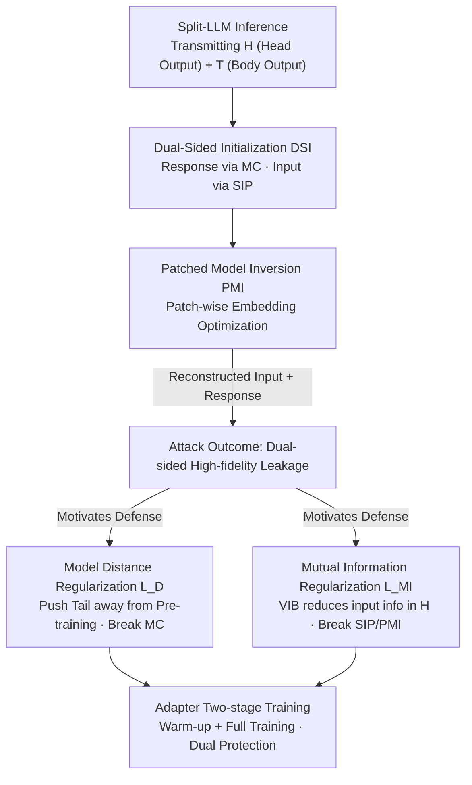

# From Prompts to Responses: Dual-Sided Data Leakage and Defense in Split Large Language Models

**Conference**: ICML2026  
**arXiv**: [2606.14210](https://arxiv.org/abs/2606.14210)  
**Code**: https://github.com/FLAIR-THU/VFLAIR-LLM  
**Area**: AI Security / Privacy Attacks and Defenses  
**Keywords**: Split Learning, Model Inversion Attack, Privacy Protection, Mutual Information Regularization, Large Language Models

## TL;DR
In "Split Large Language Models (Split-LLM)," private data is leaked from **both ends**—the model head and the model tail. This paper proposes the PIDI attack, which uses dual-sided initialization and patched inversion to reconstruct user input prompts and model-generated responses with high fidelity. Simultaneously, it proposes the ADMI defense, which utilizes adapter local warm-up and mutual information regularization to suppress attack success rates at both ends to near zero with almost no task performance degradation.

## Background & Motivation
**Background**: Users in privacy-sensitive fields (finance, medical) face a dilemma when using LLMs: external API calls risk data leakage, while local full-scale deployment lacks sufficient compute. Split Learning offers a compromise by cutting a complete LLM into "Head-Body-Tail (HBT)" segments. The lightweight head $M_h$ (embedding layer + first few layers) and tail $M_t$ (last few layers + output projection) remain with the local data owner, while the parameter-heavy body $M_b$ is deployed on the cloud. Both parties exchange intermediate activations rather than raw data.

**Limitations of Prior Work**: The original intent of HBT was that "keeping both ends local equals safety for both," but this is not the case in practice. Most existing inversion attacks focus solely on **input prompt** leakage (inferring input from the head output $H$) or reconstructing **labels** from gradients in classification tasks. Leakage on the **response output** side in generative tasks, and how inputs and responses **jointly leak** from both ends, has rarely been systematically studied.

**Key Challenge**: Autoregressive generation naturally appends generated tokens back to the input sequence. Consequently, the cloud model provider can aggregate the head output $H$ and body output $T$ over multiple forward passes, effectively **holding information from both sides required to reconstruct inputs and responses**. Existing defenses almost exclusively harden the model head (preventing input leakage) while leaving the tail undefended; DualGuard, the only attempt to defend both, possesses structural flaws.

**Goal**: (1) Attack side: Systematically reveal the **dual-sided leakage** of inputs and responses during Split-LLM generation and develop an attack capable of reconstructing both with high fidelity; (2) Defense side: Design a defense that truly protects both ends while minimizing the sacrifice of task performance.

**Key Insight**: The attacker is an "honest-but-curious" model provider who follows the protocol and does not collude, but possesses the original model segments $\bar{M}_{h/b/t}$, the fine-tuned body $M_b$, the activations $H$ and $T$ transmitted during inference, and optional minimal auxiliary data (only 50 entries in experiments). The entire attack occurs during the forward phase with **no gradients available**, which fundamentally differs from training-time attacks.

**Core Idea**: The attack employs a "coarse initialization followed by fine-grained inversion" two-stage strategy, using different methods for input and response sides. The defense uses "adapter local warm-up + mutual information regularization + model distance regularization" to break the two prerequisites for the attack (head leakage and the "not-too-far" property where the fine-tuned tail remains close to the pre-trained tail).

## Method

### Overall Architecture
The paper follows an "attack-defense pair" structure: it first proposes the attack **PIDI** (Patched Model Inversion with Dual-Sided Initialization) to prove high-fidelity leakage, then introduces the defense **ADMI** (Adapter-based DualGuard with Mutual Information Defense) to close the vulnerabilities exploited by PIDI.

PIDI consists of two stages: **Dual-Sided Initialization (DSI)** first performs a coarse estimation of the response and input—the response uses "Model Completion (MC)" (feeding $T$ into the original tail $\bar{M}_t$ by exploiting the "not-too-far" property), and the input uses SIP (training a small model to directly map $H$ to the input). **Patched Model Inversion (PMI)** then feeds the coarsely estimated embeddings into the original head $\bar{M}_h$ to obtain "fake" hidden states, optimizing the embeddings by minimizing the distance to the real $H$. A "patching" technique is used to solve convergence issues with long sequences.

ADMI also consists of two stages to dismantle the two pillars of PIDI: **Adapter-based local warm-up** introduces an encoder-decoder Adapter as a proxy path for $M_b$, allowing the local side to leverage $M_b$'s capabilities while it remains frozen, and uses model distance regularization $\mathcal{L}_D$ to push the tail away from the pre-training space (breaking MC). **Full training** then inserts a Variational Information Bottleneck (VIB) with mutual information regularization $\mathcal{L}_{\text{MI}}$ to reduce input-related information in $H$ (breaking SIP and PMI).

### Key Designs

**1. Dual-Sided Initialization DSI: Distinct treatments for input and response**

The first step of PIDI is to construct a coarse initialization for the input sequence $X$ and response sequence $Y$. The key insight is that the leakage "mechanisms" differ, so a single approach is insufficient. The **response side** is strongly related to the model's generation mode, thus MC is used: since fine-tuned tail parameters $M_t$ typically remain "not-too-far" from pre-trained parameters $\bar{M}_t$, the attacker can estimate the response $\hat{Y}=\bar{M}_t(T)$ by feeding $T$ into the original tail. The **input side** is weakly related to the generation process and is primarily encoded by the head $M_h$; thus, SIP (Semi-white-box Forward Inversion) is used: utilizing the known transformation $H=M_h(X)$ and the semantic properties of hidden states, an inversion model $M_{\text{SIP}}$ is trained with just 50 auxiliary points to estimate $\hat{X}=M_{\text{SIP}}(H)$.

**2. Patched Model Inversion PMI: Exploiting causal structure for long sequences**

Traditional inversion feeds initial embeddings $E_0$ into the original head $\bar{M}_h$ to get $\hat{H}$, then minimizes $\mathcal{L}_{\text{inv}}=\|M_h(E)-H\|$ to solve $E_1=\arg\min_{E_0}\mathcal{L}_{\text{inv}}$. As the sequence length $L$ increases, optimizing a full sequence becomes difficult to converge.

PMI utilizes the **causal structure of decoder-only LLMs**: the full embedding $E_0\in\mathbb{R}^{L\times d}$ is cut into $N$ non-overlapping patches $[E_{p1},\dots,E_{pN}]$. Since a hidden state at any position only depends on **preceding** tokens, prefix patches $[E_{p1},\dots,E_{pk}]$ and their corresponding $H$ segments form valid input-output pairs. **Patch-wise iterative** inversion is performed: each iteration optimizes only $E_{pk}$, minimizes $\|\hat{H}_{pk}-H_{pk}\|$, and freezes previous patches. Finally, a **joint inversion** is performed with all patches unfrozen.

**3. Mutual Information Regularization $\mathcal{L}_{\text{MI}}$: Erasing input info from the source**

To block the "H leaks input" path, the goal is to minimize the mutual information $I(X,H)$, squeezing task-irrelevant input information out of $H$. Since discrete token IDs are non-differentiable, it is applied to continuous embeddings $E=f_e(X)$. By the Data Processing Inequality, $I(X,H)\le I(E,H)$, so $I(E,H)$ is minimized instead. This is implemented via a VIB (Variational Information Bottleneck) between $M_h$ and $M_b$ using the KL divergence:

$$\mathcal{L}_{\text{MI}}=\frac{1}{N}\sum_{i=1}^{N}\frac{1}{2}\sum_{j=1}^{d}\left(\mu_{ij}^2+\sigma_{ij}^2-\log(\sigma_{ij}^2)-1\right)$$

**4. Adapter Local Warm-up + Model Distance Regularization $\mathcal{L}_D$: Breaking "not-too-far"**

To block the "MC attack relies on tail proximity" path, ADMI adopts the distance regularization $\mathcal{L}_D=1/\text{CrossEntropy}(M_t(T),M_t'(T))$ to **increase** the output divergence between fine-tuned and pre-trained tails. ADMI introduces an encoder-decoder **Adapter**: $A_e$ processes $H$, $M_b$ computes $T$, and $A_d$ (using $A_e$ as memory) refines $T$ into $T'$ for the tail. No gradients are sent to the cloud model provider during training; $M_b$ remains frozen while the head is updated via the adapter path. An adaptive weight $\text{ada}(\beta)$ is used to keep its gradient norm within 0.1x of the main task gradient:

$$\text{ada}(\beta)=\frac{\min(\|\nabla_{\mathbf{E}}\mathcal{L}_D\|_2,\ 0.1\cdot\|\nabla_{\mathbf{E}}\mathcal{L}_T\|_2)}{\|\nabla_{\mathbf{E}}\mathcal{L}_D\|_2+\epsilon}$$

### Loss & Training
ADMI uses a two-stage strategy: **Local Warm-up** with $\mathcal{L}_{\text{lw}}=\mathcal{L}_T+\text{ada}(\beta)\cdot\mathcal{L}_D$ (defends the tail via the Adapter path) and **Full Training** with $\mathcal{L}_{\text{ft}}=\mathcal{L}_T+\alpha\mathcal{L}_{\text{MI}}+\text{ada}(\beta)\cdot\mathcal{L}_D$ (VIB defense on the head). The Adapter encodes unperturbed $H$ info, which helps recoup semantic loss caused by the VIB in the decryption stage.

## Key Experimental Results

### Main Results (Attack)
Evaluated on 3 LLMs (Llama3.2-3B / Llama3-8B / Qwen2.5-7B) across 3 datasets (Fin, Med, Dolly). Metric: Integrated Attack Success Rate $\text{AP}_{\alpha=0.5}$ (average BLEU of input and response).

| Method | Fin/Llama3.2-3B | Fin/Llama3-8B | Fin/Qwen2.5-7B | Dolly/Qwen2.5-7B |
|----------|----------------|---------------|----------------|------------------|
| **PIDI (Ours)** | **0.868** | **0.883** | **0.892** | **0.985** |
| DSI+VMI | 0.828 | 0.716 | 0.770 | 0.814 |
| BiSR (SIP+VMI) | 0.665 | 0.610 | 0.546 | 0.667 |
| DSI (Init Only) | 0.691 | 0.697 | 0.770 | 0.740 |
| SIP (Input Only) | 0.391 | 0.347 | 0.546 | 0.450 |
| MC (Response Only) | 0.400 | 0.418 | 0.442 | 0.405 |
| VMI (Inversion Only) | 0.006 | 0.312 | 0.224 | 0.029 |

PIDI is the strongest across all settings (AP 0.8~0.99), implying high-fidelity reconstruction for both ends.

### Main Results (Defense)
Metrics: Task Performance MP (METEOR), Attack Success Rate AP, and Trade-off Score DCS.

| Method | Llama3.2-3B (MP/AP/DCS) | Llama3-8B (MP/AP/DCS) | Qwen2.5-7B (MP/AP/DCS) |
|----------|--------------------------|------------------------|-------------------------|
| No Defense | 0.560 / 0.868 / — | 0.527 / 0.883 / — | 0.550 / 0.892 / — |
| **ADMI (Ours)** | 0.516 / **0.017** / **0.968** | 0.515 / **0.014** / **0.987** | 0.527 / **0.004** / **0.984** |
| DualGuard | 0.459 / 0.296 / 0.819 | 0.510 / 0.446 / 0.760 | 0.542 / 0.572 / 0.712 |
| MID | 0.510 / 0.167 / 0.890 | 0.497 / 0.023 / 0.974 | 0.515 / 0.290 / 0.829 |

ADMI suppresses PIDI's AP to **0.004~0.017** while maintaining performance (~0.52 vs original ~0.55).

### Key Findings
- **Dual-sided initialization is critical**: DSI alone improves AP significantly compared to SIP/MC, proving the effectiveness of joint initialization.
- **Patched inversion solves long sequences**: While pure VMI fails on long sequences (0.006 on Llama3.2), PMI enables high-fidelity reconstruction.
- **Adapter path preserves performance**: Unlike DualGuard's projection layer, the Adapter maintains $M_b$'s understanding, ensuring MP is preserved.

## Highlights & Insights
- The **"dual-sided leakage" perspective** completes the threat model for Split-LLM by highlighting response leakage.
- **Causal patching for inversion**: Converting high-dimensional optimization into iterative short-sequence sub-problems is a clever adaptation to LLM structures.
- **Adapter as a proxy path**: It simultaneously freezes the large body to ensure security and allows gradients to update the head, while recouping info lost to VIB.

## Limitations & Future Work
- **Strong attacker assumptions**: Requires the original model segments and auxiliary data.
- **Empirical protection**: Lacks formal differential privacy guarantees; robustness against future adaptive attacks needs further validation.
- **VIB-Performance tension**: The upper bound of the privacy-utility trade-off when using VIB and Adapters remains to be fully explored.

## Related Work & Insights
- **Compared to BiSR / SIP**: PIDI extends the attack to both ends and introduces patched inversion for generative tasks.
- **Compared to DualGuard**: ADMI replaces the restrictive projection layer with an Adapter and adds VIB, achieving a significantly better trade-off.
- **Compared to MID / DPForward**: ADMI is one of the few solutions that effectively defends both sides without massive performance loss.

## Rating
- Novelty: ⭐⭐⭐⭐⭐ 
- Experimental Thoroughness: ⭐⭐⭐⭐ 
- Writing Quality: ⭐⭐⭐⭐ 
- Value: ⭐⭐⭐⭐⭐ 

<!-- RELATED:START -->

## Related Papers

- [\[ICML 2026\] BYORn: Bootstrap Your Own Responses to Defend Large Vision-Language Models Against Backdoor Attacks](byorn_bootstrap_your_own_responses_to_defend_large_vision-language_models_agains.md)
- [\[ICML 2026\] Differentially Private Preference Data Synthesis for Large Language Model Alignment](differentially_private_preference_data_synthesis_for_large_language_model_alignm.md)
- [\[CVPR 2026\] A Provable Energy-Guided Test-Time Defense Boosting Adversarial Robustness of Large Vision-Language Models](../../CVPR2026/ai_safety/a_provable_energy-guided_test-time_defense_boosting_adversarial_robustness_of_la.md)
- [\[ICML 2026\] Forget to Know, Remember to Use: Context-Aware Unlearning for Large Language Models](forget_to_know_remember_to_use_context-aware_unlearning_for_large_language_model.md)
- [\[ICML 2026\] COFT: Counterfactual-Conformal Decoding for Fair Chain-of-Thought Reasoning in Large Language Models](coft_counterfactual-conformal_decoding_for_fair_chain-of-thought_reasoning_in_la.md)

<!-- RELATED:END -->
