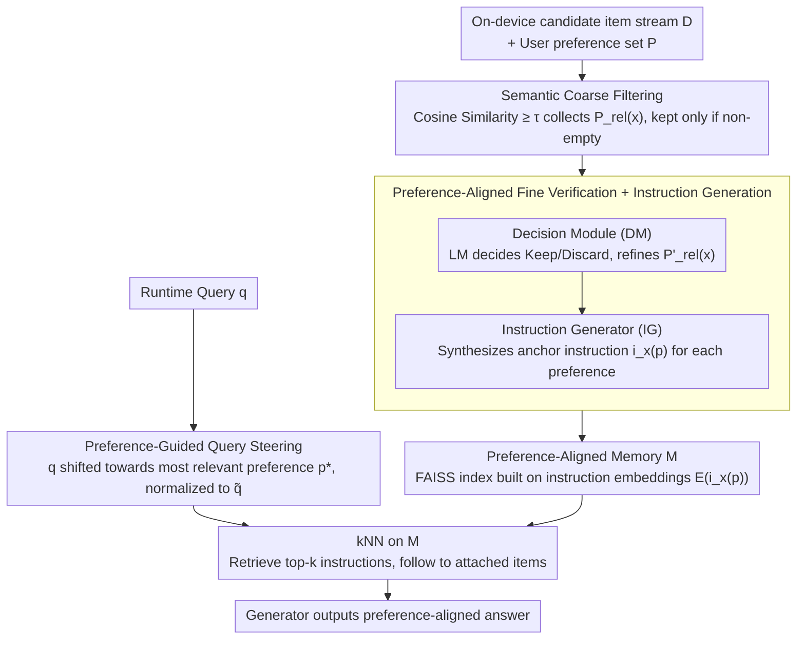

# From Volume to Value: Preference-Aligned Memory Construction for On-Device RAG

**Conference**: ICML 2026  
**arXiv**: [2605.18271](https://arxiv.org/abs/2605.18271)  
**Code**: https://github.com/UbiquitousAILab/EPIC (Available)  
**Area**: Information Retrieval / On-device RAG / Personalization  
**Keywords**: on-device RAG, user preference, memory constraint, instruction-based indexing, query steering

## TL;DR
EPIC shifts the core bottleneck of on-device RAG from "how to use preferences during retrieval" forward to "what to store during indexing." It utilizes a three-stage pipeline involving "coarse filtering + fine verification + query steering" to retain only data aligned with user preferences and generates "instruction-item" pairs as indexing units. It reduces storage by 2404× while achieving an absolute improvement of 20.17 percentage points in preference alignment accuracy across four preference benchmarks.

## Background & Motivation

**Background**: Personal AI agents centered on LLMs are increasingly deployed on mobile and edge devices to ensure privacy and responsiveness. Agents need to ground generation in on-device personal corpora (browsing history, dialogues, notifications, Wiki, etc.). RAG is the mainstream solution for integrating external knowledge. Existing personalized RAG works focus on organizing user content/profiles into graphs on the memory side (EMG-RAG, PEARL) or using preference rewriting and expansion on the query side (Cognitive Personalized Search, PBR).

**Limitations of Prior Work**: When scenarios move to the device side, storage and power consumption are hard constraints. Existing works generally assume the corpus has been "carefully curated," leaving only the problem of how to use it during querying. However, in on-device scenarios, raw data is heterogeneous and ever-growing (Wikipedia, Common Crawl, dialogue streams, notifications...). Indexing all data indiscriminately is impossible under a 1 MB memory budget; for instance, HippoRAG 2's index reaches 2.9 GB. Furthermore, standard retrievers only align query-text similarity and are "agnostic" to user preferences, leading to preference mismatch issues where "retrieved content is factually correct but violates user preferences" (e.g., a user allergic to seafood being recommended sashimi).

**Key Challenge**: Limited on-device memory vs. infinite personal data growth; retriever's goal of query similarity vs. user's actual need for preference alignment. These two goals are coupled in "what to index and what the query matches," yet existing methods optimize them separately.

**Goal**: Under tight on-device budgets, answer the upstream question of "what should be stored," which has been neglected, while reusing the same preference signal for both indexing and retrieval. Sub-problems include: (i) how to discard the vast majority of preference-irrelevant content with high throughput; (ii) how to perform semantic-level fine verification on potentially relevant content and store "how to use this data"; (iii) how to imbue query embeddings with preference semantics with almost no increased latency.

**Key Insight**: Among all forms of personal context, **user preferences** ($P = \{p_1, \dots, p_N\}$) are the most compact and stable abstractions—tastes, dietary restrictions, and stylistic preferences remain invariant across sessions and can be implicitly extracted from dialogue history. By treating the preference set as a "known-at-indexing" prior, the problem becomes picking preference-relevant subsets from a raw stream and indexing them in a preference-aligned manner.

**Core Idea**: Reframing "Personalized RAG" from the query-side to a **memory-construction problem**. Preference is integrated throughout: (1) high-recall coarse filtering using embedding similarity → (2) fine-grained verification using LM and synthesis of "anchor instructions" as indexing units → (3) steering the query towards the most relevant preferences during retrieval. This ensures the pipeline stores less while finding more accurately.

## Method

### Overall Architecture
The input consists of an ever-growing set of candidate items $\mathcal{D}$ (Wiki passages, dialogue fragments, webpages, etc.) and a set of user preferences $P = \{p_1, \dots, p_N\}$. The output is a compact preference-aligned memory $\mathcal{M}$, where each record is $(x, i_x(p), p, E(i_x(p)))$, representing "original item + preference-conditioned instruction + corresponding preference + instruction embedding." At runtime, given a query $q$, $q$ is steered toward the most relevant preference to obtain $\tilde q$. A FAISS kNN search is then performed on the instruction embeddings in $\mathcal{M}$. The retrieved instructions point to their attached original items, which are provided as context to the generator. The pipeline limits LM calls to a small subset (averaging 0.22 fine verification triggers per incoming data item). Both the indexing side (coarse filtering + fine verification) and the retrieval side (query steering + kNN) share the same preference set $P$ without redundant encoding.

### Key Designs

**1. Semantic-Based Coarse Filtering: Using embedding geometry to compress the LM invocation domain**

Over 99% of raw stream content is irrelevant to current user preferences. Passing every item to an LM for verification is unaffordable on-device. Coarse filtering uses a zero-cost geometric approximation: a shared sentence encoder (e.g., Contriever) encodes item $x$ and each preference $p$ into $\ell_2$ normalized vectors $E(\cdot) \in \mathbb{R}^d$. For each $x$, the cosine similarity $\mathrm{Sim}(E(x), E(p))$ is calculated. Preferences exceeding threshold $\tau$ are collected into $P_{rel}(x) = \{p \in P \mid \mathrm{Sim}(E(x), E(p)) \ge \tau\}$. Item $x$ is retained only if $P_{rel}(x)$ is non-empty ($\mathcal{D}_{coarse} = \{x \mid P_{rel}(x) \neq \emptyset\}$). This stage is the source of memory savings and low indexing latency—filtering alone achieves 3.95×–77.68× storage compression.

**2. Preference-Aligned Fine Verification + Instruction Generation: Upgrading from vector approximation to semantic alignment**

Embedding similarity can only approximate semantics. It may include noise for fine trade-offs like "dislike seafood" vs. "sushi menu." LM-based discrimination is necessary. This stage cascades two modules: the Decision Module (DM) outputs $(\mathrm{Decision}, \mathrm{Rationale}, P'_{rel}(x))$, where $P'_{rel}(x) \subseteq P_{rel}(x)$ is the refined relevant subset. Only "Keep" items enter $\mathcal{D}_{fine}$. The Instruction Generator (IG) then takes $(x, p, \mathrm{Rationale})$ as input to generate a preference-conditioned instruction $i_x(p) = \mathrm{IG}(x, p, \mathrm{Rationale})$, describing "how to use this data under this preference." ** Crucially, the FAISS index is built on $E(i_x(p))$ instead of $E(x)$.** Indexing instructions instead of raw text upgrades "finding semantically similar facts" to "finding facts matching current preference usage," driving an accuracy gain of +13.22–+33.69%p.

**3. Preference-Guided Query Steering: Zero-parameter query projection into the preference subspace**

Although preferences are encoded into instruction embeddings at indexing, queries remain preference-agnostic at runtime. EPIC solves this via geometric translation: the most relevant preference $p^* = \arg\max_{p \in P} \mathrm{Sim}(E(q), E(p))$ is selected, and the query is shifted: $\tilde q = (E(q) + E(p^*)) / \|E(q) + E(p^*)\|$. This zero-parameter operation adds only 0.18 ms latency per query on a Jetson Orin Nano, avoiding the overhead of LLM-based query rewriting (Pref-QR / PBR).

### Loss & Training
EPIC is a **purely inference-time pipeline**. It introduces no new training objectives or parameters. It uses off-the-shelf encoders (Contriever) and LLMs (Qwen3-4B / Llama-3.1-8B). The only tunable parameters are the threshold $\tau$ and the IG prompts. This allowing it to be plug-and-play with any retriever or LLM backend.

## Key Experimental Results

### Main Results
Preference-following Accuracy (%) on four benchmarks using LLaMA-3.3-70B-Instruct as the judge:

| Backend | Method | PrefWiki | PrefRQ | PrefELI5 | PrefEval |
|------|------|----------|--------|----------|----------|
| Llama-3.1-8B | BM25 | 38.56 | 64.22 | 69.04 | 27.97 |
| Llama-3.1-8B | NV-Embed-v2 (Prev. SOTA) | 44.53 | 70.22 | 69.86 | 30.88 |
| Llama-3.1-8B | HippoRAG 2 | 42.91 | 66.00 | 69.73 | 32.98 |
| Llama-3.1-8B | Pref-QR | 39.72 | 71.33 | 69.59 | 34.21 |
| Llama-3.1-8B | **EPIC** | **54.07** | **83.00** | **87.95** | **65.61** |
| gpt-oss-20b | NV-Embed-v2 | 42.29 | 86.56 | 77.01 | 29.28 |
| gpt-oss-20b | **EPIC** | **73.26** | **93.89** | **87.61** | **77.96** |

EPIC achieves an average absolute **Gain of +20.17%p** over NV-Embed-v2.

Efficiency Comparison:

| Dimension | NV-Embed-v2 | HippoRAG 2 | PBR | **EPIC** | Advantage |
|------|-------------|------------|-----|----------|----------------|
| Storage (MB) | 648 | 2896 | 286 | **0.27** | **~2404× smaller** |
| Retrieval Latency (ms) | 100 | 812 | 10073 | **3** | **~33× faster** |
| Indexing Latency (s) | 1918 | 4726 | 654 | 246 | Comparable to lightweight |

### Ablation Study

| Configuration | Accuracy Gain (vs. baseline) | Storage Compression | Description |
|------|----------------------------|----------|------|
| C only | Minimal | **3.95×–77.68×** | Main source of memory saving; accuracy unstable. |
| C + F | **+13.22 to +33.69 %p** | Additional ×1.95–8.93 | Main source of accuracy; instruction-centric memory. |
| C + F + S | Additional **+0.78 to +4.03 %p** | Unchanged | Zero-cost gain by utilizing encoded preference signals. |

### Key Findings
- **Clear contribution profiles**: C handles "storing less," F handles "finding accurately," and S provides a "free extra boost."
- **Strongest on PrefEval (Dialogue History)**: Preference-agnostic methods hover around 30%, whereas EPIC jumps to 65–78%, showing that "filtering at indexing" yields the highest returns where preference signals are densest.
- **Robustness under streaming preference drift**: As 5K→40K documents arrive with random preference switches, EPIC's memory remains nearly flat, and accuracy stays stable.
- **Portability**: Applying EPIC components to HippoRAG 2 replicated the same improvement trends, proving it is a plug-in memory layer.

## Highlights & Insights
- **Paradigm shift to "what to store"**: While most personalized RAG literature focuses on the query side, this work identifies memory construction as the upstream bottleneck for on-device deployment.
- **Instruction-based indexing is a clever design**: Traditional indexing focuses on "fact semantics." By indexing LLM-generated anchor instructions, the system upgrades retrieval from fact matching to preference-usage matching.
- **Reuse of preference signals**: Coarse filtering, fine verification, and query steering all consume the same $P$ without training new alignment networks, making it extremely friendly for zero-shot on-device deployment.
- **Transferable Trick**: The $\tilde q = \text{normalize}(E(q) + E(p^*))$ approach for "vector-sum conditional retrieval" can be applied to any scenario requiring retrievers to respect specific attributes (domain, style, safety).

## Limitations & Future Work
- Assumes $P$ is known at indexing; the extraction of preferences from dialogue streams is handled by an upstream pipeline and not integrated into the threshold strategy.
- No explicit modeling for conflicting preferences; steering may default to the single most similar preference.
- Accuracy relies on the quality of the on-device LM used for verification and instruction generation.
- Evaluation depends on LLM-as-a-judge frameworks, which may carry inherent biases.

## Related Work & Insights
- **vs. HippoRAG 2 / RAPTOR**: These methods focus on "better retrieval on a fixed index." EPIC handles the upstream decision of "what enters the index," reducing storage by ~10000× compared to HippoRAG 2.
- **vs. Pref-QR / PBR**: These lines use LLMs at the query side, resulting in high latency. EPIC amortizes the cost to the indexing phase, which suits on-device workloads (frequent queries, sparse data inflow).
- **vs. EMG-RAG / PEARL**: These works assume "memory already exists." EPIC is complementary, acting as a filter for raw heterogeneous data before these systems organize the memory.

## Rating
- Novelty: ⭐⭐⭐⭐⭐ Shifts the focus from query-side preference usage to indexing-side construction.
- Experimental Thoroughness: ⭐⭐⭐⭐⭐ Extensive testing across 4 benchmarks, 3 LLM backends, 8 baselines, and 3 types of hardware.
- Writing Quality: ⭐⭐⭐⭐ Strong problem statement, though some details are scattered in the Appendix.
- Value: ⭐⭐⭐⭐⭐ Massive gains in memory, speed, and accuracy make this a potential new SOTA baseline for on-device agents.

<!-- RELATED:START -->

## Related Papers

- [\[ICML 2026\] Memory as a Markov Matrix: Sample Efficient Knowledge Expansion via Token-to-Dictionary Mapping](memory_as_a_markov_matrix_sample_efficient_knowledge_expansion_via_token-to-dict.md)
- [\[ICML 2026\] Differentially Private Preference Data Synthesis for Large Language Model Alignment](differentially_private_preference_data_synthesis_for_large_language_model_alignm.md)
- [\[ICML 2026\] Federated Variational Preference Alignment with Gumbel-Softmax Prior for Personalized User Preferences](federated_variational_preference_alignment_with_gumbel-softmax_prior_for_persona.md)
- [\[ICML 2026\] The Injection Paradox: Brand-Level Suppression in Safety-Trained LLM Recommendations via RAG Context Injection](the_injection_paradox_brand-level_suppression_in_safety-trained_llm_recommendati.md)
- [\[CVPR 2026\] V-Attack: Targeting Disentangled Value Features for Controllable Adversarial Attacks on LVLMs](../../CVPR2026/ai_safety/v-attack_targeting_disentangled_value_features_for_controllable_adversarial_atta.md)

<!-- RELATED:END -->
