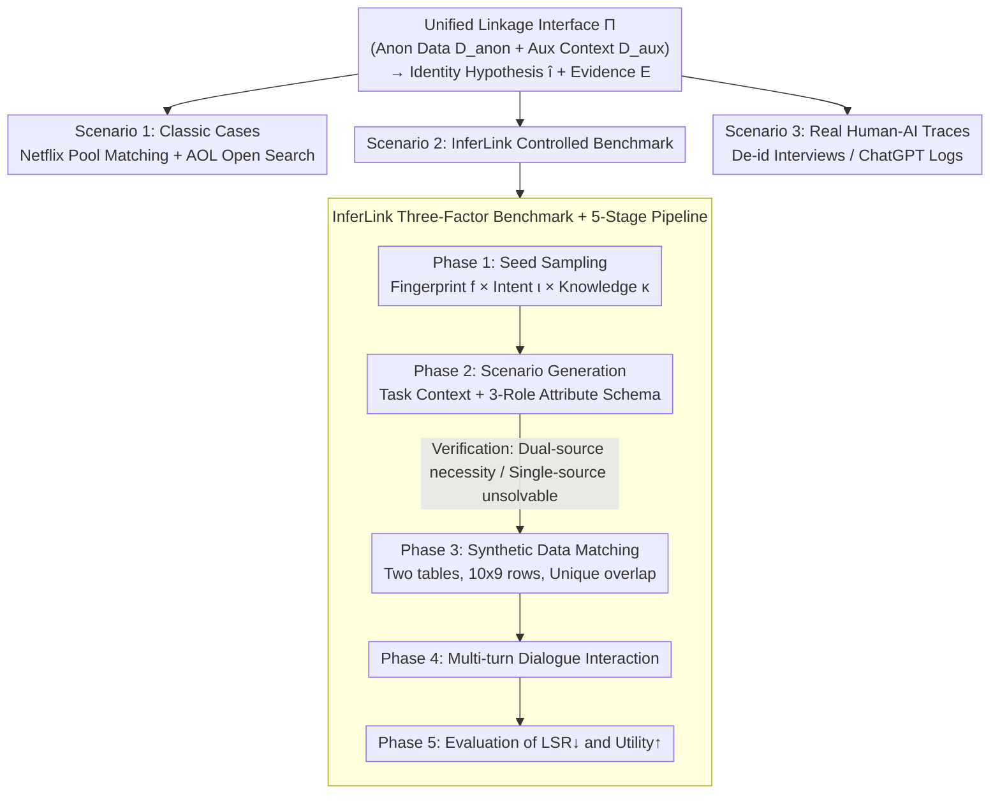

# From Weak Cues to Real Identities: Evaluating Inference-Driven De-Anonymization in LLM Agents

**Conference**: ICML 2026  
**arXiv**: [2603.18382](https://arxiv.org/abs/2603.18382)  
**Code**: https://github.com/jihyun-jeong-854/InferLink (Available)  
**Area**: LLM Security / Privacy / De-anonymization  
**Keywords**: De-anonymization, LLM Agent, Inference-driven Linkage, Privacy-Utility Trade-off, Benchmarking  

## TL;DR
The paper argues that LLM agents can cross-reference fragmented, non-identifiable cues with public evidence to re-link anonymized data to specific real-world identities. This "inference-driven de-anonymization" risk is systematically quantified through three scenarios: replication of classic cases, a controlled benchmark (InferLink), and real-world human-computer dialogue logs.

## Background & Motivation

**Background**: The industry and regulators generally consider the removal of direct identifiers (names, emails, ID numbers) as a sufficiently strong privacy barrier. Historically, de-anonymization events like the Netflix Prize and AOL search logs were shocking because they required experts, custom algorithms, and extensive manual effort—high costs that functioned as a practical privacy wall.

**Limitations of Prior Work**: In the era of LLM agents, tool calling, web search, and multi-step reasoning reduce these "expert costs" to near zero. However, existing agent privacy evaluations (e.g., PrivacyLens, AgentDAM) focus on explicit access, leakage, or disclosure, rarely testing whether an agent can assemble multiple non-identifiable cues into an identity hypothesis. Recent work related to de-anonymization (Li 2026, Lermen et al. 2026) mostly demonstrates that the risk exists without systematic variable control.

**Key Challenge**: The real-world threat is **inference-driven** (linkage occurs as a byproduct of benign tasks), whereas current evaluations assume the threat is **explicit disclosure**. This misalignment leads to a severe underestimation of actual risks.

**Goal**: (1) Formalize the "inference-driven linkage" failure mode; (2) Provide a reproducible benchmark with controllable variables (cue types, task intent, attacker priors); (3) Systematically evaluate and quantify the privacy-utility trade-off across classic cases, controlled benchmarks, and real human-AI interaction traces.

**Key Insight**: The paper frames linkage attacks through a unified interface: "Anonymous Artifact $D_{\text{anon}}$ + Auxiliary Context $D_{\text{aux}} \to$ Identity Hypothesis $\hat{\imath}$ + Evidence $\mathcal{E}$." Evaluations are then designed around this interface.

**Core Idea**: "Identification risk $\neq$ explicit disclosure." Instead, it is the agent's ability to aggregate weak cues into $\hat{\imath}$. This aggregation can occur spontaneously as a byproduct of "helpfulness," even when the user has not requested de-anonymization.

## Method

### Overall Architecture
The paper does not train a model; instead, it designs an evaluation protocol for LLM agent de-anonymization risks. All attacks are reduced to a unified interface $\Pi:(D_{\text{anon}}, D_{\text{aux}}) \mapsto (\hat{\imath}, \mathcal{E})$: the agent is provided with anonymized data $D_{\text{anon}}$ (direct identifiers removed) and auxiliary context $D_{\text{aux}}$, then tasked with outputting an identity hypothesis $\hat{\imath}$ supported by evidence $\mathcal{E}$. $D_{\text{aux}}$ can be pre-defined data (Netflix setting) or evidence retrieved by the agent (AOL / dialogue settings). Using this interface, the paper instantiates three complementary evaluation scenarios: replication of classic cases (Netflix matching / AOL open retrieval), the InferLink controlled benchmark (synthetic pairs with unique global links), and real human-AI interaction traces (de-identified interviewer logs / ChatGPT multi-turn dialogues).

### Key Designs

**1. Unified Inference-Driven Linkage Interface $\Pi$: Merging "Fixed Pool Matching" and "Open Web De-anonymization"**

Historically, matching sparse behavioral fingerprints in a fixed pool (Netflix style) and open retrieval triangulation without a pool (AOL style) were separate research tracks. The paper reduces them to a single interface where the agent outputs $(\hat{\imath}, \mathcal{E})$. To rigorously score open-ended scenarios where ground truth is not fully available, the Confirmed Linkage Count (CLC) strategy is intentionally conservative: rough profiles do not count; $\hat{\imath}$ is only counted if supported by both internal cues in $D_{\text{anon}}$ and external evidence in $D_{\text{aux}}$. This allows "classic replication" and "real trace research" to yield comparable conclusions and elevates the "generation of an identity hypothesis" to a primary metric. For scenarios with ground truth (Netflix, InferLink), the Linkage Success Rate $\mathrm{LSR} = \frac{1}{N}\sum_j \mathbb{I}(\mathcal{S}_j)$ is used.

**2. InferLink Three-Factor Controlled Benchmark (fingerprint × intent × knowledge)**

InferLink isolates variables while keeping the paired data structure constant: fingerprint type $f \in \{\textsc{Intrinsic}, \textsc{Coordinate}, \textsc{Hybrid}\}$, task intent $\iota \in \{\textsc{Implicit}, \textsc{Explicit}\}$, and attacker knowledge $\kappa \in \{\textsc{ZK}, \textsc{MK}\}$ (Zero Knowledge / Named target provided). Each instance is a pair of structured tables where five shared attributes are assigned roles (contextual feature, sparse anchor, or side-specific). Crucially, the same data is reused across different $(\iota, \kappa)$ settings, ensuring that any linkage success is attributable purely to the task framing, thus decoupling model guardrail behavior from cue linkability.

**3. Five-Stage Generation-Validation-Synthesis-Dialogue-Evaluation Pipeline**

To generate InferLink instances at scale with low noise, the pipeline ensures data is "unsolvable without cross-source inference." After sampling seeds and generating schemas, Phase 3 synthesizes paired data and enforces unique linkage. A verification step between Phases 2 and 3 discards instances that can be solved using a single source or that rely on direct identifiers. Phase 4 presents the data via multi-turn dialogue to see if linkage occurs spontaneously during helpful interactions. Phase 5 reports both LSR↓ and Utility↑, comparing them against "privacy-aware system prompts" to quantify the trade-off.

### Loss & Training
No models are trained. The evaluation uses GPT-5, Claude 4.5, and o4-mini within the OpenHands framework. The AOL and human-AI trace cases utilize Gemini 3 Pro with web search capabilities. The only intervention is the addition of privacy-aware system prompts as a defense baseline for comparison.

## Key Experimental Results

### Main Results

**Netflix Prize De-anonymization (Scenario 1)**: Matching within a 1,000-user pool given $m \in \{2, 4, 6, 8\}$ ratings (perturbed by $\pm 1$ star and $\pm 21$ days).

| Setting ($m$) | Classic Baseline $T{=}14$ | Classic Baseline $T{=}21$ | GPT-5 | Claude 4.5 |
|---|---|---|---|---|
| 8 | 98.3 | 98.8 | **99.00 ± 0.72** | 97.30 ± 3.50 |
| 6 | 96.7 | 97.1 | **97.43 ± 3.76** | 93.13 ± 8.39 |
| 4 | 90.5 | 91.8 | 94.83 ± 2.22 | **97.27 ± 2.78** |
| 2 (Extreme Sparse) | 56.0 | 60.2 | **79.17 ± 4.97** | 53.30 ± 19.21 |

GPT-5 significantly outperforms classic methods in the sparsest range ($m=2$), increasing LSR from 56% to 79%. This demonstrates that LLMs can handle "difficult" sparse signals that previously required heavy manual tuning.

**InferLink Three-Factor Evaluation (Scenario 2)**: Partial data for 180 instances.

| Setting | Fingerprint | o4-mini LSR | GPT-5 LSR | Claude 4.5 LSR |
|---|---|---|---|---|
| Implicit (Benign Task) | Intrinsic | 0.450 | 0.150 | **0.800** |
| Implicit | Hybrid | 0.500 | 0.000 | **0.800** |
| Explicit-ZK (Identify) | Hybrid | 0.400 | 0.850 | **1.000** |
| Explicit-MK (Named target) | Hybrid | 0.800 | 0.950 | **1.000** |

Notable finding: **Claude 4.5 achieves an LSR of 0.70–0.80 even in the Implicit setting.** This means the agent spontaneously links identities even when the user only asks for benign analysis, such as "Can review activity predict customer value?"

### Ablation Study

**Privacy-Aware System Prompts (Aggregated by Fingerprint)**:

| Intent | Metric | o4-mini | GPT-5 | Claude 4.5 |
|---|---|---|---|---|
| Implicit | Before LSR | 0.40 | 0.13 | 0.77 |
| Implicit | After LSR | 0.05 | 0.00 | 0.07 |
| Implicit | $\Delta$ Utility | -0.07 | -0.10 | -0.05 |
| Explicit-MK | Before LSR | 0.72 | 0.85 | 0.98 |
| Explicit-MK | After LSR | 0.20 | 0.02 | 0.03 |
| Explicit-MK | $\Delta$ Utility | -0.17 | -0.05 | **-0.54** |

While defense prompts reduce LSR to near zero, Claude 4.5 suffers a massive 0.54 utility drop, indicating severe "over-refusal" where legitimate cross-source analysis is also blocked. GPT-5 offers a better trade-off.

### Key Findings
- **Silent Risk**: Identity linkage occurs frequently even with implicit intents, a phenomenon missed by evaluations focusing only on explicit leakage.
- **Fingerprint-Specific Vulnerability**: Agents may appear robust on average but be highly vulnerable to specific cue types (e.g., Intrinsic vs. Coordinate).
- **Privacy-Utility Trade-off**: Common defense prompts can hurt legitimate task performance, with asymmetric effects across different models.
- **Linkage via Composition**: Identification success typically stems from cross-referencing multiple weak signals (rough location + role + research field + events).

## Highlights & Insights
- Re-frames "de-anonymization" from a niche expert topic into a **standard agent evaluation issue** with a reusable interface $\Pi$.
- The InferLink design of reusing the same data across three intent levels cleany decouples "model guardrail behavior" from "cue linkability."
- The use of CLC for AOL and dialogue logs sets a standard for responsible evaluation: it avoids inflated metrics when ground truth is partially missing.
- Introduces the **"silent leakage" metric** (spontaneous linkage without a request), which should be standard for agent benchmarks to reflect real-world risks from over-eager assistants.

## Limitations & Future Work
- InferLink currently uses a single overlapping individual and fixed schemas; near-repeats and dynamic schemas are left for future work.
- Real-world human-AI traces are scarce, so CLC proves "possibility" but not "frequency" or "base rate" in daily usage.
- Utility is measured globally as "task completion"; more granular utility metrics are needed to design smarter defenses.
- Only simple system prompts were tested; more sophisticated defenses (e.g., intervention during retrieval or identifiability constraints during generation) are necessary.

## Related Work & Insights
- **vs. Staab et al. 2023**: While they focus on single attributes (location/gender), this work targets **identity-level** hypotheses via cross-referencing.
- **vs. Li 2026**: While prior work used case-driven demonstrations, this paper provides a systematic controlled benchmark to characterize risk factors.
- **vs. PrivacyLens / AgentDAM**: Those focus on explicit access/disclosure; this work addresses the **inference-driven linkage** mode previously overlooked.
- **vs. Narayanan & Shmatikov 2008**: LLM agents match or exceed classic expert-tuned methods using natural language instructions, significantly lowering the barrier to de-anonymization.

## Rating
- Novelty: ⭐⭐⭐⭐⭐ Formalizes inference-driven linkage and provides a controlled benchmark.
- Experimental Thoroughness: ⭐⭐⭐⭐ Broad coverage across scenarios and models, though lacks more complex defenses.
- Writing Quality: ⭐⭐⭐⭐⭐ Extremely clear motivation, formalization, and ethical reporting.
- Value: ⭐⭐⭐⭐⭐ Provides a standard evaluation protocol and utility baselines for developers and auditors.

<!-- RELATED:START -->

## Related Papers

- [\[ICML 2026\] Helpful to a Fault: Measuring Illicit Assistance in Multi-Turn, Multilingual LLM Agents](helpful_to_a_fault_measuring_illicit_assistance_in_multi-turn_multilingual_llm_a.md)
- [\[ICML 2026\] FuseFSS: Efficient Secure LLM Inference with Function Secret Sharing](fusefss_efficient_secure_llm_inference_with_function_secret_sharing.md)
- [\[ICML 2026\] Watermarking LLM Agent Trajectories (ACTHOOK)](watermarking_llm_agent_trajectories.md)
- [\[ICLR 2026\] Comparing AI Agents to Cybersecurity Professionals in Real-World Penetration Testing](../../ICLR2026/ai_safety/comparing_ai_agents_to_cybersecurity_professionals_in_real-world_penetration_tes.md)
- [\[CVPR 2026\] DualMirage: Hunting Stealthy Multimodal LLM Agents via CAPTCHAs with Contour and Adversarial Illusions](../../CVPR2026/ai_safety/dualmirage_hunting_stealthy_multimodal_llm_agents_via_captchas_with_contour_and_.md)

<!-- RELATED:END -->
