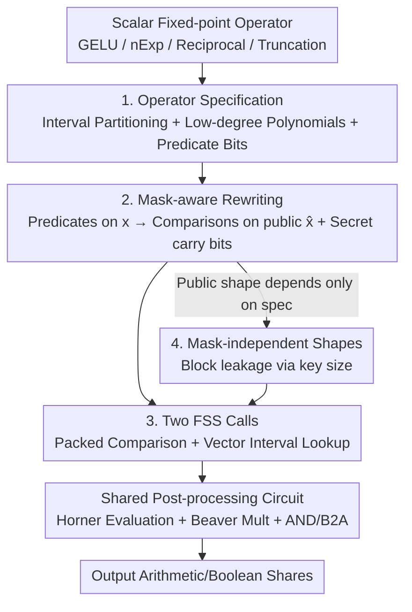

# FuseFSS: Efficient Secure LLM Inference with Function Secret Sharing

**Conference**: ICML2026  
**arXiv**: [2606.09551](https://arxiv.org/abs/2606.09551)  
**Code**: To be confirmed  
**Area**: AI Security / Privacy-Preserving Inference / Secure Multi-party Computation  
**Keywords**: Secure Inference, Function Secret Sharing, Fixed-point Non-linear Operators, Compiler, Two-party Computation

## TL;DR
FuseFSS replaces the paradigm of "handcrafting a dedicated secure protocol for every fixed-point non-linear operator" with a unified compiler. By defining a compact specification for each scalar operator (interval partitioning + low-degree polynomials + predicate bits), the compiler automatically generates two FSS calls: "one packed comparison + one vector interval lookup." Compared to the state-of-the-art FSS baseline Sigma, it achieves end-to-end speedups of 1.24×–1.50× on BERT/GPT, reduces online communication by 9%–16%, and produces smaller, faster keys.

## Background & Motivation

**Background**: Two-server secure inference allows a client to secret-share private inputs between two non-colluding servers. Servers execute the model on ciphertext shares without exposing prompts or embeddings. Recent GPU systems based on Function Secret Sharing (FSS), such as Sigma and SHAFT, have significantly accelerated the **linear layers** of Transformers.

**Limitations of Prior Work**: The bottleneck has shifted to **element-wise non-linear operators and rescaling** under fixed-point arithmetic—such as GELU, $\mathrm{nExp}$, reciprocal, inverse square root, truncation, and Arithmetic Right Shift (ARS). These operators require comparisons and piecewise selection with modulo $2^n$ wrap-around on the ring $R=\mathbb{Z}_{2^n}$. Currently, each operator is implemented as a **handcrafted dedicated protocol**, each with its own comparison logic, wrap-around correction, and preprocessing materials.

**Key Challenge**: This "one-operator-one-protocol" approach is fragile. Correctness proofs must be reconstructed for each operator, key generation logic is heavily redundant, and adding new operators easily introduces subtle wrap-around or sign-bit bugs. This manual workflow severely restricts high performance, scalability, and provable correctness.

**Goal**: Replace "per-operator protocol engineering" with a "single compilation + single proof" approach—covering all fixed-point scalar operators with a unified structure that ensures both performance and provable security.

**Key Insight**: The authors observe a critical fact—the data-dependent components of these fixed-point non-linear operators are structurally almost identical: they all select an interval using a small set of predicate bits and then apply a low-degree polynomial (with few constants) on that interval. Given this structural isomorphism, a unified representation is feasible.

**Core Idea**: Abstract each scalar operator into an **operator specification**. The compiler then automatically generates two standard FSS calls on the public masked value $\hat{x}=x+r_{\mathrm{in}} \bmod 2^n$: **one packed comparison** returning XOR shares of all predicate bits, and **one vector interval lookup** returning polynomial coefficients and constants for the current interval. The remaining logic consists of a fixed shared post-processing circuit.

## Method

### Overall Architecture

FuseFSS is a compiler that transforms "scalar fixed-point operators" into "unified secure protocols." It operates under a standard two-party preprocessing model: in the offline phase (conceptually a dealer), it samples masks, derives secret-shared instance constants, and generates FSS keys and associated random numbers for each operator instance. In the online phase, two servers $P_0, P_1$ evaluate the model on ciphertext shares with low latency.

The pipeline is as follows: Obtain a scalar fixed-point operator → Define operator specification (interval partitioning + per-interval low-degree polynomials + boolean predicate circuits) → Compiler rewrites "predicates on secret $x$" into "comparisons on public $\hat{x}$ + secret carry bits" → Collect all comparison atoms into **one packed comparison** and all per-interval coefficients/constants into **one interval lookup** → Online, only the masked value $\hat{x}$ is revealed, the two FSS instances are evaluated locally, followed by a fixed shared post-processing circuit (Horner evaluation + Beaver multiplication + Boolean AND / B2A conversion) → Output arithmetic and boolean shares. The "public shape" (number of comparisons, bit width, lookup dimensions) is strictly designed to **depend only on public specifications and not on sampled masks**, thereby blocking leakage of masks via key size or instance shape.

### Key Designs

**1. Operator Specification: Abstracting non-linear operators into a compilable typed IR**

To address the pain point of "per-operator handcrafted protocols," the authors define an operator specification—a typed description with the signature $F:\mathsf{A}_n \to \mathsf{A}_n^r \times \mathsf{B}^\ell$ (takes one arithmetic share, outputs $r$ arithmetic values + $\ell$ boolean bits), which can include fixed-point metadata. It consists of three parts: ① a **complete interval partition** $0=\alpha_0<\alpha_1<\dots<\alpha_m=2^n$, where interval $I_i=[\alpha_i,\alpha_{i+1})$; ② a **vector of polynomials of degree $\le d$** for each interval $P_i(x)\in R[x]^r$; ③ a set of **boolean formulas** $B_i(x)$ for each interval, composed of atomic predicates $C_\beta(x)=\mathbb{I}[x<\beta]$ and low-bit predicates $D_{\gamma,f}(x)=\mathbb{I}[(x\bmod 2^f)<\gamma]$, connected by $\neg, \wedge, \vee, \oplus$. The induced function is $F(x)=(P_i(x),B_i(x))$, where $i$ is the unique interval containing $x$.

The beauty of this abstraction lies in "divide and conquer": not every operator is a polynomial (e.g., truncation/ARS discards bits and is not a polynomial over $R$). Thus, the specification is separated from a **fixed post-processing circuit $\Phi$**. As long as there exists a specification $F$ and a deterministic circuit $\Phi$ such that $G(x)=\Phi(F(x),\kappa,x,\hat{x},\mathsf{pub})$, the operator is "spec-compatible." Activation functions, $\mathrm{nExp}$, reciprocal/inverse square root, and truncation/ARS—all dominant in secure Transformer inference—fit this framework. Cross-coordinate operations like max/sum reduction and sorting/top-$k$ are handled by standard MPC sub-protocols at the circuit/DAG layer.

**2. Mask-aware Rewriting: Translating "predicates on secret $x$" to "comparisons on public $\hat{x}$"**

In the masked-wire paradigm of FSS, parties reveal the public masked value $\hat{x}=x+r_{\mathrm{in}}\bmod 2^n$. The difficulty lies in rewriting predicates defined on secret $x$ into comparisons on public $\hat{x}$. Rewriting introduces mask-dependent carry/wrap-around information, which **must remain secret-shared** to prevent leaking $r_{\mathrm{in}}$ and $x$.

The core is Lemma 4.3 (Unsigned comparison rewriting under mask): Let $\hat{x}=(x+r)\bmod N$, $\theta=(r+\beta)\bmod N$, and the carry bit $w=\mathbb{I}[r+\beta\ge N]$ (provided via XOR shares $\langle w\rangle$). Then:
$$\mathbb{I}[x<\beta]=\mathbb{I}[\hat{x}<\theta]\oplus\mathbb{I}[\hat{x}<r]\oplus w.$$
The comparisons on the right side are performed on public $\hat{x}$, while $w$ is a secret-shared constant. Furthermore, when representing the interval indicator $\mathbb{I}[x\in I_i]$ as the XOR of two boundary comparisons, the common $\mathbb{I}[\hat{x}<r]$ terms **cancel each other out**. This leaves only comparisons against shifted boundaries $(\alpha_i+r)\bmod 2^n$ and carry bits $w_i$, significantly reducing the number of primitive comparisons needed for interval selection. MSB tests and signed comparisons are also reduced to unsigned comparisons with fixed constant shifts.

**3. Two FSS Calls + Fixed Shared Post-processing: Compressing arbitrary spec-compatible operators into constant-round non-interactive evaluation**

This is the source of performance (Theorem 4.6). The backend requires only two types of standard FSS primitives: **Packed Comparison** (given queries $(k_t,c_t,\theta_t)$, returns XOR shares of all $\mathbb{I}[\mathsf{view}_{k_t,c_t}(u)<\theta_t]$, covering full-width comparisons, low-bit predicates, and MSB tests) and **Vector Interval Lookup** (given boundaries and per-interval payload vectors, returns additive shares of the payload $v_{i^\star}$ for the interval containing $u$, without revealing the interval index). At compile time, boundaries are shifted to the $\hat{x}$ space, partitions are **padded to a fixed number of intervals $M$** (ensuring public shape is mask-independent), all comparison atoms are gathered into a single packed comparison instance, and all coefficients/constants into an interval lookup instance.

Online evaluation consists of four steps: Open $\hat{x}$ → Evaluate Packed Comparison for predicate bits → Evaluate Interval Lookup for coefficient payloads → Locally derive shares of $x=\hat{x}-r_{\mathrm{in}}$ and run post-processing circuit $\Phi$. Polynomials are evaluated using Horner’s method with Beaver triples ($O(r\cdot d)$ ring multiplications). $\Phi$ then uses a few Beaver multiplications, Boolean ANDs, and B2A for truncation/ARS corrections. All interactions converge to the opening of standard sub-protocols—a single proof and one set of preprocessing logic cover all operators.

**4. Mask-independent Shapes: Trading uniform proof for controlled leakage**

Regarding security, compiled gate instances expose certain **public shape parameters**: the number of comparison queries $T$ and their bit-width multiset, interval count $M$, and payload dimension $p$. The authors model this as an explicit leakage function $\mathcal{L}_{\mathrm{shape}}$ and enforce that these shapes **depend only on public specifications and fixed-point metadata** via padding. Consequently, key lengths are independent of masks, blocking side-channels that could infer masks from key sizes. In the semi-honest preprocessing model, as long as the FSS primitives satisfy single-key security with explicit shape leakage and the Beaver/AND/B2A protocols are semi-honest secure, each compiled gate instance is simulatable under standard hybrid arguments (Theorem 4.7).

### A Complete Example: Compiling nExp in Softmax

Using BERT-base with sequence length 128 as an example, softmax includes max reduction, $\mathrm{nExp}$, and reciprocal steps. Max reduction is a cross-coordinate operation using standard MPC comparison trees (not compiled by FuseFSS), whereas $\mathrm{nExp}$ and reciprocal are element-wise spec-compatible operators compiled into the "Packed Comparison + Interval Lookup + Horner" path. Specifically, the compiled path ($\mathrm{nExp}$ + reciprocal) reduces from 223 (units as per original text) in Sigma to 49, a **4.50× speedup** per step. Max reduction remains at 93. This illustrates that FuseFSS gains specifically from unifying fragmented element-wise non-linear operators.

## Key Experimental Results

### Main Results

Hardware: 2× RTX PRO 6000 Blackwell + 2× EPYC 9654, with one GPU per party. Baseline: Sigma. FuseFSS acts as a **plug-and-play replacement** for Sigma's handcrafted non-linear protocols. Batch size 1, sequence length 128.

| Model | Sigma Online Latency (ms) | FuseFSS Online Latency (ms) | Gain | Sigma Comm (GB) | FuseFSS Comm (GB) |
|------|------|------|------|------|------|
| BERT-tiny-128 | 63.90 | 42.60 | −33.3% | 0.021 | 0.018 |
| BERT-base-128 | 1613.80 | 1149.50 | −28.8% | 1.062 | 0.891 |
| BERT-large-128 | 4034.50 | 2997.90 | −25.7% | 2.833 | 2.376 |
| GPT-2-128 | 1423.90 | 1072.70 | −24.7% | 0.885 | 0.777 |
| GPT-Neo-128 | 6326.20 | 5115.80 | −19.1% | 4.326 | 3.917 |

Overall: Online latency reduced by 19%–33%, online communication reduced by 9%–16%, leading to a 1.24×–1.50× end-to-end speedup with **parity accuracy**. Preprocessing is also lighter: keygen time dropped by 14%–23%, and key size by 20%–24% (e.g., BERT-base keygen 1.32→1.08 s, key 18.076→13.678 GB).

### Ablation Study

Sequence length scaling (BERT-base, batch 1) and softmax sub-step breakdown:

| Analysis | Config | Sigma | FuseFSS | Gain |
|------|------|------|------|------|
| Sequence Len 32 | Online Latency (ms) | 642.30 | 545.50 | −15.1% |
| Sequence Len 128 | Online Latency (ms) | 1613.80 | 1149.50 | −28.8% |
| Sequence Len 512 | Online Latency (ms) | 7694.70 | 5324.10 | −30.8% |
| softmax compiled path | nExp + Reciprocal | 223 | 49 | 4.50× |
| softmax max reduction | Cross-coordinate | 93 | 93 | 1.00× (Not compiled) |

### Key Findings
- **Gains scale with sequence length**: Speedups of 1.36×–1.45× are maintained across lengths 64–512, with communication savings increasing as the sequence grows.
- **Clear attribution of gains**: On BERT-base, non-linear/auxiliary blocks account for 56% of Sigma's online time and 54% of its communication. FuseFSS reduces these to 42% and 45%, respectively—effectively compressing the non-linear bottleneck.
- **Cross-coordinate tasks remain unchanged**: As expected, max reduction is not handled by FuseFSS.

## Highlights & Insights
- **"Isomorphism observation" as the pivot**: Recognizing that data-dependent parts of non-linear operators are structurally similar allows for a unified specification. This replaces fragile per-operator engineering with a compiled, provable paradigm.
- **$\mathbb{I}[\hat{x}<r]$ cancellation trick**: This technique reduces the number of comparisons for interval selection in masked-wire FSS and can be applied to any FSS system utilizing piecewise functions.
- **Mask-independent shape design**: By ensuring shapes depend only on public metadata, a single semi-honest security proof can be reused across all operators, and key sizes do not leak mask information.
- **Plug-and-play compatibility**: As a replacement for Sigma, it is engineering-friendly, and all end-to-end improvements can be cleanly attributed to the compilation strategy.

## Limitations & Future Work
- **Semi-honest model only**: Protects only against passive adversaries; does not cover active/malicious security.
- **Limited to element-wise scalar operators**: Cross-coordinate tasks (max/sum reduction, top-$k$, sparse attention) still rely on external MPC protocols.
- **Redundancy from padding**: Padding to a fixed interval count $M$ to ensure shape independence may incur extra overhead for operators with highly non-uniform partitions.
- **Limited baseline scope**: Comparisons are primarily against Sigma. Cross-platform comparisons with BOLT or BumbleBee are limited due to differing protocol families and hardware.

## Related Work & Insights
- **vs Sigma (Gupta et al., 2024)**: Sigma uses FSS + GPU with handcrafted protocols for core operators; FuseFSS replaces these with unified compiled FSS calls, achieving 1.24×–1.50× speedups.
- **vs SHAFT (Kei & Chow, 2025)**: SHAFT focuses on numerical stability and round optimization for specific operators like softmax; FuseFSS is a compiler-level contribution aimed at unifying all scalar fixed-point kernels.
- **vs IRON / BOLT / BumbleBee**: These prove LLM inference feasibility but rely on per-operator design, which FuseFSS aims to eliminate as a scalability bottleneck.

## Rating
- Novelty: ⭐⭐⭐⭐⭐ The "spec + two FSS calls" abstraction is a paradigm-shifting approach for secure inference.
- Experimental Thoroughness: ⭐⭐⭐⭐ Solid results on BERT/GPT with sequence scans, though baselines are mostly limited to Sigma.
- Writing Quality: ⭐⭐⭐⭐ Clear structure with complete theorem/lemma support.
- Value: ⭐⭐⭐⭐⭐ Significant impact on the performance, provable security, and scalability of privacy-preserving LLM inference.

<!-- RELATED:START -->

## Related Papers

- [\[AAAI 2026\] SecMoE: Communication-Efficient Secure MoE Inference via Select-Then-Compute](../../AAAI2026/ai_safety/secmoe_communication-efficient_secure_moe_inference_via_select-then-compute.md)
- [\[ACL 2026\] On the (In-)Security of the Shuffling Defense in the Transformer Secure Inference](../../ACL2026/ai_safety/on_the_in-security_of_the_shuffling_defense_in_the_transformer_secure_inference.md)
- [\[ICLR 2026\] Secure Outlier-Aware Large Language Model Inference](../../ICLR2026/ai_safety/secure_outlier-aware_large_language_model_inference.md)
- [\[ICML 2026\] Position: Retire the "Positive Backdoor" Label -- Secret Alignment Requires Strict and Systematic Evaluation](position_retire_the_positive_backdoor_label_--_secret_alignment_requires_strict_.md)
- [\[ICML 2026\] From Weak Cues to Real Identities: Evaluating Inference-Driven De-Anonymization in LLM Agents](from_weak_cues_to_real_identities_evaluating_inference-driven_de-anonymization_i.md)

<!-- RELATED:END -->
## Related Papers

- [\[AAAI 2026\] SecMoE: Communication-Efficient Secure MoE Inference via Select-Then-Compute](../../AAAI2026/ai_safety/secmoe_communication-efficient_secure_moe_inference_via_select-then-compute.md)
- [\[ACL 2026\] On the (In-)Security of the Shuffling Defense in the Transformer Secure Inference](../../ACL2026/ai_safety/on_the_in-security_of_the_shuffling_defense_in_the_transformer_secure_inference.md)
- [\[ICML 2026\] From Weak Cues to Real Identities: Evaluating Inference-Driven De-Anonymization in LLM Agents](from_weak_cues_to_real_identities_evaluating_inference-driven_de-anonymization_i.md)
- [\[ICML 2026\] PipeSD: An Efficient Cloud-Edge Collaborative Pipeline Inference Framework with Speculative Decoding](pipesd_an_efficient_cloud-edge_collaborative_pipeline_inference_framework_with_s.md)
- [\[ICML 2026\] Watermarking LLM Agent Trajectories (ACTHOOK)](watermarking_llm_agent_trajectories.md)

<!-- RELATED:END -->
