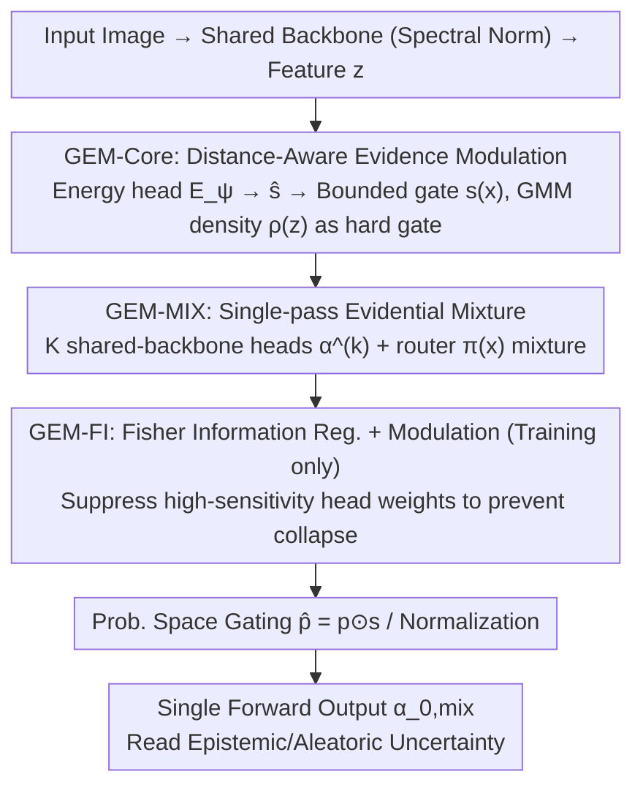

# GEM-FI: Gated Evidential Mixtures with Fisher Modulation

**Conference**: ICML 2026  
**arXiv**: [2605.03750](https://arxiv.org/abs/2605.03750)  
**Code**: None  
**Area**: Uncertainty Estimation / Evidential Deep Learning / OOD Detection  
**Keywords**: Evidential Deep Learning, Energy-based gating, Fisher Information, Mixture of Beliefs, Single-pass OOD Detection

## TL;DR
This paper addresses the issues of overconfidence in out-of-distribution (OOD) samples and the difficulty of single-head architectures in expressing multimodal epistemic uncertainty in Evidential Deep Learning (EDL). It proposes a three-component suite, GEM-Core/MIX/FI: gating evidence with learned feature energy, approximating ensembles via a single-pass mixture of evidential heads, and stabilizing mixture assignments with Fisher information regularization. It outperforms DAEDL on OOD detection tasks (CIFAR-10 → SVHN/CIFAR-100) while maintaining single-pass efficiency.

## Background & Motivation

**Background**: Reliable predictive uncertainty is crucial for OOD and high-risk scenarios. BNNs are theoretically optimal but computationally expensive; MC-dropout and Deep Ensembles require multiple forward passes. EDL provides epistemic uncertainty in a single forward pass by predicting Dirichlet concentrations $\alpha$, making it a mainstream choice for latency-constrained scenarios. Density-aware variants like DAEDL improve calibration by using offline GDA for feature density estimation to rescale evidence.

**Limitations of Prior Work**: (1) Standard EDL remains overconfident under distribution shift/OOD even if accurate on ID; (2) DAEDL's density estimation is offline and decoupled from training, leading to inaccurate density proxies when features drift; (3) Single-head evidential models struggle to represent multimodal epistemic uncertainty near complex decision boundaries (Paper Figure 2(a) shows DAEDL collapsing to an overconfident assignment at non-convex boundaries); (4) Energy-based ID/OOD distinction is typically post-hoc (training first, then tuning temperature), not participating in evidence generation or enforcing local smoothness; (5) Deep Ensembles capture multimodality but violates single-pass efficiency.

**Key Challenge**: Integrating "support" signals into the evidence mechanism while maintaining single-pass inference; expressing multimodal epistemic uncertainty without accumulating ensembles.

**Goal**: (1) Design an in-model, learnable support gate acting directly on evidence; (2) Replace ensembles with a mixture of evidential heads sharing a single backbone; (3) Introduce Fisher information regularization to prevent head collapse and ensure stable mixture weights.

**Key Insight**: Treat energy $E(x)$ as an inverse indicator for representation-level support—high energy implies low support, naturally corresponding to OOD. Using it as an in-model gate rather than a post-hoc score allows for direct suppression of evidence in low-support regions during training. Multimodal epistemic uncertainty is captured not through multiple passes, but via multiple heads combined with a learned router.

**Core Idea**: Feature energy → Bounded gate → Direct multiplication into Dirichlet evidence + Router-based mixture of evidential heads + Fisher regularization for stable mixing.

## Method

### Overall Architecture
The method resolves the contradiction between EDL's overconfidence in OOD and the difficulty of single-head architectures expressing multimodal uncertainty while preserving single-pass inference. The approach embeds "support" signals end-to-end into the Dirichlet evidence generation process. It uses multiple evidential heads with a shared backbone plus a router to approximate an ensemble in one forward pass, stabilized by Fisher information regularization. The three components are layered: GEM-Core for evidence gating, GEM-MIX for multimodal mixtures, and GEM-FI for stabilizing mixture weights. At inference, a single gradient-free forward pass uses the mixed Dirichlet concentration $\alpha_0$ to derive epistemic uncertainty.

### Key Designs

**1. Distance-Aware Evidence Modulation (GEM-Core): Integrating Support Signals Online**

The limitation of DAEDL is that its density estimation is offline and decoupled from training, making density rankings inaccurate as features drift. Ours implements an in-model, learnable gate: energy is defined as the inverse of support (anti-correlated with feature density). A lightweight MLP computes scalar energy $E(x)=E_\psi(z)$, transformed via sigmoid into $\hat s(x)=\sigma(E(x))\in(0,1)$. Then $[z, \hat s(x)]$ is fed into an integration gate $G_\eta$ to output per-class bounded gates $s(x)\in[s_{\min},s_{\max}]^C$. During evidence generation, a density proxy $\rho(z)=\sigma(\log p_{GMM}(z))^\gamma$, fitted offline on ID features via GMM, acts as a "hard safety gate": $\alpha_c(x)=\rho(z)\cdot\exp(\tilde u_c(x))+\epsilon$. Finally, probability-space gating is applied: $\hat p(x)=p(x)\odot s(x)/\mathbf{1}^\top(p(x)\odot s(x))$. Training utilizes $\mathcal{L}_{core}=\mathbb{E}[\|e_y-\hat p(x)\|_2^2 + \lambda_{KL}\mathrm{KL}[\mathrm{Dir}(\alpha)\|\mathrm{Dir}(\mathbf{1})]]$, with gradients flowing back to $E_\psi$ and $G_\eta$, allowing the gate to learn which representation regions should suppress evidence. Multiplicative gating acts earlier than post-hoc scores, and the hard bounds $[s_{\min},s_{\max}]\subset(0,1)$ ensure Lipschitz smoothness (Proposition 3.2)—combining GMM hard gates with soft learned gates provides both a safety floor and adaptability.

**2. Single-pass Evidential Mixture (GEM-MIX): Approximating Ensembles via Router**

Single-head models often collapse to overconfident solutions near complex boundaries, yet ensembles violate single-pass constraints. Ours expands the single head into $K$ evidential heads sharing a backbone: each head outputs logits $u^{(k)}(x)$, resulting in $\alpha^{(k)}(x)$ after clipping and $\rho(z)$ modulation. Predicted means are $p^{(k)}_c=\alpha^{(k)}_c/\sum_j \alpha^{(k)}_j$. A router provides mixture weights $\pi(x)=\mathrm{softmax}(h_\omega([z,\hat s(x)]))\in\Delta^{K-1}$. The mixed prediction is $p_{mix}(y=c|x)=\sum_k \pi_k(x) p^{(k)}_c(x)$, with total concentration $\alpha_{0,mix}=\sum_k \pi_k \alpha_0^{(k)}$, followed by the shared per-class gate to produce $\hat p(x)$. The loss $\mathcal{L}_{mix}=\mathbb{E}[-\log \hat p_y(x) + \lambda_{KL}\sum_k \pi_k(x)\mathrm{KL}[\mathrm{Dir}(\alpha^{(k)})\|\mathrm{Dir}(\mathbf{1})]]$ weights the KL term by $\pi_k$ to avoid over-regularizing less-active heads. Different heads specialize in different regions of the boundary ("mixture of beliefs"), preserving multimodal structures while backbone reuse ensures near-constant inference cost.

**3. Fisher Information Regularization + Modulation (GEM-FI): Preventing Collapse and Smoothing Boundaries**

Relying solely on the router often leads to weight collapse where one head dominates. Fisher Information (FI) measures local "sharpness"—sensitive heads react strongly to perturbations and lack stability. Ours computes an FI proxy $\widehat{\mathrm{FI}}_k(x)$ (approximated by the squared norm of the log-likelihood gradient w.r.t. logits) and penalizes the "high $\pi$ × high FI" combination via $\mathcal{L}_{FI}=\mathbb{E}_x[\sum_k \pi_k(x)\widehat{\mathrm{FI}}_k(x)]$. During training, router outputs are modulated as $\tilde\pi_k^{mod}(x)\propto \tilde\pi_k(x)\exp(\lambda_{FI}(1-\bar{\mathrm{FI}}_k(x)))$, where $\bar{\mathrm{FI}}_k=\widehat{\mathrm{FI}}_k/\sum_j\widehat{\mathrm{FI}}_j$ is the normalized sensitivity, pushing weights toward low-sensitivity heads. Two auxiliary losses sharpen boundaries: an energy term $\mathcal{L}_{EBM}=\mathbb{E}_x[\mathrm{softplus}(\mathrm{clip}(E_\psi(z),-\tau,\tau))]+\mathcal{L}_{EBM}^{neg}$ (including a margin loss on VOS synthetic negative samples), and a contrastive entropy term $\mathcal{L}_{UNC}=\beta_{id}\mathbb{E}_x[H(\hat p)]-\beta_{ood}\mathbb{E}_{x^{ood}}[H(\hat p(x^{ood}))]$ to encourage ID low entropy and OOD high entropy. The total objective is $\mathcal{L}_{GEM-FI}=\mathcal{L}_{mix}+\lambda_{FI}\mathcal{L}_{FI}+\lambda_{EBM}\mathcal{L}_{EBM}+\lambda_{UNC}\mathcal{L}_{UNC}$. Since FI modulation is training-only, stability is achieved without inference overhead. Figure 2(b) illustrates that GEM-FI preserves multimodality on non-convex boundaries where DAEDL collapses.

### Loss & Training
Spectral normalization is applied to both the backbone and gate pathways to satisfy the Lipschitz assumptions in Section 3.1. GMM is pre-fitted on ID training features. The number of evidential heads $K$ (default $\ge 2$) and hyperparameters $\lambda_{FI}, \lambda_{EBM}, \lambda_{UNC}$ are selected via validation. VOS synthetic negative sampling is enabled only for GEM-FI as an auxiliary boundary sharpener.

## Key Experimental Results

### Main Results
4 OOD pairs: MNIST → KMNIST/FMNIST (Digit domain), CIFAR-10 → SVHN/CIFAR-100 (Natural images, far-OOD and near-OOD respectively). AUPR (Higher is better):

| Method | CIFAR-10→SVHN (Alea./Epis.) | CIFAR-10→CIFAR-100 (Alea./Epis.) | MNIST→KMNIST (Epis.) |
|--------|--------------------------|----------------------------------|----------------------|
| EDL | 78.87 / 79.32 | 84.30 / 84.80 | 96.31 |
| I-EDL | 86.32 / 85.92 | 85.55 / 84.84 | 98.33 |
| DAEDL | 85.50 / 85.54 | 88.16 / 88.19 | 99.92 |
| R-EDL | 85.00 / 85.00 | – / – | 98.69 |
| **GEM-FI (Ours)** | **92.59 / 95.09** | **90.20 / 89.06** | Near ceiling |

CIFAR-10 ID Classification + Calibration:

| Metric | DAEDL | **GEM-FI (Ours)** | Gain |
|------|-------|-----------|---------|
| Acc | 91.11 | **93.75** | +2.64 |
| Brier×100 | 14.27 | **6.81** | −7.46 |
| Misclassification AUPR | 99.08 | **99.94** | +0.86 |

### Ablation Study

| Configuration | CIFAR-10→SVHN AUPR | Description |
|------|---------------------|------|
| GEM-FI (full) | 92.59 | Full model |
| GEM-Core only (No mixture/FI) | Intermediate | Outperforms EDL, validates in-model gate effectiveness |
| GEM-MIX (No FI) | Slightly lower than full | Multi-head helps multimodality but prone to collapse |
| No Spectral Norm | Decrease | Lost Lipschitz guarantees, worse calibration |
| No VOS Negatives | Decrease | Boundary sharpening benefit disappears |
| $K=1$ vs $K=2,3,4$ | Significant gain from $K=2$ | Mixture size is a key hyperparameter; saturates at $K=4$ |

### Key Findings
- No sacrifice in ID accuracy (CIFAR-10 actually improved +2.64), indicating that gating does not degrade ID performance. The combination of IB-style hard safety gates and soft learned gates is robust.
- GEM-FI excels even in near-OOD scenarios like CIFAR-10 → CIFAR-100 (90.20 vs 88.16), proving that Fisher modulation allows mixture weights to provide effective discrimination even when distributions are similar.
- Ablations show all three components are indispensable. Fisher modulation's impact is particularly pronounced on datasets with complex boundaries and clear multimodality.
- Calibration improves significantly, with Brier scores nearly halved (14.27 → 6.81), representing one of the strongest empirical results.

## Highlights & Insights
- Upgrading "energy" from a post-hoc OOD score to an in-model gate is a first in the EDL series for end-to-end integration of support signals into Dirichlet parameterization. This logic can be extended to any model outputting probability distributions (e.g., token-level LMs).
- Simulating ensemble multimodality in a single pass depends on the router and Fisher modulation to prevent head collapse. Using Fisher Information to measure local sharpness of experts is highly relevant for MoE expert balancing.
- The framework maintains single-pass inference while establishing a complete "energy → gate → evidence → mixture → calibration" pipeline, supported by formal theory on Lipschitz smoothness (Prop 3.2) and distance-aware monotonicity (Prop 3.4).
- Probability-space gating $\hat p=p\odot s/\mathbf{1}^\top(p\odot s)$ is more stable than logit multiplication, avoiding softmax saturation—a useful trick for the calibration toolbox.

## Limitations & Future Work
- Spectral normalization is enforced on all backbone and gate layers, which may slow down convergence on large-scale models. Experiments were limited to ResNet-level backbones; scalability to ViT/Transformers remains unverified.
- GMM density estimation requires a fixed pre-fitting; if the feature space drifts significantly, it may still fail. Online GMM updates could be considered.
- Synthetic negative sampling (VOS) is sensitive to OOD assumptions; synthetic samples may not represent real-world OOD. The method has not been tested on aggressive adversarial OOD.
- The mixture head count $K$ is a manual hyperparameter; making $K$ data-driven (e.g., via Dirichlet processes) would be beneficial.

## Related Work & Insights
- **vs EDL (Sensoy 2018)**: Ours predicts Dirichlet parameters but adds energy gating, mixture heads, and Fisher regularization, fundamentally solving EDL's OOD overconfidence and multimodality issues.
- **vs DAEDL**: DAEDL uses offline GDA decoupled from training. GEM-Core's gate is in-model and learnable, adapting to feature drift during training and outperforming in both calibration and OOD detection.
- **vs MC-dropout / Deep Ensemble**: These rely on multiple passes. Ours uses a mixture-of-heads to approximate an ensemble in a single forward pass, providing a clear latency advantage.
- **vs Energy-based OOD score (Liu 2020)**: While that is a post-hoc score, Ours utilizes energy during Dirichlet generation and ensures local smoothness via Lipschitz constraints.

## Rating
- Novelty: ⭐⭐⭐⭐ The GEM suite integrates existing concepts (EDL, energy, Fisher) into a functional single-pass multimodal uncertainty framework.
- Experimental Thoroughness: ⭐⭐⭐⭐ Solid results across 4 OOD pairs plus calibration; lacks large-scale (ImageNet-1K) and modern backbone (ViT) experiments.
- Writing Quality: ⭐⭐⭐⭐ Clear structure with theoretical propositions; some derivations regarding FI modulation are slightly complex.
- Value: ⭐⭐⭐⭐ Significant progress in single-pass uncertainty, highly relevant for safety-critical, latency-sensitive applications like autonomous driving.

<!-- RELATED:START -->

## Related Papers

- [\[ICML 2026\] Mind the Gap: Mixtures of Gaussians in Approximate Differential Privacy](mind_the_gap_mixtures_of_gaussians_in_approximate_differential_privacy.md)
- [\[ICLR 2026\] Robust Adversarial Quantification via Conflict-Aware Evidential Deep Learning](../../ICLR2026/ai_safety/robust_adversarial_quantification_via_conflict-aware_evidential_deep_learning.md)
- [\[ICLR 2026\] Fairness-Aware Multi-view Evidential Learning with Adaptive Prior](../../ICLR2026/ai_safety/fairness-aware_multi-view_evidential_learning_with_adaptive_prior.md)
- [\[ECCV 2024\] Fisher Calibration for Backdoor-Robust Heterogeneous Federated Learning](../../ECCV2024/ai_safety/fisher_calibration_for_backdoor-robust_heterogeneous_federated_learning.md)
- [\[ICLR 2026\] Fisher-Rao Sensitivity for Out-of-Distribution Detection in Deep Neural Networks](../../ICLR2026/ai_safety/fisher-rao_sensitivity_for_out-of-distribution_detection_in_deep_neural_networks.md)

<!-- RELATED:END -->
