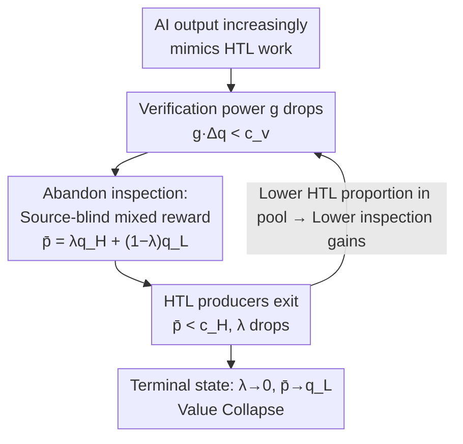

# Generative Models Erode Human Temporal Learning Through Market Selection

**Conference**: ICML 2026  
**arXiv**: [2606.06572](https://arxiv.org/abs/2606.06572)  
**Code**: None (Theory / Position Paper)  
**Area**: AI Safety / AI Risk Governance  
**Keywords**: Risks of Generative Models, Adverse Selection, Verification Costs, Value Collapse, Sub-AGI Risks

## TL;DR
This position paper argues that even before reaching AGI, generative models pose structural risks to knowledge and cultural production through "market adverse selection." As AI outputs increasingly mimic surface features of work traditionally requiring long-term human learning, the cost for evaluators to verify "whether this is a product of long-term human accumulation" exceeds the benefits. Consequently, reward mechanisms become "source-blind," forcing individuals who invested years in learning to compete on price with near-zero-cost AI outputs, ultimately driving them out of the market.

## Background & Motivation
**Background**: Mainstream AI risk research (Bostrom, Russell, Hendrycks, etc.) largely focuses on "AGI loss of control"—catastrophes occurring after thresholds like superintelligence, alignment failure, or loss of agency. This line of reasoning places risk primarily "after capabilities become sufficiently strong."

**Limitations of Prior Work**: This narrative overlooks a more immediate problem: before crossing those capability thresholds, is machine learning **already** introducing structural risks to knowledge and cultural production? Empirical evidence (academic paper flooding, legal AI-generated fake citations, content platform degradation, open-source security reports) shows erosion occurring at varying rates across domains, yet a unified explanatory mechanism is missing.

**Key Challenge**: Historically, "output" served as a signal of quality because producing it required long-term learning investment (Spence’s Signaling Theory); institutions rewarded this implicit time investment. Generative models produce things that **superficially** resemble deep human work without the underlying learning trajectory—training optimizes only for "matching observed output," discarding the learning process. This invalidates the long-standing contract of "inferring learning investment from output."

**Goal**: To articulate, using an economic framework, why the "increasing difficulty in distinguishing AI output from human output" leads to the competitive displacement of deep human work through **ordinary market dynamics** (rather than malice or loss of control), and to organize cross-domain evidence into observable stages.

**Key Insight**: The authors introduce **Human Temporal Learning (HTL)**—the non-codifiable judgment and skill formed through long-term, repeated exposure to problems (Polanyi's "tacit knowledge"). The problem is reframed as "whether it remains economically viable for evaluators to verify if an output is HTL-intensive work."

**Core Idea**: Model generative model risk as an **adverse selection problem with costly inspection**. Once "verification power $\times$ quality gap < verification cost," rational evaluators abandon verification. Rewards become source-blind, high-cost human producers exit, and the quality of the pool further declines, forming a self-reinforcing cycle of "value collapse."

## Method

### Overall Architecture
The "method" is not an algorithm but an economic framework that **formalizes** the social risks of generative models, supplemented by a four-stage classification of cross-domain empirical evidence. The logic is: define four variables determining "whether to verify" (verification power $g$, verification cost $c_v$, quality gap $\Delta q$, and HTL proportion $\lambda$); derive a verification threshold condition; show how breaking this condition triggers source-blind pricing, leading to high-cost producer exit and quality decline (value collapse); and finally, characterize real-world domains within these four stages of erosion.

The mechanism is a self-reinforcing negative feedback loop, illustrated below:

### Key Designs

**1. Human Temporal Learning (HTL) and the "Erasure of Learning Trajectories": Anchoring risk to a lossable asset**

Ours first establishes the object of analysis: HTL refers to judgments and skills accumulated through long-term exposure that are resistant to codification. Its historical economic value stemmed from outputs (papers, creative works) condensing long learning trajectories, which institutions used as quality proxies (funding favors long records; hiring looks at years of training). The destructiveness of generative models lies in: training optimizes only for "matching observed output," and the **learning trajectory is completely discarded in the process**. Formats, rhetorical structures, citation patterns, and stylistic coherence become increasingly easy to replicate, making surface inspections insufficient to distinguish production methods. To obtain equivalent assurance, evaluators must perform deeper verification (verifying citations, auditing methodological choices, testing if reasoning holds up), which directly raises the verification cost per output.

**2. Verification Threshold with Costly Inspection: $g \cdot \Delta q \gtrsim c_v$ as the Switch**

This is the core mechanism of the framework. The authors compress the decision to verify into a game between four variables: verification power $g \in [0,1]$ (how reliably inspection separates HTL-intensive from low-HTL output; 0 = indistinguishable, 1 = perfect identification), verification cost $c_v$ (expert time per deep audit), quality gap $\Delta q = q_H - q_L > 0$ (difference in expected returns), and HTL proportion $\lambda$. Verification is rational if and only if the expected benefit of distinguishing the two types of output exceeds the inspection cost:

$$g \cdot \Delta q \gtrsim c_v \quad\Longleftrightarrow\quad g^* \approx \frac{c_v}{\Delta q}.$$

Below the threshold $g^*$, rational evaluators abandon verification. The key insight is that generative models apply pressure from both sides: **depressing $g$** (making outputs more realistic and harder to distinguish) and raising $c_v$ (requiring deeper audits), thus making it easier to fall below the threshold even if individual AI outputs improve locally.

**3. Value Collapse: Mixed Rewards → Self-Reinforcing Loop of Adverse Selection**

Once evaluators stop distinguishing, rewards focus only on the average quality of the pool. If deep human work constitutes proportion $\lambda$ of the pool, the mixed reward (average price in bidding, or expected reward under source-blindness in journals/platforms) is:

$$\bar p = \lambda q_H + (1-\lambda) q_L.$$

When $\bar p$ covers AI generation costs but is lower than the cost of deep human work $c_H$, individuals who invested in long-term learning cannot recover costs and exit. The drop in $\lambda$ further lowers $\bar p$, driving out marginal producers in a continuing cycle. This is classic **adverse selection** (Akerlof’s "Market for Lemons"): inability to distinguish quality → high-cost producers exit → pool quality declines. Ours further notes that "alignment is orthogonal": better alignment makes models commit fewer obvious errors and use citations more standardly, which **narrows the observable gap**, depresses $g$, and exacerbates the competitive squeeze on HTL work, even as individual AI outputs improve.

### A Complete Example
Take academic publishing: Generative models make paper formats, citations, and prose increasingly resemble deep human research ($g$ decreases). Peer review requires checking every citation and auditing methods (high $c_v$), yet global review labor already exceeded 100 million hours in 2020—itemized verification is unfeasible under volume surges. In a field report for ICLR 2026, at least 50 out of 300 examined papers contained forged citations yet received 3–5 expert reviews without detection ($g \cdot \Delta q < c_v$ was broken). When reviewers cannot reliably distinguish, rewards become source-blind. Researchers doing serious work face "spam" manuscripts produced at near-zero cost, and adverse selection begins.

## Key Experimental Results

As a position/theory paper, there are no traditional experiments; instead, **cross-domain empirical evidence** is used to categorize erosion levels into four stages (ordered by the relationship between $g \cdot \Delta q$ and $c_v$).

### Main Results: Four Stages of Verification Erosion

| Stage | Parameter State | Representative Domain | Empirical Evidence |
|------|---------|---------|---------|
| Stage 1: Intact | $g\cdot\Delta q \gg c_v$ | Clinical Medicine | Patient safety keeps $\Delta q$ extremely high; doctor review remains a workflow necessity; has not collapsed into source-blind acceptance. |
| Stage 2: Penalty Maintenance | $g\cdot\Delta q \ge c_v$ | Legal Practice | Courts impose sanctions for AI-forged citations and mandate AI usage disclosure; the cost of not verifying exceeds inspection costs, maintaining verification. |
| Stage 3: Overwhelmed by Volume | $g\cdot\Delta q < c_v$ | Academic Publishing | LLM-rewritten content in CS abstracts rose from 2.4% to ~22.5%; NHANES single-factor analysis paper rates surged ~47x; redundancy increased 17x from 2022 to 2024. |
| Stage 4: Source Blindness | $\Delta q \to 0$ | Content Platforms | Rewards are allocated by views/clicks/shares regardless of production method; while platforms add AI labels, YouTube/Spotify disclosures do not affect reach or monetization. |

### Key Findings

| Dimension | Perspective of Ours |
|------|---------|
| Alignment Orthogonality | Better alignment reduces the observable gap and $g$, exacerbating the squeeze on HTL work—successful alignment does not mitigate value collapse. |
| Pipeline Compression | Even where verification remains in high-risk domains, AI automation of entry-level tasks narrows the "experiential path to accumulating senior judgment": professional entry-level jobs exposed to AI saw a relative 16% decline; campus recruitment at major firms dropped 25% (2023→2024). |
| Value Collapse → Model Collapse | The exit of HTL producers causes the next generation of training data to come increasingly from previous model outputs, eroding distributional diversity and linking value collapse to model collapse. |

- **Core "Aha" Moment**: The risk switch is not "how strong AI capabilities are," but the "statistical similarity + cost structure"—a threshold decoupled from absolute capability that has already been crossed in some domains.
- **Governance Leverage**: Ours suggests governance should aim to reduce $c_v$ or maintain $\Delta q$ visibility (e.g., source-sensitive ranking and monetization rules) rather than waiting for AGI thresholds.

## Highlights & Insights
- **Shifting "AI Risk" from Capability to Market Mechanism**: No loss of control, malice, or alignment failure is required. Market selection of low-cost options, platform pursuit of engagement, and rational decision-making by resource-constrained institutions are sufficient to trigger structural erosion. This "no bad actors needed" argument is highly persuasive.
- **A Unified Threshold for Scattered Evidence**: $g \cdot \Delta q \gtrsim c_v$ places clinical, legal, academic, and platform domains on a single axis and explains why they are at different stages of erosion—transferable to any market analysis where "output serves as a quality signal."
- **"Alignment Orthogonality" is Counter-intuitive but Sharp**: While the industry assumes "better alignment equals more safety," this work points out that alignment makes AI harder to distinguish from humans, depressing verification power $g$ and providing a clear counter-example for a neglected class of risk.

## Limitations & Future Work
- **Ours Acknowledges**: Compressing production modes into HTL/Low-HTL is a simplification for solvability; reality is a continuum. The formalization is in the appendix, with the main text prioritizing mechanism transparency.
- **Evidence is Observational, Not Causal**: The four stages use cross-domain correlations (surges in publication rates, forged citation ratios, etc.). The framework itself is qualitative + simple game theory, lacking falsifiable quantitative predictions or controlled experiments to rule out confounding factors (e.g., pure volume growth, platform policy shifts).
- **Lack of Intervention Evaluation**: Governance suggestions (maintaining $\Delta q$ visibility, reducing $c_v$) lack operationalized quantitative effects. Future work could perform quasi-experimental verification of the threshold model in specific domains (e.g., source-sensitive review in journals).
- **Parameter Measurement Difficulty**: How to stably estimate $g, c_v, \Delta q$ in real-world domains remains an open question; ours only provides rough guidance like using "detection failure rates/audit results" as empirical proxies.

## Related Work & Insights
- **vs. AGI Loss of Control (Bostrom / Russell / Hendrycks)**: They bet on catastrophes after capability thresholds; this work bets on "sub-AGI, the present, and ordinary market dynamics." These are complementary—erosion of HTL today weakens the human reserve available to govern future stronger systems.
- **vs. Model Collapse (Shumailov et al.)**: Model collapse discusses "distributional degradation from training on model outputs"; Value Collapse discusses "economic dynamics driving human producers out," arguing the former is a downstream consequence of the latter.
- **vs. Signaling / Market for Lemons (Spence / Akerlof)**: Directly applies classic models of signaling and adverse selection under quality uncertainty to the new context of "generative AI erasing learning trajectories," representing a clean theoretical migration.

## Rating
- Novelty: ⭐⭐⭐⭐⭐ Reframes generative model risk as adverse selection under costly inspection; proposes "value collapse" and "alignment orthogonality."
- Experimental Thoroughness: ⭐⭐⭐ Position paper; relies on cross-domain observational evidence and simple game theory without controlled experiments or falsifiable quantitative predictions.
- Writing Quality: ⭐⭐⭐⭐⭐ Clear mechanism, unified evidence through a threshold, and a compelling four-stage narrative; clean logical chain.
- Value: ⭐⭐⭐⭐⭐ Provides an analytical framework and governance leverage for overlooked "present-day sub-AGI risks."

<!-- RELATED:START -->

## Related Papers

- [\[ICLR 2026\] Generative Adversarial Post-Training Mitigates Reward Hacking in Live Human-AI Music Interaction](../../ICLR2026/ai_safety/generative_adversarial_post-training_mitigates_reward_hacking_in_live_human-ai_m.md)
- [\[CVPR 2026\] RunawayEvil: Jailbreaking the Image-to-Video Generative Models](../../CVPR2026/ai_safety/runawayevil_jailbreaking_the_image-to-video_generative_models.md)
- [\[CVPR 2026\] Towards Human-Imperceptible Backdoor Attacks on Text-to-Image Diffusion Models](../../CVPR2026/ai_safety/towards_human-imperceptible_backdoor_attacks_on_text-to-image_diffusion_models.md)
- [\[ICML 2026\] MetaMoE: Diversity-Aware Proxy Selection for Privacy-Preserving Mixture-of-Experts Unification](metamoe_diversity-aware_proxy_selection_for_privacy-preserving_mixture-of-expert.md)
- [\[ICLR 2026\] STEDiff: Unveiling Spatio-Temporal Redundancy in Backdoor Attacks on Text-to-Image Diffusion Models](../../ICLR2026/ai_safety/stediff_revealing_the_spatial_and_temporal_redundancy_of_backdoor_attacks_in_tex.md)

<!-- RELATED:END -->
