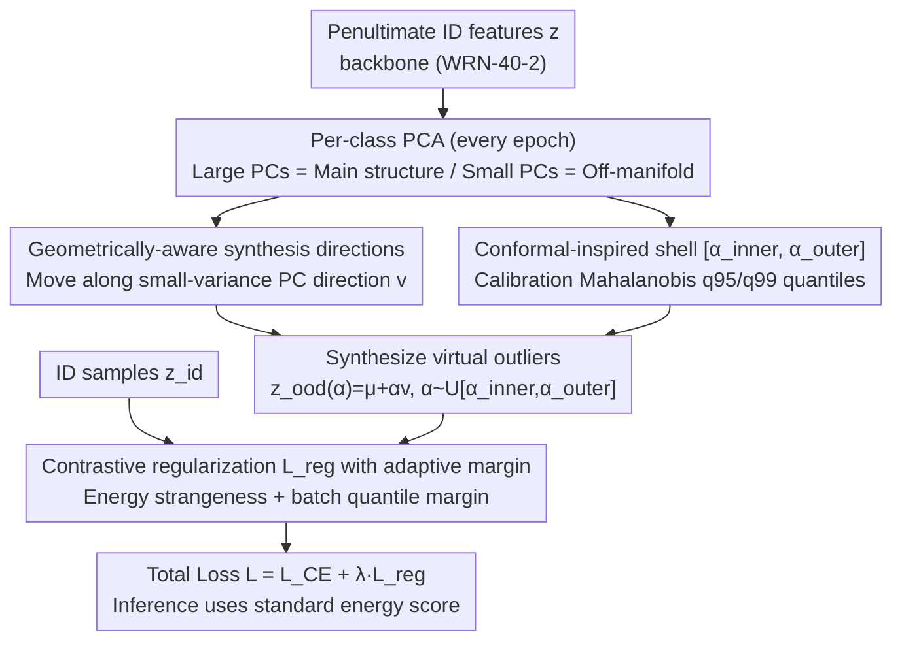

# Geometrically Constrained Outlier Synthesis

**Conference**: ICML 2026  
**arXiv**: [2603.08413](https://arxiv.org/abs/2603.08413)  
**Code**: None  
**Area**: AI Safety / OOD Detection  
**Keywords**: Virtual outlier synthesis, conformal prediction, feature manifold, contrastive regularization, near-OOD

## TL;DR
GCOS synthesizes virtual outliers along geometric off-manifold directions within the "small-variance subspace" of ID feature PCA. It regulates synthesis intensity via a "conformal shell" $[\alpha_\text{inner},\alpha_\text{outer}]$ derived from Mahalanobis quantiles of a calibration set. Combined with a contrastive regularization loss using an adaptive margin, it improves average AUROC from 86.21 (VOS) to 93.47 across four near-OOD datasets.

## Background & Motivation

**Background**: Image classifiers are generally overconfident on OOD inputs. A mainstream mitigation strategy is Outlier Exposure—constructing "virtual outliers" during training and pushing them away from ID data via energy regularization. A representative work, VOS, fits Gaussians in the feature space of each class and samples from the tails as virtual outliers.

**Limitations of Prior Work**: Methods like VOS model outliers as samples from simple parametric distributions (e.g., class-conditional Gaussians), which faces two issues: (1) real-world anomalies are often structured and non-Gaussian, which Gaussian tail sampling fails to cover; (2) if the learned feature space geometry is poor, synthesized points may fall into ID regions or meaningless distant zones, wasting the regularization signal.

**Key Challenge**: The "difficulty" of synthesized outliers is hard to strike—if they are too close to ID, they become inseparable; if too far, they become trivial. VOS uses fixed probability density thresholds, but these are sensitive to the shape of the feature space. Furthermore, the field mostly evaluates on far-OOD (semantically unrelated to the training domain), avoiding the more dangerous **near-OOD** (unseen fine-grained classes within the same domain).

**Goal**: (1) Move away from dependence on preset parametric distributions to ensure synthesized points follow the learned manifold geometry; (2) use a calibratable mechanism that does not require per-dataset tuning to control outlier "strangeness"; (3) shift the evaluation focus to near-OOD.

**Key Insight**: The authors observe that "principal components with large variance" in PCA describe the main structure of the manifold, while moving along "principal components with small variance" corresponds to off-manifold directions that are rare yet close to the data center—a natural geometric prior determined by the data itself. Simultaneously, Conformal Prediction (CP) provides a natural language for "how strange a point is": using $q_{95}$ and $q_{99}$ of nonconformity scores as thresholds allows for defining a "hard negative band" without manual tuning.

**Core Idea**: Use small-variance PCA directions to decide "where to go," use a CP-inspired Mahalanobis quantile shell to decide "how far to go," and apply a contrastive loss to push these geometrically aware virtual outliers away from ID features.

## Method

### Overall Architecture
GCOS addresses the empirical problem of "where and how far" to synthesize virtual outliers. It attaches its mechanism to the penultimate layer features $\mathbf{z}\in\mathbb{R}^D$ before the classification layer, decoupling it from the backbone (WRN-40-2 used in experiments). Every epoch, it fits subspace statistics and calibrates difficulty thresholds per class on a calibration set. Every batch, it samples virtual outliers along geometric directions to be backpropagated with the classification loss. Essentially, it reformulates outlier synthesis from a generative task into a geometric sampling problem in the PCA subspace.

### Key Designs

**1. Geometrically-aware synthesis direction: Replacing Gaussian tail sampling with small-variance PCA directions**

The limitation of VOS lies in assuming outliers follow the tails of a class-conditional Gaussian, whereas real anomalies are often non-Gaussian. GCOS adopts a data-driven perspective: it performs eigen-decomposition $(\mathbf{V}_\text{train},\boldsymbol{\Lambda}_\text{train})$ on each class's features. The first $K$ principal components (PCs) that explain $\ge\eta$ (default 90%) of the cumulative variance are treated as "large PCs" describing the manifold structure. The remaining "small PCs" are natural off-manifold directions—moving samples along these directions results in points that are "near the data center but virtually unseen during training," precisely hitting the blind spots of OOD detectors. The synthesis direction $v$ is either the average of all small PCs or synthesized per direction. Thus, by moving $\mathbf{z}_\text{ood}(\alpha)=\mu+\alpha v$ (with random sign flipping), PCA provides rare directions that adhere to the manifold geometry without requiring external generative models.

**2. Conformal-inspired shell $[\alpha_\text{inner},\alpha_\text{outer}]$: Quantifying "difficulty" as tuning-free quantile intervals**

With the direction set, the question is "how far to move." GCOS uses the language of Conformal Prediction to quantify this. On a calibration set, it calculates the Mahalanobis nonconformity score $\mathcal{S}_{Mahal}(z,\mu,\{\lambda_i\},\{v_i\})=\sum_i\frac{((z-\mu)^Tv_i)^2}{\lambda_i+\epsilon}$ and takes its $q_{95}$ and $q_{99}$ quantiles as shell targets. $\alpha_\text{inner}$ is defined as the minimum $\alpha$ such that $\mathcal{S}(\mathbf{z}_\text{ood}(\alpha))=q_{95}$, and $\alpha_\text{outer}$ corresponds to $q_{99}$. Since $\mathcal{S}$ is monotonic along $\alpha$, this is solved via binary search. Choosing $q_{95}/q_{99}$ aligns with standard 0.05 and 0.01 significance levels in hypothesis testing, providing a principled default. This shell excludes samples that are "too ID-like" ($< q_{95}$) or "too trivial" ($> q_{99}$), upgrading hard negative mining from heuristic thresholds to a geometrically controlled interval.

**3. Contrastive regularization loss $\mathcal{L}_{reg}$ with adaptive margin: Pulling apart the inference scores**

To ensure ID and OOD samples are separated by the score used at inference, GCOS defines $\mathcal{L}_{reg}=\mathbb{E}[\max(0,\mathcal{S}_\mathcal{L}(\mathbf{z}_{id}|\mathcal{M}_{y_{id}})-\min_k\mathcal{S}_\mathcal{L}(\mathbf{z}_{ood}|\mathcal{M}_k)+m)]$. It intentionally decouples the components: it use Mahalanobis for geometric synthesis, while $\mathcal{S}_\mathcal{L}$ in the regularization term uses the Energy Strangeness Score $\mathcal{S}_\mathcal{L}(\mathbf{z})=\log\sum_i w_i\exp(h_\phi(\mathbf{z})_i)$ to match inference. The margin $m$ is also not a fixed value; as score magnitudes drift during training, $m$ is set to the difference between the 95th and 50th percentiles of the positive class scores within each batch. This trick avoids manual tuning and allows the margin to shrink or expand automatically with the score distribution.

### Loss & Training
The total loss is $\mathcal{L}=\mathcal{L}_{CE}+\lambda\mathcal{L}_{reg}$. Inference follows the standard energy score path (with an extension for conformal hypothesis testing in Appendix D). To mitigate the violation of exchangeability caused by using the calibration set during training, the authors maintain two independent calibration sets: one for online synthesis/regularization and one reserved for final inference. The PCA variance threshold $\eta$ defaults to 90%, and $q_{95}/q_{99}$ require no tuning.

## Key Experimental Results

### Main Results
Four near-OOD datasets: Colored MNIST (randomized color-digit correlation), Stanford Dogs (unseen breeds), MVTec (defective parts of the same class), and Retinopathy (other eye diseases vs. 5-level DR). Backbone: WRN-40-2.

| Dataset | Metric | GCOS | VOS | NCIS (Prev. SOTA) | Gain |
|---------|--------|------|-----|------------------|------|
| C-MNIST | AUROC / FPR95 | **99.50 / 1.00** | 94.71 / 18.50 | 96.72 / 24.50 | +2.78 AUROC, −23.5 FPR95 |
| Dogs | AUROC / FPR95 | **99.55 / 0.00** | 99.25 / 5.00 | 99.35 / 10.00 | +0.20 AUROC, −10 FPR95 |
| MVTec | AUROC / FPR95 | 95.61 / 23.08 | 80.37 / 70.77 | **96.50 / 3.08** | Slightly behind NCIS |
| Retinopathy | AUROC / FPR95 | **79.23 / 73.00** | 70.52 / 80.00 | 75.29 / 85.50 | +3.94 AUROC, −12.5 FPR95 |
| **Avg. AUROC** | — | **93.47** | 86.21 | 91.97 | **+1.50 vs SOTA** |

### Ablation Study

| Configuration | Avg. AUROC | Description |
|---------------|------------|-------------|
| GCOS Full (Mahalanobis Synthesis + Energy Reg) | 93.47 | Default configuration |
| Mahalanobis for Regularization | App. H | Decoupling is better than homologous |
| VOS-style Uncertainty loss for $\mathcal{L}_{reg}$ | App. H | Validates synthesis strategy effectiveness |
| Direction: average vs per direction | App. J | Per direction is finer but costlier |
| Variance threshold $\eta$ | App. J | Robust to default 90% |
| No regularization baseline | 84.64 | ~9 AUROC drop on average |

### Key Findings
- On near-OOD tasks, the combination of geometrically-aware synthesis and energy-based inference is significantly more lightweight and effective than heavy synthesis schemes like NCIS (based on diffusion/normalizing flow).
- The drop in FPR95 from 18.5% (VOS) to 1.0% on C-MNIST demonstrates that for complex feature spaces with high intra-class variance, adaptive per-class calibration is crucial.
- UMAP visualizations (Fig. 2) show that while VOS outliers are scattered near class boundaries (potentially harming the decision surface), GCOS outliers fall on the "outer" off-manifold regions of adjacent clusters. This forces the decision boundary to contract more tightly around the data clusters, providing the geometric basis for near-OOD robustness.

## Highlights & Insights
- Formalizing the "intensity of hard negative sampling" using the language of CP quantiles as a $q_{95}/q_{99}$ shell provides a principled default for outlier synthesis, eliminating per-dataset threshold tuning.
- The observation that "small-variance PC directions = rare off-manifold directions" is simple yet powerful: PCA, a tool from 1933, provides more manifold-aligned synthesis than diffusion or normalizing flows, and can be directly integrated into any backbone for training-time outlier exposure.
- The adaptive margin using batch score differences is a highly reusable trick for any max-margin/triplet loss scenario where score magnitudes drift during training.

## Limitations & Future Work
- The authors admit that CP coverage guarantees strictly hold only during post-hoc inference (Appendix D); during training, CP serves as a geometric heuristic.
- The method relies on a well-separated feature space—for long-tailed or semantically overlapping settings, per-class PCA covariance estimates may be unstable. Training overhead, while lower than diffusion, is still higher than pure Gaussian sampling in VOS.
- The evaluation is limited to four relatively small datasets, missing comparisons on major benchmarks like OpenOOD. Code is currently not public.
- Future work could integrate "small PC + conformal shell" with diffusion synthesis—the former ensures geometric alignment while the latter provides image-space diversity.

## Related Work & Insights
- **vs VOS (Du et al., 2022)**: VOS uses class-conditional Gaussian tail sampling, which has strong assumptions and lacks manifold awareness. GCOS replaces this with PCA small-variance directions and a conformal quantile shell, improving average AUROC across four datasets from 86.21 to 93.47.
- **vs Dream-OOD / NCIS (Du 2023; Doorenbos 2024)**: These synthesize outliers in image space using diffusion/normalizing flows, which is computationally expensive. GCOS operates in the penultimate feature space with no image generation cost and outperforms NCIS by 1.50 AUROC points on average.
- **vs ViM (Wang et al., 2022)**: ViM also utilizes PCA residual space as an OOD score but only during inference. GCOS moves the geometric insight to the training phase via regularization, showing that "geometrically-aware synthesis + training regularization" shapes the feature space more fundamentally than post-hoc geometric inference alone.

## Rating
- Novelty: ⭐⭐⭐⭐ The combination of PCA small-variance directions and CP quantile shells is elegant and novel, though individual components are established.
- Experimental Thoroughness: ⭐⭐⭐ Limited to four medium-scale datasets; lacks tests on mainstream OpenOOD benchmarks.
- Writing Quality: ⭐⭐⭐⭐ Clear motivation, honest discussion of CP boundaries, and well-structured diagrams.
- Value: ⭐⭐⭐⭐ Lightweight and plug-and-play with substantial gains over VOS. Shifts focus to the practically significant near-OOD problem for safety-critical applications.

<!-- RELATED:START -->

## Related Papers

- [\[CVPR 2026\] Image-based Outlier Synthesis With Training Data](../../CVPR2026/ai_safety/image-based_outlier_synthesis_with_training_data.md)
- [\[ICML 2026\] Deep Sequence Models Tend to Memorize Geometrically; It Is Unclear Why](deep_sequence_models_tend_to_memorize_geometrically_it_is_unclear_why.md)
- [\[ICML 2026\] Old Habits Die Hard: How Conversational History Geometrically Traps LLMs](old_habits_die_hard_how_conversational_history_geometrically_traps_llms.md)
- [\[ICML 2026\] Differentially Private Preference Data Synthesis for Large Language Model Alignment](differentially_private_preference_data_synthesis_for_large_language_model_alignm.md)
- [\[ICLR 2026\] Private Rate-Constrained Optimization with Applications to Fair Learning](../../ICLR2026/ai_safety/private_rate-constrained_optimization_with_applications_to_fair_learning.md)

<!-- RELATED:END -->
## Related Papers

- [\[CVPR 2026\] Image-based Outlier Synthesis With Training Data](../../CVPR2026/ai_safety/image-based_outlier_synthesis_with_training_data.md)
- [\[ICML 2026\] Deep Sequence Models Tend to Memorize Geometrically; It Is Unclear Why](deep_sequence_models_tend_to_memorize_geometrically_it_is_unclear_why.md)
- [\[ICML 2026\] Old Habits Die Hard: How Conversational History Geometrically Traps LLMs](old_habits_die_hard_how_conversational_history_geometrically_traps_llms.md)
- [\[ICML 2026\] Differentially Private Preference Data Synthesis for Large Language Model Alignment](differentially_private_preference_data_synthesis_for_large_language_model_alignm.md)
- [\[CVPR 2026\] RAVEN: Erasing Invisible Watermarks via Novel View Synthesis](../../CVPR2026/ai_safety/raven_erasing_invisible_watermarks_via_novel_view_synthesis.md)

<!-- RELATED:END -->
