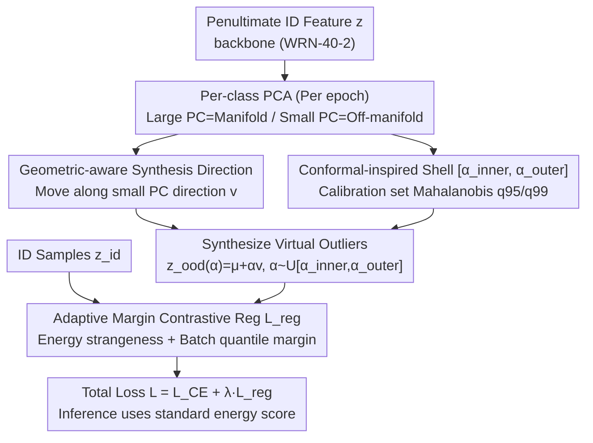

markdown
# Geometrically Constrained Outlier Synthesis

**Conference**: ICML 2026  
**arXiv**: [2603.08413](https://arxiv.org/abs/2603.08413)  
**Code**: None  
**Area**: AI Security / OOD Detection  
**Keywords**: Virtual Outlier Synthesis, Conformal Prediction, Feature Manifold, Contrastive Regularization, Near-OOD

## TL;DR
GCOS synthesizes virtual outliers along geometric off-manifold directions in the "small variance subspace" of ID feature PCA. It controls synthesis intensity using a "conformal shell" $[\alpha_\text{inner}, \alpha_\text{outer}]$ derived from calibrated Mahalanobis quantiles. Combined with contrastive regularization using an adaptive margin, it improves average AUROC across 4 near-OOD datasets from VOS's 86.21 to 93.47.

## Background & Motivation

**Background**: Image classifiers are generally overconfident on OOD inputs. A mainstream mitigation is Outlier Exposure—constructing "virtual outliers" during training and separating them from ID features via energy regularization. A representative work, VOS, fits Gaussians in the feature space of each class and samples from the tails as virtual outliers.

**Limitations of Prior Work**: Methods like VOS model outliers as samples from simple parametric distributions (e.g., class-conditional Gaussians), which faces two issues: (1) Real-world anomalies often possess structured, non-Gaussian properties that Gaussian tail sampling cannot cover; (2) If the learned feature space geometry is poor, synthesized points may fall into ID regions or meaningless distant areas, losing the regularization signal.

**Key Challenge**: Calibrating the "difficulty" of synthesized outliers is difficult—points too close to ID are inseparable, while those too far are trivial. VOS uses a fixed probability density threshold, but such thresholds are sensitive to feature space shape. Furthermore, the field primarily evaluates on far-OOD (semantically unrelated to the training domain), avoiding the more dangerous **near-OOD** (unseen fine-grained classes within the same domain).

**Goal**: (1) Eliminate dependence on preset parametric distributions, allowing synthesized points to follow the learned manifold geometry; (2) Use a calibratable mechanism that does not require per-dataset tuning to control the "strangeness" of synthesized points; (3) Shift the evaluation focus to near-OOD.

**Key Insight**: The authors observe that "large variance principal components" from PCA characterize the main manifold structure, while moving along "small variance principal components" directions corresponds to off-manifold directions that are rare yet close to the data center—a natural geometric prior determined by the data itself. Simultaneously, Conformal Prediction (CP) provides a natural quantile-based language to judge how "strange" a point is: using $q_{95}$ and $q_{99}$ of nonconformity scores as thresholds allows for defining a "hard negative band" without hyperparameter tuning.

**Core Idea**: Use PCA small variance directions to determine "where to go," use CP-inspired Mahalanobis quantile shells to determine "how far to go," and apply contrastive loss to push these geometry-aware virtual outliers away from ID features.

## Method

### Overall Architecture
GCOS addresses the two empirical questions of "where to synthesize virtual outliers" and "how far to synthesize them." The mechanism is attached to the penultimate feature layer $\mathbf{z} \in \mathbb{R}^D$ and decoupled from the backbone (WRN-40-2 is used in experiments). Each epoch, it fits subspace statistics and calibrates difficulty thresholds for each class on a calibration set. Each batch then samples virtual outliers along geometric directions to be backpropagated with the classification loss. It reformulates outlier synthesis from a generative task into a geometric sampling problem in PCA subspaces.

### Key Designs

**1. Geometric-aware Synthesis Direction: Replacing Gaussian tail sampling with PCA small variance directions**

The pain point of VOS is the assumption that outliers follow the tail of a class-conditional Gaussian, whereas real anomalies are often structured and non-Gaussian. GCOS shifts to a data-driven perspective: performing eigen-decomposition $(\mathbf{V}_\text{train}, \boldsymbol{\Lambda}_\text{train})$ on features of each class. The first $K$ principal components (PCs) that explain $\ge \eta$ (default 90%) cumulative variance are treated as the "large PCs" of the manifold structure. The remaining "small PCs" are natural off-manifold directions. Moving samples along these directions keeps them "near the data center but rare in training," hitting the weak spots of OOD detectors. The synthesis direction $v$ is either the average of all small PCs or synthesized per direction. $\mathbf{z}_\text{ood}(\alpha) = \mu + \alpha v$, with random signs to support bidirectional movement. This bypasses the Gaussian assumption using PCA geometric priors.

**2. Conformal-inspired Shell $[\alpha_\text{inner}, \alpha_\text{outer}]$: Quantifying "difficulty" as tuning-free quantile intervals**

Once the direction is set, "how far to go" must be decided. GCOS uses Conformal Prediction to quantify this. It computes the Mahalanobis nonconformity score $\mathcal{S}_{Mahal}(z, \mu, \{\lambda_i\}, \{v_i\}) = \sum_i \frac{((z-\mu)^T v_i)^2}{\lambda_i + \epsilon}$ on the calibration set and uses its $q_{95}$ and $q_{99}$ quantiles as shell targets. $\alpha_\text{inner}$ is defined as the minimum $\alpha$ such that $\mathcal{S}(\mathbf{z}_\text{ood}(\alpha)) = q_{95}$, and $\alpha_\text{outer}$ corresponds to $q_{99}$. Since $\mathcal{S}$ is monotonic along $\alpha$, it is solved via binary search. Sampling $\alpha \sim \mathcal{U}[\alpha_\text{inner}, \alpha_\text{outer}]$ targets a principled significance level (0.05 to 0.01) that excludes points "too ID" ($< q_{95}$) and "too trivial" ($> q_{99}$). The CP mechanism is used primarily as a geometric heuristic during training.

**3. Adaptive Margin Contrastive Regularization Loss $\mathcal{L}_{reg}$: Separating inference scores**

To push ID and OOD apart using the same score used during inference, GCOS defines $\mathcal{L}_{reg} = \mathbb{E}[\max(0, \mathcal{S}_\mathcal{L}(\mathbf{z}_{id}|\mathcal{M}_{y_{id}}) - \min_k \mathcal{S}_\mathcal{L}(\mathbf{z}_{ood}|\mathcal{M}_k) + m)]$. It utilizes a decoupled approach: Mahalanobis for geometric synthesis and Energy Strangeness Score $\mathcal{S}_\mathcal{L}(\mathbf{z}) = \log \sum_i w_i \exp(h_\phi(\mathbf{z})_i)$ for regularization. The margin $m$ is adaptive; since score scales drift per epoch, $m$ is calculated as the difference between the 95th and 50th percentiles of positive scores within each batch, allowing it to contract automatically with the score distribution.

### Loss & Training
The total loss is $\mathcal{L} = \mathcal{L}_{CE} + \lambda \mathcal{L}_{reg}$. Inference follows the standard energy score path. To mitigate the loss of exchangeability from using the calibration set in training, authors maintain two independent calibration sets: one for synthesis/regularization and one for final inference-time conformal hypothesis testing. The PCA variance threshold $\eta$ defaults to 90%, and $q_{95}/q_{99}$ require no tuning.

## Key Experimental Results

### Main Results
Four near-OOD datasets: Colored MNIST (shuffled color-digit correlation), Stanford Dogs (unseen breeds), MVTec (anomalies within the same category), and Retinopathy (other eye diseases vs. DR grades). Backbone is WRN-40-2.

| Dataset | Metric | GCOS | VOS | NCIS (Prev. SOTA) | Gain |
| :--- | :--- | :--- | :--- | :--- | :--- |
| C-MNIST | AUROC / FPR95 | **99.50 / 1.00** | 94.71 / 18.50 | 96.72 / 24.50 | +2.78 AUROC, −23.5 FPR95 |
| Dogs | AUROC / FPR95 | **99.55 / 0.00** | 99.25 / 5.00 | 99.35 / 10.00 | +0.20 AUROC, −10 FPR95 |
| MVTec | AUROC / FPR95 | 95.61 / 23.08 | 80.37 / 70.77 | **96.50 / 3.08** | Slightly lower than NCIS |
| Retinopathy | AUROC / FPR95 | **79.23 / 73.00** | 70.52 / 80.00 | 75.29 / 85.50 | +3.94 AUROC, −12.5 FPR95 |
| **Median AUROC** | — | **93.47** | 86.21 | 91.97 | **+1.50 vs SOTA** |

### Ablation Study

| Configuration | Avg. AUROC | Note |
| :--- | :--- | :--- |
| GCOS Full (Mahalanobis Synthesis + Energy Reg) | 93.47 | Default |
| Mahalanobis for Reg (same source) | (See App. H) | Decoupled hybrid is better |
| VOS-style uncertainty loss instead of $\mathcal{L}_{reg}$ | (See App. H) | Validates synthesis strategy |
| Direction: average vs per direction | — | Per direction is more granular |
| Variance threshold $\eta$ | Robust | Insensitive to default 90% |
| No regularization baseline | 84.64 | Drop of ~9 AUROC |

### Key Findings
- On near-OOD, geometric-aware synthesis combined with energy inference is significantly more lightweight and effective than heavy synthesis schemes like Diffusion or Normalizing Flows (e.g., NCIS).
- On C-MNIST, FPR95 dropped from 18.5% (VOS) to 1.0%, indicating that adaptive per-class calibration is critical for complex feature spaces.
- UMAP visualizations show that VOS outliers scatter near cluster boundaries (risking decision boundary collapse), while GCOS outliers fall "outside" the adjacent classes in off-manifold regions, forcing the decision boundary to shrink more tightly around data clusters.

## Highlights & Insights
- Formalizing the "intensity of hard negative sampling" using CP quantiles ($q_{95}/q_{99}$) provides a principled default, eliminating per-dataset threshold tuning.
- The observation that "small variance PCs = rare off-manifold directions" is a powerful insight: PCA provides better manifold-aligned synthesis than complex generative models without the training overhead.
- The adaptive margin using intra-batch score differences is a highly reusable trick for any max-margin scenario where score scales drift.

## Limitations & Future Work
- Authors admit that CP coverage guarantees only strictly hold during post-hoc inference; the training phase uses it as a geometric heuristic.
- The method depends on a separable feature space—per-class PCA estimation becomes unstable for long-tailed or overlapping distributions.
- PCA on a rolling queue/epoch basis is cheaper than Diffusion but still heavier than VOS’s simple Gaussian sampling.
- Future work: Hybridizing "small PC + conformal shell" with Diffusion/Flow synthesis—using the former for geometric alignment and the latter for image-space diversity.

## Related Work & Insights
- **vs VOS (Du et al., 2022)**: VOS assumes class-conditional Gaussians, which is restrictive. GCOS uses PCA small variance directions and conformal shells, which are more geometrically aware.
- **vs Dream-OOD / NCIS (Du 2023; Doorenbos 2024)**: These synthesize outliers in image space using complex models. GCOS operates in the feature space without image generation costs and outperforms NCIS by 1.50 AUROC points on average.
- **vs ViM (Wang et al., 2022)**: ViM uses PCA residual space only during inference. GCOS moves this geometric insight to the training phase for regularization, demonstrating that "geometric-aware synthesis" actively shapes the feature space.

## Rating
- Novelty: ⭐⭐⭐⭐ Clean combination of PCA and CP quantiles.
- Experimental Thoroughness: ⭐⭐⭐ Focused on 4 medium-scale datasets; lacks evaluation on massive benchmarks like OpenOOD.
- Writing Quality: ⭐⭐⭐⭐ Clear motivation and honest discussion regarding CP boundaries.
- Value: ⭐⭐⭐⭐ Lightweight, plug-and-play, and significantly improves near-OOD robustness.

<!-- RELATED:START -->

## Related Papers

- [\[CVPR 2026\] Image-based Outlier Synthesis With Training Data](../../CVPR2026/ai_safety/image-based_outlier_synthesis_with_training_data.md)
- [\[CVPR 2026\] RAVEN: Erasing Invisible Watermarks via Novel View Synthesis](../../CVPR2026/ai_safety/raven_erasing_invisible_watermarks_via_novel_view_synthesis.md)
- [\[ICML 2026\] VPD-100K: Towards Generalizable and Fine-grained Visual Privacy Protection](vpd-100k_towards_generalizable_and_fine-grained_visual_privacy_protection.md)
- [\[ICML 2026\] Extending Fair Null-Space Projections for Continuous Attributes to Kernel Methods](extending_fair_null-space_projections_for_continuous_attributes_to_kernel_method.md)
- [\[ICML 2026\] Position: Beyond Sensitive Attributes, ML Fairness Should Quantify Structural Injustice via Social Determinants](position_beyond_sensitive_attributes_ml_fairness_should_quantify_structural_inju.md)

<!-- RELATED:END -->
