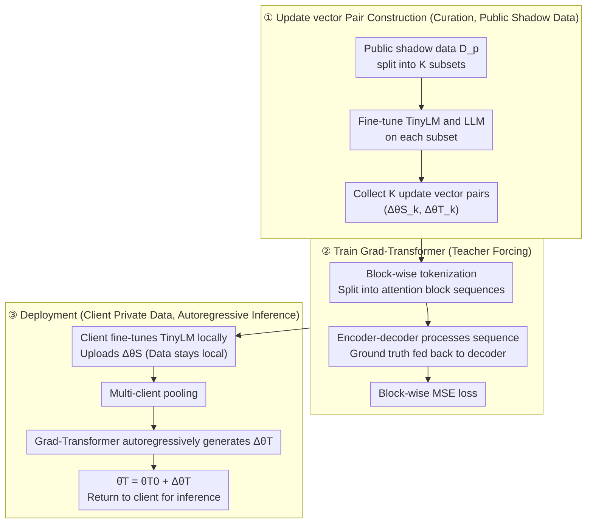

# Gradient Transformer: Learning to Generate Updates for LLMs

**Conference**: ICML 2026  
**arXiv**: [2605.27591](https://arxiv.org/abs/2605.27591)  
**Code**: To be confirmed  
**Area**: Learned Optimizer / Data-free Knowledge Distillation / Privacy-preserving Fine-tuning  
**Keywords**: update vector, weak-to-strong distillation, Grad-Transformer, LoRA, differential privacy

## TL;DR
This paper proposes Grad-Transformer, which "translates" the update vector obtained by a client fine-tuning a small model (TinyLM) on private data into an update vector for a target large language model (LLM) using an encoder-decoder Transformer. This achieves weak-to-strong knowledge distillation without touching private data. It achieves an average PGR of 91.88% across 6 reasoning/summarization datasets, a 55.89% improvement over the best baseline (58.94%), and demonstrates robustness to differential privacy perturbations.

## Background & Motivation

**Background**: There are two main approaches to fine-tuning LLMs on enterprise private data: (1) clients fine-tune a small model (TinyLM) locally; (2) clients provide data to a cloud service provider for fine-tuning a large model. The former yields poor performance, while the latter violates privacy constraints such as GDPR/HIPAA. Academic compromises include data-free knowledge distillation (KD), which trains a generator to synthesize samples that "look like" private data to distill the student.

**Limitations of Prior Work**: Data-free KD faces two major issues: (a) the generator must be retrained for each new teacher, and distillation requires massive synthetic samples, which is computationally expensive; (b) synthetic samples may expose privacy-sensitive information through memorization or leakage (Annamalai et al., 2024), contradicting the "data-free" intent. Another approach, weak-to-strong KD (Burns et al., 2024), requires the teacher (weak) and student (strong) to share data, which also fails to meet the requirement that "private data remains local."

**Key Challenge**: Traditional carriers of knowledge in KD are logits or synthetic samples, both of which either require data access or risk leakage. **Is there a "knowledge carrier" that can encode the effects of fine-tuning on private data while being irreversible to original samples?**

**Goal**: To design a mechanism $\mathcal{M}$ that allows a third-party provider to map a TinyLM update vector $\Delta\theta_S=\theta_S^*-\theta_S^0$ submitted by a client directly into a target LLM update vector $\Delta\theta_T$ **without any access to private data**, while supporting collaborative updates from multiple clients.

**Key Insight**: The authors observe that the update vector itself is a "compressed representation of accumulated gradient steps on a specific dataset"—it encapsulates the impact of private data as increments in the parameter space, which is more abstract than logits or synthetic samples and does not directly correspond to specific samples. If the correspondence between "TinyLM update ↔ LLM update" can be learned on a **public shadow dataset**, this mapping can serve as a reusable "gradient translator."

**Core Idea**: The update vector is partitioned into token-like sequences based on attention blocks. A Flan-T5 encoder-decoder is used to autoregressively generate block-wise update vectors for the LLM. The entire mapping is trained once on shadow data and used directly for inference during deployment.

## Method

### Overall Architecture
The mechanism is designed to allow a provider to transfer "gradient knowledge" from a client's TinyLM fine-tuned on private data to an LLM without touching said data. The process consists of three steps: First, fine-tune both TinyLM and LLM on a **public shadow dataset** $D_p$ to curate $K$ pairs of $(\Delta\tilde\theta_{S,k}, \Delta\tilde\theta_{T,k})$ (curation); use these pairs to train a seq2seq Grad-Transformer to learn the "TinyLM update → LLM update" translation (train); during deployment, a client uploads a locally fine-tuned $\Delta\theta_{S,i}$, the provider pools updates from multiple clients followed by Grad-Transformer inference to obtain $\Delta\hat\theta_T$, which is added to the initial weights $\hat\theta_T=\theta_T^0+\Delta\hat\theta_T$ before returning the model for client inference (deploy). The mapping is trained once on shadow data and reused for all clients.

### Key Designs

**1. Update vector as Distillation Carrier: Using "Parameter Increments" as Non-leaking Knowledge Media**

Traditional distillation uses logits or synthetic samples, requiring shared data or risking privacy leakage. This work uses the client's increment $\Delta\theta_S=\theta_S^*-\theta_S^0$ relative to public initial weights. The provider performs mapping on this increment, while original samples remain local. LoRA $r=2$ adapters further reduce dimensionality. This is feasible because the update vector is a low-variance, stable "semantic compression" that encapsulates data influence without directly corresponding to samples. Theoretically (Lemma 5.1, Theorem 5.2), generalization and utility bounds are controlled by $I(w;D_p)$; thus, DP-SGD can be added to weaken the dependence of $\Delta\theta_S$ on individual samples. Crucially, shadow data is only used to learn "spatial correlations between parameters," independent of specific client data.

**2. Block-wise Tokenization: Mapping Trillion-dimensional Updates to Sequence Translation**

Concatenating all parameters results in an unmanageable projection matrix. This work treats parameter mapping as sequence translation: for each attention block, increments in Q/K/V/output projection weights are concatenated into a block vector $\delta_{S,k}^j\in\mathbb{R}^{d_S}$ and treated as a token. Embedding layers $W_S^{emb}, W_T^{emb}$ project source/target blocks to a shared hidden size. An encoder-decoder $\varphi$ processes the sequence, and $W_{out}$ projects them back to the $d_T$-dimensional LLM block space. This retains the "layer-wise correspondence" prior and keeps sequence lengths within the optimal range for Transformers.

**3. Teacher-forcing Training + Autoregressive Inference: Capturing Inter-block Coupling**

Updates in LLM layers are highly correlated. Predicting blocks independently loses this structure. The decoder generates the $j$-th LLM block update by attending to all TinyLM blocks and previously generated $j-1$ LLM blocks. Training uses teacher forcing with ground truth $h_{T,k}^{<j}=W_T^{emb}(\delta_{T,k}^{<j})$ to minimize block-wise MSE:

$$\arg\min_w \frac{1}{KL_T}\sum_k\sum_j\big\|\hat\delta_{T,k}^j-\delta_{T,k}^j\big\|_2^2$$

Inference switches to feeding back the previous prediction $\hat h_{T,k}^{<j}$ (Eq. 11), making it fully autoregressive. In multi-client scenarios, $\{\Delta\theta_{S,i}\}$ are pooled (mean or sum) before entering $\mathcal{M}$, naturally supporting joint updates.

### Loss & Training
- **Objective**: Block-wise MSE (Eq. 10), optimized via Adam for 30 epochs, batch size 32, lr 2e-5 to 8e-5.
- **Data**: Training sets are split in half: one for client private data $D$ and one for shadow data $D_p$. $D_p$ is randomly split into $K=300$ subsets (1024 samples each). LoRA $r=2$ fine-tuning is performed until convergence, and the last 200 steps' adapters are collected as update vector pairs (60k tuples, 95:5 train/val split).
- **Models**: TinyLM = Qwen2.5-3B-Instruct, LLM = Qwen2.5-7B-Instruct, $\varphi$ = Flan-T5-Large.

## Key Experimental Results

### Main Results (Single Client, higher PGR % is better)

| Dataset | $P_S$ (TinyLM) | Best Baseline | Grad-Transformer | $P_T$ (LLM Upper Bound) |
|--------|--------------:|--------------:|-----------------:|-----------------:|
| AQuA-RAT (Acc) | 48.43 | 47.64 (W2S Conf) | **61.02** | 58.66 |
| GSM8K (Acc) | 62.62 | 74.30 (W2S Conf) | **73.59** | 73.16 |
| DROP (Acc) | 49.36 | 54.18 (W2S Conf) | **58.26** | 59.01 |
| CommonsenseQA (Acc) | 77.40 | 83.46 | 83.21 | 83.78 |
| SAMSum (R-1) | 47.64 | 49.92 | **50.52** | 50.59 |
| DialogSum (R-1) | 46.43 | 47.70 | 48.37 | 50.92 |

**Key Findings**: On AQuA-RAT, Grad-Transformer's accuracy (61.02%) **exceeds the upper bound of direct LLM fine-tuning** (58.66%), with PGR reaching 123%, suggesting the "gradient translation" learned from shadow data offers regularization or ensemble effects. The average PGR of 91.88% far outperforms the best baseline's 58.94% (+55.89%). Notably, despite the baselines (W2S, Conf, VisSup) **having access to private data**, Grad-Transformer is the **only method that does not**.

### Comparison Table

| Dimension | Data-free KD baseline | Weak-to-strong KD baseline | Grad-Transformer |
|------|----------------------|---------------------------|------------------|
| Access Private Data | ✗ (But needs generator) | ✓ | **✗** |
| Retrain per Teacher | ✓ (Expensive) | – | ✗ (One-time mapping) |
| Synthetic Leakage Risk | High | – | **No samples** |
| Multi-client Support | Difficult | Difficult | ✓ (Pool update vec) |
| DP / LoRA Compatible | Partially | Partially | ✓ |

### Key Findings
- **Block-wise tokenization is the key to scalability**: It reduces the trillion-parameter mapping to a Flan-T5-Large scale, making the architecture trainable.
- **DP Robustness**: When adding DP-SGD noise at the client side, Grad-Transformer's performance degradation is significantly less than baselines, as its "translation capability" derives from spatial correlations in shadow data rather than precise $\Delta\theta_S$.
- **Theory-Experiment Alignment**: Theorem 5.2 predicts utility bounds depend on $I(w;D_p)+\mathrm{KL}(\tilde\mu\|\mu)$. Experiments show performance is best when shadow $D_p$ and private $D$ are from the same distribution; significant drops occur in out-of-distribution settings.

## Highlights & Insights
- **"Gradient as Knowledge" Paradigm**: Treating the update vector as a sequence of learnable "knowledge tokens" is a key extension of model soup/task arithmetic. While the latter perform arithmetic within the same architecture, this work bridges **cross-architecture and cross-scale** parameter space mapping.
- **Elegant Privacy-Utility-Cost Balance**: Clients only need to tune a local 3B model without uploading data. Providers train one Grad-Transformer once. This compresses the cyclic communication costs of federated learning into a one-time upload of a LoRA adapter.
- **Transferable Trick**: The combination of block-wise serialization and encoder-decoder autoregression can be transferred to model merging or cross-architecture adapter transfer.

## Limitations & Future Work
- **Shadow Data Dependence**: Performance relies heavily on the distribution alignment between $D_p$ and private data (per Theorem 5.2). If a client's task is too niche, finding a suitable $D_p$ may be difficult.
- **Generalization**: Experiments only validated cross-scale mapping within the **same family (Qwen2.5)** (e.g., 3B to 7B). Cross-family feasibility (e.g., LLaMA to Qwen) remains unknown. Furthermore, stability under full fine-tuning (where dimensions explode) is not tested.
- **Future Improvements**: Using hierarchical serialization or introducing "architecture embeddings" as prompts might allow a single Grad-Transformer to serve multiple teacher-student combinations.

## Related Work & Insights
- **vs Burns et al. 2024 (Weak-to-Strong)**: W2S uses teacher outputs (logits/labels) necessitating shared data access; this work uses **parameter increments**, allowing the student to be data-free.
- **vs Data-Free KD (Tran et al., 2024; Wei et al., 2025)**: These use generators to synthesize data. Grad-Transformer avoids the cost of retraining generators for each teacher and eliminates leakage risks.
- **vs Task Arithmetic / Model Soup**: Grad-Transformer is a **non-linear cross-architecture** extension of task arithmetic which usually only operates within the same architecture.

## Rating
- **Novelty**: ⭐⭐⭐⭐⭐ "Translating gradients" is a novel perspective, transforming high-dimensional mapping into a well-defined seq2seq task.
- **Experimental Thoroughness**: ⭐⭐⭐⭐ Covers 6 datasets and 3 baselines under single/multi-client and DP settings, though cross-family validation is missing.
- **Writing Quality**: ⭐⭐⭐⭐ The three-stage framework is clear, and the theory aligns well with experimental methodology.
- **Value**: ⭐⭐⭐⭐⭐ Addresses real-world pain points of private LLM fine-tuning with an engineering-ready solution (LoRA/DP/pooling compatible).

<!-- RELATED:START -->

## Related Papers

- [\[ICML 2026\] FedHPro: Federated Hyper-Prototype Learning via Gradient Matching](fedhpro_federated_hyper-prototype_learning_via_gradient_matching.md)
- [\[ICML 2026\] Multilingual Unlearning in LLMs: Transfer, Dynamics, and Reversibility](multilingual_unlearning_in_llms_transfer_dynamics_and_reversibility.md)
- [\[ICML 2026\] Efficient DP-SGD for LLMs with Randomized Clipping](efficient_dp-sgd_for_llms_with_randomized_clipping.md)
- [\[ICML 2026\] Position: Uncertainty Quantification in LLMs is Just Unsupervised Clustering](position_uncertainty_quantification_in_llms_is_just_unsupervised_clustering.md)
- [\[ICML 2026\] Old Habits Die Hard: How Conversational History Geometrically Traps LLMs](old_habits_die_hard_how_conversational_history_geometrically_traps_llms.md)

<!-- RELATED:END -->
