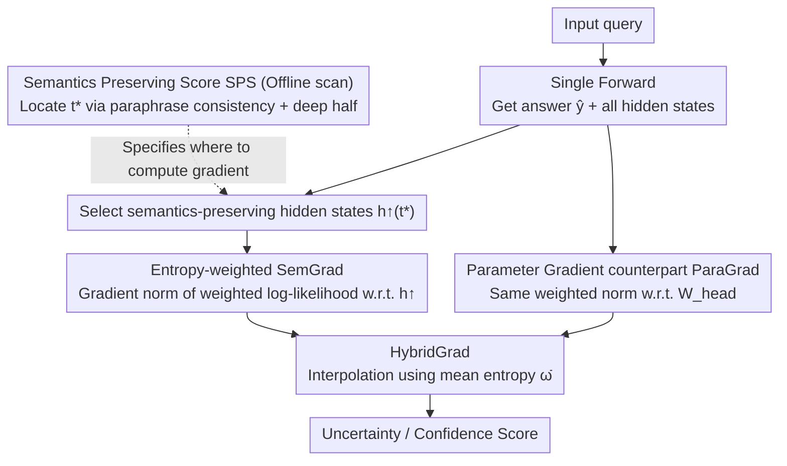

# SemGrad: Gradients w.r.t. Semantics-Preserving Embeddings Tell LLM Uncertainty

**Conference**: ICML 2026  
**arXiv**: [2605.04638](https://arxiv.org/abs/2605.04638)  
**Code**: https://github.com/mingdali6717/SemGrad (Available)  
**Area**: LLM Safety / Uncertainty Quantification / Hallucination Detection  
**Keywords**: Free-form generation UQ, Semantic Gradient, Semantics Preserving Score (SPS), Single forward+backward, Multiple valid answers  

## TL;DR
SemGrad applies gradient-based uncertainty quantification to LLM free-form generation for the first time. By using the Semantics Preserving Score (SPS) to identify hidden states that encode input semantics, the method uses the gradient norm of the log-likelihood with respect to these states as a measure of LLM confidence. Without sampling and requiring only a single backward pass, it outperforms 11 SOTA baselines on 3 QA datasets, notably exceeding SAR by 3.27 AUROC on TruthfulQA, which contains multiple valid answers.

## Background & Motivation

**Background**: LLMs are increasingly deployed in medical, educational, and financial scenarios, making "how confident the model is in its own answer" a critical requirement. SOTA UQ methods (e.g., Semantic Entropy, SAR, Semantic Density) typically follow a "sampling + cross-sample semantic clustering" route: sampling $K$ outputs for the same query and calculating distributional divergence.

**Limitations of Prior Work**: (i) Sampling methods cost $K\times$ generation time, exhibit high variance, and are expensive to deploy. (ii) Established "parameter gradient norm" UQ in classification tasks assumes a single ground truth label (equivalent to a Dirac distribution), where the formula $\nabla_\theta\log p(y^\star|x)=0$ holds at the optimum. However, natural language naturally possesses aleatoric uncertainty (multiple valid answers); gradients do not vanish even at the optimal $\theta^\star$, causing parameter gradient norms to misinterpret intrinsic task stochasticity as model uncertainty.

**Key Challenge**: In free-form generation, aleatoric (task-inherent) and epistemic (lack of model knowledge) uncertainties are conflated and cannot be decoupled in parameter space, while sampling methods remain prohibitively expensive.

**Goal**: (1) Propose the first gradient-based UQ specifically suited for free-form generation; (2) Ensure effectiveness in scenarios with multiple valid answers; (3) Maintain high efficiency via "single forward + single backward" passes.

**Key Insight**: Grounded in linguistic intuition, if a model truly understands a query, semantics-preserving perturbations $\boldsymbol{x}+\Delta\boldsymbol{x}$ should not alter the output distribution. This local stability can be quantified by the gradient norm with respect to semantics-preserving embeddings, which is independent of whether the ground truth distribution is unimodal or multimodal.

**Core Idea**: Shift gradients from "parameter space" to "semantic space" by identifying intermediate hidden states $\boldsymbol{h}_E$ that preserve input semantics, and use $\|\nabla_{\boldsymbol{h}_E}\log p(\hat{\boldsymbol{y}}|\boldsymbol{x};\boldsymbol{h}_E)\|$ as the uncertainty metric.

## Method

### Overall Architecture
SemGrad aims to determine LLM confidence in a single free-form generation without sampling, using only one forward and one backward pass. During inference, a forward pass generates the answer $\hat{\boldsymbol{y}}$ and all hidden states. The semantic-preserving token $t^\star$ that best encodes input semantics is identified; hidden states from its deeper half (layers $L/2+1$ to $L-1$) are concatenated as $\boldsymbol{h}^\uparrow_{t^\star}$. A single backward pass is performed on an entropy-weighted log-likelihood to compute the gradient norm w.r.t. $\boldsymbol{h}^\uparrow_{t^\star}$ for SemGrad. Finally, HybridGrad is obtained by interpolating between SemGrad and the parameter-based "ParaGrad" using the average token entropy $\bar\omega$.

### Key Designs

**1. Semantics Preserving Score (SPS): Data-driven Localization of Gradients**

The key to gradient UQ is not how to compute it, but where—selecting the wrong location (e.g., the last layer serving next-token decoding or low layers focused on lexical features) fails to capture uncertainty. SPS provides a quantifiable selection criterion: for each query, $K$ semantically equivalent paraphrases are generated via GPT. The within-paraphrase similarity $S_{w/i}^{l,t}$ and across-query similarity $S_{a/c}^{l,t}$ of hidden states are calculated. A higher $\mathrm{SPS}=S_{w/i}-S_{a/c}$ indicates a position that maps synonymous inputs closer while pushing dissimilar ones apart. Scanning reveals three patterns: each model has a consistent $t^\star$ across datasets (e.g., `<|start_header_id|>` for LLaMA-3.1), high SPS is concentrated in the deeper half of layers, and high SPS regions form a band rather than a single point.

**2. Entropy-weighted SemGrad: Sensitivity to Semantic Perturbation**

Quantifying local stability as the gradient norm w.r.t. semantic embeddings:

$$S_{\text{SemGrad}}=\frac{1}{|\boldsymbol{h}^\uparrow_{t^\star}|}\Big\|\nabla_{\boldsymbol{h}^\uparrow_{t^\star}}\sum_{t=1}^T\omega_t\log p(\hat{y}_t\mid\hat{y}_{<t},\boldsymbol{x};\boldsymbol{h}^\uparrow_{t^\star})\Big\|_1$$

Where $\omega_t=H(p(y_t\mid\hat{y}_{<t},\boldsymbol{x}))$ is the token entropy at each step, detached from the computational graph. This weighting accounts for the non-uniform contribution of tokens—stopwords receive lower weights while critical factual words receive higher weights, preventing the signal from being diluted by redundant tokens. Theoretically, $\|\nabla_{\boldsymbol{h}_E}\log p\|\approx 0$ only requires the model to be close to the true distribution, regardless of its unimodal or multimodal nature, ensuring gradients are not biased by aleatoric noise in multi-answer tasks.

**3. HybridGrad: Adaptive Switching using Mean Entropy**

While SemGrad is robust for multiple answers, parameter gradients can be more accurate in single-answer scenarios where they directly correspond to the training objective. HybridGrad uses the average token entropy $\bar\omega=\frac{1}{T}\sum_t\omega_t$ as a proxy for task aleatoric uncertainty to interpolate:

$$S_{\text{HybridGrad}}=(1-e^{-\bar\omega})\,S_{\text{SemGrad}}+e^{-\bar\omega}\,S_{\text{ParaGrad}}$$

Low entropy (certain tasks) biases towards ParaGrad, while high entropy (ambiguous tasks) biases towards SemGrad. ParaGrad is the parameter-space twin of SemGrad, replacing $\nabla_{\boldsymbol{h}_E}$ with $\nabla_{\boldsymbol{W}_{\text{head}}}$.

### Loss & Training
The method is inference-only with no training. The only offline step is a single SPS scan on a small development set to determine the model-specific $t^\star$.

## Key Experimental Results

### Main Results
Performance (AUROC) across 3 LLMs and 3 QA datasets (SciQ, TriviaQA for single-answer; TruthfulQA for multi-answer) using BEM for correctness evaluation:

| Method | SciQ avg | TriviaQ avg | TruthfulQ avg | **Overall avg** |
|------|---------:|------------:|--------------:|----------------:|
| SAR (Prev. SOTA, Sampling) | 74.86 | 84.13 | 66.99 | 75.33 |
| ExGrad (Parameter Grad) | 74.33 | 83.37 | 64.06 | 73.92 |
| ParaGrad (Ours baseline) | 75.02 | 84.81 | 66.95 | 75.59 |
| SemGrad | 74.50 | 82.50 | **70.25** | 75.75 |
| **HybridGrad** | **75.35** | 83.90 | **70.53** | **76.59** |

On multi-answer TruthfulQA, SemGrad outperforms SAR by +3.27, ExGrad by +6.82, and ParaGrad by +3.30 AUROC.

### Ablation Study

| Configuration | TruthfulQA AUROC (LLaMA) | Description |
|------|-------------------------:|------|
| Full SemGrad (Deep half + $t^\star$ + $\ell_1$ + entropy weight) | 69.42 | Default |
| $\ell_2$ instead of $\ell_1$ | 69.42 | Negligible difference |
| Remove $\omega_t$ entropy weight | 68.98 | Drops 3.4 points on TriviaQA |
| Last layer only ($L-1$) | 68.13 | Band > Single layer |
| Token changed to last input token | 69.07 | $t^\star$ > last input token |
| Use low SPS hidden states | Significant drop | Strong positive correlation between SPS and AUROC |

### Key Findings
- **SPS and AUROC are strongly positively correlated**: Hidden states with high SPS yield higher SemGrad performance, while low SPS positions (early layers/misaligned tokens) capture almost no uncertainty information.
- **SemGrad dominates parameter gradients in multi-answer scenarios**: Parameter gradients fail due to aleatoric nature in TruthfulQA, while SemGrad's theoretical independence provides qualitative improvements.
- **HybridGrad is the most robust all-rounder**: Adapting between semantic and parameter gradients achieves the highest and most stable average AUROC across 9 (model, dataset) combinations.
- **Significant efficiency advantage**: SemGrad/HybridGrad runtime per example is an order of magnitude faster than sampling baselines.

## Highlights & Insights
- **First gradient UQ suited for LLM free-form generation**: Moves beyond "sampling + clustering," proving gradient-based routes are effective or superior in multi-answer scenarios.
- **SPS as a standalone utility**: Identifying "semantic encoding tokens" via paraphrase consistency has direct value for mechanistic interpretability and representation engineering.
- **Entropy-weighted token importance**: Using cheap token-level entropy instead of expensive third-party importance scores is a valuable lightweight technique.
- **Adaptive fusion paradigm**: Using $\bar\omega$ as an aleatoric indicator to interpolate between SemGrad and ParaGrad is a generalizable framework for any scenario where two estimators excel in different regimes.

## Limitations & Future Work
- Only applicable to white-box models (requires gradients and hidden states).
- Primarily validated on short-answer claim-level QA; gradient signals in long-form output might be diluted by low-information tokens.
- Current implementation computes gradients for all tokens simultaneously due to framework constraints; engineering optimizations could target specific indices.
- Identifying $t^\star$ still requires an SPS scan for new models; the impact of special tokens in different chat templates remains significant.

## Related Work & Insights
- **vs Semantic Entropy / SAR / Semantic Density**: Sampling routes rely on cross-sample clustering for distributional divergence; SemGrad resolves this in a single backward pass and naturally handles multiple answers.
- **vs ExGrad / ParaGrad**: Parameter gradient routes for classification; this work reveals the theoretical reasons for their failure in multi-answer settings (Dirac assumption breakdown) and proposes SemGrad as a remedy.
- **vs INSIDE / Self-Consistency / P(True)**: SemGrad provides a more principled "semantic stability" metric compared to internal state or self-scoring methods.

## Rating
- Novelty: ⭐⭐⭐⭐⭐ Advances gradient UQ from the classification era to free-form generation.
- Experimental Thoroughness: ⭐⭐⭐⭐ Extensive coverage across 3 models, 3 datasets, and 11 baselines; lacks long-form and OOD validation.
- Writing Quality: ⭐⭐⭐⭐ Clear derivations and well-explained motivations.
- Value: ⭐⭐⭐⭐⭐ High practical significance for hallucination detection due to low deployment cost compared to sampling.

<!-- RELATED:START -->

## Related Papers

- [\[ICML 2026\] Position: Uncertainty Quantification in LLMs is Just Unsupervised Clustering](position_uncertainty_quantification_in_llms_is_just_unsupervised_clustering.md)
- [\[ICML 2026\] Watermarking LLM Agent Trajectories (ACTHOOK)](watermarking_llm_agent_trajectories.md)
- [\[ICML 2026\] Calibrating Uncertainty for Zero-Shot Adversarial CLIP](calibrating_uncertainty_for_zero-shot_adversarial_clip.md)
- [\[ICML 2026\] LLM Benchmark Datasets Should Be Contamination-Resistant (Position Paper)](llm_benchmark_datasets_should_be_contamination-resistant.md)
- [\[ICML 2026\] From Weak Cues to Real Identities: Evaluating Inference-Driven De-Anonymization in LLM Agents](from_weak_cues_to_real_identities_evaluating_inference-driven_de-anonymization_i.md)

<!-- RELATED:END -->
