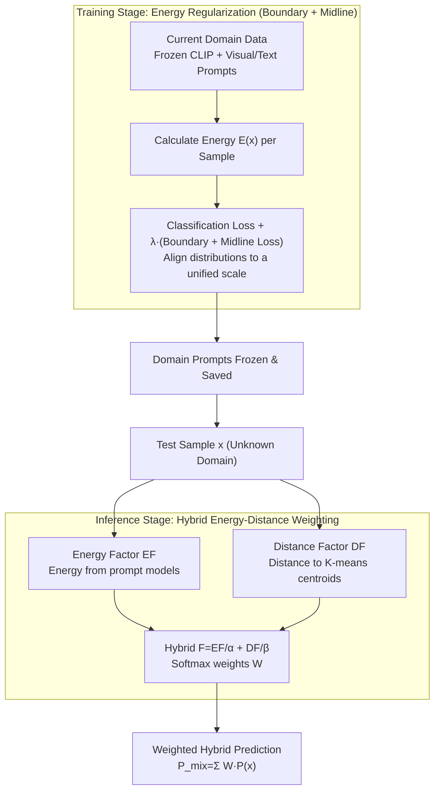

# HEDP: A Hybrid Energy-Distance Prompt-based Framework for Domain Incremental Learning

**Conference**: ICML 2026  
**arXiv**: [2605.05776](https://arxiv.org/abs/2605.05776)  
**Code**: Available (repository link attached at the end of paper)  
**Area**: Continual Learning / Domain Incremental / Prompt Learning  
**Keywords**: Domain Incremental Learning, Prompt Learning, Energy-Based Models, Helmholtz Free Energy, CLIP

## TL;DR
Drawing physical intuition from Helmholtz free energy, this work trains prompt parameters for each domain to follow an energy curve that is "compressed to boundary $\Theta$ and aligned to midline $\Delta$." During inference, a hybrid weight composed of energy and distance factors is used to combine domain-specific prompts, achieving improvements of 1.76 / 3.12 / 2.57 percentage points on unseen domains across CDDB / DomainNet / CORe50 DIL benchmarks, respectively.

## Background & Motivation

**Background**: Domain Incremental Learning (DIL) requires a model to be trained sequentially on multiple domains (e.g., autonomous driving detection under different weather conditions). During training, old domain data cannot be replayed. During inference, the model must maintain accuracy on known domains while generalizing to unknown domains. A mainstream approach is to freeze a pre-trained large-scale model (e.g., CLIP) and learn a set of prompt parameters for each domain. Representative methods include CP-Prompt, S-Prompts, MoP-CLIP, and ESN.

**Limitations of Prior Work**: (1) There is a persistent trade-off between known and unknown domains—CP-Prompt performs well on known domains but poorly on unknown ones, while MoP-CLIP shows the opposite; (2) "How to select which domain prompt" during inference is the core issue; existing methods use either distance (prone to misjudgment in overlapping regions) or clustering (fuzzy boundaries at coarse granularity); (3) Single-domain prompts easily overfit to their own distributions, increasing overlap in the shared space. t-SNE visualizations show that Domain B samples in the CLIP space may actually be closer to the cluster points of Domain A.

**Key Challenge**: Domains are both similar and distinct within the shared feature space. A single signal (distance or energy) only captures one aspect—distance reflects the global semantic structure (learned by CLIP), while energy reflects local distribution sensitivity (tuned by prompts). Their failure modes differ, but neither is stable in isolation.

**Goal**: (1) Align the energy distributions of each domain prompt during training so that energy truly reflects whether a sample belongs to that domain; (2) Design a hybrid signal of energy and distance during inference to combine their advantages and cancel out their respective weaknesses.

**Key Insight**: An analogy is drawn between the statistical distribution of data in the feature space and physical energy fields. Helmholtz free energy $E(x) = -kT \ln[\sum_y e^{H(x)[y]/kT}]$ is used to calculate a scalar energy for each sample relative to each prompt. Ideally, a prompt for a specific domain should assign low energy to samples from its own domain and high energy to others.

**Core Idea**: An energy regularization term combining "boundary loss + midline loss" is used to constrain the energy distribution of each domain prompt to a unified scale. During inference, normalized energy and distance factors are summed and passed through a softmax to obtain hybrid weights, which are used to perform a weighted sum of predictions from each domain prompt.

## Method

### Overall Architecture
HEDP freezes the CLIP ViT-B/16 backbone and learns separate prompts for each domain. The complexity is shifted to "which domain prompt to use at inference." During training, a set of visual prompts $P_v^S$ and textual prompts $P_t^S$ is learned independently for each domain. The loss consists of cross-entropy $\mathcal{L}_{ce}$ plus an energy regularization $\lambda\mathcal{L}_{reg}$ ($\lambda=0.05$). The key is constraining each domain's energy distribution to a unified scale. During inference, two signals are calculated for each test sample: the distance $D^i(x)$ to domain centroids in the frozen CLIP space, and the energy $E^i(x)$ under each prompt model. These are normalized into relative factors and summed $F^i(x)=EF^i/\alpha+DF^i/\beta$. Softmax weights $W^i$ are derived to produce the final hybrid prediction $P_{mix}(x)=\sum_i W^i P^i(x)$. Contributions lie in two stages: energy regularization during training and energy-distance hybrid weighting during inference.

### Key Designs

**1. Energy Regularization Loss (Boundary + Midline): Aligning Energy Distributions**

The energy signal itself is usable—domain prompts assign low energy to in-domain samples and high energy to out-domain samples—but only if energies are comparable across domains. If Domain A's prompt compresses samples to $-50$ and Domain B's to $-20$, inference based on energy magnitudes fails. Ours uses Helmholtz free energy to calculate a scalar $E(x) = -kT\ln[\sum_{y=1}^U e^{H(x)[y]/kT}]$ and applies two complementary constraints: the boundary loss $\mathcal{L}_{border}=\frac{1}{|\mathcal{D}_t|}\sum\max(0, E(x)-\Theta)$ penalizes energy exceeding a threshold $\Theta=-32$, pushing in-domain samples to the low-energy side; the midline loss $\mathcal{L}_{midline}=|\Delta-\frac{1}{|\mathcal{D}_t|}\sum E(x)|$ pulls the mean to $\Delta=-40$. Specifically, the boundary loss controls the "maximum upper limit" while the midline loss controls the "central position." Only together can they ensure $E^s(x^s) < E^i(x^s)\ (\forall i\neq s)$, making energy a cross-domain comparable metric.

This regularization provides an additional benefit (Appendix Proposition 2): traditional energy training often creates "energy cliffs" where OOD samples near the boundary are mistakenly assigned low energy. Constraining the energy output to $(-\infty, \Theta]$ and the mean to $\Delta$ implicitly lowers the local Lipschitz constant $K$ of the energy function on the data manifold. For an OOD sample $x_{out}=x_{in}+\Delta_x$, the energy shift satisfies $|E(x_{out})-E(x_{in})|\le K\|\Delta_x\|$. A smaller $K$ prevents unknown samples from suddenly falling into low-energy zones of known domains, mitigating catastrophic forgetting.

**2. Fusion of Energy and Distance Factors: Complementing Orthogonal Error Modes**

Energy alone is insufficient in domain overlap regions where local sensitivity might lead to misjudgment. Ours designs a hybrid similarity factor to determine weights. The energy factor $EF^i(x)=E_{\min}-E^i(x)$ maps values to $(-\infty, 0]$, where higher values indicate lower energy and higher similarity. The distance factor $DF^i(x)=D_{\min}-D^i(x)$ uses $K$-means to find $K$ centroids per domain in the frozen CLIP space and measures the cosine distance to the nearest centroid. The hybrid factor is $F^i(x)=EF^i(x)/\alpha+DF^i(x)/\beta$, leading to $W^i=\text{softmax}(F^i)$. The synergy stems from the first-order Taylor argument (Appendix): $\nabla_x EF$ follows the prompt parameter direction (capturing statistical variance), while $\nabla_x DF$ follows the frozen CLIP semantic direction (capturing global structure). These gradients are approximately orthogonal, meaning their error patterns are uncorrelated, allowing errors to cancel out.

### Loss & Training
Total loss: $\mathcal{L}_{total}=\mathcal{L}_{ce}+\lambda\mathcal{L}_{reg}$, where $\mathcal{L}_{reg}=\mathcal{L}_{border}+\mathcal{L}_{midline}$. Hyperparameters: $\Theta=-32,\ \Delta=-40,\ K=5,\ \alpha=\beta=0.6,\ \lambda=0.05$. Optimization uses SGD with cosine annealing and an initial lr of 0.01.

## Key Experimental Results

### Main Results

| Dataset | Scenario | Prev. SOTA | HEDP | Gain |
|--------|------|---------|------|------|
| CDDB-Hard | Known AA / AF | CP-Prompt 93.65 / -0.25 | **93.72 / -0.08** | +0.07 / +0.17 |
| CDDB-Hard | Unknown AA | MoP-CLIP 81.98 | **83.74** | +1.76 |
| DomainNet | Known AA (All) | CP-Prompt 73.15 | **74.19** | +1.04 |
| DomainNet | Unknown AA | MoP-CLIP 63.97 | **67.09** | +3.12 |
| CORe50 | Unknown AA | ESN 91.80 | **94.37** | +2.57 |

HEDP achieves the best performance on both known and unknown domains simultaneously, eliminating the typical trade-off.

### Ablation Study

| Scheme | Energy Border | Energy Midline | Energy Factor | Distance Factor | CDDB Unk. | DomainNet Unk. | CORe50 Unk. |
|------|----------|----------|----------|----------|-----------|----------------|-------------|
| 1 (Distance Only) | ✗ | ✗ | ✗ | ✓ | 75.80 | 64.97 | 93.17 |
| 2 (Unreg. Energy) | ✗ | ✗ | ✓ | ✗ | 77.31 | 63.55 | 92.06 |
| 3 (+Border) | ✓ | ✗ | ✓ | ✗ | 79.22 | 65.05 | 92.98 |
| 4 (+Midline) | ✗ | ✓ | ✓ | ✗ | 79.12 | 65.01 | 93.77 |
| 5 (Full Energy) | ✓ | ✓ | ✓ | ✗ | 81.52 | 65.59 | 94.07 |
| 6 (Full HEDP) | ✓ | ✓ | ✓ | ✓ | **83.74** | **67.09** | **94.66** |

### Key Findings
- **Necessity of Border + Midline**: Using either alone is 2-3 points worse than the full regularization, proving they capture different distribution characteristics (maximum constraint vs. central trend alignment).
- **Energy and Distance are Complementary**: Adding the distance factor to pure energy (Scheme 5 to 6) improves CDDB unknown by 2.22 points; adding the energy factor to pure distance (Scheme 1 to 6) improves it by 7.94 points.
- **Hyperparameter Sensitivity**: Heatmaps for $\alpha, \beta$ show known domains favor "distance dominance" while unknown domains prefer a balance, confirming differing mechanisms.
- Changing the number of clusters $K$ has minimal impact, suggesting the distance factor serves as a "global topological stabilizer."

## Highlights & Insights
- **Physical Intuition to ML Design**: Naturally utilizes Helmholtz free energy; "energy boundary + midline" corresponds to potential well depth and zero-point energy, providing strong interpretability.
- **Gradient Orthogonality Proof**: Uses Taylor expansion to justify the complementarity of energy and distance signals, offering theoretical depth beyond empirical observation.
- **Topographical Smoothing**: The discovery that energy distribution constraints implicitly lower the Lipschitz constant to improve OOD robustness is a transferable trick for OOD detection tasks.
- For prompt-based continual learning, "how to select the prompt" is more critical than "how to train the prompt," and this work pushes that perspective to its limit.

## Limitations & Future Work
- Inference latency scales linearly with the number of domains, as each sample must pass through all prompt models to calculate energy. The authors suggest dynamic prompt selection as a future direction.
- $\Theta, \Delta$ are manually tuned; while larger $\Delta$ intervals generally help before saturation, a self-adaptive mechanism is lacking.
- Experiments are focused on visual classification; applicability to NLP or VLM reasoning tasks remains to be verified.

## Related Work & Insights
- **vs CP-Prompt**: CP-Prompt is strong in known domains but weak in unknown ones; HEDP uses energy factors to fill the gap in unknown generalization.
- **vs MoP-CLIP**: MoP-CLIP uses coarse clustering for mixing; HEDP combines clustering (distance) with internal prompt energy for finer resolution.
- **vs ESN**: ESN introduces temperature-adjustable energy measures but relies solely on energy; HEDP adds the "energy regularization" to explicitly constrain distribution shapes.
- **vs ELI**: ELI uses energy for incremental learning, but its task-wise manifold is less suited for DIL prompt-based scenarios. HEDP is more lightweight by attaching energy directly to prompt outputs.

## Rating
- Novelty: ⭐⭐⭐⭐ The energy regularization and distance-energy hybrid combination is novel, aided by a natural physical analogy.
- Experimental Thoroughness: ⭐⭐⭐⭐ Three datasets, full ablations, hyperparameter grids, and energy visualization.
- Writing Quality: ⭐⭐⭐⭐ Clear narrative with theoretical depth provided by gradient orthogonality and Lipschitz arguments.
- Value: ⭐⭐⭐⭐ Practically useful for resolving the known/unknown trade-off in prompt-based DIL.

<!-- RELATED:START -->

## Related Papers

- [\[ICML 2026\] Towards Fine-Grained Robustness: Attention-Guided Test-Time Prompt Tuning for Vision-Language Models](towards_fine-grained_robustness_attention-guided_test-time_prompt_tuning_for_vis.md)
- [\[CVPR 2026\] FedDAP: Domain-Aware Prototype Learning for Federated Learning under Domain Shift](../../CVPR2026/ai_safety/feddap_domain-aware_prototype_learning_for_federated_learning_under_domain_shift.md)
- [\[ECCV 2024\] One-stage Prompt-based Continual Learning](../../ECCV2024/ai_safety/one-stage_prompt-based_continual_learning.md)
- [\[ECCV 2024\] Noise-Assisted Prompt Learning for Image Forgery Detection and Localization](../../ECCV2024/ai_safety/noise-assisted_prompt_learning_for_image_forgery_detection_and_localization.md)
- [\[CVPR 2026\] A Provable Energy-Guided Test-Time Defense Boosting Adversarial Robustness of Large Vision-Language Models](../../CVPR2026/ai_safety/a_provable_energy-guided_test-time_defense_boosting_adversarial_robustness_of_la.md)

<!-- RELATED:END -->
