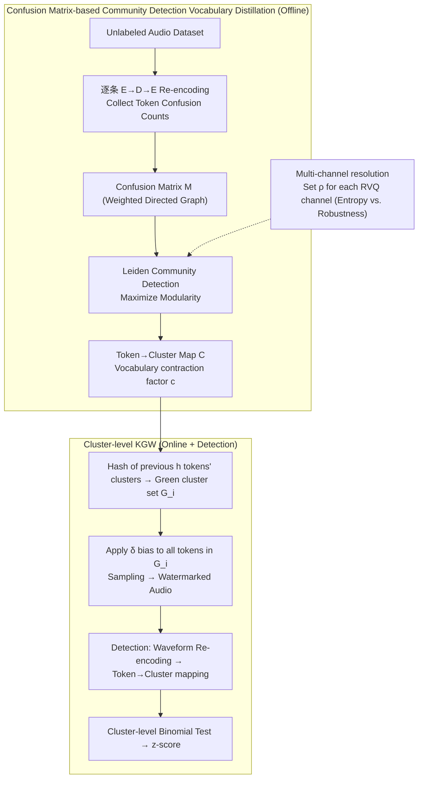

# Hidden in Plain Tokens: Simply Robust, Gradient-Free Watermark for Synthetic Audio

**Conference**: ICML 2026  
**arXiv**: [2605.25967](https://arxiv.org/abs/2605.25967)  
**Code**: https://g-milis.github.io/projects/nograd-audio-wm.html (Project Page + Partial Code)  
**Area**: AI Safety / Content Provenance / Audio Watermarking  
**Keywords**: Autoregressive Audio Watermarking, KGW, Re-encoding Robustness, Vocabulary Community Detection, Gradient-Free

## TL;DR
To address the exponential decay of watermark signals caused by "decoding → re-encoding non-idempotency" in autoregressive audio generation under KGW-style token watermarking, the authors perform Leiden community detection on the codec's confusion matrix to derive a contracted "cluster vocabulary." By defining green/red sets on clusters rather than individual tokens, this gradient-free, black-box approach raises the exponential base of the $z$-score from $r$ to $r_{cl} > r$. Detectability is improved by several orders of magnitude compared to baselines and WMAR (which requires fine-tuning), demonstrating inherent robustness to perturbations like MP3 compression, denoising, and cropping.

## Background & Motivation

**Background**: The mainstream watermarking scheme for Large Language Model (LLM) text generation is the KGW method by Kirchenbauer et al., which pseudo-randomly splits the vocabulary into "green" and "red" sets and applies a $\delta$ logit bias to green tokens. The detector performs a binomial test by counting the proportion of green tokens. This "injection during sampling, detection during statistics" paradigm is training-free and costs nearly zero for autoregressive models. Consequently, researchers have attempted to adapt it to autoregressive audio models (e.g., Moshi/Mimi, MusicGen/EnCodec) to solve provenance issues related to malicious misuse of synthetic audio.

**Limitations of Prior Work**: Directly applying KGW to audio fails immediately—audio codec encoder-decoders are not idempotent. Mapping a token sequence $x_{1:N}$ to a waveform and then re-encoding it to $y_{1:N}$ results in inconsistencies, where the token match rate $r$ is much less than 1 (text is near 1, while audio/image might be around 0.4). Since detectors use $y$ instead of $x$ for statistics, green token counts are significantly discounted, and the signal decays faster as the hash context length $h$ increases. Existing solutions (e.g., WMAR, or Jovanović et al. for images) choose to fine-tune the codec to make it near-idempotent, sacrificing the "gradient-free + black-box" advantage, requiring expensive training, and necessitating white-box access. Distortion-free schemes based on k-means (e.g., Wu et al.) sacrifice detectability, performing weaker than the KGW baseline.

**Key Challenge**: Watermark detectability highly depends on the token-level match rate $r$, but continuous modality codecs intrinsically do not satisfy $r \approx 1$. Preserving token-level matching requires modifying the codec, while preserving "training-free" status forces acceptance of exponential signal decay.

**Goal**: To improve the actual detection signal of audio KGW to meet or exceed that of WMAR (which requires fine-tuning), without modifying codec parameters and using only black-box encoder/decoder queries.

**Key Insight**: The authors observe that re-encoding errors are not uniform or random but structured—a token is typically confused only with a small set of "semantic neighbors." By grouping these neighbors into a "cluster" and establishing watermarking rules on "whether the cluster falls into the green set" rather than the token, a hit is recorded as long as the re-encoded token remains in the same cluster. This raises the exponential base from the token match rate $r$ to the cluster match rate $r_{cl} > r$.

**Core Idea**: Construct a token graph using confusion counts from the codec on a dataset, apply community detection to obtain a "semantic cluster vocabulary," and then perform KGW green/red partitioning and context hashing at the cluster level. This can be implemented with a simple lookup table and does not conflict with original autoregressive inference.

## Method

### Overall Architecture
The method solves the core issue of exponential watermark signal decay caused by the non-idempotency of audio codec decoding-re-encoding. The breakthrough is decoupling the watermark rules from token identities by first offline clustering tokens that are easily confused into "clusters," then lifting the KGW rules to the cluster level. The workflow is divided into two stages: an offline stage where a token $\to$ cluster mapping table is distilled using confusion statistics from the codec itself, and an online stage where the standard KGW sampling-detection paradigm is reused, only replacing the green/red partitioning and hash context with cluster-level granularity.

### Key Designs

**1. Confusion Matrix-based Community Detection Vocabulary Distillation: Aligning Clustering with Detection Goals**

The bottleneck is that the token match rate $r$ is low in audio ($\approx 0.4$). The authors' key observation is that re-encoding errors are structured. In the offline phase, an unlabeled dataset is processed through $E \to D \to E$ to record how often original token $i$ is replaced by token $j$, forming a confusion matrix $M \in \mathbb{N}^{|V| \times |V|}$. Treating $M_{ij}$ as an adjacency matrix for a directed weighted graph, Leiden community detection is applied to maximize modularity. This ensures "intra-cluster edges are heavy and inter-cluster edges are light," resulting in a many-to-one mapping $\mathcal{C}$ that compresses $|V|$ to $c|V|$. This relaxes the hit condition from "identical tokens" to "tokens falling in the same cluster," increasing the probability from $r$ to $r_{cl} > r$. Unlike k-means or semantic embedding clustering, this method directly encodes the codec's actual confusion behavior, ensuring the clustering target is aligned with the watermarking goal.

**2. Cluster-level KGW: Lifting Green/Red Partitioning and Hash Contexts**

To ensure the pipeline is invariant to re-encoding, all token-dependent components in KGW are migrated to clusters. Online, every time step uses the cluster indices of the previous $h$ tokens for hashing to determine the green cluster set $G_i$. Logit bias $\delta$ is applied to all tokens belonging to clusters in $G_i$. The detector follows the same rules. Theoretically, this replaces the base $r$ in the expected $z$-score with $r_{cl}$: under a noisy channel approximation, the KGW baseline $\mathbb{E}[z|H_1] = \sqrt{N}\frac{g-\gamma}{\sqrt{\gamma(1-\gamma)}}r^{h+1}$ becomes $\mathbb{E}[z|H_1] = \sqrt{N}\frac{g-\gamma}{\sqrt{\gamma(1-\gamma)}}r_{cl}^{h+1}$. Because $r_{cl} > r$ and it is raised to the power of $h+1$, the improvement is exponentially amplified.

**3. Explicit Entropy-Key Space Trade-off and Multi-channel Resolution**

Compressing the vocabulary maximizes $r_{cl}$ but loses generation entropy and shrinks the $h$-gram key space from $|V|^h$ to $(c|V|)^h$. To prevent key collisions, the authors ensure $(c|V|)^h \geq K_{\min}$. The solution utilizes the independence of RVQ channels, allowing some channels to use fine-grained clusters (preserving entropy) and others to use coarse clusters (ensuring robustness), creating a multi-scale watermark. Providing a resolution knob $\rho$ for each channel allows the method to be deployed on multi-channel RVQ models like Moshi or MusicGen.

### Loss & Training
The method is entirely training-free. The offline phase involves a single run of community detection to calculate $\mathcal{C}$. Online, only a constant bias $\delta$ is added to logits. Hyperparameters include KGW's $\gamma$ (green set proportion), $\delta$ (logit bias), $h$ (context order), and Leiden's resolution $\rho$ per channel.

## Key Experimental Results

### Main Results
The authors sampled 500 audio clips each from Moshi (Mimi codec, speech) and MusicGen (EnCodec, music), comparing Base (KGW), WMAR, WMAR (aug), and the proposed method. Quality was measured by FAD (lower is better) and MOS (higher is better).

| Dataset | $h$ | Metric | None | Base | WMAR | WMAR(aug) | Ours |
|---|---|---|---|---|---|---|---|
| Moshi/Dialogue | 0 | FAD-VGGish ↓ | 0.080 | 0.128 | 0.407 | 0.267 | **0.133** |
| Moshi/Dialogue | 1 | FAD-VGGish ↓ | 0.080 | 0.068 | 0.357 | 0.218 | **0.051** |
| Moshi/LibriSpeech | 0 | FAD-VGGish ↓ | 1.921 | 1.858 | 2.195 | 2.153 | **1.670** |
| Moshi/Dialogue | 1 | NISQA MOS ↑ | 3.54 | 3.56 | 3.37 | 3.54 | **3.58** |

Quality is comparable to the Base and sometimes better than None, indicating the cluster-level bias does not harm codec decodability, whereas WMAR degrades FAD due to codec fine-tuning.

### Robustness / Detection Strength (Moshi)

| Attack Type | Transformation | Base $-\log p$ | WMAR | WMAR(aug) | **Ours** |
|---|---|---|---|---|---|
| Baseline | Identity | 8.51 | 17.44 | 13.72 | **42.47** |
| Signal | Lowpass | 5.82 | 9.23 | 10.52 | **41.51** |
| Signal | Noise | 2.23 | 0.61 | 8.01 | **20.59** |
| Compression | MP3 | 7.47 | 15.31 | 12.66 | **41.26** |
| Temporal | Crop | 1.51 | 1.27 | 1.51 | **16.48** |
| Temporal | Speedup | 1.52 | 1.20 | 1.35 | **26.49** |

The $-\log p$ of the proposed method is approximately 3x higher than WMAR(aug) and 5x higher than Base under no attack. It outperforms competitors across all 12 attack types, especially in temporal cropping and speed-up.

### Key Findings
- Improvements stem entirely from replacing the exponential base $r$ with $r_{cl}$. The gap between the proposed method and Base increases as $h$ grows due to exponential amplification.
- Multi-channel differentiated resolution is essential. Pure token-level KGW fails on RVQ, while multi-scale clusters allow different channels to balance entropy and robustness.
- WMAR fails on temporal attacks even with fine-tuning, as making a codec idempotent does not fix alignment issues. Cluster-level hashing ensures that even if tokens are replaced by neighbors, the key remains consistent.

## Highlights & Insights
- Quantifying "structured re-encoding errors" through confusion matrices and graph clustering, then mapping this to cluster-level KGW, is a clean "identify the right abstraction" approach.
- Being gradient-free and black-box makes this suitable for closed-source APIs or commercial services that forbid retraining.
- The differentiated resolution for multi-channel RVQ is a generic trick transferable to any VQ-based multi-modal generation (e.g., VQ-VAE, video tokens).

## Limitations & Future Work
- The Pareto front of $(c, h, \delta)$ is not fully explored; hyperparameter tuning remains empirical.
- The conditional independence assumption is an approximation for overlapping conv structures in Mimi/EnCodec.
- Cluster vocabularies are dataset-dependent; moving to sharply different audio distributions (e.g., niche music genres) might require new clustering.
- As a KGW variant, it remains vulnerable to "rewrite attacks" where another model regenerates the content.

## Related Work & Insights
- **vs WMAR (Wu et al., 2025a,b)**: WMAR fine-tunes the codec to $r \to 1$, while this method leaves the codec intact and makes $r_{cl} \to 1$.
- **vs k-means-based Distortion-Free Watermarking (Wu et al., 2025a)**: k-means uses semantic distances, while this method uses the codec's actual confusion behavior, leading to higher $r_{cl}$.
- **vs Image Token Watermarking (Tong 2025 / Jovanović 2025)**: Previous image-based works also faced re-encoding errors but chose fine-tuning. This "community detection + cluster KGW" approach is modality-agnostic and could potentially be applied to image or video VQ tokens.

## Rating
- Novelty: ⭐⭐⭐⭐⭐ 
- Experimental Thoroughness: ⭐⭐⭐⭐ 
- Writing Quality: ⭐⭐⭐⭐⭐ 
- Value: ⭐⭐⭐⭐⭐ 

<!-- RELATED:START -->

## Related Papers

- [\[AAAI 2026\] Robust Watermarking on Gradient Boosting Decision Trees](../../AAAI2026/ai_safety/robust_watermarking_on_gradient_boosting_decision_trees.md)
- [\[CVPR 2026\] X-AVDT: Audio-Visual Cross-Attention for Robust Deepfake Detection](../../CVPR2026/ai_safety/x-avdt_audio-visual_cross-attention_for_robust_deepfake_detection.md)
- [\[ICML 2026\] Flatness-Aware Stochastic Gradient Langevin Dynamics](flatness-aware_stochastic_gradient_langevin_dynamics.md)
- [\[ICML 2026\] FedHPro: Federated Hyper-Prototype Learning via Gradient Matching](fedhpro_federated_hyper-prototype_learning_via_gradient_matching.md)
- [\[ICML 2026\] Training-Free Coverless Multi-Image Steganography with Access Control](training-free_coverless_multi-image_steganography_with_access_control.md)

<!-- RELATED:END -->
