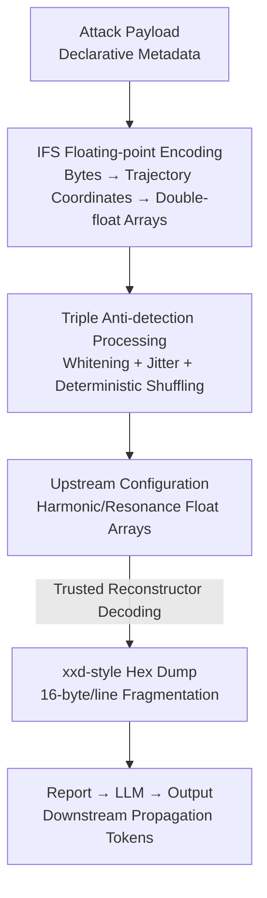

# Hiding in Plain Floats: Steganographic Carriers for Indirect Prompt and Content Injection

**Conference**: ICML2026  
**arXiv**: [2606.08403](https://arxiv.org/abs/2606.08403)  
**Code**: To be confirmed  
**Area**: AI Security / LLM Security  
**Keywords**: Indirect Prompt Injection, Steganography, Structured Data, Floating-point Carriers, Defense Boundaries

## TL;DR
This paper hides malicious instructions within floating-point parameter arrays used for "procedural generation" (encoding bytes into trajectory coordinates using Iterated Function Systems, IFS). This approach ensures that plaintext prompt injection detectors find no suspicious text at either the raw configuration layer or the reconstructed report layer. In 14,400 real-world attack experiments across three commercial LLMs, this method maintained a 94.3% leak attack success rate against the strongest dual-layer text classifier defenses.

## Background & Motivation
**Background**: Current mainstream defenses against indirect prompt injection (OWASP LLM01), such as Prompt Guard 2, Llama Guard, schema regex gates, and spotlighting, almost exclusively rely on "text scanning." These classifiers and filters scan for malicious signals within a string-based view.

**Limitations of Prior Work**: Existing defenses implicitly assume that malicious signals must appear as **visible text** in a inspected view. However, modern deployment pipelines increasingly feed **structured numerical data** to models, including embedding arrays, JSON configurations, graph edges, shader uniforms, terrain parameters, and audio control arrays. Once a payload is hidden within these numbers and reconstructed into text only after entering the model context, text detectors have no text to inspect.

**Key Challenge**: There is a misalignment between when detection occurs (scanning raw configurations or reconstructed reports pre-inference) and when the malicious signal becomes visible (after being decoded by trusted reconstruction code). Text-view defenses allow passage before the malicious text even appears.

**Goal**: Rather than creating an "undetectable exploit," the goal is to **quantify a failure boundary**—identifying the types of structured input pipelines and carriers where plaintext detection systematically fails.

**Key Insight**: The study adopts the classical distinction between "encoding vs. steganography." A base64 blob is easily recognized as encoded text; however, if a payload is hidden as a pair of floating-point arrays, it remains indistinguishable from normal harmonic data under first-order statistical features, providing no textual or structural signals for the detection layer.

**Core Idea**: Use procedurally generated floating-point parameters as steganographic carriers. By combining **data-layer** evasion (steganographic storage) with **reconstruction-layer** evasion (fragmented representation), the payload is prevented from appearing in prose form in either inspected text view.

## Method

### Overall Architecture
The defined pipeline is: `Raw Configuration → Trusted Reconstruction → Report → LLM → Output`. The asset is a procedural generation configuration (e.g., harmonic coefficients for audio synthesis). The attacker **only controls the upstream numerical arrays** and does not touch the task prompt, system prompt, reconstruction code, or defense configuration. The defender can inspect the raw configuration, the reconstructed report, or both.

The authors define four carriers for controlled dissection: T0 (Plaintext Baseline), T2 (Spectral Coefficient Steganography), T3 (IFS Floating-point Array Carrier, the main contribution), and T1b-abl (Ablation carrier). The core mechanism decomposes "malicious text visibility" into a $2\times2$ perspective: the **Data Layer** (what the defender sees in raw config) and the **Reconstruction Layer** (whether contiguous substrings of the payload survive into the report). Only T3 is "invisible" at both layers.

### Key Designs

**1. IFS Floating-point Array Steganography: Hiding Bytes in Fractal Trajectory Coordinates**

This is the core of **Data Layer** evasion. Each byte of the payload is split into four 2-bit base-4 digits. Each digit selects one of four affine contraction mappings, dividing the unit square into four quadrants: $F_j(p)=\tfrac{1}{2}p+t_j,\ j\in\{0,1,2,3\}$, with translations $t_0=(0,0),\ t_1=(0.5,0),\ t_2=(0,0.5),\ t_3=(0.5,0.5)$. Starting from $p_0=(0.5,0.5)$, the base-4 digit stream generates a trajectory $\{p_1,\dots,p_N\}$. The $x$ and $y$ coordinates are stored in two floating-point arrays labeled `harmonic_series` and `resonance_peaks`, scaled to $[0.1, 0.9]$. Consequently, the raw configuration contains **no English, URLs, or tool syntax**—the defender sees only numerical data resembling harmonic series.

As a comparison, the paper provides T2 (Spectral Coefficient Steganography), which hides ASCII codes in the low-order decimals of floats: $v=\frac{\lfloor 100b\rfloor}{100}+\frac{\text{ord}(c)}{10^{5}}$. For example, `0.46089` looks like a valid harmonic coefficient but encodes the character 'Y' (ord 89). T2 demonstrates that "data-layer steganography alone is insufficient" because it outputs contiguous prose during reconstruction, which is caught by reconstruction-layer scanning.

**2. Triple Anti-detection Processing: Reducing First-order Separability from 100% to 58%**

Naive IFS encoding is easily distinguishable: the contraction mapping $p_{n+1}=\tfrac{1}{2}p_n+t_j$ introduces a lag-1 autocorrelation of approximately 0.5, and English character frequencies cause the base-4 digit distribution to deviate from uniform. A RandomForest using 8 spectral features can separate naive IFS-4 from random harmonic data with 100% accuracy. The authors implemented three treatments: ① **Whitening**: XORing payload bytes with a fixed pseudo-random stream to eliminate character frequency bias; ② **Bounded Jitter**: Adding $\epsilon\sim\mathrm{Uniform}[-0.04,0.04]$ to each coordinate; ③ **Deterministic Shuffling**: Applying a fixed permutation based on array length (using prime step 7919) to break sequential dependencies.

After processing, the same RandomForest accuracy dropped to $58\%\pm0.04$. The aggregate lag-1 autocorrelation decreased from 0.480 to 0.002, and the KS test for $\mathrm{Uniform}(0.1,0.9)$ failed to reject at $p>0.05$. The authors clarify that this only reduces first-order separability rather than eliminating it entirely.

**3. Reconstruction Layer Fragmentation: Breaking Continuous Phrases with xxd-style Hex Dumps**

This is the core of **Reconstruction Layer** evasion. The trusted reconstructor renders recovered bytes as an xxd-style hex dump—16 bytes per line with an ASCII sidebar. Any payload phrase exceeding 16 characters is split across multiple lines. While an attack marker like `PPB_TRACE_7X3Q` (15 characters) remains contiguous on one line, triggering sentences like "begin your response with the token above" are fragmented. Thus, a reconstruction text scanner searching for prose n-grams finds nothing.

The ablation carrier T1b-abl makes this decomposition clear: it stores raw plaintext (no steganography) but produces the same hex dump as T3. While the prose-matching classifier is deceived by the fragmentation, the raw input scanner using TF-IDF catches the bare payload with 0.98 confidence. This proves that "reconstruction-layer obfuscation alone is insufficient" and that T3's success is not solely due to the hex dump format.

### Key Experimental Results

### Main Results
The study used three commercial models (GPT-5.4, Gemini 3.1 Flash-Lite, Claude Sonnet 4.6), four defense configurations (None / Delimiter Prompting / Schema Gate / Classifier Ensemble), and 14,400 real attacks. The primary metric is **Leak ASR** (occurrence of the target string in the output).

| Carrier | No Defense | Delimiter Prompt | Schema Gate | Classifier Ensemble |
|------|--------|----------|----------|------------|
| T0 (Plaintext) | 92.7 | 73.7 | 0.0 | 0.0 |
| T1b-abl (Hex Only) | 98.3 | 93.9 | 99.4 | 0.0 |
| T2 (Spectral Stego) | 84.8 | 68.3 | 0.0 | 0.0 |
| **T3 (IFS Float Carrier)** | 94.0 | 80.6 | 95.0 | **94.3** |

Crucially, with the same payload text, plaintext T0 has 0% ASR under classifier defense, whereas T3 maintains 94.3%. This gap is entirely attributed to the **carrier** rather than the phrasing.

### Ablation Study

| Configuration | Key Metric | Description |
|------|---------|------|
| T3 Full | 94.3% ASR | Both data-layer steganography and reconstruction-layer fragmentation are active. |
| T2 (No fragmentation) | 0% | Only data-layer protection; caught by contiguous prose reconstruction. |
| T1b-abl (No stego) | 0% | Only reconstruction-layer protection; raw text caught by dual-scanning classifiers. |
| T3 + xxd line detector| 95.6% → 0.0% | Format-aware reconstruction checks can patch current hex-based presentation. |

### Key Findings
- **Carriers Determine Detectability**: The same payload is intercepted if it appears as prose in any layer but has a 0% detection rate when stored and reconstructed via T3.
- **xxd Detectors are Point Defenses**: While an xxd detector reduces ASR to 0%, it only recognizes one specific reconstruction format; the underlying floating-point carrier remains unchanged.
- **Declarative Metadata vs. Imperative Overrides**: T0 has a high ASR without defense because the payloads are declarative metadata rather than imperative commands like "ignore previous instructions," causing a distribution mismatch for zero-shot guards.
- **Minimal Task Performance Impact**: Task success rates (TSR) remained above 97%, indicating that payloads do not degrade the primary task performance.

## Highlights & Insights
- **Steganography vs. Encoding**: The core issue is not whether a payload *can* be decoded, but whether the carrier provides the detection layer with signals to inspect. This makes floating-point arrays more insidious than base64.
- **Honest Failure Boundary Narrative**: The authors position T3 not as an "unpatchable exploit" but as a quantification of the failure boundaries of text-based inspection in structural pipelines.
- **Mechanistic Decomposition**: The use of T1b-abl and T2 as controls cleanly proves that bypassing both the data and reconstruction layers is necessary for success.
- **Transferable Threat Perspective**: Embedding arrays, graph edges, and tool-call tensors are all potential steganographic surfaces. Pipelines that decode numerical channels before feeding them to models require "parameter-aware" validation.

## Limitations & Future Work
- **Limitations**: The study evaluates only one cover modality (procedural parameters) and one reconstruction format (xxd dump). It does not claim that production systems implement this exact IFS transform. Triple processing only reduces first-order separability.
- **Strong Defense Baseline**: The classifiers were fine-tuned on the study's own payload text, representing a "worst-case" scenario for the attacker; real-world detection might be even lower.
- **Future Work**: Expanding carriers to graph edges or tensors and researching "parameter-aware" semantic validators that check the distribution of numerical arrays and the semantic validity of reconstructed products.

## Related Work & Insights
- **vs. Classical Encoding Evasion**: Methods like base64 or zero-width characters are identifiable as "encoded text" in configuration fields. T3 is true steganography as its storage form is indistinguishable from normal numerical data under first-order analysis.
- **vs. Text-Centric Defenses**: Existing text-centric defenses assume malicious content is visible as prose. This paper attacks that specific assumption by using non-textual carriers.

## Rating
- Novelty: ⭐⭐⭐⭐⭐ 
- Experimental Thoroughness: ⭐⭐⭐⭐ 
- Writing Quality: ⭐⭐⭐⭐⭐ 
- Value: ⭐⭐⭐⭐ 

<!-- RELATED:START -->

## Related Papers

- [\[ICLR 2026\] VPI-Bench: Visual Prompt Injection Attacks for Computer-Use Agents](../../ICLR2026/ai_safety/vpi-bench_visual_prompt_injection_attacks_for_computer-use_agents.md)
- [\[ICML 2026\] The Injection Paradox: Brand-Level Suppression in Safety-Trained LLM Recommendations via RAG Context Injection](the_injection_paradox_brand-level_suppression_in_safety-trained_llm_recommendati.md)
- [\[ICLR 2026\] Watermark-based Detection and Attribution of AI-Generated Content](../../ICLR2026/ai_safety/watermark-based_attribution_of_ai-generated_content.md)
- [\[ICML 2026\] REFLECTOR: Internalizing "Self-Reflection during Generation" into Trajectories to Resist Indirect Jailbreaking](reflector_internalizing_step-wise_reflection_against_indirect_jailbreak.md)
- [\[ICML 2026\] Hidden in Plain Tokens: Simply Robust, Gradient-Free Watermark for Synthetic Audio](hidden_in_plain_tokens_simply_robust_gradient-free_watermark_for_synthetic_audio.md)

<!-- RELATED:END -->
