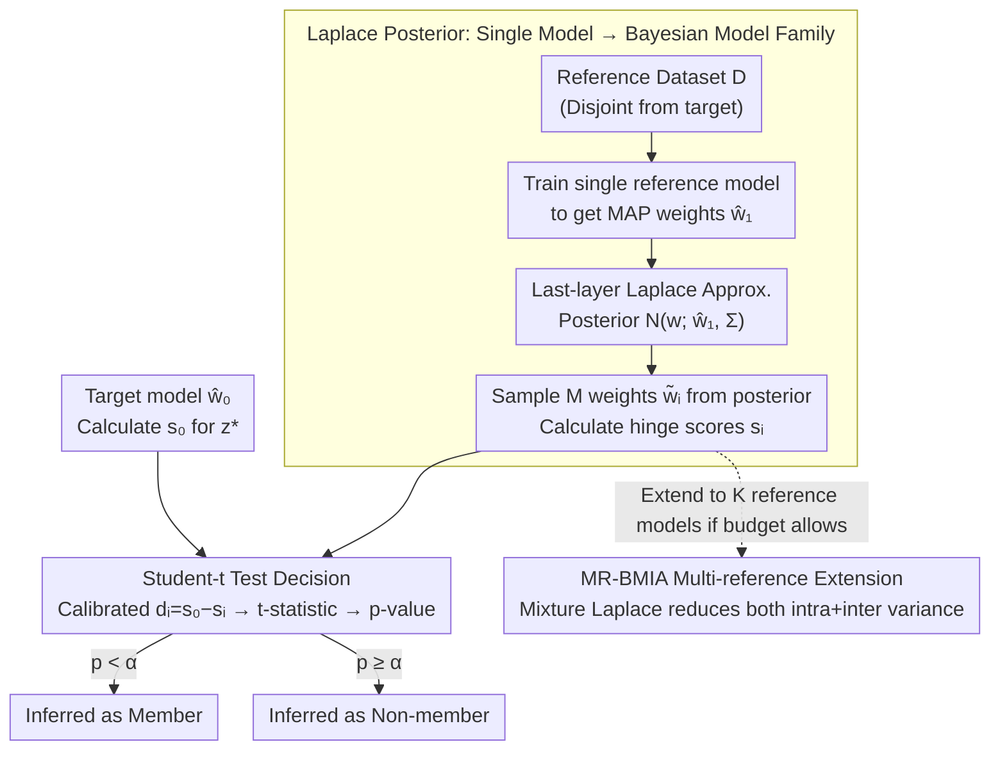

# How Does Bayesian Sampling Help Membership Inference Attacks?

**Conference**: ICML 2026  
**arXiv**: [2503.07482](https://arxiv.org/abs/2503.07482)  
**Code**: https://github.com/zhenlong-liu/BMIA (Available)  
**Area**: AI Security / Privacy Attacks  
**Keywords**: Membership Inference Attack, Bayesian Sampling, Laplace Approximation, Conditional Distribution, Variance Decomposition

## TL;DR
This paper proposes BMIA, which expands a single reference model into a "virtual model family" using a Laplace posterior. By employing Bayesian sampling to estimate the conditional score distribution of each sample under the budget of training only a single reference model, it achieves a TPR in low FPR regions on datasets like CIFAR-100 that is 54% higher than LiRA trained with 8 reference models.

## Background & Motivation
**Background**: Membership Inference Attack (MIA) is a standard probe for measuring the degree to which a model memorizes training samples. The current strongest class is the "conditional attack"—estimating a personalized threshold $\tau_\alpha(x,y)$ for each sample $z=(x,y)$ and determining if the model's score on that sample is abnormally high. LiRA by Carlini et al. and Attack-R by Ye et al. belong to this category.

**Limitations of Prior Work**: To estimate the conditional distribution, the mainstream approach is to **train dozens or even hundreds of shadow models**, each trained on a different subset. The same sample is then fed into all shadow models to sample a set of scores for Gaussian or empirical distribution fitting. On ImageNet, training each shadow model takes 580 GPU·min; running 8 models requires 78 hours, which is nearly infeasible for real-world auditing scenarios.

**Key Challenge**: The power of conditional attacks stems from "per-instance uncertainty modeling," but existing methods can only obtain this uncertainty through **external retraining**, tightly coupling computational cost with attack potency.

**Goal**: Support conditional distribution estimation using a single reference model, ensuring that TPR in low FPR regions does not drop and even increases.

**Key Insight**: The authors observe that the variance of scores across multiple shadow models can be analyzed via the **Law of Total Variance**—decomposed into "intra-model variance" $\sigma^2_{\text{intra}}$ caused by different parameters under the same dataset, and "inter-model variance" $\sigma^2_{\text{inter}}$ caused by different datasets. LiRA essentially eliminates $\sigma^2_{\text{inter}}$ through external retraining but cannot handle $\sigma^2_{\text{intra}}$. If the reference model weights are treated as random variables over a BNN posterior, direct capture of $\sigma^2_{\text{intra}}$ is possible by sampling weights from the posterior multiple times without any retraining.

**Core Idea**: Upgrade a MAP reference model into a family of Bayesian reference models using a Laplace posterior, using posterior sampling instead of shadow training to obtain the conditional score distribution.

## Method

### Overall Architecture
The BMIA attack pipeline: (1) Train a standard reference model on a reference dataset $\mathcal{D}$ disjoint from the target model's training set to obtain MAP weights $\hat w_1$; (2) Fit a Gaussian posterior $\mathcal{N}(w;\hat w_1,\Sigma)$ using Laplace approximation around $\hat w_1$; (3) For each candidate sample $z^*=(x^*,y^*)$, sample $M$ sets of weights $\tilde w_i$ from the posterior and calculate a hinge score $s_i$ for each; (4) Treat the target model score $s_0$ as the "variable under test" and perform a one-sided one-sample $t$-test against $\{s_i\}$ to output a $p$-value for membership determination. This entire process **trains the reference model only once**, with all "expansion" overhead distributed across matrix multiplications and sampling.

### Key Designs

**1. Laplace posterior transforms a single model into a Bayesian model family: Supporting the entire conditional score distribution with one MAP reference model**

The strength of conditional attacks comes from per-instance uncertainty modeling, but existing methods must rely on retraining dozens or hundreds of shadow models to obtain it, locking computation cost to attack strength. BMIA shifts this overhead to the inference phase: performing a second-order Taylor expansion at $\hat w_1$ to approximate the posterior as $p(w\mid\mathcal{D})\approx\mathcal{N}(w;\hat w_1,\Sigma)$, where $\Sigma=(-\nabla_w^2\mathcal{L}(\mathcal{D};w)|_{w=\hat w})^{-1}$. In practice, LA is applied only to the last layer, using KFAC or Diagonal approximations for the Hessian, with prior precision determined by marginal likelihood maximization. Sampling $M$ sets of $\tilde w_i$ from this posterior and computing $s_{\text{hinge}}(x,y)=f(x)_y-\max_{y'\neq y}f(x)_{y'}$ provides a set of conditional scores under the same model but different parameter samples. LiRA is equivalent to $M=1$ with a large $K$; BMIA reverses this—single $K$ with large $M$, compressing "training cost" into "forward inference cost," while Bayesian sampling happens to preserve the Gaussian assumption empirically required by hinge scores.

**2. Conditional MIA decision rule based on Student-$t$ test: Formalizing "score magnitude" as a hypothesis test**

Traditional methods use empirical quantiles or Gaussian tails to estimate thresholds, which are unstable for extreme tails like 0.1% FPR with small samples. BMIA switches to a $t$-test: defining calibrated scores $d_i=s_0-s_i$. Under the null hypothesis $H_0$ ($z^*$ is a non-member), $\mathbb{E}[d_i]=0$, which implies $\operatorname{Var}(\bar d)=(1+\frac{1}{M})\sigma^2$. Estimating $\sigma^2$ with sample variance $\hat\sigma^2$, the statistic $t=\bar d/(\hat\sigma\sqrt{1+1/M})$ follows a $t$-distribution with $M-1$ degrees of freedom. The attack decision is $p=1-F_t(t;M-1)<\alpha$. The $t$-test naturally handles "unknown sample variance + small samples," perfectly fitting the scenario of "sampling only dozens of weights," and directly equates attack power $1-\beta$ to statistical power, facilitating correlation with variance.

**3. Total variance decomposition and MR-BMIA multi-reference extension: Explaining effectiveness to guide resource allocation**

The Law of Total Variance decomposes the total score variance into $\operatorname{Var}(s)=\sigma^2_{\text{intra}}+\sigma^2_{\text{inter}}$—intra-model variance from different parameters under the same dataset, and inter-model variance from different datasets. In a setting with $K$ reference datasets and $M$ samples each, the variance of the difference between the target score and the mean is $\operatorname{Var}(s_0-\bar s)=(1+\frac{1}{K})\sigma^2_{\text{inter}}+(1+\frac{1}{KM})\sigma^2_{\text{intra}}$. LiRA is equivalent to $M=1$ and relies on increasing $K$ to reduce variance. BMIA, at $K=1$, reduces the $\sigma^2_{\text{intra}}$ through the $\frac{1}{M}$ term. Theorem 3.2 further proves $\beta(M')>\beta(M)$—larger $M$ provides a tighter rejection region and higher TPR. The multi-reference variant MR-BMIA uses a mixture-Laplace to reduce both variance terms (a two-level estimator in Algorithm 2 with Welch–Satterthwaite style DOF $v$ correction). This decomposition explicitly informs the attacker: adding shadow models reduces inter-variance, while adding posterior sampling reduces intra-variance, making it clear which knob to turn.

### Loss & Training
No special training loss is used; the attacker runs standard SGD to train reference models (ResNet-50 for CIFAR-10, DenseNet-121 for CIFAR-100, ResNet-50 for ImageNet, 4-layer MLP for tabular, BERT/DistilBERT fine-tuning for text), followed by posterior fitting. Data is split 20%/20%/40%/20% for target train / target test / reference pool / QMIA validation.

## Key Experimental Results

### Main Results
Evaluations were performed on CIFAR-10/100, ImageNet, Texas-100, Purchase-100, and 5 text datasets. Primary metrics are TPR at low FPR and training time.

| Dataset | Metric | BMIA (n=1) | LiRA (n=8) | Gain / Saving |
|--------|------|------------|------------|-------------|
| CIFAR-100 | TPR@FPR=1% | 35.75% | 23.20% | +54% TPR |
| CIFAR-100 | Training Time | 26.4 min | 211.5 min | 8× Speedup |
| CIFAR-10 | TPR@FPR=0.1% | 2.84% | 1.73% | +64% TPR |
| ImageNet | TPR@FPR=1% | 13.59% | 11.90% | Slightly better & 8× faster |
| Texas-100 | TPR@FPR=1% | 11.81% | 8.63% | +37% TPR |

| Setting | Dataset | Method | TPR@FPR=1% |
|------|--------|------|------------|
| Single Ref | CIFAR-100 | RMIA | 10.08% |
| Single Ref | CIFAR-100 | QMIA | 15.26% |
| Single Ref | CIFAR-100 | **BMIA** | **35.75%** |
| 64 Ref | CIFAR-100 | LiRA | 43.33% |
| 64 Ref | CIFAR-100 | RMIA | 36.06% |
| 64 Ref | CIFAR-100 | **MR-BMIA** | **45.57%** |

### Ablation Study
| Configuration | CIFAR-10 TPR@1% | Remarks |
|------|------------------|------|
| BMIA, $M=1$ | Close to LiRA(n=1) | Degenerates to single score comparison |
| BMIA, increasing $M$ | Monotonically increasing | Validates Theorem 3.2 |
| Hessian = Diagonal | Close to KFAC | Lightweight approximation maintains performance |
| Architecture mismatch (target=ResNet-50, ref=ResNet-18) | BMIA 8.72% vs LiRA 8.16% | Still leads across architectures |

### Key Findings
- **Variance decomposition is directly validated by experiments**: As $M$ increases, TPR rises while inference time remains nearly constant (due to sampling parallelization), indicating performance gains stem from reducing $\sigma^2_{\text{intra}}$ rather than extra computation.
- **Robust across modalities**: BMIA is SOTA or tied for SOTA across image, text, and tabular modalities + ResNet/DenseNet/BERT/MLP architectures.
- **Robust to architecture mismatch**: When using a ResNet-18 reference model to attack a ResNet-50 target, BMIA leads LiRA across all FPR intervals, suggesting Laplace posterior uncertainty is more "universal" than shadow model ensembles.
- **MR-BMIA is not redundant**: When compute allows for multiple references, MR-BMIA reduces both variance terms simultaneously, pushing TPR@1% on CIFAR-100 to 45.57%, which is 2.2 points higher than 64-shadow LiRA.

## Highlights & Insights
- **BNN posterior as a "free shadow model generator"**: Single MAP model + Laplace posterior ≈ a family of shadow models. The cleverness lies in obtaining uncertainty at the inference stage, avoiding the quadratic overhead of the training stage.
- **Theory precedes empirical evidence**: Use of variance decomposition to clarify that "shadow $K$ vs sampling $M$" target different variance components allows for a precise design of BMIA and MR-BMIA, creating a solid theoretical loop.
- **Transferable trick**: Using the $t$-test + calibrated scores $d_i=s_0-s_i$ for hypothesis testing is more stable than empirical quantiles and can be directly transferred to other score-based tasks (e.g., OOD detection, distribution shift).
- **Audit-friendly**: The budget of a single reference model + dozens of posterior samples makes running MIA on actual production-size models for privacy auditing feasible for the first time.

## Limitations & Future Work
- The current implementation only performs **last-layer** LA with KFAC/Diagonal Hessian; the cost vs. benefit of all-layer LA has not been fully analyzed. The Laplace assumption might collapse under non-convex or heavy-tailed losses.
- Gaussian score approximation is a prerequisite for the $t$-test. The authors acknowledge that under non-Gaussian scores (e.g., long-tail text tasks), additional calibration is needed (Appendix F.1); this may be brittle when scaling to LLM-size models.
- The actual benefits of BMIA under defense strategies (differential privacy, temperature scaling) have not been extensively evaluated; the perspective is strong on the attacker but weak on the defender.
- No direct comparison with gradient-based or loss-trajectory MIA; whether they can be combined remains for future work.

## Related Work & Insights
- **vs LiRA (Carlini 2022)**: LiRA trains multiple shadow models to fit score distributions with Gaussians. BMIA trains a single model and expands it with a Laplace posterior. This paper explicitly notes LiRA is equivalent to $M=1$, thus BMIA naturally outperforms it under low $K$ budgets.
- **vs RMIA (Zarifzadeh 2024)**: RMIA uses likelihood ratios of sample pairs; this paper uses intra-sample weight distributions. BMIA achieves higher TPR under a single-reference budget (CIFAR-100: 35.75% vs 10.08%).
- **vs QMIA (Bertran 2024)**: QMIA trains quantile regression to predict thresholds directly, requiring extra hyperparameter search for the quantile model. BMIA converts quantile estimation into posterior sampling, bypassing the secondary training loop.
- **vs Attack-R (Ye 2022)**: Attack-R uses empirical quantiles for thresholds, requiring more shadows for stability. BMIA uses a parametric $t$-distribution, allowing estimation from small samples.

## Rating
- Novelty: ⭐⭐⭐⭐⭐ Using Laplace posterior to replace shadow training is a first in MIA; the variance decomposition perspective is also new.
- Experimental Thoroughness: ⭐⭐⭐⭐⭐ Covers three modalities, multiple architectures, single/multi-reference settings, architecture mismatch, and Hessian factorization.
- Writing Quality: ⭐⭐⭐⭐ Clear theory and dense tables; minor issues with uncompiled experimental figure references (LABEL:), slightly affecting readability.
- Value: ⭐⭐⭐⭐⭐ Reduces high-fidelity MIA from "hundred-GPU" scale to "single-GPU" scale, making privacy auditing of real-world models possible.

<!-- RELATED:START -->

## Related Papers

- [\[ICML 2026\] Singular Bayesian Neural Networks](singular_bayesian_neural_networks.md)
- [\[ICCV 2025\] Membership Inference Attacks with False Discovery Rate Control](../../ICCV2025/ai_safety/membership_inference_attacks_with_false_discovery_rate_control.md)
- [\[ICML 2026\] How Hard Can It Be? Hardness-Aware Multi-Objective Unlearning](how_hard_can_it_be_hardness-aware_multi-objective_unlearning.md)
- [\[AAAI 2026\] Privacy Auditing of Multi-Domain Graph Pre-Trained Model under Membership Inference Attack](../../AAAI2026/ai_safety/privacy_auditing_of_multi-domain_graph_pre-trained_model_under_membership_infere.md)
- [\[AAAI 2026\] Reference Recommendation based Membership Inference Attack against Hybrid-based Recommender Systems](../../AAAI2026/ai_safety/reference_recommendation_based_membership_inference_attack_against_hybrid-based_.md)

<!-- RELATED:END -->
