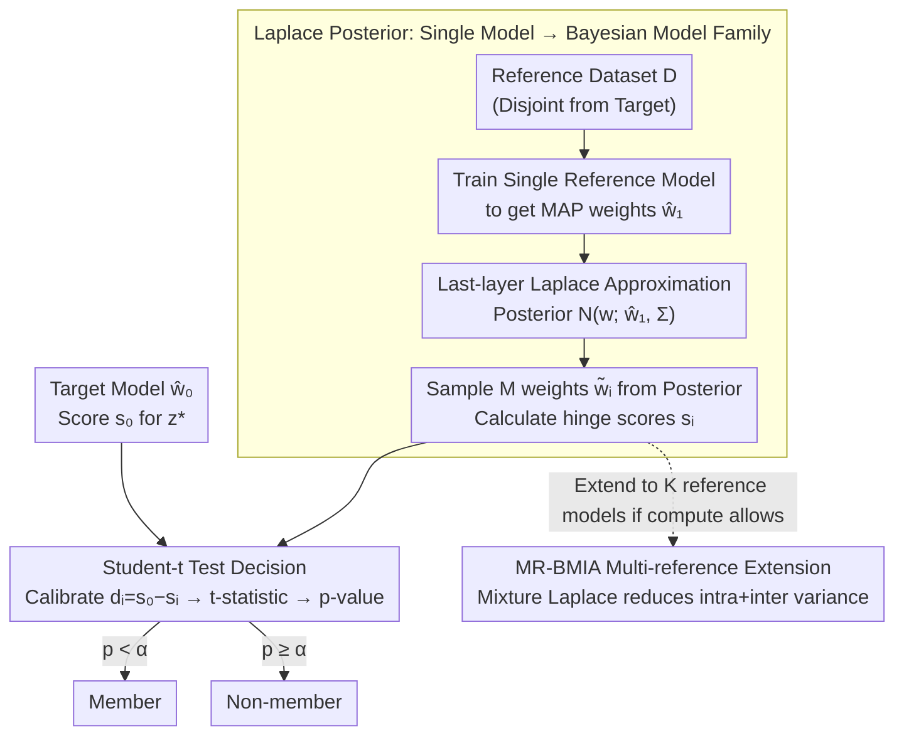

# How Does Bayesian Sampling Help Membership Inference Attacks?

**Conference**: ICML 2026  
**arXiv**: [2503.07482](https://arxiv.org/abs/2503.07482)  
**Code**: https://github.com/zhenlong-liu/BMIA (Available)  
**Area**: AI Security / Privacy Attacks  
**Keywords**: Membership Inference Attack, Bayesian Sampling, Laplace Approximation, Conditional Distribution, Variance Decomposition

## TL;DR
This paper proposes BMIA, which expands a single reference model into a "virtual model family" using a Laplace posterior. By estimating the conditional score distribution of each sample via Bayesian sampling, BMIA achieves a TPR in low FPR regions that is 54% higher than LiRA (which requires 8 reference models) on datasets like CIFAR-100, all while staying within a budget of training only one reference model.

## Background & Motivation
**Background**: Membership Inference Attack (MIA) is a standard probe for measuring how much a model memorizes training samples. The current strongest class of these is "conditional attacks"—estimating a personalized threshold $\tau_\alpha(x,y)$ for each sample $z=(x,y)$ to determine if the model's score on that sample is abnormally high. LiRA by Carlini et al. and Attack-R by Ye et al. belong to this category.

**Limitations of Prior Work**: To estimate the conditional distribution, the mainstream approach is to **train dozens or even hundreds of shadow models**, each trained on a different subset. The same sample is then fed into all shadow models to sample a set of scores for Gaussian or empirical distribution fitting. On ImageNet, each shadow model takes 580 GPU·min; running 8 models requires 78 hours, which is nearly infeasible for real auditing scenarios.

**Key Challenge**: The power of conditional attacks comes from "per-instance uncertainty modeling." However, existing methods can only obtain this uncertainty through **external retraining**, tightly coupling computational cost with attack strength.

**Goal**: To support conditional distribution estimation using a single reference model, ensuring that the TPR in low FPR regions does not drop and even increases.

**Key Insight**: The authors noticed that the variance of scores across multiple shadow models can be decomposed using the **law of total variance** into "intra-model variance" $\sigma^2_{\text{intra}}$ caused by different parameters under the same dataset, and "inter-model variance" $\sigma^2_{\text{inter}}$ caused by different datasets. LiRA actually only eliminates $\sigma^2_{\text{inter}}$ via external retraining but cannot handle $\sigma^2_{\text{intra}}$. If the reference model weights are treated as random variables on a BNN posterior, sampling weights from the posterior several times can directly capture $\sigma^2_{\text{intra}}$ without any retraining.

**Core Idea**: Upgrade a MAP reference model into a family of Bayesian reference models using a Laplace posterior, and use posterior sampling instead of shadow training to obtain the conditional score distribution.

## Method

### Overall Architecture
The BMIA attack pipeline: (1) Train a standard reference model on a reference dataset $\mathcal{D}$ disjoint from the target model's training set to obtain MAP weights $\hat w_1$; (2) Fit a Gaussian posterior $\mathcal{N}(w;\hat w_1,\Sigma)$ around $\hat w_1$ using Laplace approximation; (3) For each target sample $z^*=(x^*,y^*)$, sample $M$ sets of weights $\tilde w_i$ from the posterior and calculate a hinge score $s_i$ for each; (4) Treat the target model score $s_0$ as a "random variable to be tested" and perform a one-sided one-sample $t$-test with $\{s_i\}$ to output a $p$-value for membership determination. This process **trains the reference model only once**, and all "augmentation" overhead is amortized over matrix multiplications and sampling.

### Key Designs

**1. Transforming a Single Model into a Bayesian Family via Laplace Posterior: Supporting the entire conditional score distribution with one MAP reference model**

The strength of conditional attacks stems from per-instance uncertainty modeling. Existing methods require training dozens of shadow models to achieve this, linking cost to performance. BMIA moves this overhead to the inference stage: it performs a second-order Taylor expansion at $\hat w_1$ to approximate the posterior as $p(w\mid\mathcal{D})\approx\mathcal{N}(w;\hat w_1,\Sigma)$, where $\Sigma=(-\nabla_w^2\mathcal{L}(\mathcal{D};w)|_{w=\hat w})^{-1}$. In practice, LA is only applied to the last layer, using KFAC or Diagonal approximations for the Hessian, with prior precision determined by maximizing marginal likelihood. Sampling $M$ sets of $\tilde w_i$ from this posterior to compute $s_{\text{hinge}}(x,y)=f(x)_y-\max_{y'\neq y}f(x)_{y'}$ provides a set of conditional scores under different samples from the same model. LiRA is equivalent to $M=1$ with a large $K$; BMIA does the opposite—single $K$ with large $M$, converting "training cost" into "forward inference cost," while Bayesian sampling happens to preserve the Gaussian premise of the hinge score.

**2. Conditional MIA Decision Rule based on Student-$t$ Test: Formalizing "score magnitude" as a hypothesis test**

Traditional methods use empirical quantiles or Gaussian tails to estimate thresholds, which are unstable for extreme tails like 0.1% FPR. BMIA switches to a $t$-test: defining calibrated scores $d_i=s_0-s_i$. Under the null hypothesis $H_0$ ($z^*$ is a non-member), $\mathbb{E}[d_i]=0$, which implies $\operatorname{Var}(\bar d)=(1+\frac{1}{M})\sigma^2$. Estimating $\sigma^2$ with the sample variance $\hat\sigma^2$, the statistic $t=\bar d/(\hat\sigma\sqrt{1+1/M})$ follows a $t$-distribution with $M-1$ degrees of freedom. The decision is $p=1-F_t(t;M-1)<\alpha$. The $t$-test naturally handles "unknown sample variance + small samples," fitting the scenario of "sampling only dozens of weights," and equates attack power directly to $1-\beta$ (test power), facilitating the link to variance.

**3. Total Variance Decomposition and MR-BMIA Multi-reference Extension: Explaining why it works and guiding resource allocation**

Using the law of total variance, the total variance of the score is split into $\operatorname{Var}(s)=\sigma^2_{\text{intra}}+\sigma^2_{\text{inter}}$—intra-variance from parameter differences within the same dataset and inter-variance from different datasets. Given $K$ reference datasets with $M$ samples each, the variance of the difference between the target score and the mean is $\operatorname{Var}(s_0-\bar s)=(1+\frac{1}{K})\sigma^2_{\text{inter}}+(1+\frac{1}{KM})\sigma^2_{\text{intra}}$. LiRA corresponds to $M=1$ and relies on increasing $K$ to reduce variance. BMIA, with $K=1$, reduces $\sigma^2_{\text{intra}}$ by increasing $M$ (the $1/M$ term). Theorem 3.2 further proves that $\beta(M')>\beta(M)$—a larger $M$ yields a tighter rejection region and higher TPR. The multi-reference variant MR-BMIA uses a mixture-Laplace to reduce both variance components simultaneously (Algorithm 2 dual-level estimator with Welch–Satterthwaite style $v$ correction). This decomposition explicitly tells attackers: adding shadow models only reduces inter-variance, while adding posterior sampling reduces intra-variance.

### Loss & Training
There is no special training loss; the attacker simply runs standard SGD to train the reference model (ResNet-50 for CIFAR-10, DenseNet-121 for CIFAR-100, ResNet-50 for ImageNet, 4-layer MLP for tabular, BERT/DistilBERT for text), followed by posterior fitting. Data is split 20%/20%/40%/20% for target training / target testing / reference pool / QMIA validation.

## Key Experimental Results

### Main Results
Evaluations were conducted on CIFAR-10/100, ImageNet, Texas-100, Purchase-100, and 5 text datasets. Main metrics are TPR at low FPR and training time.

| Dataset | Metric | BMIA (n=1) | LiRA (n=8) | Gain / Savings |
|--------|------|------------|------------|-------------|
| CIFAR-100 | TPR@FPR=1% | 35.75% | 23.20% | +54% TPR |
| CIFAR-100 | Training Time | 26.4 min | 211.5 min | 8× Speedup |
| CIFAR-10 | TPR@FPR=0.1% | 2.84% | 1.73% | +64% TPR |
| ImageNet | TPR@FPR=1% | 13.59% | 11.90% | Slightly better & 8× faster |
| Texas-100 | TPR@FPR=1% | 11.81% | 8.63% | +37% TPR |

| Setting | Dataset | Method | TPR@FPR=1% |
|------|--------|------|------------|
| Single Ref | CIFAR-100 | RMIA | 10.08% |
| Single Ref | CIFAR-100 | QMIA | 15.26% |
| Single Ref | CIFAR-100 | **BMIA** | **35.75%** |
| 64 Ref | CIFAR-100 | LiRA | 43.33% |
| 64 Ref | CIFAR-100 | RMIA | 36.06% |
| 64 Ref | CIFAR-100 | **MR-BMIA** | **45.57%** |

### Ablation Study

| Configuration | CIFAR-10 TPR@1% | Notes |
|------|------------------|------|
| BMIA, $M=1$ | Close to LiRA(n=1) | Degenerates to single score comparison |
| BMIA, $M$ increases | Monotonically increases | Validates Theorem 3.2 |
| Hessian = Diagonal | Close to KFAC | Lightweight approximation without performance loss |
| Architecture mismatch (target=ResNet-50, ref=ResNet-18) | BMIA 8.72% vs LiRA 8.16% | Still leading across architectures |

### Key Findings
- **Variance decomposition is directly verified by experiments**: As $M$ increases, TPR rises while inference time remains almost constant (due to sampling parallelization), indicating that performance gains indeed come from suppressing $\sigma^2_{\text{intra}}$ rather than extra computation.
- **Robust across modalities**: BMIA achieves SOTA or competitive performance across image, text, and tabular modalities with ResNet/DenseNet/BERT/MLP architectures.
- **Stable under architecture mismatch**: When using ResNet-18 as a reference model to attack a ResNet-50 target, BMIA leads LiRA across all FPR intervals, suggesting that the uncertainty provided by the Laplace posterior is more "universal" than an ensemble of shadow models.
- **MR-BMIA is not redundant**: When compute allows for multiple references, MR-BMIA suppresses both variance terms. On CIFAR-100, it pushes TPR@1% to 45.57%, which is 2.2 points higher than 64-shadow LiRA.

## Highlights & Insights
- **Treating BNN Posterior as a "Free Shadow Model Generator"**: A single MAP model + Laplace posterior ≈ a family of shadow models. It cleverly obtains uncertainty during the inference stage, avoiding binary overhead during training.
- **Theory Precedes Empiricism**: The authors first use variance decomposition to clarify what shadow model count $K$ vs. sampling count $M$ each control, then design BMIA and MR-BMIA to match. The loop between theory and method is elegant.
- **Transferable Trick**: Using a $t$-test with calibrated scores $d_i=s_0-s_i$ as a hypothesis test is more stable than empirical quantiles and can be directly transferred to other score-based tasks (e.g., OOD detection, distribution shift).
- **Audit-Friendly**: The budget of one reference model plus dozens of posterior samples makes it possible to run high-fidelity MIA on real production-size models for privacy auditing for the first time.

## Limitations & Future Work
- The current implementation only applies LA to the **last layer** with KFAC/Diagonal Hessian; the cost vs. benefit of full-network LA has not been fully analyzed. The Laplace assumption might collapse under non-convex or heavy-tailed losses.
- Gaussian approximation of scores is an assumption for the $t$-test; the authors admit that non-Gaussian scores (e.g., long-tail text tasks) require extra calibration (Appendix F.1). This might be fragile when scaling to LLMs.
- The actual gains of BMIA under defense strategies (differential privacy, temperature scaling) have not been extensively evaluated; it is strong on the attacker’s side but less explored on the defender’s.
- It was not compared head-to-head with gradient-based or loss-trajectory MIA; whether they can be combined remains for future work.

## Related Work & Insights
- **vs LiRA (Carlini 2022)**: LiRA trains multiple shadow models to fit a score distribution with a Gaussian. BMIA trains a single model and expands it with a Laplace posterior. This paper explicitly points out that LiRA is equivalent to $M=1$, and thus inevitably loses to BMIA under low $K$ budgets.
- **vs RMIA (Zarifzadeh 2024)**: RMIA uses the likelihood ratio of sample pairs, while this work uses the weight distribution within a sample. BMIA achieves higher TPR under a single-reference budget.
- **vs QMIA (Bertran 2024)**: QMIA trains a quantile regression model to predict thresholds, requiring hyperparameter search for the quantile model. BMIA converts quantile estimation into posterior sampling, saving the second-order training loop.
- **vs Attack-R (Ye 2022)**: Attack-R uses empirical quantiles for thresholds, requiring more shadows for stability. BMIA uses a parameterized $t$-distribution, allowing estimation from small samples.

## Rating
- **Novelty**: ⭐⭐⭐⭐⭐ Using a Laplace posterior to replace shadow training is a first in the MIA field, as is the variance decomposition perspective.
- **Experimental Thoroughness**: ⭐⭐⭐⭐⭐ Covers three modalities, multiple architectures, single/multi-reference settings, architecture mismatch, and Hessian factorization.
- **Writing Quality**: ⭐⭐⭐⭐ Theory is clear and tables are dense. A few experimental figure references (LABEL:) were uncompiled, slightly affecting readability.
- **Value**: ⭐⭐⭐⭐⭐ Reduces high-fidelity MIA from "hundred-GPU scale" to "single-GPU scale," making privacy auditing for real-world models feasible.

<!-- RELATED:START -->

## Related Papers

- [\[ICCV 2025\] Membership Inference Attacks with False Discovery Rate Control](../../ICCV2025/ai_safety/membership_inference_attacks_with_false_discovery_rate_control.md)
- [\[ICML 2026\] Singular Bayesian Neural Networks](singular_bayesian_neural_networks.md)
- [\[ICLR 2026\] Curation Leaks: Membership Inference Attacks against Data Curation for Machine Learning](../../ICLR2026/ai_safety/curation_leaks_membership_inference_attacks_against_data_curation_for_machine_le.md)
- [\[ICLR 2026\] A Fair Bayesian Inference through Matched Gibbs Posterior](../../ICLR2026/ai_safety/a_fair_bayesian_inference_through_matched_gibbs_posterior.md)
- [\[AAAI 2026\] Reference Recommendation based Membership Inference Attack against Hybrid-based Recommender Systems](../../AAAI2026/ai_safety/reference_recommendation_based_membership_inference_attack_against_hybrid-based_.md)

<!-- RELATED:END -->
