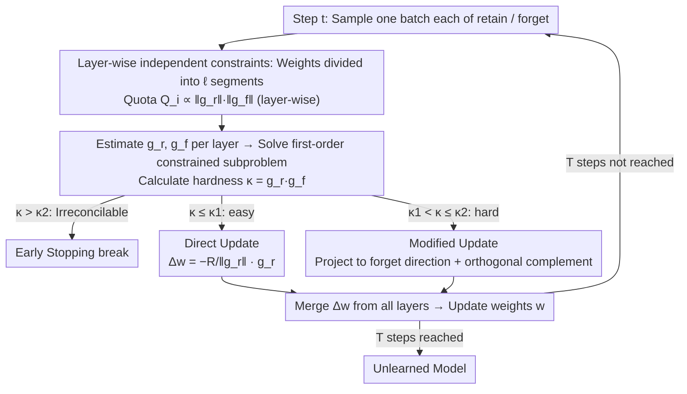

# How Hard Can It Be? Hardness-Aware Multi-Objective Unlearning

**Conference**: ICML 2026  
**arXiv**: [2606.02119](https://arxiv.org/abs/2606.02119)  
**Code**: https://github.com/aoi3142/HAMU  
**Area**: AI Safety / Machine Unlearning  
**Keywords**: machine unlearning, multi-objective optimization, constrained optimization, gradient dot product, collateral forgetting

## TL;DR
The trade-off between "forgetting vs. retaining" is formulated directly as a "per-step constrained first-order convex optimization" problem. The dot product of the retain/forget gradients, $\kappa = \bm{g_r}\cdot\bm{g_f}$, serves simultaneously as a hardness metric, a switch for update directions, and an early stopping condition. It proves more stable than baselines such as GA, GDiff, SCRUB, and KL on CIFAR-10/ResNet-20 and Llama-2-7B/WaterDrum-TOFU.

## Background & Motivation

**Background**: Machine unlearning aims to erase the influence of a specific portion of forget data $D_f$ from a trained model while preserving performance on retain data $D_r$. Mainstream approaches involve gradient ascent on forget loss (GA, NPO), fine-tuning on retain loss (FT), or a weighted combination of both (GDiff, KL, SCRUB).

**Limitations of Prior Work**: Weighted combination methods neither guarantee that forget data is truly removed to a "specified degree" nor ensure that $D_r$ is not inadvertently damaged (a cost referred to as collateral forgetting). In other words, users cannot specify a target such as "unlearn to at least degree $Q$, then minimize retain loss."

**Key Challenge**: Whether these two objectives conflict depends on the similarity between $D_f$ and $D_r$. In the extreme case where $D_f = D_r$, it is impossible to forget one without damaging the other. Existing works neither quantify this "level of conflict" nor explicitly utilize such a metric within their algorithms.

**Goal**: (1) Provide a computable scalar metric for "how hard this unlearning task is"; (2) develop an algorithm that ensures forget improvement $\geq Q$ while minimizing retain degradation; (3) actively stop when the conflict becomes irreconcilable.

**Key Insight**: The authors start from a first-order analysis of a single gradient descent step—how much a small step on $D_r$ changes the loss on $D_f$ is determined entirely by the sign of the dot product of the two batch gradients, $\nabla L(D_f)\cdot\nabla L(D_r)$. A more positive dot product implies the objectives are more coupled (harder), while a more negative dot product suggests they are easier to unlearn.

**Core Idea**: Each unlearning step is formulated as a constrained convex problem: "within a local neighborhood of radius $R$, minimize retain degradation s.t. forget improvement $\geq Q$." The closed-form solution naturally highlights $\kappa = \bm{g_r}\cdot\bm{g_f}$ as the hardness metric, which dictates whether to perform a "standard gradient descent" or a "projected correction toward the forget direction" based on a threshold.

## Method

### Overall Architecture
HAMU (Hardness-Aware Multi-objective Unlearning) addresses the core issue where weighted forgetting fails to guarantee a specific degree of unlearning and causes collateral damage. It reformulates unlearning from "weight tuning" to a $T$-step iterative constrained optimization. Each step considers the current weights $\bm{w}_t$ and one batch each of retain/forget data, solving a first-order convex subproblem with inequality constraints in the weight's local neighborhood. Each step estimates batch gradients $\bar{\bm{g}}_{\bm{r}}, \bar{\bm{g}}_{\bm{f}}$ and their dot product $\bar\kappa$. This $\bar\kappa$ is compared against two theoretical thresholds to decide whether to stop, perform a direct update, or a modified update. The algorithm introduces no new learnable parameters and consists of a convex subproblem, two dual variants (HAMU-Q / HAMU-U), and layer-wise parallel execution.

### Key Designs

**1. Hardness Metric $\kappa$ and First-Order Constrained Subproblem: Turning "unlearning difficulty" into a computable scalar**

Previous definitions of "hardness" were post-hoc heuristics like training curves or influence functions, which couldn't be directly fed into an algorithm. HAMU’s key observation is that within a trust region $\|\Delta\bm{w}\|\leq R$, first-order expansions approximate changes in retain and forget loss as $\Delta L(D_r)\approx \bm{g_r}\cdot\Delta\bm{w}$ and $\Delta L(D_f)\approx \bm{g_f}\cdot\Delta\bm{w}$, respectively. The optimal step is thus formulated as the convex subproblem $\min\ \bm{g_r}\cdot\Delta\bm{w}\ \text{s.t.}\ \bm{g_f}\cdot\Delta\bm{w}\geq Q,\ \|\Delta\bm{w}\|\leq R$. Under the feasibility condition $Q\leq R\|\bm{g_f}\|$, this has a closed-form solution, and the optimal cost $F_r^*$ (the unavoidable retain degradation) is monotonically non-decreasing with respect to the gradient dot product $\kappa = \bm{g_r}\cdot\bm{g_f}$. This means $\kappa$ is not just another heuristic, but theoretically equivalent to the "optimal lower bound of retain degradation at this step," calculable with a single dot product.

**2. Switching Direct vs. Modified Updates based on $\kappa$: Allowing the algorithm to judge whether to incorporate the forget direction**

Existing methods either stick rigidly to weighted gradients (failing to guarantee forgetting in hard regions) or gradient ascent (unnecessarily damaging $D_r$ in easy regions). HAMU uses $\kappa$ as a switch to toggle between two behaviors. Defining the threshold $\kappa_1 = -Q\|\bm{g_r}\|/R$: when $\kappa \leq \kappa_1$ (easy), simply following the negative retain gradient $\Delta\bm{w} = -\tfrac{R}{\|\bm{g_r}\|}\bm{g_r}$ naturally satisfies the forget constraint, equivalent to SGD on $D_r$. When $\kappa > \kappa_1$ (hard), this step would violate $\bm{g_f}\cdot\Delta\bm{w}\geq Q$, so the algorithm uses the modified update $\Delta\bm{w}^* = \tfrac{Q}{\|\bm{g_f}\|^2}\bm{g_f} - \sqrt{R^2 - Q^2/\|\bm{g_f}\|^2}\,\tfrac{\bm{g_r}_\perp}{\|\bm{g_r}_\perp\|}$, where $\bm{g_r}_\perp$ is the component of $\bm{g_r}$ orthogonal to $\bm{g_f}$. Geometrically, this first takes the smallest step in the forget direction to satisfy the constraint and then spends the remaining budget in the orthogonal direction that minimizes retain damage. The threshold $\kappa_1$ is determined entirely by $Q, R, \|\bm{g_r}\|$ without extra hyperparameters.

**3. Early Stopping via $\kappa_2$ and Layer-wise Independent Constraint Parallelization: Knowing when to stop and scaling to large models**

When $D_f$ and $D_r$ are too similar, no step can improve forget loss without harming retain performance. HAMU adds a condition $\bm{g_r}\cdot\Delta\bm{w}\leq 0$ (requiring no retain degradation) to the original problem, deriving a new feasibility boundary $\kappa_2 \triangleq \sqrt{(\|\bm{g_r}\|\|\bm{g_f}\|)^2 - Q^2\|\bm{g_r}\|^2/R^2}$. Once $\kappa > \kappa_2$, collateral forgetting is proven inevitable, and the algorithm breaks. Furthermore, to make it feasible for LLMs and respect differing layer sensitivities, HAMU splits the global constraint: it segments $\bm{w}$ into $\ell$ parts and distributes the quota $Q_i = \tfrac{\|\bm{g_r}^{(i)}\|\|\bm{g_f}^{(i)}\|}{\sum_j\|\bm{g_r}^{(j)}\|\|\bm{g_f}^{(j)}\|}\cdot Q$ proportional to the product of gradient magnitudes in each layer. This automatically tilts unlearning towards layers "most worth modifying" and allows for multi-GPU parallelization.

### Loss & Training
The model maintains its original cross-entropy loss without new learnable parameters. The only adjustable hyperparameter is the learning rate $\eta$, with $R = \eta\|\bar{\bm{g}}_{\bm{r}}\|$ set implicitly. Users select $Q$ (HAMU-Q) or $U$ (HAMU-U) based on requirements; to satisfy first-order approximations, authors suggest gradient clipping $\|\bm{g}\|_{\max}=1$ and choosing $Q < \eta$. HAMU-U is the dual variant: it optimizes to minimize forget loss while constraining retain improvement $\geq U$.

## Key Experimental Results

### Main Results

CV tasks used ResNet-20 pretrained on CIFAR-10; LLM tasks used Llama-2-7B-chat fine-tuned on WaterDrum-TOFU. Baselines include FT (retain fine-tuning), GA (forget gradient ascent), GDiff (gradient difference), KL, and SCRUB. Metrics track $\Delta L_f$ (forget improvement, higher is better) and $-\Delta L_r$ (retain improvement, higher is better) trajectories over 5 epochs.

| Scenario | Key Observation | Conclusion |
|----------|-----------------|------------|
| CIFAR-10, $\rho=0$ (easy) | HAMU/GDiff improve both objectives; GA/KL degrade retain; FT/SCRUB degrade forget | Both HAMU and GDiff perform well in easy regions. |
| CIFAR-10, $\rho=0.75$ (hard) | Only HAMU-Q/HAMU-U achieve visible improvements without damaging other objectives; baselines mostly degrade | HAMU has a unique advantage in hard regions. |
| Llama-2-7B / Semantic TOFU | Avg $\bar\kappa=6.1\times10^{-4}$ vs. $4.0\times10^{-4}$ for non-semantic; HAMU-Q still improves both while baselines degrade to diagonal (random collapse) | Conclusions are consistent in large model scenarios. |

### Ablation Study

| Configuration | Key Finding | Description |
|---------------|-------------|-------------|
| Full HAMU-Q | $\Delta L_f, -\Delta L_r$ are both significantly positive | Standard |
| Global constraint instead of layer-wise | $\Delta L_f, -\Delta L_r$ become negative for small $Q$ | Layer-wise constraints are key for LLM usability |
| Disabled stopping criterion | At $\rho=0.5$ over 25 epochs, $-\Delta L_r$ begins to drop after a certain epoch | The $\kappa_2$ stop condition triggers near the "turning point." |
| Varying $Q/\eta$ magnitude | $\Delta L_f$ vs $Q/\eta$ shows near-perfect linearity ($R^2=0.999$) | The first-order layer-wise version aligns closely with reality. |

### Key Findings
- **$\kappa$ correlates with human-defined hardness (similarity ratio $\rho$) at Pearson 0.994 (HAMU-Q) / 0.986 (HAMU-U)**, proving that $\kappa$ truly captures the similarity between $D_f$ and $D_r$. This trend holds even for other baselines (higher $\rho$ leads to worse results), suggesting this is an intrinsic property of unlearning.
- **Higher $Q/U$ leads to faster forgetting but worse retain**: Users can generate a Pareto-front with a single algorithm without retraining.
- **Unlearning becomes harder over time**: $\bar\kappa$ increases monotonically across epochs, reflecting fewer available directions for improvement, justifying the $\kappa_2$ stopping condition.
- **Most baselines fail in hard regions**: GA/KL destroy retain performance, while FT/SCRUB fail to unlearn anything—only the explicitly constrained HAMU yields positive gains for both.

## Highlights & Insights
- **From Weight Tuning to Constrained Subproblems**: A simple shift in perspective turns "how much I want to forget" from a weight requiring grid search into an explicit, interpretable quota $Q$. This "constraint vs. weighting" approach is valuable for many trade-off problems.
- **One metric, three roles**: $\kappa$ acts as a hardness measure, a direction switch, and a stopping condition—all from a simple gradient dot product. This is more elegant than stacking meta-networks.
- **Layer-wise allocation $Q_i \propto \|\bm{g_r}^{(i)}\|\|\bm{g_f}^{(i)}\|$**: This adaptive allocation can be transferred to other budget-constrained scenarios like layer-wise bit allocation in mixed-precision quantization or hierarchical sparsity.
- **Geometric logic of modified updates**: $\Delta\bm{w}^* = \tilde{\bm{g}}_f - \alpha\,\bm{g}_{r,\perp}/\|\bm{g}_{r,\perp}\|$ essentially ensures the minimum projection in the forget direction while using the remaining budget for the least-damaging retain direction. This is a clean geometric representation of a Lagrange solution with inequality constraints.

## Limitations & Future Work
- **Reliance on First-Order Approximation**: Approximation errors cannot be ignored with very large learning rates or large Hessian eigenvalues (requiring smaller $\eta$ in some LLM cases). A second-order version is provided by the authors but is impractical for large models.
- **Per-Iteration Stopping Criterion**: The $\kappa_2$ trigger is local and may occur "slightly later" than the actual global turning point; soft stopping $\bar\kappa > \bar\kappa_2 - \varepsilon$ is suggested as a remedy. Optimal global stopping remains unsolved.
- **Manual $Q$ Selection**: Automatically mapping a target forget quality (e.g., MIA success rate < x%) to a specific $Q$ is still an open question.
- **Variance of Batch Gradient Estimations**: While empirical evidence suggests robustness to batch size, a rigorous concentration bound for $\bar\kappa$ is missing.

## Related Work & Insights
- **vs. SCRUB / KL**: These use weighted or distillation objectives and cannot balance objectives in hard scenarios; HAMU maintains positive gains at $\rho=0.75$.
- **vs. GDiff**: GDiff keeps up in easy scenarios but degrades in hard ones because it lacks the awareness to "stop" when objectives become irreconcilable.
- **vs. GA / NPO**: HAMU’s framework can incorporate NPO or other forget losses by simply replacing the definition of $\bm{g_f}$.
- **vs. Newton-style certified unlearning**: Those methods require convexity and Hessian inversion, which cannot scale to LLMs. HAMU’s first-order local trust region approach is actually deployable.

## Rating
- Novelty: ⭐⭐⭐⭐ The perspective of first-order convex constrained unlearning is refreshing; the triple-role of $\kappa$ is ingenious.
- Experimental Thoroughness: ⭐⭐⭐⭐ Both CV and LLM scenarios, 5 baselines, and comprehensive $\rho$, $Q/U$, and ablation scans.
- Writing Quality: ⭐⭐⭐⭐ Clear progression from theory to algorithm to engineering; effective geometric illustrations in Fig 1/2.
- Value: ⭐⭐⭐⭐ Provides a practical, deployable algorithm for ensuring forget intensity without destroying retain performance; open-sourced.

<!-- RELATED:START -->

## Related Papers

- [\[ICML 2026\] Old Habits Die Hard: How Conversational History Geometrically Traps LLMs](old_habits_die_hard_how_conversational_history_geometrically_traps_llms.md)
- [\[CVPR 2025\] MOS-Attack: A Scalable Multi-Objective Adversarial Attack Framework](../../CVPR2025/ai_safety/mos-attack_a_scalable_multi-objective_adversarial_attack_framework.md)
- [\[ICLR 2026\] How to Cure Newton for Unlearning Neural Networks? An Empirical Study from the Hessian Perspective](../../ICLR2026/ai_safety/how_to_cure_newton_for_unlearning_neural_networks_an_empirical_study_from_the_he.md)
- [\[AAAI 2026\] Easy to Learn, Yet Hard to Forget: Towards Robust Unlearning Under Bias](../../AAAI2026/ai_safety/easy_to_learn_yet_hard_to_forget_towards_robust_unlearning_under_bias.md)
- [\[ICML 2026\] Forget to Know, Remember to Use: Context-Aware Unlearning for Large Language Models](forget_to_know_remember_to_use_context-aware_unlearning_for_large_language_model.md)

<!-- RELATED:END -->
