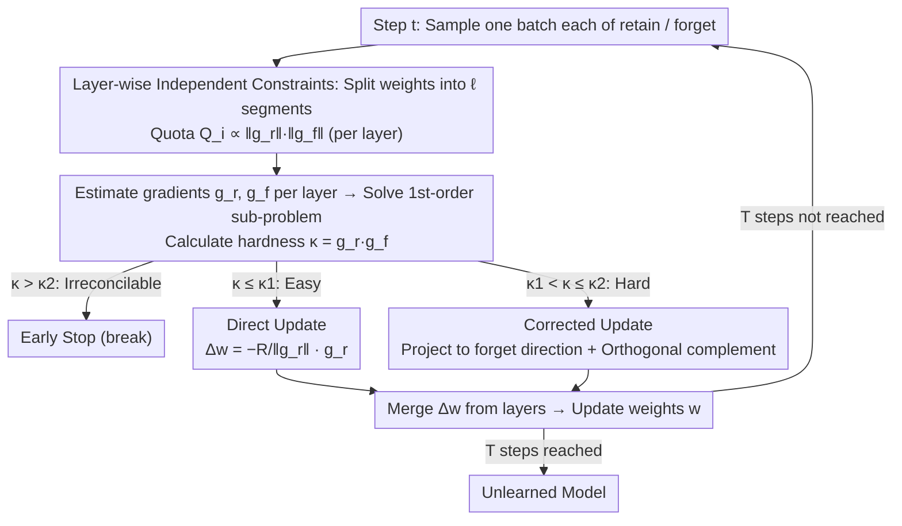

# How Hard Can It Be? Hardness-Aware Multi-Objective Unlearning

**Conference**: ICML 2026  
**arXiv**: [2606.02119](https://arxiv.org/abs/2606.02119)  
**Code**: https://github.com/aoi3142/HAMU  
**Area**: AI Safety / Machine Unlearning  
**Keywords**: machine unlearning, multi-objective optimization, constrained optimization, gradient dot product, collateral forgetting

## TL;DR
The "forgetting vs. retaining" trade-off is directly formulated as a "per-step constrained first-order convex optimization" problem. The dot product of retain/forget gradients, $\kappa = \bm{g_r}\cdot\bm{g_f}$, simultaneously serves as a hardness metric, a switch for update directions, and an early stopping condition. It demonstrates superior stability over baselines such as GA, GDiff, SCRUB, and KL on CIFAR-10/ResNet-20 and Llama-2-7B/WaterDrum-TOFU.

## Background & Motivation

**Background**: Machine unlearning aims to erase the influence of specific forget data $D_f$ from a trained model while preserving capabilities on retain data $D_r$. Mainstream approaches include gradient ascent (GA, NPO) on forget loss, fine-tuning (FT) on retain loss, or weighted combinations of both (GDiff, KL, SCRUB).

**Limitations of Prior Work**: Weighted combination methods can neither guarantee that the forget data is erased to a "specified degree" nor ensure that the retain data is not inadvertently damaged (a cost the authors term "collateral forgetting"). In other words, users cannot pre-specify to the algorithm: "I need at least $Q$ level of forgetting, then please minimize retain loss."

**Key Challenge**: Whether these two objectives conflict depends on the similarity between $D_f$ and $D_r$. In the extreme case of $D_f = D_r$, it is impossible to forget one without damaging the other. However, existing works neither quantify "how much conflict exists" nor explicitly utilize this quantity within their algorithms.

**Goal**: (1) Provide a computable scalar metric for "how hard this unlearning task is"; (2) Propose an algorithm that guarantees forget improvement $\geq Q$ while minimizing retain degradation; (3) Proactively stop when conflicts become irreconcilable.

**Key Insight**: The authors begin with a first-order analysis of a single gradient descent step—how much the loss on $D_f$ changes when taking a small step on $D_r$ is entirely determined by the sign of the dot product $\nabla L(D_f)\cdot\nabla L(D_r)$. A larger positive dot product implies the two objectives are tightly coupled (hard), while a negative dot product indicates easier unlearning.

**Core Idea**: Each unlearning step is formulated as a constrained convex problem: "within a local neighborhood of radius $R$, minimize retain degradation s.t. forget improvement $\geq Q$." The closed-form solution naturally yields $\kappa = \bm{g_r}\cdot\bm{g_f}$ as the hardness metric, which dictates whether to perform a "direct update" or a "corrected update" projected onto the forget direction based on threshold crossings.

## Method

### Overall Architecture
HAMU (Hardness-Aware Multi-objective Unlearning) addresses the core pain point where weighted forgetting fails to guarantee forget targets and causes collateral forgetting. It reformulates the entire unlearning process from "weight tuning" into $T$ steps of per-iteration constrained optimization. Each step considers only the current weights $\bm{w}_t$ and one batch each of retain/forget data, solving a first-order convex sub-problem with inequality constraints in the local neighborhood. Each step estimates batch gradients $\bar{\bm{g}}_{\bm{r}}, \bar{\bm{g}}_{\bm{f}}$ and their dot product $\bar\kappa$, then compares $\bar\kappa$ against two theoretical thresholds to decide whether to stop, apply a direct update, or apply a corrected update. The final $\Delta\bm{w}$ is added to the weights. The algorithm introduces no new parameters and consists of a convex sub-problem, two dual variants (HAMU-Q / HAMU-U), and a layer-wise parallel implementation.

### Key Designs

**1. Hardness Metric $\kappa$ and First-Order Constrained Sub-problem: Turning "Hardness" into a Computable Scalar**

Previous "hardness" metrics were post-hoc heuristics like training curves or influence functions, which cannot be fed directly into an algorithm. HAMU's key observation is that within a trust region $\|\Delta\bm{w}\|\leq R$, first-order expansions approximate loss changes as $\Delta L(D_r)\approx \bm{g_r}\cdot\Delta\bm{w}$ and $\Delta L(D_f)\approx \bm{g_f}\cdot\Delta\bm{w}$. The next step is thus defined by the convex sub-problem $\min\ \bm{g_r}\cdot\Delta\bm{w}\ \text{s.t.}\ \bm{g_f}\cdot\Delta\bm{w}\geq Q,\ \|\Delta\bm{w}\|\leq R$—minimizing retain degradation while ensuring forget improvement is at least $Q$. This has a closed-form solution under the feasibility condition $Q\leq R\|\bm{g_f}\|$, and the optimal cost $F_r^*$ (unavoidable retain degradation) is monotonically non-decreasing with respect to the gradient dot product $\kappa = \bm{g_r}\cdot\bm{g_f}$. Thus, $\kappa$ is theoretically equivalent to the "optimal lower bound of retain degradation for this step," computable via a single dot product with negligible overhead.

**2. Direct vs. Corrected Updates Switched by $\kappa$: Autonomously Deciding when to Involve Forget Directions**

Existing methods either strictly follow weighted gradients (failing to guarantee forgetting in hard regions) or strictly follow gradient ascent (unnecessarily damaging retain in easy regions). HAMU uses $\kappa$ as a switch to toggle between two trajectories. Defining the threshold $\kappa_1 = -Q\|\bm{g_r}\|/R$: when $\kappa \leq \kappa_1$ (easy), the retain negative gradient $\Delta\bm{w} = -\tfrac{R}{\|\bm{g_r}\|}\bm{g_r}$ naturally satisfies the forget constraint, equivalent to SGD on retain data. When $\kappa > \kappa_1$ (hard), this step would violate $\bm{g_f}\cdot\Delta\bm{w}\geq Q$, so the corrected update $\Delta\bm{w}^* = \tfrac{Q}{\|\bm{g_f}\|^2}\bm{g_f} - \sqrt{R^2 - Q^2/\|\bm{g_f}\|^2}\,\tfrac{\bm{g_r}_\perp}{\|\bm{g_r}_\perp\|}$ is used, where $\bm{g_r}_\perp$ is the component of $\bm{g_r}$ orthogonal to $\bm{g_f}$. Geometrically, this first takes the minimal step along the forget direction to satisfy the constraint, then spends the remaining budget in the orthogonal direction that least damages retain data. $\kappa_1$ is determined solely by $Q, R, \|\bm{g_r}\|$, introducing no extra hyperparameters.

**3. Early Stopping for Irreconcilability $\kappa_2$ and Parallelization via Layer-wise Constraints: Knowing when to stop and scaling to LLMs**

Simply switching isn't enough: when $D_f$ and $D_r$ are too similar, no step can improve forget without damaging retain; continuing only harms retain. HAMU adds a constraint $\bm{g_r}\cdot\Delta\bm{w}\leq 0$ (requiring no retain degradation) to derive a feasibility bound $\kappa_2 \triangleq \sqrt{(\|\bm{g_r}\|\|\bm{g_f}\|)^2 - Q^2\|\bm{g_r}\|^2/R^2}$. If $\kappa > \kappa_2$, collateral forgetting is inevitable, and the algorithm breaks. Furthermore, to handle LLMs and respect varied sensitivities across layers, HAMU decomposes global constraints into $\ell$ segments of $\bm{w}$. It distributes the total quota $Q$ per layer $Q_i = \tfrac{\|\bm{g_r}^{(i)}\|\|\bm{g_f}^{(i)}\|}{\sum_j\|\bm{g_r}^{(j)}\|\|\bm{g_f}^{(j)}\|}\cdot Q$, proportional to the product of gradient magnitudes. This automatically tilts the forget quota toward layers "more worth modifying" (outperforming uniform distribution in ablations) and allows independent GPU parallelization for each layer.

### Loss & Training
The original cross-entropy loss is maintained without introducing new learnable parameters. The only tunable hyperparameter is the learning rate $\eta$, with $R = \eta\|\bar{\bm{g}}_{\bm{r}}\|$ set implicitly. Users select $Q$ (HAMU-Q) or $U$ (HAMU-U) based on requirements. To satisfy first-order approximations, the authors suggest gradient clipping $\|\bm{g}\|_{\max}=1$ and choosing $Q < \eta$. HAMU-U is the dual variant that optimizes for for negative forget improvement subject to retain improvement $\geq U$, with a symmetric closed-form solution.

## Key Experimental Results

### Main Results

CV tasks use ResNet-20 pre-trained on CIFAR-10; LLM tasks use Llama-2-7B-chat fine-tuned on WaterDrum-TOFU. Baselines include FT (retain fine-tuning), GA (forget gradient ascent), GDiff (gradient difference), KL, and SCRUB. Metrics track trajectories of $\Delta L_f$ (forget improvement, higher is better) and $-\Delta L_r$ (retain improvement, higher is better) over 5 epochs.

| Scenario | Key Observation | Conclusion |
|------|---------|------|
| CIFAR-10, $\rho=0$ (easy) | HAMU/GDiff improve both objectives; GA/KL degrade retain; FT/SCRUB degrade forget | HAMU and GDiff both perform well in easy regions |
| CIFAR-10, $\rho=0.75$ (hard) | Only HAMU-Q/HAMU-U achieve visible improvement without damaging the other objective; baselines almost all degrade | HAMU holds a unique advantage in hard regions |
| Llama-2-7B / Semantically similar TOFU | Avg $\bar\kappa=6.1\times10^{-4}$ vs. semantically dissimilar $4.0\times10^{-4}$; HAMU-Q still improves both while most baselines degrade to the diagonal (random degradation) | Conclusions remain consistent in LLM scenarios |

### Ablation Study

| Configuration | Key Finding | Description |
|------|---------|------|
| Full HAMU-Q | Both $\Delta L_f, -\Delta L_r$ significantly positive | Standard |
| Global vs. Layer-wise constraint | $\Delta L_f, -\Delta L_r$ actually become negative for small $Q$ | Layer-wise constraints are critical for LLM feasibility |
| Disabling stopping criterion | At $\rho=0.5$ for 25 epochs, $-\Delta L_r$ begins to drop after a certain epoch | The $\kappa_2$ stop condition indeed triggers near the "turning point" |
| Changing $Q/\eta$ size | $\Delta L_f$ vs. $Q/\eta$ follows a perfect linear relationship ($R^2=0.999$) | The first-order layer-wise approximation aligns very well with reality |

### Key Findings
- **The Pearson correlation between $\kappa$ and human-defined hardness (similarity ratio $\rho$) is 0.994 (HAMU-Q) / 0.986 (HAMU-U)**, strongly proving $\kappa$ accurately captures the similarity between $D_f$ and $D_r$. Even for other baselines, the trend of worse improvement with higher $\rho$ holds—indicating this is an intrinsic property of unlearning, not just a HAMU artifact.
- **Larger $Q/U$ leads to faster forgetting but worse retain**: Users can generate a Pareto-front with a single algorithm without retraining.
- **Forgetting becomes harder over time**: $\bar\kappa$ increases monotonically with epochs, reflecting "fewer available directions," which justifies the practical utility of the $\kappa_2$ stopping condition.
- **Most baselines are irredeemable in hard regions**: GA/KL destroy retain, while FT/SCRUB fail to forget anything—only the explicitly constrained HAMU achieves positive gains in both.

## Highlights & Insights
- **Transition from "Weighted Tuning" to "Constrained Sub-problems"**: A simple shift in perspective turns "how much I want to forget" from an implicit weight requiring grid search into an explicit, interpretable quota $Q$. This "constraint vs. weighting" paradigm is valuable for various trade-off problems.
- **$\kappa$ wear three hats**: Hardness metric, update direction switch, and stopping condition—all from a simple gradient dot product. This "leveraging an existing cheap quantity to drive multiple decisions" is more elegant than stacking meta-networks.
- **$Q_i$ proportional to $\|\bm{g_r}^{(i)}\|\|\bm{g_f}^{(i)}\|$ allocation**: This layer-wise hardness adaptation can be transferred to any scenario with "budgets across layers" (e.g., layer-wise bit allocation in mixed-precision quantization or layer-wise sparsity rates).
- **Geometric Intuition of Corrected Updates**: $\Delta\bm{w}^* = \tilde{\bm{g}}_f - \alpha\,\bm{g}_{r,\perp}/\|\bm{g}_{r,\perp}\|$ essentially means "first guarantee the minimal projection in the forget direction, then use the remaining budget for the direction that least harms retain." This represents a clean geometric form of a Lagrangian solution with inequality constraints.

## Limitations & Future Work
- **Strictly First-order Approximation**: Approximation errors cannot be ignored with very large learning rates or large Hessian eigenvalues (authors had to use smaller $\eta$ in LLM experiments to save HAMU-U from slight constraint violations). A second-order version is provided but requires Hessian computation, which is impractical for LLMs.
- **Stopping Criterion is a Local Per-iteration Junction**: It may trigger "slightly later" than the actual turning point. The authors suggest a soft stop $\bar\kappa > \bar\kappa_2 - \varepsilon$. Global optimal stopping remains unsolved.
- **Forget Intensity Still Requires User Specification of $Q$ or $U$**: How to automatically map "target forget quality (e.g., MIA success rate < x%)" back to $Q$ is still an open question.
- **Variance of Batch Gradient Estimate $\bar\kappa$**: Not rigorously analyzed; the authors only empirically state robustness to batch size in App.G.3, lacking a concentration bound.

## Related Work & Insights
- **vs. SCRUB / KL**: These use weighted or distillation targets and cannot balance both in hard scenarios; HAMU's ability to remain positive for both at $\rho=0.75$ is a direct empirical advantage.
- **vs. GDiff**: GDiff holds up in easy scenarios but degrades instantly in hard ones. The essential difference is that GDiff does not know "when it is beyond saving," whereas HAMU stops via $\kappa_2$.
- **vs. GA / NPO**: HAMU's formulation can encompass other forget losses like NPO simply by replacing the definition of $\bm{g_f}$, while keeping the theoretical framework intact.
- **vs. Newton-style certified unlearning (e.g., Bui et al. 2026)**: That branch requires convexity and Hessian inversion, making it unusable for LLMs; HAMU's first-order approach with a local trust region is actually deployable on large models.

## Rating
- Novelty: ⭐⭐⭐⭐ The perspective of first-order convex constrained unlearning is fresh; $\kappa$'s triple-role design is clever.
- Experimental Thoroughness: ⭐⭐⭐⭐ Covers CV and LLM scenarios, 5 baselines, $\rho$ scanning, ablation, and $Q/U$ scanning.
- Writing Quality: ⭐⭐⭐⭐ Clear chain from theory to algorithm to engineering parallelization; Figures 1/2 effectively illustrate geometry.
- Value: ⭐⭐⭐⭐ Provides a deployable practical algorithm for guaranteeing forget strength without destroying retain data; open-sourced.

<!-- RELATED:START -->

## Related Papers

- [\[CVPR 2026\] Machine Unlearning via Adaptive Gradient Reweighting and Multi-stage Objective Optimization](../../CVPR2026/ai_safety/machine_unlearning_via_adaptive_gradient_reweighting_and_multi-stage_objective_o.md)
- [\[AAAI 2026\] Easy to Learn, Yet Hard to Forget: Towards Robust Unlearning Under Bias](../../AAAI2026/ai_safety/easy_to_learn_yet_hard_to_forget_towards_robust_unlearning_under_bias.md)
- [\[ICML 2026\] How Does Bayesian Sampling Help Membership Inference Attacks?](how_does_bayesian_sampling_help_membership_inference_attacks.md)
- [\[CVPR 2025\] MOS-Attack: A Scalable Multi-Objective Adversarial Attack Framework](../../CVPR2025/ai_safety/mos-attack_a_scalable_multi-objective_adversarial_attack_framework.md)
- [\[ICML 2026\] Flatness-Aware Stochastic Gradient Langevin Dynamics](flatness-aware_stochastic_gradient_langevin_dynamics.md)

<!-- RELATED:END -->
