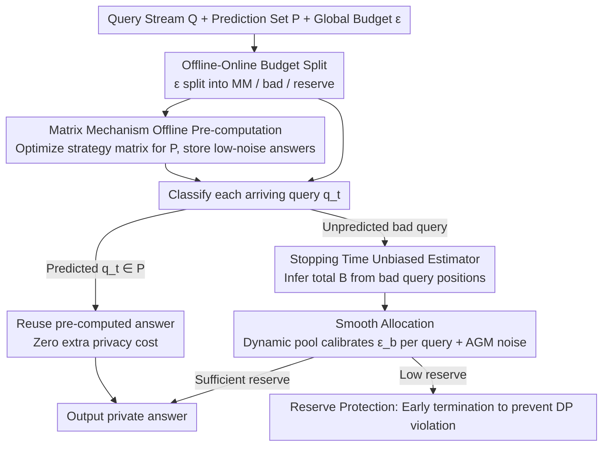

# LAPRAS: Learning-Augmented PRivate Answering for Linear Query Streams

**Conference**: ICML 2026  
**arXiv**: [2605.01960](https://arxiv.org/abs/2605.01960)  
**Code**: None  
**Area**: AI Security / Differential Privacy / Learning-Augmented Algorithms  
**Keywords**: Differential Privacy, Linear Queries, Matrix Mechanism, Prediction-Augmented, Budget Allocation

## TL;DR
LAPRAS utilizes a predictor of "upcoming queries" to categorize an online DP query stream into predicted and unpredicted types. Predicted queries are released with low noise using an offline optimal Matrix Mechanism, while unpredicted queries utilize a Smooth Allocation strategy to estimate the total count online based on observed "unpredicted query" positions and distribute budget smoothly. It nearly matches offline optimal performance when predictions are accurate and degrades to online baseline levels when predictions are poor.

## Background & Motivation
**Background**: Differential Privacy (DP) is the de facto standard for industrial-grade data analysis. In **offline** scenarios with a fixed workload $\mathrm{W}$, the Matrix Mechanism (MM) minimizes total error by designing an optimal strategy matrix using query correlations. However, in **online** scenarios, queries $q_1, \dots, q_S$ arrive sequentially and must be answered immediately, while the total budget $(\varepsilon, \delta)$ is globally fixed.

**Limitations of Prior Work**: Theoretically, online DP can be **exponentially** worse than offline DP because the mechanism must conservatively allocate small budgets to each query, leading to high noise and data inutility. Existing solutions like Private Multiplicative Weights, Privacy Odometers/Filters, and CacheDP are either computationally expensive or "passively" cache historical results without actively exploiting the structure of future workloads.

**Key Challenge**: Online mechanisms only perceive the past, but actual industrial systems (SCOPE, SQL Server, Azure SQL) show that over 60% of query streams are periodic/repetitive, and over 90% of resources come from a few templates. This **predictability** is a free prior, yet traditional DP algorithms cannot translate "I guess these queries are coming" into "I will pre-calculate their low-noise answers."

**Goal**: Design a **learning-augmented** online DP mechanism that satisfies: (i) utility approaching offline MM when predictions are accurate (high overlap); (ii) performance no worse than independent Gaussian noise when predictions are completely wrong; (iii) $(\varepsilon, \delta)$-DP throughout; (iv) solving the core budget allocation challenge—how to distribute budget without knowing the total number of bad queries.

**Key Insight**: The authors leverage a critical assumption—the **query arrival order is uniformly random**. This transforms the "unknown total $B$" problem into a negative hypergeometric distribution problem, allowing for an unbiased estimation of $B$ based on the arrival positions of initial bad queries.

**Core Idea**: Split the stream using a prediction set; use offline MM for predicted queries and "stopping time unbiased estimation + smooth allocation" for unpredicted queries online.

## Method

### Overall Architecture
LAPRAS addresses the dilemma where online DP must conservatively allocate budget for the worst case, resulting in unusable data. It uses a prediction set $\mathrm{P}$ to split the query stream into two categories. Queries in the prediction set use pre-computed low-noise answers via the Matrix Mechanism, while unpredicted "bad queries" receive budget online. The global budget $\varepsilon$ is partitioned into four parts: $\varepsilon_{\text{MM}}$ for the Matrix Mechanism on the prediction set, $\varepsilon_{\text{badInit}}$ for the first $T = \lceil \log^2 S \rceil$ bad queries (warm-up), $\varepsilon_{\text{remBad}}$ for subsequent bad queries, and $\varepsilon_{\text{reserve}}$ as a safety buffer. Each query $q_t$ is classified upon arrival: if $q_t \in \mathrm{P}$, the pre-computed result is used (zero extra privacy cost via post-processing immunity); otherwise, a Smooth Allocation strategy determines the budget, and noise is added via the Analytic Gaussian Mechanism (AGM). If the reserve falls below $\varepsilon_{\min}$, the process terminates early to prevent DP violation.

### Key Designs

**1. Stopping Time Unbiased Estimator $\widehat{B}$: Estimating total bad queries without prior knowledge**

The fundamental pain point of online DP is not knowing the total number of bad queries, forcing a worst-case $S$ allocation and causing noise to swell to $O(S^2)$. LAPRAS assumes queries arrive in a random order, turning the "unknown $B$" into a negative hypergeometric distribution problem. Specifically, when the $b$-th bad query appears at stream position $n$, it uses $\widehat{B}(b) = S \cdot \frac{b-1}{n-1}$ to infer the total count, locking the estimate $B_{\text{est}}$ at $b = T = \lceil \log^2 S \rceil$. Based on $Y \sim \mathrm{NHG}(S, G, T)$, the paper proves this estimate is unbiased $\mathbb{E}[\widehat{B}] = B$ with variance $O(B^2 / \log^2 S)$. This allows budget allocation based on physical reality rather than the worst case, reducing expected noise from $O(S^2)$ to $O(B^2)$. Crucially, the estimation only depends on **arrival positions**, not data, thus consuming zero privacy budget.

**2. Smooth Allocation: Dynamic budget pool with on-the-fly calibration**

A static estimate $B_{\text{est}}$ is not robust—if early bad queries arrive with abnormal density, Static Allocation is penalized by the locked error. Smooth Allocation treats $\varepsilon_{\text{pool}} = \varepsilon_{\text{badInit}} + \varepsilon_{\text{remBad}}$ as a dynamic pool. For the $b$-th bad query, it estimates remaining bad queries $\widehat{B}_{\text{rem},b} = \max(1, \widehat{B}(b) - b)$ and spends $\varepsilon_b = \frac{\varepsilon_{\text{rem},b-1}}{\widehat{B}_{\text{rem},b} + 1}$ (the $+1$ prevents early overspending). The pool then updates: $\varepsilon_{\text{rem},b} = \varepsilon_{\text{rem},b-1} - \varepsilon_b$. This allows budget per query to increase when bad queries are sparse and automatically conserve budget when they are dense. Lemma 4.5 proves $\sum_b \varepsilon_b < \varepsilon_{\text{pool}}$, maintaining DP budget conservation.

**3. Offline-Online Budget Split + Reserve Protection: Trading utility without leaks**

MM's advantage is thinning variance via workload correlation, which only materializes if the "queries that actually appear" are fed into it. LAPRAS uses $(\varepsilon_{\text{MM}}, \delta_i)$ for MM to solve an optimal strategy matrix $\mathbf{A}$ for the prediction set $\mathrm{P}$. The results $W \mathbf{A}^+ \mathcal{K}(\mathbf{A}, x)$ are reused at zero privacy cost. To handle the worst case (e.g., total bad queries exceeding $B_{\text{est}}$), each excess query spends $\varepsilon_{\text{reserve}} / 2$, with the reserve halving each time. Termination occurs if it drops below $\varepsilon_{\min}$. This geometric decay ensures no budget violation even if predictions are entirely wrong. Combined with basic composition and post-processing immunity, the system is $(\varepsilon, \delta)$-DP (Theorem 4.6).

### Loss & Training
LAPRAS is an algorithmic framework rather than a learned model, so it has no training loss. Theoretical utility bounds (Section 4): $\sum_{q \in \mathcal{S}} \mathbb{E}[U_{\text{LAPRAS}}(q)^2] = O(\frac{B^2 \ln(1/\delta)}{\varepsilon^2}) + O(\sum_q \mathbb{E}[U_{\text{MM}}(q)^2])$, ensuring $\le c \cdot \sum_q \mathbb{E}[U_{\text{Online}}(q)^2]$ (robustness).

## Key Experimental Results

### Main Results
Evaluated on Adult and Gowalla datasets with $\varepsilon = 1.0$, comparing OfflineMM and independent Gaussian noise (Online baseline):

| Dataset | Scenario | OfflineMM (MAE) | Online | LAPRAS (Ours) |
|--------|------|------|--------|------|
| Adult | High overlap ($\rho \approx 1$) | ~14 | 193.4 | 14.3 |
| Adult | Low overlap ($\rho \approx 0$) | — | 186.5 | 201.8 |
| Gowalla | High overlap | ~17 | 181.2 | 17.1 |
| Gowalla | Low overlap | — | 204.1 | 213.9 |

Under high overlap, MAE **drops by an order of magnitude**. Under low overlap, performance remains in the same order as Online, empirically validating the consistency-robustness trade-off.

### Ablation Study
Four budget allocation strategies (Table 1): equal / matrix-heavy / query-heavy / reserve-heavy.

| Strategy | $\varepsilon_{\text{MM}}$ | $\varepsilon_{\text{badInit}}$ | $\varepsilon_{\text{reserve}}$ | Use Case |
|------|----|----|----|----|
| equal | $\varepsilon/4$ | $\varepsilon/4$ | $\varepsilon/4$ | General |
| matrix-heavy | $\varepsilon/2$ | $\varepsilon/6$ | $\varepsilon/6$ | High prediction accuracy |
| query-heavy | $\varepsilon/6$ | $\varepsilon/3$ | $\varepsilon/6$ | Poor prediction accuracy |
| reserve-heavy | $\varepsilon/6$ | $\varepsilon/6$ | $\varepsilon/2$ | High uncertainty |

Matrix-heavy optimal for high overlap but degrades significantly in low overlap; query-heavy and reserve-heavy provide better protection under low overlap.

### Key Findings
- Smooth Allocation is more robust than Static Allocation, especially when early bad query density is abnormal or $B < T$.
- $T = \lceil \log^2 S \rceil$ is the "sweet spot" for estimation variance versus budget waste.
- Estimating $\widehat{B}$ consumes no extra privacy budget as it relies solely on **arrival positions**.

## Highlights & Insights
- Formally translates the empirical predictability of industrial query streams into provable DP acceleration, a clean application of learning-augmented algorithms in the privacy domain.
- Uses a stopping time estimator with a random order assumption to bypass the fundamental online DP challenge of "unknown total $B$." This technique is transferable to other online budget allocation problems.
- The consistency-robustness guarantee is elegant: it achieves offline-level utility when predictions are correct without losing points when they are wrong.

## Limitations & Future Work
- The random order assumption may not hold for periodic cron jobs in real workloads, potentially breaking the unbiasedness of $\widehat{B}$.
- The source of the prediction set $\mathrm{P}$ is outside the scope of this paper, yet utility is directly tied to overlap $\rho$.
- Evaluation is limited to linear counting queries on two datasets; extension to complex queries like joins or selectivity estimation remains unknown.

## Related Work & Insights
- **vs Private Multiplicative Weights (PMW)**: PMW maintains a synthetic database for any query but update costs explode with domain size; LAPRAS maintains low computation costs and focuses on budget allocation.
- **vs CacheDP**: CacheDP is reactive, relying on historical redundancy with cold-start costs. LAPRAS is proactive, using predictions to release future queries, making them orthogonal.
- **vs Privacy Odometers/Filters**: Odometers are descriptive accounting tools; LAPRAS provides **prescriptive** allocation strategies.

## Rating
- Novelty: ⭐⭐⭐⭐ Integrating learning-augmented ideas into online DP is a fresh direction.
- Experimental Thoroughness: ⭐⭐⭐ Good variety of strategies, though cross-dataset generalization could be stronger.
- Writing Quality: ⭐⭐⭐⭐ Theories and algorithms are clear with complete proofs.
- Value: ⭐⭐⭐⭐ High utility for industrial DP deployment where repetitive query loads are common.

<!-- RELATED:START -->

## Related Papers

- [\[NeurIPS 2025\] Private Continual Counting of Unbounded Streams](../../NeurIPS2025/ai_safety/private_continual_counting_of_unbounded_streams.md)
- [\[ICLR 2026\] Skirting Additive Error Barriers for Private Turnstile Streams](../../ICLR2026/ai_safety/skirting_additive_error_barriers_for_private_turnstile_streams.md)
- [\[NeurIPS 2025\] Nearly-Linear Time Private Hypothesis Selection with the Optimal Approximation Factor](../../NeurIPS2025/ai_safety/nearly-linear_time_private_hypothesis_selection_with_the_optimal_approximation_f.md)
- [\[ICML 2026\] PRISM: Gauge-Invariant Tangent-Space Differentially Private LoRA](prism_gauge-invariant_tangent-space_differentially_private_lora.md)
- [\[NeurIPS 2025\] Learning-Augmented Facility Location Mechanisms for Envy Ratio](../../NeurIPS2025/ai_safety/learning-augmented_facility_location_mechanisms_for_envy_ratio.md)

<!-- RELATED:END -->
