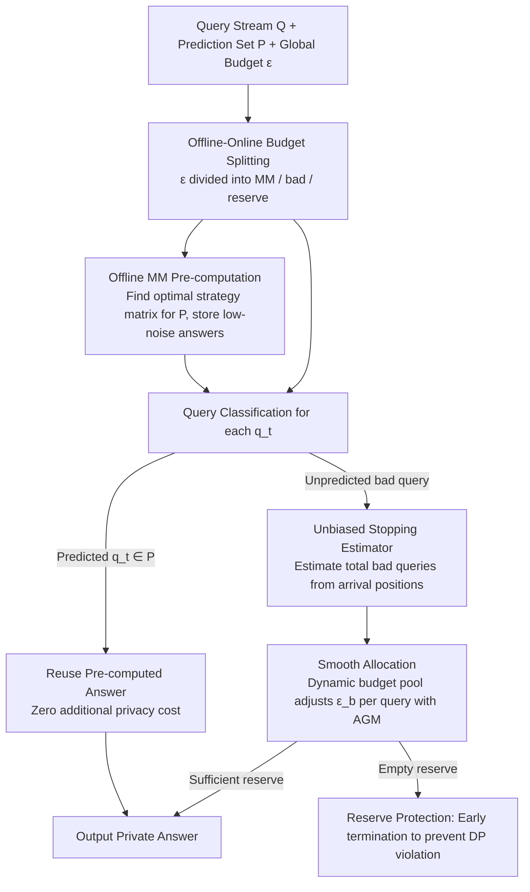

# LAPRAS: Learning-Augmented PRivate Answering for Linear Query Streams

**Conference**: ICML 2026  
**arXiv**: [2605.01960](https://arxiv.org/abs/2605.01960)  
**Code**: None  
**Area**: AI Safety / Differential Privacy / Learning-Augmented Algorithms  
**Keywords**: Differential Privacy, Linear Queries, Matrix Mechanism, Prediction Augmentation, Budget Allocation

## TL;DR
LAPRAS utilizes a predictor of "which queries will arrive" to categorize an online DP query stream into predicted and unpredicted queries. Predicted queries are released with low noise through the offline optimal Matrix Mechanism, while unpredicted queries use Smooth Allocation to estimate the total count online based on the observed arrival positions of "unpredicted queries" and distribute the budget smoothly. It nearly matches offline optimal performance when predictions are accurate and degrades to online baseline levels when predictions are poor.

## Background & Motivation
**Background**: Differential Privacy (DP) is the de-facto standard for industrial-grade data analysis. In **offline** scenarios with a fixed workload $\mathrm{W}$, the Matrix Mechanism (MM) can design an optimal strategy matrix by exploiting correlations between queries to minimize total error. However, in **online** scenarios, queries $q_1, \dots, q_S$ arrive sequentially and must be answered immediately, while the total budget $(\varepsilon, \delta)$ is globally fixed.

**Limitations of Prior Work**: Theory proves that online DP can be **exponentially** worse than offline DP because the mechanism, unaware of future queries, must conservatively allocate a tiny budget to each query, resulting in high noise and nearly unusable data. Existing solutions like Private Multiplicative Weights, Privacy Odometers/Filters, or CacheDP are either computationally expensive or "passively" cache historical results, failing to actively exploit future workload structures.

**Key Challenge**: Online mechanisms only perceive the past, but practical industrial systems (SCOPE, SQL Server, Azure SQL) show that 60% or more of query streams are periodically repetitive and 90% or more of resources are consumed by a few templates. This **predictability** is a free prior, yet traditional DP algorithms lack the means to translate "I guess these queries will come next" into "I will pre-calculate their low-noise answers."

**Goal**: Design a **learning-augmented** online DP mechanism given a prediction set $\mathrm{P}$ that: (i) approaches offline MM utility when predictions are accurate (high overlap); (ii) performs no worse than "independent Gaussian noise" when predictions are entirely wrong; (iii) satisfies $(\varepsilon, \delta)$-DP throughout; (iv) solves the core budget allocation problem of not knowing the total number of bad queries.

**Key Insight**: The authors leverage a seemingly simple but critical assumption—**query arrival order is uniformly random**. This transforms the "unknown total $B$" problem into a Negative Hypergeometric distribution problem, allowing for an unbiased estimation of $B$ based on the arrival positions of the first few bad queries.

**Core Idea**: Split the stream using a prediction set; apply offline MM for predicted queries and use "unbiased stopping time estimation + smooth allocation" for online budget distribution for queries outside the set.

## Method

### Overall Architecture
LAPRAS addresses the dilemma where online DP mechanisms must conservatively allocate budgets based on worst-case scenarios, leading to unusable data. It employs a prediction set $\mathrm{P}$ to split the query stream into two categories: queries within the prediction set use pre-calculated low-noise answers from an offline optimal Matrix Mechanism, while "bad queries" outside the set receive budget online. The global budget $\varepsilon$ is split into four parts: $\varepsilon_{\text{MM}}$ for the Matrix Mechanism on the prediction set, $\varepsilon_{\text{badInit}}$ for warming up the first $T = \lceil \log^2 S \rceil$ bad queries, $\varepsilon_{\text{remBad}}$ for subsequent bad queries, and $\varepsilon_{\text{reserve}}$ as a safety buffer. Each arriving query $q_t$ is classified: if $q_t \in \mathrm{P}$, the pre-calculated result is retrieved (zero additional privacy cost due to post-processing immunity); otherwise, Smooth Allocation determines the budget spend, and the answer is output using the Analytic Gaussian Mechanism (AGM). If the reserve falls below a threshold $\varepsilon_{\min}$, the process terminates early to prevent DP violations.

### Key Designs

**1. Unbiased Stopping Estimator $\widehat{B}$: Estimating the unknown total of bad queries**

The fundamental pain point of online DP is the unknown total number of bad queries, forcing a worst-case $S$ budget allocation and causing expected noise to explode to $O(S^2)$. LAPRAS breaks this by assuming a uniformly random arrival order, treating the "unknown total $B$" as a Negative Hypergeometric distribution problem. specifically, if the $b$-th bad query appears at position $n$ in the stream, the total is estimated as $\widehat{B}(b) = S \cdot \frac{b-1}{n-1}$, and the estimate $B_{\text{est}}$ is locked when $b = T = \lceil \log^2 S \rceil$. The paper proves that based on $Y \sim \mathrm{NHG}(S, G, T)$, this estimator is unbiased $\mathbb{E}[\widehat{B}] = B$, with a variance upper bound of $O(B^2 / \log^2 S)$, converging fast enough for budget allocation. With $\widehat{B}$, the budget is allocated based on the actual number of bad queries rather than the worst case, reducing expected noise from $O(S^2)$ to $O(B^2)$. Since the estimation only uses the **arrival positions** and does not query the data, it consumes zero privacy budget.

**2. Smooth Allocation: Dynamic budget pool with on-the-go calibration**

Locking a static estimate $B_{\text{est}}$ is not robust—if early bad queries have abnormal density, Static Allocation remains hindered by a locked-in incorrect estimate. Smooth Allocation instead treats $\varepsilon_{\text{pool}} = \varepsilon_{\text{badInit}} + \varepsilon_{\text{remBad}}$ as a dynamic pool recalibrated for every bad query. When the $b$-th bad query arrives, it estimates the remaining bad queries $\widehat{B}_{\text{rem},b} = \max(1, \widehat{B}(b) - b)$ and spends $\varepsilon_b = \frac{\varepsilon_{\text{rem},b-1}}{\widehat{B}_{\text{rem},b} + 1}$ (the $+1$ prevents early overspending), updating the remaining pool $\varepsilon_{\text{rem},b} = \varepsilon_{\text{rem},b-1} - \varepsilon_b$. This allows the budget $\varepsilon_b$ to increase when bad queries are sparse and decrease automatically when they are dense, preventing exhaustion. Theorem 4.5 proves $\sum_b \varepsilon_b < \varepsilon_{\text{pool}}$, maintaining DP budget conservation.

**3. Offline-Online Budget Splitting + Reserve Protection: Trading utility without leaks**

The core advantage of the Matrix Mechanism is thinning variance by exploiting workload correlation, which only yields utility if "queries that actually appear" are fed into it. Thus, LAPRAS uses $(\varepsilon_{\text{MM}}, \delta_i)$ to solve the optimal strategy matrix $\mathbf{A}$ for the prediction set $\mathrm{P}$ offline. The results $W \mathbf{A}^+ \mathcal{K}(\mathbf{A}, x)$ are reused at query time with zero privacy cost, which is the source of near-optimal utility when predictions are accurate. To guard against worst-case scenarios where predictions are entirely wrong, if the total bad queries exceed $B_{\text{est}}$, each excess query spends $\varepsilon_{\text{reserve}} / 2$ while the reserve is halved, stopping once it hits $\varepsilon_{\min}$. This geometric decay ensures the budget is never exceeded even with 100% prediction error. Combined with basic composition and post-processing immunity, the system remains $(\varepsilon, \delta)$-DP (Theorem 4.6).

### Loss & Training
LAPRAS is an algorithm, not a learning model, and has no training loss. Theoretical utility bounds (Section 4): $\sum_{q \in \mathcal{S}} \mathbb{E}[U_{\text{LAPRAS}}(q)^2] = O(\frac{B^2 \ln(1/\delta)}{\varepsilon^2}) + O(\sum_q \mathbb{E}[U_{\text{MM}}(q)^2])$, ensuring $\le c \cdot \sum_q \mathbb{E}[U_{\text{Online}}(q)^2]$ (robustness).

## Key Experimental Results

### Main Results
Evaluated on Adult and Gowalla datasets with $\varepsilon = 1.0$, comparing OfflineMM and independent Gaussian noise Online baseline:

| Dataset | Scenario | OfflineMM (MAE) | Online | LAPRAS (Ours) |
|--------|------|------|--------|------|
| Adult | High overlap ($\rho \approx 1$) | ~14 | 193.4 | 14.3 |
| Adult | Low overlap ($\rho \approx 0$) | — | 186.5 | 201.8 |
| Gowalla | High overlap | ~17 | 181.2 | 17.1 |
| Gowalla | Low overlap | — | 204.1 | 213.9 |

Under high overlap, MAE **drops by an order of magnitude**; under low overlap, it stays within the same magnitude as the Online baseline, validating the consistency-robustness trade-off.

### Ablation Study
Four budget allocation strategies (Table 1): equal / matrix-heavy / query-heavy / reserve-heavy.

| Strategy | $\varepsilon_{\text{MM}}$ | $\varepsilon_{\text{badInit}}$ | $\varepsilon_{\text{reserve}}$ | Use Case |
|------|----|----|----|----|
| equal | $\varepsilon/4$ | $\varepsilon/4$ | $\varepsilon/4$ | General |
| matrix-heavy | $\varepsilon/2$ | $\varepsilon/6$ | $\varepsilon/6$ | Accurate predictions |
| query-heavy | $\varepsilon/6$ | $\varepsilon/3$ | $\varepsilon/6$ | Poor predictions |
| reserve-heavy | $\varepsilon/6$ | $\varepsilon/6$ | $\varepsilon/2$ | High uncertainty |

Matrix-heavy provides optimal utility in high overlap but degrades significantly in low overlap; query-heavy and reserve-heavy offer better protection in low overlap, suggesting practical systems should tune configurations based on overlap priors.

### Key Findings
- Smooth Allocation is more robust than Static Allocation, especially when bad query density is abnormal early on or when $B < T$.
- The $T = \lceil \log^2 S \rceil$ squared-logarithmic window is the sweet spot between estimation variance and budget waste.
- The estimator $\widehat{B}$ consumes no additional budget as it only observes arrival positions, not data.

## Highlights & Insights
- Formally translates the empirical fact of "predictable industrial query streams" into provable DP algorithm acceleration, a clean application of learning-augmented algorithms in the privacy domain.
- Uses a stopping estimator combined with a random order assumption to bypass the fundamental online DP challenge of "unknown total $B$," a trick transferable to other online budget problems.
- The consistency-robustness guarantee is elegant: achieving offline optimal results when correct and not losing ground when wrong.

## Limitations & Future Work
- The random order assumption may not always hold—periodic cron jobs create highly non-uniform arrivals, potentially breaking the unbiasedness of $\widehat{B}$.
- The source of the prediction set $\mathrm{P}$ is outside the scope of this paper, yet utility is directly determined by its overlap $\rho$.
- Evaluations are limited to linear counting queries; scalability to joins or selectivity estimation remains unknown.

## Related Work & Insights
- **vs Private Multiplicative Weights (PMW)**: PMW maintains a synthetic database for any query but update costs explode with domain size; LAPRAS maintains low computation like MM and focuses on budget distribution.
- **vs CacheDP**: CacheDP is reactive, relying on historical redundancy and facing cold-start costs; LAPRAS is proactive, using predictions to release future queries with low noise—the two are orthogonal.
- **vs Privacy Odometers/Filters**: Odometers are descriptive accounting tools; LAPRAS provides **prescriptive** allocation strategies.

## Rating
- Novelty: ⭐⭐⭐⭐ Bridging learning-augmented ideas to online DP is a fresh direction.
- Experimental Thoroughness: ⭐⭐⭐ Good variety of strategies, though real-world workload validation could be stronger.
- Writing Quality: ⭐⭐⭐⭐ Clear theory and complete proofs.
- Value: ⭐⭐⭐⭐ Direct industrial value for DP deployments where repetitive workloads are common.

<!-- RELATED:START -->

## Related Papers

- [\[ICLR 2026\] Skirting Additive Error Barriers for Private Turnstile Streams](../../ICLR2026/ai_safety/skirting_additive_error_barriers_for_private_turnstile_streams.md)
- [\[ICML 2026\] Private Learning with Public Feature Conditioning](private_learning_with_public_feature_conditioning.md)
- [\[NeurIPS 2025\] Private Continual Counting of Unbounded Streams](../../NeurIPS2025/ai_safety/private_continual_counting_of_unbounded_streams.md)
- [\[NeurIPS 2025\] Nearly-Linear Time Private Hypothesis Selection with the Optimal Approximation Factor](../../NeurIPS2025/ai_safety/nearly-linear_time_private_hypothesis_selection_with_the_optimal_approximation_f.md)
- [\[ICML 2026\] Differentially Private Preference Data Synthesis for Large Language Model Alignment](differentially_private_preference_data_synthesis_for_large_language_model_alignm.md)

<!-- RELATED:END -->
