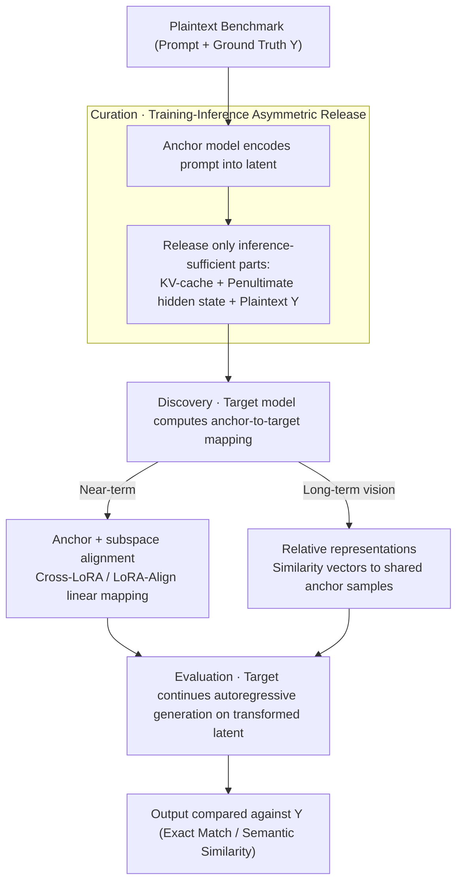

# LLM Benchmark Datasets Should Be Contamination-Resistant (Position Paper)

**Conference**: ICML 2026  
**arXiv**: [2605.19999](https://arxiv.org/abs/2605.19999)  
**Code**: None (position paper)  
**Area**: LLM Security / Evaluation Benchmarks / Data Contamination  
**Keywords**: benchmark contamination, contamination-resistant datasets, KV-cache, training-inference asymmetry, cross-model interoperability  

## TL;DR
This position paper argues that LLM benchmarks should be **contamination-resistant**—meaning they are usable for inference but unusable for training. It proposes leveraging the fundamental asymmetry between Transformer training and inference pipelines (training requires full tokens for gradients, while inference only requires the KV-cache + penultimate layer hidden state). The authors suggest shifting benchmark release formats from plaintext to KV-cache and intermediate hidden states, combined with cross-model subspace alignment or relative representations to solve interoperability, calling for community adoption.

## Background & Motivation

**Background**: LLM benchmark contamination is a pervasive phenomenon: over 90% of MMLU samples were detected in GPT-3's training data, Llama 2 still shows 16% MMLU contamination, and multilingual benchmarks reach detection rates as high as 91.8%. Once a benchmark is ingested during pre-training, model scores reflect "memorization" rather than "generalization"—Zhang et al. 2024 tested Mistral with a non-public mirror of GSM8K and saw a 13% drop in accuracy.

**Limitations of Prior Work**: Existing countermeasures are insufficient:
- **Keep private + Third-party evaluation**: Prevents leakage but raises the barrier to innovation and makes independent verification difficult.
- **Dynamic benchmarking**: Frequent updates lose long-term baselines for comparison.
- **Decontamination (identifying and deleting leaked samples)**: Identification precision drops sharply under trillion-token corpora.
- **Rephrasing**: Results in loss of quality and difficulty control.

Critically, once a benchmark is public, it is rapidly duplicated across repositories, forums, and secondary datasets; even gated benchmarks leak indirectly through distillation or continuous pre-training.

**Key Challenge**: To evaluate (infer) a benchmark, the model must access the content; however, public content will inevitably leak into the next training cycle. This appears to be an intractable trade-off.

**Goal**: Establish the conceptual framework for "Contamination-Resistant Datasets (CRD)"—a format that maintains inference utility but cannot be effectively learned during training.

**Key Insight**: There is a fundamental mathematical asymmetry between Transformer training and inference pipelines. Training requires the full sequence of tokens to calculate gradients (next-token prediction requires seeing the prefix tokens), whereas inference only requires the KV-cache and the penultimate layer hidden state. If the release format exposes only the parts needed for inference while hiding those needed for training, it is theoretically possible to achieve "inferable but not trainable" benchmarks.

**Core Idea**: Release benchmarks as the triplet $(KV\text{-}cache,\ h^{(L-1)}_t,\ Y)$ (KV-cache + penultimate hidden state + plaintext ground truth) instead of raw tokens. During inference, the model can continue generation; during training, the lack of a token sequence prevents calculating the loss. Cross-model representation alignment is used to ensure one benchmark can serve multiple LLMs.

## Method

### Overall Architecture

The paper does not propose a specific algorithm but establishes a verifiable conceptual framework for "Contamination-Resistant Datasets (CRD)": shifting the **release medium** from raw tokens to intermediate representations that suffice for inference but not for training. This ensures any model can run the evaluation without "ingesting" the data for training. The paper formalizes CRD via Definition 2.1 and provides an implementation roadmap and cross-model reuse scheme.

**Definition 2.1 (CRD)**: For a model $\mathcal{M}$ and transformation $\phi$, a dataset $\phi(\mathcal{D})$ is contamination-resistant if it simultaneously satisfies: **Inference Utility**—$\mathcal{M}(\phi(\mathcal{D}))$ yields valid task performance; **Non-trainability**—$\nabla_\theta \mathcal{L}(\mathcal{M}_\theta, \phi(\mathcal{D}))$ does not improve model generalization. A qualified CRD must also possess three properties: **Irreversibility**—computationally infeasible to reconstruct plaintext $\mathcal{D}$ from $\phi(\mathcal{D})$; **Equivalence**—$\mathcal{M}(\phi(\mathcal{D})) \approx \mathcal{M}(\mathcal{D})$; and **Interoperability**—ability to derive $\phi_1(\mathcal{D})$ for other models $\mathcal{M}_1$ from $\phi(\mathcal{D})$.

The corresponding evaluation workflow consists of three steps: **Curation**, where the provider uses an anchor model to encode the prompt into latent representations; **Discovery**, where the target model computes an anchor-to-target transformation mapping; and **Evaluation**, where the target model performs autoregressive generation on the transformed latent to provide answers.

### Key Designs

**1. Using Transformer Training-Inference Asymmetry for CRD: Decoupling at the Architectural Level**

This is the foundation of the position. The paper observes that the two pipelines are mathematically asymmetrical: training requiring the next-token loss $\mathcal{L} = -\sum_t \log P(x_t \mid x_{<t})$ must see the full sequence $x_1,\dots,x_T$ to compute gradients layer-by-layer. In contrast, inference only needs the KV-cache $\{K_{1:t}^{(l)}, V_{1:t}^{(l)}\}_{l=1}^L$ and the penultimate hidden state $h_t^{(L-1)}$ to generate new tokens. CRD releases only these intermediate representations. Users can replicate evaluation scores but cannot compute a usable training loss without the token sequence. Unlike existing unlearnable data schemes (adversarial perturbations/shortcuts) designed for images that fail when paraphrased in text, this approach leverages architectural properties, preventing attackers from fine-tuning even with KV-cache access. Irreversibility can be further reinforced: while KV-cache inversion is possible for standard MHA, its effectiveness drops significantly with modern architectures like GQA/MLA.

**2. Anchor Model + Subspace Alignment for Interoperability: Serving Multiple Target LLMs**

Releasing a KV-cache encoded by a specific model creates a silo. The proposed near-term solution involves choosing a widely-deployed anchor model. Target models then use Cross-LoRA style LoRA-Align (rank-truncated SVD + Frobenius-optimal linear mapping) to project representations from the anchor subspace to their own. This process uses only model weights and does not touch plaintext, preserving irreversibility. Anchor models are selected based on architectural similarity (e.g., GQA, SwiGLU, RMSNorm) to maximize transfer fidelity.

**3. Relative Representations as a Long-term Vision: Moving Beyond Anchor Models**

To avoid bias toward specific model families, the paper suggests a more symmetric direction: using the Platonic Representation Hypothesis and relative representations. By agreeing on a small set of shared anchor samples (100–500), every latent point is rewritten as a similarity vector relative to these samples. These relative representations are invariant across different latent spaces, allowing zero-shot cross-model stitching and evaluation within a universal coordinate system.

## Key Experimental Results

### Pervasiveness of Contamination (Review)

| Model | Benchmark | Contamination Proportion |
|------|------|--------|
| GPT-3 | Multiple | > 90% flagged |
| Llama-2 | MMLU | 16%+ |
| Avg. Mainstream LLMs | Multilingual | Up to 91.8% |
| Mistral | GSM8K Mirror vs. Public | 13% Accuracy Gap |

### Manageable Storage Overhead

| Benchmark | Raw Token Count | Full KV-cache | PyramidKV (12%) Comp. | Dropping Non-critical Tokens |
|------|---------|-------------|-------------------|------------------|
| 100K tokens (Llama-2 7B) | 100K | 50 GB | 6 GB | **350 MB** |
| MMLU | ~5M | 2.5 TB | 300 GB | ~17 GB |

PyramidKV research suggests 12% retention is sufficient; removing formatting and generic instruction tokens can further reduce overhead to 0.7%.

### Compatibility Table

| Benchmark Type | Examples | CRD Compatible |
|--------|------|--------|
| Single-turn QA | MMLU, SQuAD, HumanEval | ✅ |
| Classification/Labeling | GLUE, SuperGLUE, ImageNet | ✅ |
| Multimodal | COCO, Flickr30K | ✅ |
| Code Generation | CodeContests, APPS | ✅ |
| Summarization | CNN/DailyMail, XSum | ✅ |
| Multi-turn Dialogue | CoQA, MultiWOZ | ⚠️ Partial (input-output coupling) |
| Dynamic Agent | WebShop, ALFWorld | ❌ (Environment feedback) |
| Interactive | DynaBench, AdaTest | ❌ (Instances vary by output) |

### Key Findings
- **Compatible with most static benchmarks**: QA, classification, code, and summarization work well.
- **Storage is not a bottleneck**: With KV-cache compression and selective dropping, storage is in the same order of magnitude as original benchmarks.
- **Irreversibility depends on architecture**: Modern attention mechanisms like GQA significantly degrade the effectiveness of inversion attacks.
- **Interoperability has technical foundations**: Cross-LoRA and relative representations are already validated in representation transfer literature.

## Highlights & Insights
- **Architectural vs. Data Level Solution**: Most unlearnable data methods use "perturbation + noise"; this paper proposes a fundamental paradigm shift in the release medium.
- **Underestimated "Free Lunch" of Asymmetry**: The mathematical structure of Transformers inherently provides a boundary between inference and training that can be exploited for security.
- **Formalization of Three Properties**: Defining irreversibility, equivalence, and interoperability transforms a vague concept into a verifiable set of attributes.
- **Interdisciplinary Synthesis**: Leveraging the Platonic Representation Hypothesis and representation alignment literature to build evaluation infrastructure.

## Limitations & Future Work
- Primarily applicable to Transformer-based models; SSMs like Mamba or RWKV are not directly compatible.
- KV-cache inversion remains a risk for MHA models; GQA/MLA provide practical security but not a mathematical guarantee.
- Equivalence is difficult to strictly verify; benchmark providers need standardized calibration/backtest protocols.
- Anchor model selection may introduce bias (marginalizing smaller model families).
- Multi-turn, dynamic, and interactive benchmarks require specialized adaptation.
- While storage is manageable (350MB/100K tokens), full MMLU-scale datasets still exceed 17GB, requiring further optimization.

## Related Work & Insights
- **vs. Decontamination**: Decontamination is inaccurate at scale; CRD is proactive prevention rather than reactive detection.
- **vs. Private Benchmarks**: Private benchmarks hinder open science; CRD is public but non-trainable.
- **vs. Dynamic Benchmarks**: Dynamic versions lose comparability; CRD remains static and reproducible.
- **vs. Unlearnable Data (CV)**: Image perturbations are easily bypassed by text paraphrasing; CRD bypasses data-level obfuscation entirely.
- **Insight**: Using the mathematical properties of model architectures as a resource for security/privacy infrastructure can be extended to model attribution, watermarking, and other LLM governance issues.

## Rating
- Novelty: ⭐⭐⭐⭐⭐ Decoupling through architectural asymmetry is a truly original direction.
- Experimental Thoroughness: ⭐⭐⭐ (Position paper) — Focuses on logical argumentation and feasibility rather than SOTA numbers.
- Writing Quality: ⭐⭐⭐⭐ Clear formalization of properties and intuitive diagrams.
- Value: ⭐⭐⭐⭐⭐ Addresses fundamental flaws in the current evaluation ecosystem.

<!-- RELATED:START -->

## Related Papers

- [\[ICML 2026\] Position: Machine Learning for Heart Transplant Allocation Policy Optimization Should Account for Incentives](position_machine_learning_for_heart_transplant_allocation_policy_optimization_sh.md)
- [\[ICML 2026\] Position: Beyond Sensitive Attributes, ML Fairness Should Quantify Structural Injustice via Social Determinants](position_beyond_sensitive_attributes_ml_fairness_should_quantify_structural_inju.md)
- [\[ICML 2026\] Watermarking LLM Agent Trajectories (ACTHOOK)](watermarking_llm_agent_trajectories.md)
- [\[ICML 2026\] MedMosaic: A Challenging Large Scale Benchmark of Diverse Medical Audio](medmosaic_a_challenging_large_scale_benchmark_of_diverse_medical_audio.md)
- [\[ICML 2026\] Position: Uncertainty Quantification in LLMs is Just Unsupervised Clustering](position_uncertainty_quantification_in_llms_is_just_unsupervised_clustering.md)

<!-- RELATED:END -->
