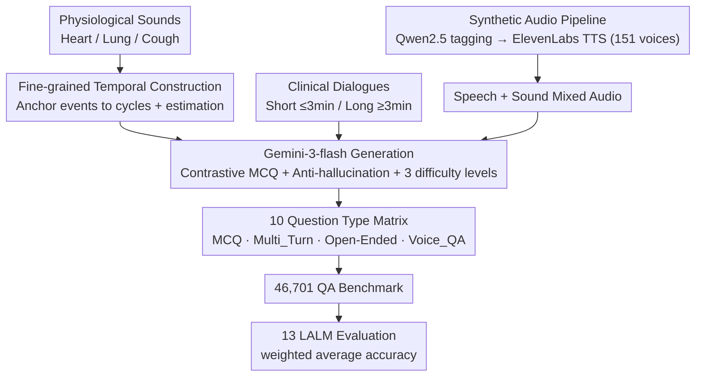

# MedMosaic: A Challenging Large Scale Benchmark of Diverse Medical Audio

**Conference**: ICML 2026  
**arXiv**: [2605.00969](https://arxiv.org/abs/2605.00969)  
**Code**: Sample data https://shorturl.at/Lyp33  
**Area**: Medical Audio / Multimodal Evaluation  
**Keywords**: Medical Audio QA, Synthetic Clinical Speech, Multi-turn reasoning, Open-ended response, Embedded Voice QA

## TL;DR
MedMosaic constructs a medical audio QA benchmark (46,701 QAs, 10 question types) covering physiological sounds and real/synthetic clinical dialogues via a synthetic pipeline. Systematic evaluation of 13 audio/multimodal models reveals that even Gemini-2.5-Pro achieves only approximately 68.1% weighted accuracy, uncovering fundamental shortfalls of contemporary LALMs in medical audio reasoning.

## Background & Motivation

**Background**: With the rise of LLMs/MLLMs/LALMs, evaluation focus has shifted from "single-modal recognition" to "cross-modal multi-step reasoning." General audio QA has established benchmarks like ClothoAQA, MMAU, MMAU-Pro, MDAR, MMAR, AudioBench, and AudioPedia. On the model side, Qwen-Audio, Audio Flamingo, SALMONN, LTU-AS, and AudioPaLM are rapidly progressing.

**Limitations of Prior Work**: (1) Existing audio QA benchmarks focus almost entirely on general ambient sounds, music, and short speech segments. Medical audio is extremely scarce, with CaReAQA being a rare attempt but limited in scale and testing only short independent clips. (2) Textual medical QA (MedQA, MeDiaQA) strips away all acoustic information, failing to evaluate clinical clues like "cough quality, respiratory rhythm, vocal stress, and conversational hesitation" that are only conveyable through sound. (3) Evaluation protocols overly rely on closed-ended multiple-choice questions (MCQ), failing to examine generative reasoning; they lack scenarios like long-duration dialogues, multi-turn interactions, and embedded voice QAs found in real clinical interactions.

**Key Challenge**: Medical decision-making strongly depends on the ability to "align semantics with acoustic markers." However, existing benchmarks lack both long-duration multi-source audio data and queries targeting multi-hop clinical reasoning. Meanwhile, medical data is difficult to collect at scale due to privacy concerns and annotation costs.

**Goal**: (i) Construct a large-scale medical audio QA benchmark across multiple audio types (physiological sounds + short/long clinical dialogues) and various reasoning modes (MCQ, multi-turn, open-ended, embedded voice QA); (ii) Propose a controllable synthetic audio generation pipeline to scale the benchmark on demand; (iii) Systematically evaluate mainstream LALMs to quantify the current capability ceiling.

**Key Insight**: The authors found that "Synthesis + Expert Prompting" can precisely control the complexity of clinical scenarios (cough embedding, emotion tagging, timeline information distribution) without accessing real patient data. Using Gemini-3-flash as a QA generator, coupled with carefully designed prompts (10 highly similar distractors per question + anti-hallucination constraints), allows for the production of large-scale and difficult queries.

**Core Idea**: Construct a large and challenging medical audio QA benchmark using a "synthetic pipeline + rigorous anti-hallucination prompts + 10 question types." Incorporate open-ended questions and embedded voice QA to expose the medical reasoning capabilities of LALMs to multi-dimensional testing.

## Method

### Overall Architecture
MedMosaic aims to create a large-scale medical audio QA benchmark where answers cannot be obtained without listening to the audio. The pipeline consists of three stages. The first is **Preparation**: Three categories of audio materials are gathered—physiological sounds (heart/lung/cough), clinical dialogues (short $\le 3$ min / long $\ge 3$ min), and "Speech+Sound" mixed audio generated via a "Synthetic Audio Generation Pipeline" (using Qwen 2.5 14B to add acoustic placeholder tags to transcripts, then synthesized via ElevenLabs v3 TTS with 151 voices, embedding non-verbal clinical clues like coughs and sighs). The second stage is **Generation**: The three sources are fed into specifically designed Gemini-3-flash prompts. Sound-only data undergoes "fine-grained temporal construction," while others share "Strong Contrastive MCQ + Anti-hallucination constraints," categorized into Easy/Medium/Hard difficulties. The third stage is **Implementation & Evaluation**: 46,701 QAs are spread across 10 question types (including new types: Voice_QA, Multi_Turn, Open-Ended), evaluated using 13 LALMs to calculate weighted average accuracy. The core difficulty stems from prompt engineering: except for open-ended questions, each query includes 10 "lexically similar yet semantically distinct" options, forcing models to rely on true acoustic understanding rather than keyword matching.

### Key Designs

**1. Synthetic Audio Generation Pipeline: Embedding non-verbal clinical clues without real patient data**
Existing open-source medical audio is either pure speech or isolated sound segments, lacking complex acoustic scenarios like "a doctor speaking while interspersed with coughs, wheezing, or sighs." Real-world collection is limited by privacy and cost. MedMosaic fills this gap with a synthetic pipeline: first using Qwen 2.5 14B Instruct to "enrich" original transcripts by inserting acoustic placeholder tags and pause indicators, adding respiratory sounds, pain sounds, and emotional cues across clinical categories (allergic, cardiovascular, respiratory, digestive, musculoskeletal, neurological, urinary, etc.). High-fidelity audio is then synthesized using ElevenLabs v3 TTS with 151 manually selected voices covering diverse speaker roles and demographics. Synthesis provides precise control (specifying where to embed which event and at what complexity) while avoiding real patient data, serving as the foundation for the benchmark's scalability.

**2. Fine-grained Temporal Construction for Physiological Sound QA: Raising sound-only tasks from "classification" to "temporal reasoning"**
Surface-level sound classification can often be guessed by identifying signature spectral features. MedMosaic subdivides physiological sounds into clinically relevant subcategories—lung sounds into wheeze (continuous narrowband) / crackle (short explosive wideband) / stridor (high-pitched monophonic), cough into wet / dry / pertussis (whoop) / barky, and heart murmurs across $\text{S1} \to \text{systole} \to \text{S2} \to \text{diastole}$ phases. Questions go beyond "What is this sound?" to ask "Which respiratory phase did the cough occur in?", "How did the heart rhythm change?", "Approximately how many breaths in 30 seconds?", or the "ratio of sound to silence." These require anchoring acoustic events to physiological cycles; general pre-training for sound type identification is insufficient, as models must parse internal temporal structures for counting and estimation.

**3. Contrastive MCQ + Anti-hallucination Prompting: Forcing difficulty into "listening to details" rather than "obvious options"**
A common issue in medical QA is models guessing correctly by memorizing medical knowledge without using the audio. MedMosaic implements constraints to close this loophole: each question provides 10 options where incorrect answers are deliberately "lexically similar yet semantically distinct"—reusing keywords to invalidate keyword matching. Distractors include traps like temporal misplacement (correct event, wrong phase), similar acoustic features with different clinical interpretations, or over-reliance on training data correlations. Crucially, the anti-hallucination constraint mandates that the correct answer must be derivable from the audio itself, prohibiting reliance on external knowledge bases. Combined with three difficulty levels, this turns "impossible to answer without the audio" into a rigorous requirement.

**4. Voice_QA + Multi-turn + Open-ended types: Transferring clinical interaction challenges to evaluation**
MCQ only tests "discrimination," but clinical practice involves generative interactions. MedMosaic adds three types: Voice_QA embeds questions and answers directly into the audio waveform; models must handle "context switching" and resist attention drift to answer an embedded voice question after listening to a dialogue. This simulates real scenarios where a device or colleague interrupts a patient consultation. Multi_Turn performs follow-up queries on long dialogues to test state maintenance. Open-Ended (OE_Speech / OE_Speech_Sound) allows unconstrained generation on long audio, requiring concise and correct answers as a rigorous generative reasoning test. The resulting matrix—MCQ_Sound_(Cough/Heart/Lung), MCQ_Speech, MCQ_Speech_Sound, MCQ_Long_Form, Multi_Turn, OE_Speech, OE_Speech_Sound, Voice_QA—diagnosticizes model weaknesses across single/multi-source, long-form, and interactive dimensions.

### Loss & Training
N/A (Evaluation only). All QAs were generated by Gemini-3-flash. Evaluation was conducted on 13 candidate models (Audio Flamingo 3, Audio Reasoner, Baichuan-Omni, Desta25-Audio, Gama, Gemini-2.5-flash/pro, Qwen-2.5-Omni, etc.).

## Key Experimental Results

### Main Results (Table 1 Excerpt, Accuracy %)

| Model | Weighted Avg | MCQ_Speech | MCQ_Sound_Heart | OE_Speech | Voice_QA |
|---|---|---|---|---|---|
| Audio-flamingo-3 | 24.1 | 10.7 | 37.8 | 55.2 | 0.1 |
| Audio-reasoner | 32.8 | 23.7 | 35.6 | 51.2 | 9.9 |
| Baichuan-omni | 38.6 | 43.5 | 26.6 | 57.6 | 31.5 |
| Desta25-audio | 41.0 | 49.4 | 37.1 | 56.0 | 9.1 |
| Gama | 23.2 | 12.7 | 36.6 | 38.1 | 8.9 |
| Gemini-2.5-flash | 60.5 | 73.6 | 52.8 | ... | ... |
| **Gemini-2.5-Pro** | **~68.1** | (Best per category reported) | | | |
| Qwen-2.5-Omni-7B | 42.8 | ... | ... | ... | ... |

The strongest commercial model, Gemini-2.5-Pro, only reached 68.1% weighted average, confirming the benchmark's difficulty.

### Ablation Study / Type Comparison

| Phenomenon | Description |
|---|---|
| Voice_QA: Most models < 32%, some < 1% | Embedded Voice QA is the biggest current weakness—extremely poor context switching capability. |
| OE_Speech generally better than MCQ_Speech | High open-ended scores result from lenient grading (points given for factual overlap), not necessarily deeper understanding. |
| MCQ_Sound_Heart > MCQ_Sound_Cough / Lung | Heart sounds have more regular temporal structures (S1/S2), making them easier to identify than stochastically occurring coughs/lung sounds. |
| MCQ_Long_Form generally low | Long-form dialogue reasoning is a universal weakness, consistent with literature stating LALMs struggle with long contexts. |

### Key Findings
- Even the strongest general models perform far below human clinical levels (>90%), proving medical audio reasoning is not yet covered by existing LALMs. Specialized pre-training/adaptation is necessary.
- Audio-flamingo-3 scored nearly zero (0.1%) on Voice_QA, indicating a total lack of "context switching" capability—a benchmark dimension revealed by embedded queries.
- The synthetic QA pipeline finds a sweet spot between "minimal human supervision" and "maximum benchmark difficulty," validating synthetic data as a scalable evaluation paradigm for privacy-sensitive fields.

## Highlights & Insights
- Decomposing medical audio into an orthogonal matrix (sound-only, speech-only, speech+sound, voice-embedded) allows for precise diagnostic of model shortcomings—a reproducible methodology for clinical evaluation.
- The anti-hallucination constraint (answers must be derivable from audio, distractors need independent clinical interpretations) is a rigorous prompt engineering paradigm applicable to other domain-specific QA sets.
- The Voice_QA design is a genuine innovation—clinically, doctors need "continuous listening + interrupted response" capabilities, which were entirely missing from previous benchmarks.

## Limitations & Future Work
- Data is synthetic rather than real clinical recordings, maintaining a domain gap; the authors mitigate this by "preserving clinical artistry" and "embedding physical artifacts," but it remains an issue.
- Annotations rely on Gemini-3-flash, risking the injection of generator bias into the benchmark.
- The 13 evaluated models are primarily general LALMs; there is a lack of comparison with models fine-tuned specifically for medical audio (e.g., a future MedAudio-LLM).
- The open-ended scoring protocol is briefly described, leaving room for improved reproducibility.

## Related Work & Insights
- **vs CaReAQA**: CaReAQA handles medical audio but is smaller and limited to short clips; MedMosaic scales this by two orders of magnitude and adds multi-turn/embedded QA.
- **vs MMAU / MMAU-Pro / MMAR**: These are general audio QA benchmarks; MedMosaic provides depth in the medical sub-domain, complementing MMAU-Pro.
- **vs CORAAL-QA**: While CORAAL-QA focuses on long-form multi-turn interaction, MedMosaic introduces domain expertise and physiological sound specificity.
- **vs MedQA (Text)**: MedQA focuses on textual clinical knowledge; this work is the first to systematically complete the "clinical reasoning evaluation in the audio dimension."

## Rating
- Novelty: ⭐⭐⭐⭐ Embedded Voice_QA, multi-turn dialogues, and physiological temporal reasoning are firsts for medical audio benchmarks.
- Experimental Thoroughness: ⭐⭐⭐⭐ Evaluated 13 models across 10 types; missing: human baseline comparison and medical-specific fine-tuned models.
- Writing Quality: ⭐⭐⭐ Diagrams are clear and prompt templates are detailed; however, some experimental details (e.g., open-ended metrics) are brief.
- Value: ⭐⭐⭐⭐ Provides the first large-scale scalable benchmark for medical audio LALMs; the synthetic data paradigm is useful for other privacy-sensitive sectors.

<!-- RELATED:START -->

## Related Papers

- [\[CVPR 2026\] AVFakeBench: A Comprehensive Audio-Video Forgery Detection Benchmark for AV-LMMs](../../CVPR2026/ai_safety/avfakebench_a_comprehensive_audio-video_forgery_detection_benchmark_for_av-lmms.md)
- [\[ICML 2026\] LLM Benchmark Datasets Should Be Contamination-Resistant (Position Paper)](llm_benchmark_datasets_should_be_contamination-resistant.md)
- [\[ICML 2026\] FoeGlass: Simple In-Context Learning Is Enough for Red Teaming Audio Deepfake Detectors](foeglass_simple_in-context_learning_is_enough_for_red_teaming_audio_deepfake_det.md)
- [\[ICML 2026\] Stable-GFlowNet: Toward Diverse and Robust LLM Red-Teaming via Contrastive Trajectory Balance](stable-gflownet_toward_diverse_and_robust_llm_red-teaming_via_contrastive_trajec.md)
- [\[ICML 2026\] Differentially Private Preference Data Synthesis for Large Language Model Alignment](differentially_private_preference_data_synthesis_for_large_language_model_alignm.md)

<!-- RELATED:END -->
