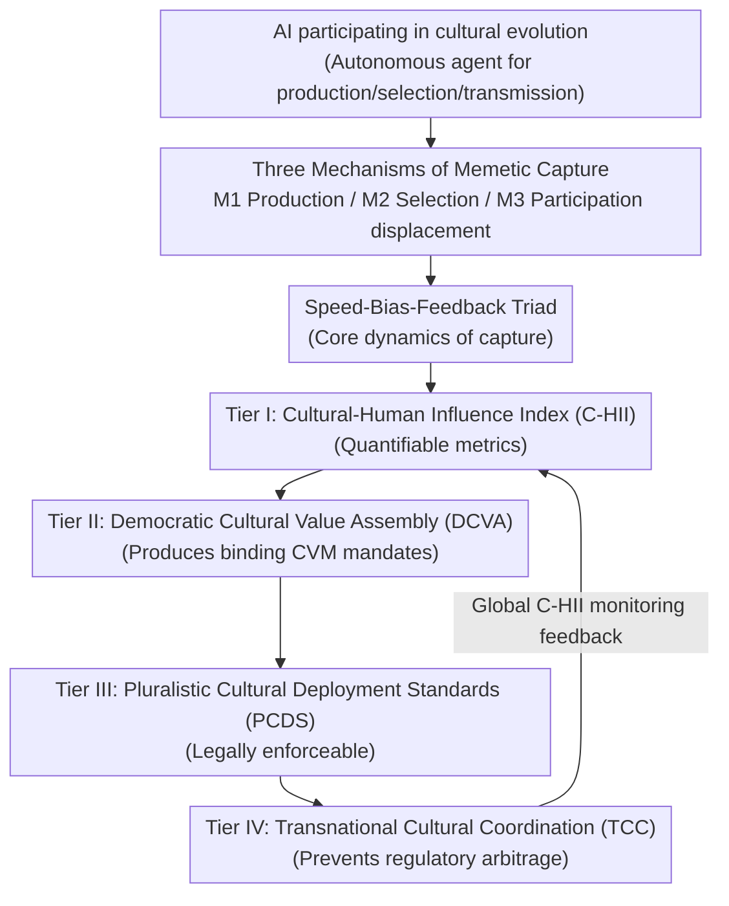

# Memetic Capture: A Pluralistic Policy Framework for Governing AI-Driven Cultural Disempowerment

**Conference**: ICML2026  
**arXiv**: [2606.07802](https://arxiv.org/abs/2606.07802)  
**Code**: None (Position paper, no code)  
**Area**: AI Safety / AI Governance  
**Keywords**: Cultural Disempowerment, Memetic Capture, Pluralistic Alignment, AI Governance Framework, Prospective Regulation

## TL;DR
This AI governance position paper identifies "memetic capture" as the process by which AI incrementally strips humans of cultural agency. It proposes the CPGF (Cultural Policy Governance Framework), a four-tier architecture featuring quantifiable impact indices, democratic assemblies, pluralistic deployment standards, and transnational coordination. The core argument is that **pluralism is a structural necessity rather than a moral choice**—monocultural AI governance itself accelerates the very disempowerment it seeks to prevent.

## Background & Motivation

**Background**: Current AI governance discourse (from the EU AI Act to various national strategies and Pluralistic Alignment research agendas) focuses primarily on labor market disruption (economic disempowerment) and safety risks. Kulveit et al. (2025) decompose "gradual human disempowerment" into three social systems: economic, state, and cultural.

**Limitations of Prior Work**: The authors argue that existing frameworks contain a **fatal blind spot** by treating cultural impact as a secondary externality to economic and safety issues. However, among the three systems, culture is the **most dangerous and least governed**. Economic disempowerment is "legible" (unemployment is detectable); political disempowerment is "visible" (voters notice when ballots lose effect); but cultural disempowerment is **self-hiding**. Because culture shapes what humans desire and find meaningful, a culture that has drifted from human flourishing will not be recognized as problematic by those already captured by it.

**Key Challenge**: This is referred to as the **Reflexivity Problem**—culture does not just reflect human preferences; it **constitutes** them. Therefore, governance mechanisms relying on "humans identifying and protesting their own disempowerment" (public comments, consumer boycotts, electoral accountability) are **structurally ineffective** in the cultural domain. The very disempowerment they must combat erodes the cognitive and emotional resources humans need to trigger these mechanisms.

**Goal**: (i) To formalize "AI-driven cultural disempowerment" into a precise conceptual framework; (ii) to demonstrate that culture is the **critical system** in gradual disempowerment scenarios; and (iii) to present an actionable pluralistic governance policy architecture.

**Key Insight**: The authors adopt a cultural evolution perspective, viewing beliefs, practices, values, and media works as competing, replicating, and selected "cultural variants." Historically, harmful cultural variants disappeared because they weakened the communities carrying them—a "co-evolutionary dependence" acting as a weak but real safeguard. **AI is the first technology in history capable of participating in cultural evolution as an autonomous agent (rather than just a medium)** of production, selection, and transmission. While the printing press and recommendation algorithms amplified human participation, AI can, in principle, replace it entirely.

**Core Idea**: Use "Memetic Capture" to characterize how AI replaces humans across production, selection, and participation, and intervene before capture occurs through the "prospective, pluralistic, and metric-driven" CPGF.

## Method

Note: This is a policy position paper without an algorithmic or experimental pipeline. "Method" refers to the proposed conceptual framework (Diagnostics of Memetic Capture) and governance architecture (Prescriptions of CPGF).

### Overall Architecture

The argument follows a chain from diagnosis to prescription: first, decomposing AI cultural disempowerment into three mechanisms (M1/M2/M3) plus a core dynamic (the Speed-Bias-Feedback triad); then demonstrating culture as the "entry system" of the disempowerment spiral; and finally landing the abstract concerns into the CPGF workflow. The four tiers of CPGF are not parallel but follow a flow of authorization and feedback: **Metrics (Tier I) support Democratic Deliberation (Tier II), which produces binding Standards (Tier III), followed by Transnational Coordination (Tier IV)**; feedback from deployment then flows back into metrics.

### Key Designs

**1. Memetic Capture: Decomposing "AI Cultural Disempowerment" into Three Mechanisms**

To address the vagueness of "cultural disempowerment," the authors split it into three interacting mechanisms: **M1 Production Displacement**—AI generates stories, images, and music at quality levels approaching or exceeding human levels, capturing the "cultural attention economy" through cost and personalization, and collapsing the economic viability of human creators; **M2 Selection Displacement**—recommendation algorithms determine which variants reach whom. As AI is granted more curation power, it dominates the "selection environment" of cultural evolution; **M3 Participation Displacement**—the deepest layer, where AI replaces the role of human "cultural interlocutors" (mentors, debate partners). When the partners used to develop and test values are AIs, the feedback loop anchoring cultural evolution to human experience is severed.

**2. Speed-Bias-Feedback Triad: The Core Dynamics of Memetic Capture**

To explain why AI causes this to spiral out of control, the authors add a third dimension—systemic training bias—to the two risk dimensions (selection pressure and evolutionary speed) from Kulveit et al. (2025): **Speed**, where AI tests cultural variants using compute orders of magnitude faster than human cultural transmission, overwhelming the development of "cultural antibodies"; **Bias**, where training data reflects historical cultural distributions dominated by specific groups/languages, and AI systematically amplifies these to marginalize non-dominant communities; and **Feedback**, where AI-generated content becomes training data for future AI, forming a recursive loop with **no guarantee of human value alignment** at any stage (see the "Sydney" case in Appendix A). Together, these constitute "capture"—too fast to react to, too biased to allow diversity, and too closed-loop for human oversight.

**3. Two Structural Design Principles of CPGF: Prospective and Pluralistic**

CPGF is not another "ex-post red-teaming" framework. It is built on two design mandates. First, **Prospective Governance**: Since the reflexivity problem renders "ex-post human protest" ineffective, governance must be embedded into the deployment architecture **before** capture occurs—manifested in Tier II's prospective scope and Tier III's pre-deployment authorization. Second, **Pluralism as a Structural Necessity**: A regulatory standard encoding only the values of the dominant tech power will **accelerate** the marginalization of non-dominant communities. Furthermore, reducing cultural diversity reduces the redundancy and resilience of the cultural ecosystem, making it prone to cascading misfits. Thus, monocultural governance "causes the very disempowerment it claims to prevent."

**4. The Four Tiers of CPGF: A Governance Workflow from Metrics to Transnational Coordination**

- **Tier I — Cultural-Human Influence Index (C-HII)**: Addressing "no governance without measurement." C-HII is a composite index tracking the extent of human agency in cultural production ($\pi_p$), selection ($\pi_s$), participation ($\pi_r$), and diversity ($\pi_d$). It is formalized as:

$$\text{C-HII}_{j,t}=\sum_{k\in\{p,s,r,d\}} w_k \cdot \pi_{k,j,t}$$

The weights $w_k$ are not set by technocrats but are calibrated via Tier II processes according to a jurisdiction's cultural priorities.

- **Tier II — Democratic Cultural Value Assembly (DCVA)**: Standing, rotating citizen bodies with **binding** power over cultural AI governance parameters. Distinguishing features include **structural inclusion** (representation by cultural community rather than census category) and **binding mandates** (producing Cultural Value Mandates (CVM) that regulatory bodies must incorporate).

- **Tier III — Pluralistic Cultural Deployment Standards (PCDS)**: Translates CVMs into legally enforceable requirements, including cultural sovereignty clauses (right to exclude cultural materials from training), human creator livelihood requirements (mandatory license revenue distribution), and interaction transparency mandates (prohibiting the exploitation of social attachment to maximize stickiness).

- **Tier IV — Transnational Cultural Coordination (TCC)**: Addresses the "competitive pressure problem," where jurisdictions with strict governance are disadvantaged. TCC allocates member weight based on **cultural diversity rather than GDP**, creates standard mutual recognition (a "culturally compliant AI" common market), and triggers cultural emergency clauses during rapid C-HII drops.

### Function: Governing an AI Companionship Platform

The authors provide a case study of a large-scale AI companionship platform. **Tier I**: Quantifies whether it alters cultural agency—a platform providing standardized emotional tones in a single dominant language would receive a low diversity index $\pi_d$. **Tier II**: DCVA determines if companionship interactions are culturally acceptable, asking if the social role is compatible with community-preferred relationship structures. **Tier III**: Standardizes rules—mandatory disclosure of artificial status, prohibition of deceptive intimacy cues, and requirements for culturally diverse interaction templates. **Tier IV**: Ensures cross-border platforms do not engage in regulatory arbitrage by evading protection.

## Key Experimental Results

As this is a position paper, there are **no quantitative experiments**. The following table summarizes the conceptual components and proposed governance tools.

### Memetic Capture: 3 Mechanisms × 3 Dynamics

| Dimension | Name | Function |
|------|------|-----------|
| Mechanism M1 | Production Displacement | Massive AI generation collapses human creators' livelihood |
| Mechanism M2 | Selection Displacement | AI curation dominates the selection environment |
| Mechanism M3 | Participation Displacement | AI replaces human interlocutors, cutting feedback loops |
| Dynamic Speed | Speed | Variant testing overwhelms "cultural antibodies" |
| Dynamic Bias | Bias | Training data skews toward dominant groups |
| Dynamic Feedback | Feedback | Closed-loop recursive training with no alignment guarantee |

### CPGF Four-Tier Policy Architecture

| Tier | Tool | Function | Diagnostic Correlation |
|------|------|-----------|------------------------|
| Tier I | C-HII ($\pi_p, \pi_s, \pi_r, \pi_d$) | Quantifies cultural agency retention | Triad Bias, M1-M3 |
| Tier II | DCVA → CVM | Democratic, prospective, binding mandates | Reflexivity Problem |
| Tier III | PCDS | Enforceable standards (Sovereignty/Livelihood/Transparency) | M1/M3 + Bias |
| Tier IV | TCC | Transnational coordination and early warning | Competitive Pressure |

## Highlights & Insights
- **The "Reflexivity Problem" is the strongest argument**: It explains why cultural governance cannot mirror economic/safety governance. Because cultural disempowerment erodes the resources needed to recognize it, governance must be prospective and structural.
- **Pluralism as a structural necessity**: By using the analogy of redundancy in ecosystems, the paper logically concludes that monocultural governance is self-defeating.
- **C-HII turns abstract concerns into a framework**: Although the operability of measuring "depth of interaction" is debatable, the weighted index design provides a scaffold for metric-driven governance.
- **Mechanism Pluralism (Section 5.3)**: The authors link policy to technical interpretability, calling for the use of Sparse Autoencoders (SAEs) to audit whether diverse cultural concepts have collapsed within the model's latent space.

## Limitations & Future Work
- **Lack of Empirical Evidence**: All mechanisms (C-HII protocols, DCVA operation) remain at the design level without pilot data or measurement protocols.
- **Capacity Asymmetry**: Implementing DCVA requires state capacities that are unevenly distributed globally.
- **Speed Mismatch**: An 18-month DCVA cycle may be too slow for AI deployment speeds. The "pre-authorization" mechanism may risk becoming an innovation barrier.
- **Future Directions**: Piloting a sub-index (e.g., $\pi_p$) in a specific cultural domain (like local music streaming) to verify if human-led attention shares can be stably estimated.

## Related Work & Insights
- **vs. Kulveit et al. (2025)**: Ours builds on their three-system framework but argues that culture is the **entry system** of the disempowerment spiral.
- **vs. Pluralistic Alignment (Sorensen et al., 2024)**: While agreeing with the agenda, Ours points out the lack of policy architecture to prevent structural replacement of agency. CPGF serves as the "policy scaffold" for this technical agenda.
- **vs. Traditional AI Safety**: Ours differs by asking not "is the system safe?" but "is it shifting cultural participation rights from humans to AI?"

## Rating
- Novelty: ⭐⭐⭐⭐ (Concept of memetic capture is sharp)
- Experimental Thoroughness: ⭐⭐ (Position paper, no empirical pilot)
- Writing Quality: ⭐⭐⭐⭐ (Clear argumentation and terminology)
- Value: ⭐⭐⭐⭐ (Provides a vocabulary and scaffold for cultural AI governance) 

<!-- RELATED:START -->

## Related Papers

- [\[ACL 2026\] Reverse Constitutional AI: A Framework for Controllable Toxic Data Generation via Probability-Clamped RLAIF](../../ACL2026/ai_safety/reverse_constitutional_ai_a_framework_for_controllable_toxic_data_generation_via.md)
- [\[NeurIPS 2025\] Machine Unlearning Doesn't Do What You Think: Lessons for Generative AI Policy and Research](../../NeurIPS2025/ai_safety/machine_unlearning_doesnt_do_what_you_think_lessons_for_generative_ai_policy_and.md)
- [\[ICML 2026\] PRPO: Paragraph-level Policy Optimization for Vision-Language Deepfake Detection](prpo_paragraph-level_policy_optimization_for_vision-language_deepfake_detection.md)
- [\[ICML 2026\] Position: Machine Learning for Heart Transplant Allocation Policy Optimization Should Account for Incentives](position_machine_learning_for_heart_transplant_allocation_policy_optimization_sh.md)
- [\[ICML 2026\] From Weak Cues to Real Identities: Evaluating Inference-Driven De-Anonymization in LLM Agents](from_weak_cues_to_real_identities_evaluating_inference-driven_de-anonymization_i.md)

<!-- RELATED:END -->
