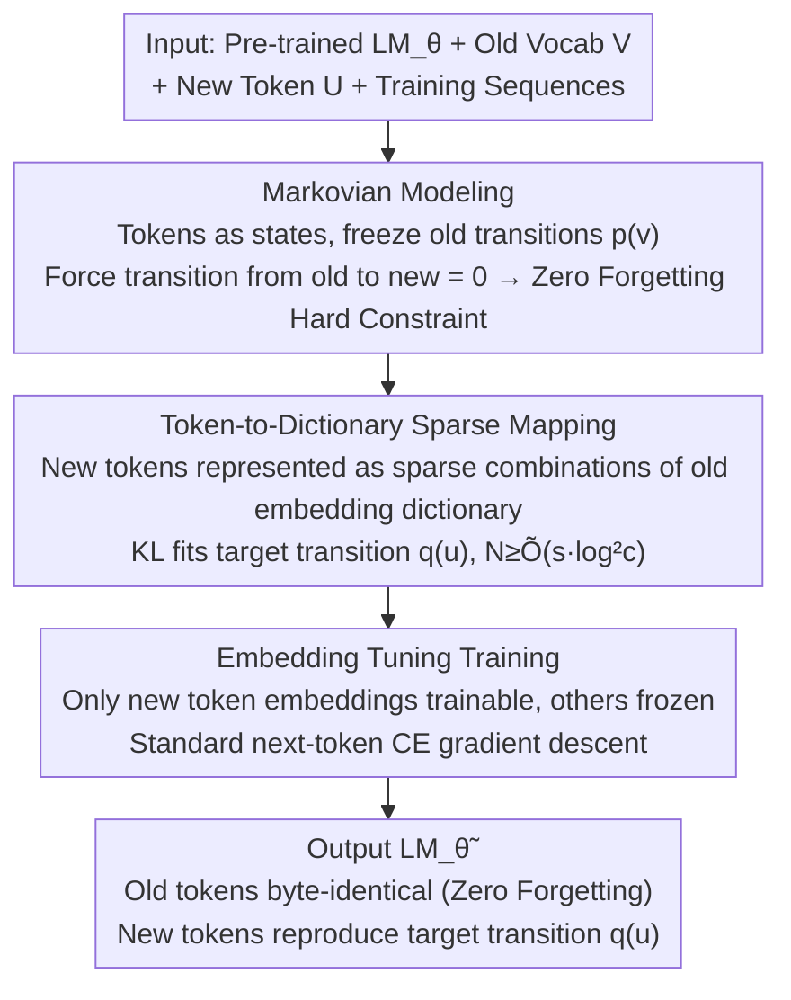

# Memory as a Markov Matrix: Sample Efficient Knowledge Expansion via Token-to-Dictionary Mapping

**Conference**: ICML 2026  
**arXiv**: [2605.04308](https://arxiv.org/abs/2605.04308)  
**Code**: None  
**Area**: LLM Continual Learning / Vocabulary Expansion / Anti-forgetting  
**Keywords**: Markov Process, Vocabulary Expansion, embedding tuning, zero forgetting, sample complexity

## TL;DR
The next-token distribution of an autoregressive LLM is interpreted as the state transition matrix of a Markov chain. Consequently, "learning new words" becomes "adding new states to the state space and representing them as sparse combinations of existing states." Theoretically, this requires only $O(s)$ samples (where $s$ is the number of mapped old tokens), and in practice, fine-tuning only the new token embeddings achieves cross-lingual or new concept expansion with strictly zero forgetting.

## Background & Motivation

**Background**: Adapting pre-trained LLMs to new vocabulary, entities, or domains (e.g., "COVID-19", specific technical terms, cross-lingual transfer) is a core requirement of continual learning. Mainstream approaches include full fine-tuning, LoRA, prompt tuning, or retrieval-augmented generation.

**Limitations of Prior Work**: Even on modern models like Llama-3 or Qwen-2.5, standard fine-tuning still exhibits significant catastrophic forgetting—which becomes more severe as the model size increases. Furthermore, model updates are irreversible; once corrupted, the model cannot be easily restored.

**Key Challenge**: Modern LLMs are already highly expressive. Updating billions of parameters just to "accommodate a small set of new knowledge" is counter-intuitive and inherently contaminates the transition relationships between old tokens.

**Goal**: To establish a clean mathematical framework for "adding $m \ll T$ new tokens without destroying the transition relationships among the original $T$ tokens" and to provide provable sample complexity.

**Key Insight**: An LLM is viewed as a Markov chain—tokens are states, and $p_\theta(\cdot \mid x_t)$ is the transition probability vector. In this perspective, "no forgetting" is equivalent to "keeping the transition matrix between old states unchanged," and "adding new knowledge" is equivalent to "expanding the state space from $\mathcal{V}$ to $\mathcal{V} \cup \mathcal{U}$."

**Core Idea**: Each new token $u$ only needs to be represented as a sparse linear combination of several existing tokens (in embedding space $\bm{\alpha}^{(u)} \in \mathbb{R}^T$, $\|\bm{\alpha}^{(u)}\|_0 \le s$) to reuse the semantic structure of the existing dictionary. The implementation involves fine-tuning only the embedding vectors of new tokens while freezing all other weights, thereby strictly guaranteeing zero forgetting.

## Method

### Overall Architecture
This paper addresses adding new tokens (new words, entities, languages) to a pre-trained LM such that they are functional without damaging the transition relationships between tens of thousands of original tokens. The problem is solved by modeling the autoregressive model as a first-order Markov chain—tokens are states, and $p_\theta(\cdot \mid x_t)$ is the transition probability vector from the current state. "Learning new words" is translated into two clean tasks: adding a new state in the state space and representing it as a sparse combination of existing states. The pipeline starts from the input pre-trained $\texttt{LM}_\theta$, old vocabulary $\mathcal{V}$, a small set of new tokens $\mathcal{U}$, and training sequences containing new tokens. First, the Markovian perspective formulates "no forgetting" as a hard constraint on old transitions. Then, a sparse dictionary hypothesis is used to derive that each new token requires only $O(s)$ samples. Finally, an extremely simple implementation is adopted—only the new token embeddings are set as trainable while all other weights are frozen. The resulting $\texttt{LM}_{\tilde{\theta}}$ remains byte-by-byte identical to the original model on old tokens (zero forgetting) while reproducing the target transition distribution $\mathbf{q}^{(u)}$ for new tokens.

### Key Designs

**1. Markovian Knowledge Expansion: Upgrading "Zero Forgetting" from Empirical Observation to Structural Constraint**

Standard fine-tuning causes catastrophic forgetting because it modifies the transition relationships between all tokens simultaneously, with no guarantee that old moves remain unpolluted. Ours explicitly writes the generation process as a Markov chain: old transitions $\mathbf{p}^{(v)} \in \Delta(\mathcal{V})$ are given by the pre-trained model. When introducing new token $u$, only a new $\mathbf{q}^{(u)} \in \Delta(\mathcal{V})$ is learned, while $p_{\tilde{\theta}}(u \mid v) = 0$ and $p_{\tilde{\theta}}(u_i \mid u_j) = 0$ are enforced (old tokens do not transition to new tokens, and new tokens do not transition to each other). Consequently, as long as the current state $x_t \in \mathcal{V}$, $p_{\tilde{\theta}}(\cdot \mid x_t)$ is identical to the original model, making the forgetting exactly zero. This converts "behavior preservation" from an empirical goal suppressed by regularization into a derived equality constraint—zero forgetting is a structural fact guaranteed by the framework.

**2. Token-to-Dictionary Sparse Mapping: Representing new concepts via sparse combinations of the old dictionary and mapping semantic granularity to sample complexity**

New concepts rarely emerge from thin air—"COVID-19" is semantically close to a mixture of old words like "virus / disease / outbreak." Ours formalizes this intuition: let $f: \mathbb{R}^d \to \Delta(\mathcal{V})$ be the model's logit head. The goal is to find coefficients $\bm{\alpha}^{(u)} \in \mathbb{R}^T$ for new token $u$ such that the combination $\mathbf{E}^\top \bm{\alpha}^{(u)}$ of the old embedding dictionary $\mathbf{E} \in \mathbb{R}^{T \times d}$ reproduces the target transition $\mathbf{q}^{(u)}$ through $f$, i.e., $f(\mathbf{E}^\top \bm{\alpha}^{(u)}) = \mathbf{q}^{(u)}$. Optimization is performed with sparse and bounded constraints $\|\bm{\alpha}^{(u)}\|_0 \le s, \|\bm{\alpha}^{(u)}\|_2 \le B$ using KL divergence to fit the empirical distribution $\hat{\mathbf{q}}^{(u)}$. The paper proves that the required sample size $N \ge \tilde{O}(s \log^2 c)$ depends only on the number of old tokens mapped to (sparsity $s$), independent of the old vocabulary size $T$ or model dimension $d$. This suggests that the cost of learning a new concept is determined by its semantic granularity—even with a massive vocabulary, learning a word that is essentially a "combination of 3 or 4 old words" is inexpensive.

**3. Embedding Tuning Training Algorithm: Implementing mapping in Transformers with minimal cost and leveraging orthogonality for zero forgetting**

The implementation is simple: the embedding rows corresponding to new tokens (e.g., the 3072-dimensional vector of `<|reserved_special_token_0|>` in Llama-3) are the only trainable parameters. All 3 billion other parameters are frozen. Training uses standard next-token cross-entropy gradient descent. During inference, new tokens pass through existing weights for attention/FFN; only their query vectors are modified. Training effectively "pulls" this query to a position that best reproduces $\mathbf{q}^{(u)}$. This implementation satisfies the theoretical assumptions because the updated parameters are naturally orthogonal to the transition computation graph of old tokens: an old token will never query the new embedding unless the new token actually appears in the context.

### Loss & Training
The objective is the standard next-token cross-entropy $-\sum_t \log p_{\tilde{\theta}}(x_{t+1} \mid x_{t-k:t})$ without regularization or replay. The framework is generalized to higher-order Markov chains by treating the $K$ most recent tokens as a composite state. The sample complexity results hold because the effective branching factor $b \ll T$ in natural language keeps the sparsity $s = O(Kb)$ manageable, preventing an explosion in the cost of high-order expansion.

## Key Experimental Results

### Main Results
Verified using three types of tasks: Arithmetic operator tasks where Llama-3.2-3B learns $a\langle\text{spec}\rangle b = a \times b$; Synthetic vocabulary tasks where 100 pseudo-words (e.g., "glor", "zorp") are injected; and Cross-lingual tasks adapting Qwen2.5-3B to Spanish/German/Arabic.

| Task | Model | Method | Target Metric | Forgetting (English / Addition) |
|------|------|------|----------|----------------------|
| Arithmetic ($a\langle\text{spec}\rangle b$) | Llama-3.2-3B | FFT | 77.2% acc | Addition 100% → 0% (Catastrophic) |
| Arithmetic | Llama-3.2-3B | ET | **81.4%** acc | Addition stays 100% |
| Cross-lingual (Spanish) | Qwen2.5-3B | FFT | loss 5.56 | English loss +9.83 |
| Cross-lingual (Spanish) | Qwen2.5-3B | ET | **loss 2.30** | English loss **−0.04** |
| Cross-lingual (Arabic) | Qwen2.5-3B | ET | **loss 2.82** | English loss **0.00** |

### Ablation Study

| Setting | Synthetic Vocab test loss | WikiText Forgetting |
|------|-------------------|---------------|
| Base model (Llama-3.1-8B) | — | Baseline 2.42 |
| FFT (N=1000) | 4.40 | +1.24 |
| LoRA | 7.63 | +8.36 |
| Prompt Tuning | 3.79 | +0.69 |
| ET (Ours) | 2.42 | **0.00** |

### Key Findings
- ET simultaneously achieves the "best/near-best target loss" and "exactly zero forgetting" across synthetic, cross-lingual, and arithmetic tasks, proving zero forgetting is not a trade-off for accuracy.
- For arithmetic, ET accuracy (81.4%) for $a\langle\text{spec}\rangle b$ actually exceeds the base performance for $a*b$ (63.5%). The $\langle\text{spec}\rangle$ embedding implicitly converges to a sparse combination of "$\times$ / times / multiplies", providing empirical evidence for the sparse dictionary hypothesis.
- LoRA performed worse than FFT in cross-lingual tasks (loss 7.63 vs 4.40, forgetting +8.36), showing that "fewer parameters" does not equate to "less forgetting." Forgetting depends on whether the update direction touches old transitions, not the parameter count.
- In Spanish/German, slight "negative forgetting" occurred (-0.04 / -0.08), indicating that learning related languages slightly improved English WikiText results, likely due to cross-linguistic transfer.

## Highlights & Insights
- Traditionally, "continual learning" is an empirical tuning problem; Ours transforms it into an equality problem of "Markov chain state space expansion" with analytical "zero forgetting" conditions. This applies to any autoregressive model with discrete output.
- Sample complexity depends only on mapping sparsity $s$ rather than vocabulary size $T$ or model dimension $d$, providing a guide for scaling: larger vocabularies do not necessarily make learning more expensive, provided the sparsity hypothesis holds.
- "Embedding tuning" is an extreme form of PEFT that leverages structural orthogonality between embeddings and the transition graph rather than rank constraints or prompt prefixes.

## Limitations & Future Work
- Assumes new tokens appear with uniform probability in training data; in reality, frequency distributions are likely coupled with the "mapped old token clusters."
- Assumes the LLM is sufficiently expressive ($f$ is Lipschitz and can realize any sparse combination). Sparsity might break if the model capacity is limited or if concepts are outside the dictionary's coverage.
- The method does not allow transitions from old tokens to new tokens by default, meaning new words can be "evoked" but not naturally initiated in generation—a significant constraint for generative applications.
- Experiments did not cover complex structures between new tokens (e.g., learning a whole network of domain terms), only single-point expansion.

## Related Work & Insights
- **vs LoRA / PT / Adapter**: These reduce parameter count but do not guarantee orthogonality with old transitions; thus, forgetting remains uncontrollable. Ours utilizes the structural orthogonality between the embedding table and the transition graph.
- **vs EWC / GEM / replay**: Classic methods use regularization or replay to suppress forgetting, which is difficult to scale for LLMs. Ours requires no replay or Fisher information.
- **vs FlexOlmo / model editing**: Those methods assume target behaviors are known before editing; Ours constrains the update space structurally to isolate forgetting.
- **vs Markov-LM (Zekri et al., Yüksel & Flammarion)**: While they analyze Transformer learning through a Markov lens, Ours uses this math to design a specific continual learning algorithm.

## Rating
- Novelty: ⭐⭐⭐⭐ Combining Markov perspective with sparse dictionary for provable sample complexity is a refreshing theoretical framework.
- Experimental Thoroughness: ⭐⭐⭐ Covers arithmetic, synthetic, and three languages across multiple scales, but lacks more realistic multi-domain/multi-step expansion.
- Writing Quality: ⭐⭐⭐⭐ Clear logic from motivation to theorems and algorithms; consistent notation.
- Value: ⭐⭐⭐⭐ Provides a minimal solution where "zero forgetting" and "sample efficiency" coexist, serving as a strong baseline for the continual learning community.

<!-- RELATED:START -->

## Related Papers

- [\[ICML 2026\] From Volume to Value: Preference-Aligned Memory Construction for On-Device RAG](from_volume_to_value_preference-aligned_memory_construction_for_on-device_rag.md)
- [\[ICML 2026\] Optimizing Token Choice for Code Watermarking: An RL Approach](optimizing_token_choice_for_code_watermarking_an_rl_approach.md)
- [\[CVPR 2026\] SEBA: Sample-Efficient Black-Box Attacks on Visual Reinforcement Learning](../../CVPR2026/ai_safety/seba_sample-efficient_black-box_attacks_on_visual_reinforcement_learning.md)
- [\[ICLR 2026\] Sample-Efficient Distributionally Robust Multi-Agent Reinforcement Learning via Online Interaction](../../ICLR2026/ai_safety/sample-efficient_distributionally_robust_multi-agent_reinforcement_learning_via_.md)
- [\[ICML 2026\] From Parameter Dynamics to Risk Scoring: Quantifying Sample-Level Safety Degradation in LLM Fine-tuning](from_parameter_dynamics_to_risk_scoring_quantifying_sample-level_safety_degradat.md)

<!-- RELATED:END -->
