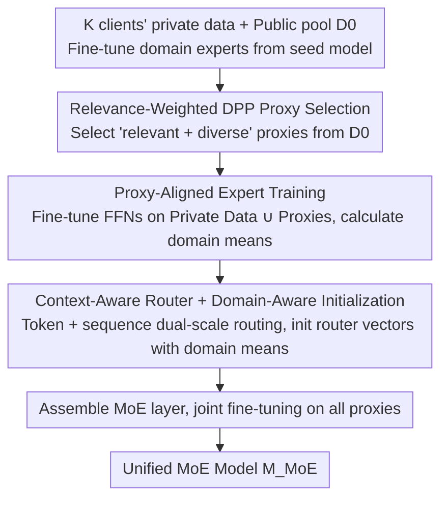

# MetaMoE: Diversity-Aware Proxy Selection for Privacy-Preserving Mixture-of-Experts Unification

**Conference**: ICML 2026  
**arXiv**: [2605.14289](https://arxiv.org/abs/2605.14289)  
**Code**: [GitHub](https://github.com/ws-jiang/MetaMoE)  
**Area**: Privacy-Preserving Learning / Mixture-of-Experts / Model Merging  
**Keywords**: MoE Unification, Privacy Protection, DPP Diversity, Proxy Data, Routing Training

## TL;DR
Expert models fine-tuned independently on private data by multiple clients can be merged into a single deployable MoE model without sharing private data. The core approach utilizes relevance-weighted Determinantal Point Processes (DPP) to select proxy samples from public data that are both "relevant and diverse." This is followed by proxy-aligned expert training and context-aware router training to align expert behavior with proxy supervision, significantly outperforming methods like FlexOlmo that rely solely on similarity for proxy selection.

## Background & Motivation

**Background**: In the era of foundation models, different organizations/users often fine-tune domain-specific experts on their private data. Model merging methods such as Branch-Train-Merge (BTM), Model Soup, and Branch-Train-MiX (BTX) attempt to fuse these experts into a single deployable model using Mixture-of-Experts (MoE) architectures and routers.

**Limitations of Prior Work**: (1) BTM outputs an ensemble rather than a unified model, complicating downstream SFT/RLHF; (2) Model Soup directly averages weights, leading to performance collapse when experts are highly heterogeneous; (3) BTX requires client private data to train the router, violating privacy constraints; (4) FlexOlmo uses public proxy samples for router training, but selects proxies based only on similarity, resulting in high redundancy, narrow coverage, and a mismatch between routing and expert behavior since experts have never seen the proxies.

**Key Challenge**: Training a router requires data representative of each client's domain, yet real client data cannot leave the local environment. Proxy data must simultaneously be "relevant to the client domain" and "cover multiple modes within that domain," which corresponds to the relevance and diversity logic of DPP.

**Goal**: (1) Provide a formal definition for the "Privacy-Preserving MoE Unification" problem; (2) Propose a proxy selection algorithm with dual control over relevance and diversity; (3) Allow experts to see their respective proxies during training to align the router's training distribution; (4) Design a router capable of utilizing both token and sequence-level contexts; (5) Provide a formal privacy analysis.

**Key Insight**: Selecting proxies based only on similarity focuses solely on how much a sample resembles the private domain, leading to the selection of redundant samples. DPP naturally generates "negative correlation" through the $\det$ term, avoiding the selection of similar samples. By embedding client-specific relevance into the DPP kernel, one can obtain proxies that are both relevant and diverse.

**Core Idea**: Construct a relevance-weighted DPP $\tilde{L}_{ij} = g(x_i, \mathcal{D}_p) \kappa(x_i, x_j) g(x_j, \mathcal{D}_p)$; select $m$ proxies via greedy Maximum A Posteriori (MAP); fine-tune experts on $\mathcal{D}_p \cup \hat{\mathcal{D}}_p$; finally, train a context-aware router to merge all FFNs into an MoE.

## Method

### Overall Architecture
The method merges $K$ domain experts, each fine-tuned on private data $\{\mathcal{D}_p\}$, into a single deployable MoE model without transferring any private data. The key transition in MetaMoE is substituting private data with "proxy samples from public data" to train the router. These proxies must be both domain-relevant and diverse for the router to learn correct routing. The unification phase involves three steps: first, use relevance-weighted DPP to select proxies from a public pool for each client; second, perform proxy-aligned expert training where FFNs are fine-tuned on "private data + proxies" (and domain mean representations are calculated); finally, assemble all expert FFNs into an MoE layer and fine-tune a context-aware router on all proxies to obtain $\mathcal{M}_\text{MoE}$.

### Key Designs

**1. Relevance-Weighted DPP Proxy Selection: Making Proxies "Relevant and Diverse"**

To learn to route inputs to the correct expert, the router must see data representing each client domain. Since private data cannot leave local storage, proxies must be selected from a public pool $\mathcal{D}_0$. FlexOlmo selects the top-$m$ samples based purely on similarity, leading to redundant samples that cluster in t-SNE visualizations with narrow coverage. MetaMoE embeds relevance into the DPP kernel: first, a binary classifier $g(x,\mathcal{D}_p)$ is trained on the public pool to distinguish $\mathcal{D}_0$ from $\mathcal{D}_p$, where the score is the relevance $r$. A kernel $\tilde{L}=\text{Diag}(r)\,L\,\text{Diag}(r)$ is constructed, where $L_{ij}=\kappa(x_i,x_j)$ is sample similarity. The subset selection objective is:

$$\hat{\mathcal{D}}_p = \arg\max_{|S|=m} \log\det(\tilde{L}_S) = 2\sum_{i\in S}\log r_i + \log\det(L_S),$$

where the first term pulls the proxy toward high relevance, and the $\det$ term in the second term penalizes the co-selection of similar samples to enforce diversity. Complexity is reduced from $O(nm^3)$ to $O(nm)$ using greedy MAP and Cholesky updates. This ensures proxies spread across the private domain manifold, covering a wider range of routing decision boundaries.

**2. Proxy-Aligned Expert Training: Eliminating Behavior Mismatch Between Router and Experts**

FlexOlmo decouples expert and router training—experts see private data while the router sees only proxies—causing a mismatch between the experts' output distribution and the router's input distribution. MetaMoE allows experts to see both private data and their corresponding proxies during fine-tuning. Each client fine-tunes only their expert's FFN sublayers on $\mathcal{D}_p \cup \hat{\mathcal{D}}_p$, keeping other layers frozen for compatibility with the seed model $\mathcal{M}_0$. A routing representation (domain mean) is calculated for each layer:

$$e_p^{(\ell)} = \frac{1}{|\mathcal{D}_p \cup \hat{\mathcal{D}}_p|} \sum_x \mathcal{M}_p^{(1:\ell)}(x).$$

By exposing experts to proxies, the input distribution the router will eventually handle is injected early, mitigating distribution mismatch.

**3. Context-Aware Router + Domain-Aware Initialization: Avoiding Misclassification of Superficially Similar Tokens**

Pure token-level routing is easily misled by literal similarity (e.g., "bank" referring to finance vs. a riverbank). MetaMoE incorporates sequence-level information: each token representation $z_t^{(\ell)}$ and the sequence mean $z_x^{(\ell)}=\tfrac{1}{T}\sum_t z_t^{(\ell)}$ form a learnable convex combination $\tilde{z}_t^{(\ell)}=(1-\lambda)z_t^{(\ell)}+\lambda z_x^{(\ell)}$. The routing distribution is calculated as:

$$\pi^{(\ell)}(z_t^{(\ell)}) = \text{softmax}\big[\tilde{z}_t^{(\ell)\top} e_1^{(\ell)},\dots,\tilde{z}_t^{(\ell)\top} e_K^{(\ell)}\big].$$

Routing vectors $e_p^{(\ell)}$ are initialized with the domain means from Step 2, providing a strong prior about each expert's specialization, which is particularly beneficial when proxy supervision is limited.

### Loss & Training
The expert stage utilizes standard next-token or classification loss. The router stage involves joint fine-tuning of the MoE on $\bigcup_p \hat{\mathcal{D}}_p$. Regarding privacy, clients only upload three types of artifacts to the server: (i) indices of proxy samples in the public data; (ii) expert FFN sublayer weights; (iii) routing vectors $e_p^{(\ell)}$. The paper formally proves that these do not leak private information, as the routing vector is a mean embedding of $N$ samples, with privacy leakage decaying at $O(1/N)$ as $N$ increases.

## Key Experimental Results

### Main Results
On CV (ViT-B/32 based Pets, Cars, CIFAR-100) and NLP (LLM-based multi-task benchmarks), MetaMoE is compared against BTM, Model Soup, BTX, and FlexOlmo. Figure 2 in the paper visualizes proxy selection strategies on the Pets dataset: MetaMoE's proxies significantly cover a broader range of the private domain manifold compared to random or FlexOlmo strategies.

| Method | CV Avg Acc | NLP Avg Acc | Privacy Level | Unified Deployable |
|------|-------------|--------------|----------|----------------|
| BTM (ensemble) | High | High | Strong | No (Multi-expert inference) |
| Model Soup | Weak (heterogeneous) | Weak | Strong | Yes |
| BTX | High | High | Weak (private router data) | Yes |
| FlexOlmo (similarity-only proxy) | Medium-High | Medium-High | Strong | Yes |
| **MetaMoE** | **Highest** | **Highest** | Strong | Yes |

### Ablation Study

| Configuration | Effect |
|------|------|
| Full MetaMoE | Optimal |
| Remove diversity (relevance-only) | Accuracy drops significantly, proxies cluster |
| Remove proxy-aligned expert training | Router-expert behavior mismatch, routing error increases |
| Remove context-aware blending (token-only) | Superficially similar tokens are misrouted |
| Remove domain-aware initialization (random) | Slower convergence, lower final precision |

### Key Findings
- t-SNE visualizations clearly show that FlexOlmo's proxies cluster (narrow coverage), while MetaMoE's proxies populate the private domain manifold, indicating that relevance and diversity are both necessary for router learning.
- The gains from proxy-aligned expert training are independent of router design, suggesting that introducing proxies to experts is a critical modification in itself.
- Artifacts uploaded (indices, weights, mean embeddings) leak less information than gradients in federated learning; leakage is formally proven to decay at $O(1/N)$.
- Proxy selection occurs only once, keeping communication complexity significantly lower than FL.

## Highlights & Insights
- Fusing DPP with client-specific relevance is a natural yet novel innovation, upgrading proxy supervision from "relevant" to "relevant and diverse" with minimal complexity.
- "Proxy-aligned expert training" breaks the traditional wall between private experts and public routers, a concept transferable to any cross-domain merging task (e.g., multi-lingual or multi-modal).
- Initializing routing vectors with expert domain mean embeddings injects a prior of specialization, reducing reliance on gradient-based discovery in low-data scenarios.
- The privacy analysis provides a specific upper bound for mean embedding leakage ($O(1/N)$), offering a template for broader use of mean-pooled embeddings in privacy contexts.

## Limitations & Future Work
- The relevance classifier $g(\cdot, \mathcal{D}_p)$ is trained on $\mathcal{D}_0 \cup \mathcal{D}_p$ and may leak some statistical information about $\mathcal{D}_p$.
- DPP uses a $O(nm)$ greedy approximation; for small $\mathcal{D}_0$, proxies may still fail to cover the private domain.
- Experiments were focused on FFN layers in ViT and LLMs; efficacy on attention or cross-modal experts remains unverified.
- $\lambda$ is a single scalar in the context-aware router; layer-specific balancing of token and sequence information might be more optimal.

## Related Work & Insights
- **vs BTM / Model Soup / BTX**: BTM lacks a single model; Model Soup is fragile under heterogeneity; BTX requires private data. MetaMoE provides a single model using only public proxies, outperforming all three.
- **vs FlexOlmo**: FlexOlmo also uses public proxies, but lacks diversity and aligned training. MetaMoE introduces DPP, proxy-aligned training, and domain-aware initialization.
- **vs Federated Learning**: FL requires multiple rounds of gradient exchange and is susceptible to inversion attacks. MetaMoE's one-time upload of weights, indices, and mean embeddings is more secure and efficient.
- **vs MoE Routing (Switch Transformer, top-k gating)**: While MetaMoE uses top-k softmax, its domain-aware initialization and context blending cater specifically to heterogeneous distributions and limited proxy supervision.

## Rating
- Novelty: ⭐⭐⭐⭐ Systematically combining DPP diversity, relevance, and proxy-aligned training for MoE unification is a first.
- Experimental Thoroughness: ⭐⭐⭐⭐ Covers CV and NLP benchmarks, multiple baselines, visualization, and ablation.
- Writing Quality: ⭐⭐⭐⭐ Clear logic in Algorithm 1, privacy analysis, formulas, and figures.
- Value: ⭐⭐⭐⭐ Provides a complete, reproducible pipeline for privacy-sensitive MoE deployment with formal privacy guarantees.

<!-- RELATED:START -->

## Related Papers

- [\[CVPR 2026\] ReMoE: Region-Mixture Experts for Adversarially-Robust Vision Transformers](../../CVPR2026/ai_safety/remoe_region-mixture_experts_for_adversarially-robust_vision_transformers.md)
- [\[ICLR 2026\] Privacy Beyond Pixels: Latent Anonymization for Privacy-Preserving Video Understanding](../../ICLR2026/ai_safety/privacy_beyond_pixels_latent_anonymization_for_privacy-preserving_video_understa.md)
- [\[ICML 2026\] Generative Models Erode Human Temporal Learning Through Market Selection](generative_models_erode_human_temporal_learning_through_market_selection.md)
- [\[ICCV 2025\] FedVLA: Federated Vision-Language-Action Learning with Dual Gating Mixture-of-Experts for Robotic Manipulation](../../ICCV2025/ai_safety/fedvla_federated_vision-language-action_learning_with_dual_gating_mixture-of-exp.md)
- [\[ICML 2026\] SemGrad: Gradients w.r.t. Semantics-Preserving Embeddings Tell LLM Uncertainty](gradients_with_respect_to_semantics_preserving_embeddings_tell_the_uncertainty_o.md)

<!-- RELATED:END -->
