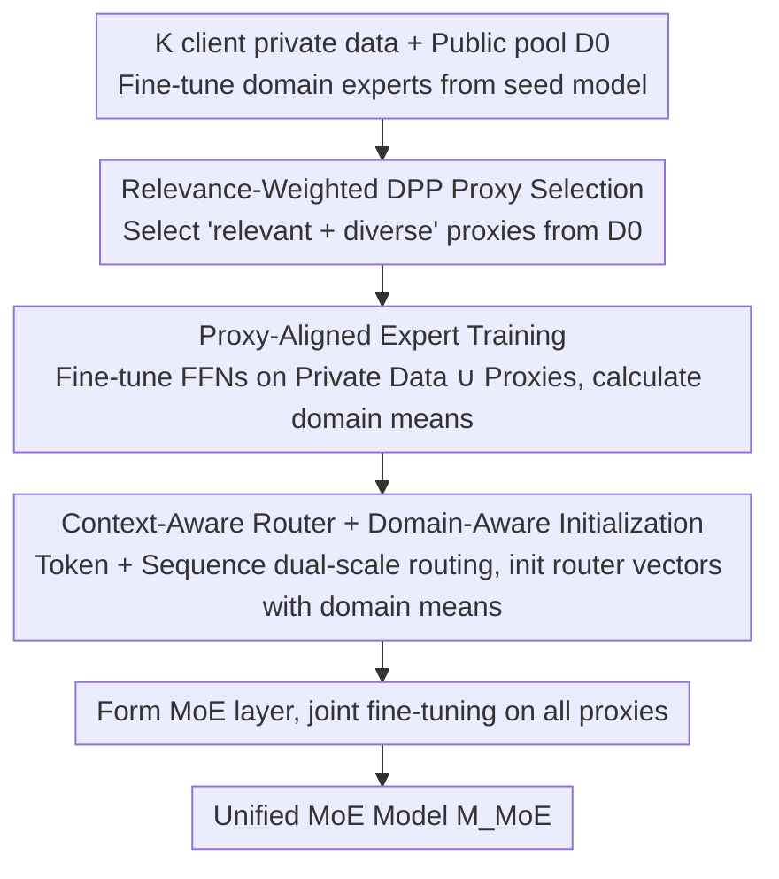

# MetaMoE: Diversity-Aware Proxy Selection for Privacy-Preserving Mixture-of-Experts Unification

**Conference**: ICML 2026  
**arXiv**: [2605.14289](https://arxiv.org/abs/2605.14289)  
**Code**: [GitHub](https://github.com/ws-jiang/MetaMoE)  
**Area**: Privacy-Preserving Learning / Mixture-of-Experts / Model Merging  
**Keywords**: MoE Unification, Privacy Protection, DPP Diversity, Proxy Data, Routing Training

## TL;DR
Domain experts fine-tuned independently by multiple clients on private data are merged into a single deployable MoE model without sharing private datasets. The core mechanism utilizes relevance-weighted DPP to select "relevant yet diverse" proxy samples from public data, followed by proxy-aligned expert training and a context-aware router, aligning expert behavior with proxy supervision—significantly outperforming methods like FlexOlmo that rely solely on similarity for proxy selection.

## Background & Motivation

**Background**: In the era of foundation models, different organizations or users often fine-tune domain experts on their respective private data. Merging methods such as Branch-Train-Merge (BTM), Model Soup, and Branch-Train-MiX (BTX) attempt to integrate these experts into a deployable model using Mixture-of-Experts (MoE) architectures and routers.

**Limitations of Prior Work**: (1) BTM outputs an ensemble rather than a unified model, affecting downstream SFT/RLHF; (2) Model Soup directly averages weights, which leads to performance collapse when expert divergence is high; (3) BTX requires client private data to train the router, violating privacy constraints; (4) FlexOlmo uses public proxy samples for router training, but proxies are selected based only on similarity, resulting in high redundancy, narrow coverage, and a mismatch between routing and expert behavior since experts have not seen the proxies.

**Key Challenge**: Training a router necessitates access to data representing each client's domain, yet real client data cannot leave local storage. Proxy data must simultaneously satisfy two properties: being "relevant to the client domain" and "covering multiple modes of that domain," which aligns precisely with the logic of relevance and diversity in DPP.

**Goal**: (1) Provide a formal definition of the "privacy-preserving MoE unification" problem; (2) Propose a proxy selection algorithm with dual control over relevance and diversity; (3) Ensure experts see their respective proxies during training to align the router's training distribution; (4) Design a router capable of utilizing both token and sequence-level context; (5) Provide a formal privacy analysis.

**Key Insight**: Similarity-based proxy selection only focuses on "how much a sample resembles the private domain," leading to the repeated selection of nearly identical samples. DPP naturally generates "negative correlation" through the $\det$ term, avoiding the co-selection of similar samples. By embedding client-specific relevance into the DPP kernel, one can obtain "relevance + diversity" simultaneously.

**Core Idea**: Multiply the DPP kernel by client-specific relevance to form a relevance-weighted DPP $\tilde{L}_{ij} = g(x_i, \mathcal{D}_p) \kappa(x_i, x_j) g(x_j, \mathcal{D}_p)$. Select $m$ proxies using greedy MAP. Allow experts to fine-tune together on $\mathcal{D}_p \cup \hat{\mathcal{D}}_p$, and finally train a context-aware router to merge all FFNs into an MoE.

## Method

### Overall Architecture
The method addresses the problem where $K$ clients fine-tune domain experts on private datasets $\{\mathcal{D}_p\}$ and aim to merge them into a single deployable MoE model without disclosing private data. The critical transition in MetaMoE is substituting private data with "proxy samples from public data" to train the router. These proxies must be both domain-aligned and diverse to ensure effective routing. The unification phase involves three steps: selecting proxies via relevance-weighted DPP, performing proxy-aligned fine-tuning of FFNs (calculating domain mean representations), and finally merging FFNs into an MoE layer trained with a context-aware router on all proxies.

### Key Designs

**1. Relevance-Weighted DPP Proxy Selection: Making Proxies "Relevant and Diverse"**

To learn correct routing, the router must see data representing each client domain. Since private data is inaccessible, proxies are selected from a public pool $\mathcal{D}_0$. Unlike FlexOlmo's top-$m$ similarity ranking—which leads to redundant samples clustered in t-SNE space—MetaMoE embeds relevance into the DPP kernel. A binary classifier $g(x,\mathcal{D}_p)$ is trained to distinguish $\mathcal{D}_0$ from $\mathcal{D}_p$, yielding relevance scores $r$. The kernel is constructed as $\tilde{L}=\text{Diag}(r)\,L\,\text{Diag}(r)$, where $L_{ij}=\kappa(x_i,x_j)$ denotes sample similarity. The subset selection objective is:

$$\hat{\mathcal{D}}_p = \arg\max_{|S|=m} \log\det(\tilde{L}_S) = 2\sum_{i\in S}\log r_i + \log\det(L_S),$$

The first term drives proxies toward high relevance, while the $\det$ term punishes co-selection of similar samples, enforcing diversity. Implementation uses greedy MAP and Cholesky updates to reduce complexity from $O(nm^3)$ to $O(nm)$. Selected proxies spread across the private domain manifold, covering broader routing decision boundaries.

**2. Proxy-Aligned Expert Training: Eliminating Behavior Mismatch**

FlexOlmo separates expert and router training data—experts see only private data, while routers see only proxies. This causes a distribution shift between expert output and router input. MetaMoE ensures experts see both private data and their proxies during fine-tuning. Each client fine-tunes only their expert's FFN sublayers on $\mathcal{D}_p \cup \hat{\mathcal{D}}_p$, freezing other layers to maintain compatibility with the seed model $\mathcal{M}_0$. Since proxies are public, this introduces no additional privacy risk. A routing representation (domain mean) is then computed for each layer:

$$e_p^{(\ell)} = \frac{1}{|\mathcal{D}_p \cup \hat{\mathcal{D}}_p|} \sum_x \mathcal{M}_p^{(1:\ell)}(x).$$

Training experts on proxies pre-injects the distribution the router will face, fundamentally resolving the mismatch.

**3. Context-Aware Router + Domain-Aware Initialization: Avoiding Misclassification of Similar Tokens**

Pure token-level routing is easily misled by literal similarity (e.g., "bank" in finance vs. geography). MetaMoE incorporates sequence-level information: each token representation $z_t^{(\ell)}$ is combined with the sequence mean $z_x^{(\ell)}=\tfrac{1}{T}\sum_t z_t^{(\ell)}$ via a learnable convex combination $\tilde{z}_t^{(\ell)}=(1-\lambda)z_t^{(\ell)}+\lambda z_x^{(\ell)}$. The routing distribution is:

$$\pi^{(\ell)}(z_t^{(\ell)}) = \text{softmax}\big[\tilde{z}_t^{(\ell)\top} e_1^{(\ell)},\dots,\tilde{z}_t^{(\ell)\top} e_K^{(\ell)}\big].$$

Routing vectors $e_p^{(\ell)}$ are initialized with the expertise domain means from step 2, providing the router with a strong prior of "what each expert is good at," which is particularly beneficial when proxy supervision is limited.

### Loss & Training
The expert stage utilizes standard next-token or classification loss. The router stage involves joint fine-tuning of the entire MoE on $\bigcup_p \hat{\mathcal{D}}_p$. Regarding privacy, clients only upload three types of artifacts: (i) indices of proxy samples in the public data; (ii) fine-tuned FFN sublayer weights; (iii) routing vectors $e_p^{(\ell)}$. The paper formally proves these do not leak private information, as the routing vector is a mean embedding of $N$ samples, with leakage decaying at $O(1/N)$.

## Key Experimental Results

### Main Results
Evaluations on CV (ViT-B/32 on Pets, Cars, CIFAR-100) and NLP (LLM multi-task benchmarks) compare MetaMoE against BTM, Model Soup, BTX, and FlexOlmo. Figure 2 visualizes selection strategies via t-SNE on the Pets dataset, showing that MetaMoE proxies significantly better cover the private domain manifold.

| Method | CV Avg Acc | NLP Avg Acc | Privacy Level | Single Deployable |
|------|-------------|--------------|----------|----------------|
| BTM (ensemble) | High | High | Strong | No (multi-expert) |
| Model Soup | Weak (heterogeneous) | Weak | Strong | Yes |
| BTX | High | High | Weak (private router data) | Yes |
| FlexOlmo (similarity-only) | Mid-High | Mid-High | Strong | Yes |
| **MetaMoE** | **Highest** | **Highest** | Strong | Yes |

(The full results in the paper indicate that MetaMoE consistently outperforms the state-of-the-art baselines across both CV and NLP.)

### Ablation Study

| Configuration | Effect |
|------|------|
| Full MetaMoE | Optimal |
| Without diversity (relevance-only) | Accuracy drops significantly; proxies cluster |
| Without proxy-aligned training | Router-expert mismatch; routing error increases |
| Without context-aware blending | Similar tokens misrouted |
| Without domain-aware initialization | Slower convergence; lower final accuracy |

### Key Findings
- t-SNE visualizations clearly show FlexOlmo proxies cluster together (narrow coverage), while MetaMoE proxies span the manifold, proving that "relevance + diversity" is essential for router learning.
- Proxy-aligned expert training provides gains independent of router design, suggesting "letting experts see proxies" is a critical architectural change.
- Uploaded artifacts (indices, weights, mean embeddings) reveal less private information than the gradients exchanged in federated learning; leakage decays at $O(1/N)$.
- Proxy selection occurs only once, resulting in communication complexity an order of magnitude lower than FL.

## Highlights & Insights
- Integrating DPP with client-specific relevance is a natural yet novel innovation that elevates proxy quality from "relevant" to "relevant + diverse."
- "Proxy-aligned expert training" breaks the traditional silo between experts and routers, providing a strategy that can be transferred to any cross-domain merging task (e.g., multilingual LMs).
- Initializing routing vectors with domain mean embeddings informs the router of expert capabilities from the start, rather than relying solely on gradient descent.
- The privacy analysis provides a concrete upper bound on leakage $O(1/N)$ for mean-pooled embeddings, offering a template for broader privacy-preserving applications.

## Limitations & Future Work
- The relevance classifier $g(\cdot, \mathcal{D}_p)$ requires training on $\mathcal{D}_0 \cup \mathcal{D}_p$, which might leak some statistical information about $\mathcal{D}_p$.
- DPP uses $O(nm)$ greedy approximation rather than global optimization; if $\mathcal{D}_0$ is significantly smaller than the private domain, proxies may still fail to provide full coverage.
- Experiments focused on FFN layers in ViT and LLM; effectiveness on attention or cross-modal experts remains to be verified.
- The $\lambda$ parameter in the context-aware router is a scalar; different layers might require different token/sequence balances.

## Related Work & Insights
- **vs BTM / Model Soup / BTX**: BTM lacks a single model; Model Soup is fragile under heterogeneity; BTX requires private data for the router. MetaMoE provides a single model using only public proxies, surpassing all three.
- **vs FlexOlmo**: Both use public proxies, but FlexOlmo lacks diversity and proxy-alignment. MetaMoE introduces DPP, proxy-aligned training, and domain-aware initialization.
- **vs Federated Learning**: FL requires multiple rounds of gradient exchange and is susceptible to inversion attacks. MetaMoE uses a one-time upload with a smaller attack surface and less communication.
- **vs MoE Gating (Switch Transformer, top-k)**: MetaMoE uses standard top-k softmax routing but adapts it for heterogeneous distributions and proxy-only supervision through specialized initialization and context blending.

## Rating
- Novelty: ⭐⭐⭐⭐ Systematically combining DPP diversity, relevance weighting, and proxy-aligned training for privacy-preserving MoE is a first.
- Experimental Thoroughness: ⭐⭐⭐⭐ Extensive benchmarks in CV/NLP, baseline comparisons, visualizations, and ablations.
- Writing Quality: ⭐⭐⭐⭐ Clear algorithms, privacy analysis, and figures.
- Value: ⭐⭐⭐⭐ Provides a complete, reproducible pipeline for privacy-sensitive MoE deployment with formal privacy guarantees.

<!-- RELATED:START -->

## Related Papers

- [\[CVPR 2026\] ReMoE: Region-Mixture Experts for Adversarially-Robust Vision Transformers](../../CVPR2026/ai_safety/remoe_region-mixture_experts_for_adversarially-robust_vision_transformers.md)
- [\[ICCV 2025\] FedVLA: Federated Vision-Language-Action Learning with Dual Gating Mixture-of-Experts for Robotic Manipulation](../../ICCV2025/ai_safety/fedvla_federated_vision-language-action_learning_with_dual_gating_mixture-of-exp.md)
- [\[ICML 2026\] Persuasive Privacy](persuasive_privacy.md)
- [\[ICCV 2025\] FedMeNF: Privacy-Preserving Federated Meta-Learning for Neural Fields](../../ICCV2025/ai_safety/fedmenf_privacy-preserving_federated_meta-learning_for_neural_fields.md)
- [\[ICLR 2026\] Membership Privacy Risks of Sharpness Aware Minimization](../../ICLR2026/ai_safety/sam_membership_privacy_risks.md)

<!-- RELATED:END -->
