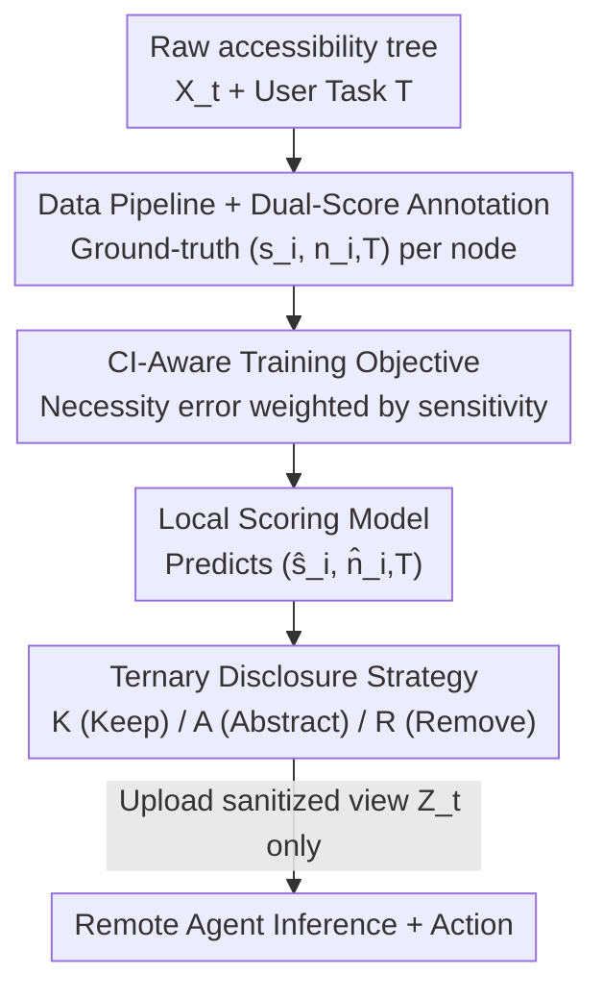

# Minim: Privacy-Aware Minimal View for Agents via Trusted Local Sanitization

**Conference**: ICML2026  
**arXiv**: [2606.13949](https://arxiv.org/abs/2606.13949)  
**Code**: To be confirmed  
**Area**: AI Safety / Agent Privacy / Structured Observation Minimization  
**Keywords**: Agent Privacy, Accessibility Tree, Contextual Integrity, Data Minimization, Local Sanitization

## TL;DR
Minim is a "trusted sanitization proxy" running locally on a user's device. Before an Agent uploads the interface state (accessibility tree) to a remote inference server, it uses a small model to assign two scores to each UI element—**intrinsic sensitivity $s$** and **task-conditioned necessity $n$**. It then applies a ternary disclosure strategy (Keep / Abstract / Remove) to release only the minimum information truly required for the task. On WebArena, it reduces Task-Irrelevant Sensitive Leakage (TISL) to 10.1% of the full observation while maintaining nearly no loss in task-critical content and interactivity.

## Background & Motivation

**Background**: Modern LLM-driven autonomous Agents increasingly rely on **structured observations** for reliable "action alignment"—specifically the accessibility tree, which represents the interface as a hierarchy of nodes with roles, states, and interactive attributes. This is more stable than pixel input and is widely adopted by OS-level assistants such as Apple Intelligence and Microsoft Copilot. Similar structures include DOM for web agents, scene graphs for robotics, and MCP schemas for tool calls.

**Limitations of Prior Work**: These interfaces were originally designed for "accessibility transparency," not privacy orchestration. Consequently, most Agent deployments adopt a **share-first** approach: even if a user task only requires a small portion of the interface, the **entire accessibility tree** is sent to the remote inference server. The authors term this failure mode **Semantic Over-Privileged Observation**—where task-irrelevant elements are exposed along with their functional semantics. For example, if a user wants to "summarize this email," the remote Agent might inadvertently see 2FA codes in sidebar notifications, background application windows, or unrelated browser tabs, all of which are PII or cross-session behavioral traces that can be used for profiling.

**Key Challenge**: What should be disclosed is **inherently task-conditioned**. The same element (e.g., a 2FA code) is essential for a "login authentication" task but pure leakage for a "browsing/summarizing" task. This renders existing privacy paradigms inadequate: static entity filtering (e.g., Presidio) relies on PII categories and may mistakenly delete task-critical content or miss non-PII sensitive attributes (e.g., political orientation); Differential Privacy (DP) introduces random perturbations that destroy precise semantic cues in structured interfaces, making actions unreliable; cryptographic methods like MPC/FHE protect the "computation process" but cannot prevent inference from the "state already disclosed to the server," and their latency is incompatible with real-time control loops.

**Goal**: Minimize **task-conditioned pre-disclosure** for structured observations **before** data leaves the device, suppressing task-irrelevant sensitive leakage while preserving the interactive utility necessary to complete the task.

**Key Insight**: The authors use **Contextual Integrity (CI)** as a normative basis—privacy is not absolute secrecy but rather whether information flow conforms to contextual norms (context / actors / attributes / transmission principle). Here, "Task $T$" defines the context, "client vs. remote server" are the actors, UI fields are the attributes, and the transmission principle is **task-conditioned necessity**: information with high disclosure risk is released only when essential for the current task.

**Core Idea**: Decouple "sensitivity" and "necessity" into two learnable scalar scores predicted by a local small model, which are then processed by a fixed ternary decision rule. By using a **specifically trained local scorer instead of the Agent's own reasoning for disclosure decisions**, the "privacy judgment-action gap" (where an Agent might identify sensitive content but fail to protect it) is avoided.

## Method

### Overall Architecture

Minim acts as a **local structural bottleneck** inserted between "raw observations" and "remote inference." The pipeline consists of two phases: The **training phase** constructs a CI-annotated dataset (each node carrying a ground-truth score pair $(s_i, n_{i,T})$) and trains a scoring model using a CI-aware objective. The **deployment phase** predicts $(\hat{s}_i, \hat{n}_{i,T})$ per node for the runtime accessibility tree, maps each node to one of three actions—**Keep (K) / Abstract (A) / Remove (R)**—via a fixed ternary threshold rule, and produces a sanitized tree $Z_t$. Crucially, $Z_t$ need not be a subset of $X_t$ because "abstraction" replaces sensitive attribute values with placeholders while preserving their structural roles.

### Key Designs

**1. Dual-Score Representation: Decoupling "Sensitivity" and "Necessity" as Orthogonal Learnable Scalars**

A single score cannot adequately determine disclosure—an element might be both highly sensitive and highly necessary (e.g., a 2FA code in a login task). Minim learns two scores for each node $e_i$: **intrinsic sensitivity** $s_i \in [0,10]$ (task-independent, characterizing the disclosure risk of the information itself) and **task-conditioned necessity** $n_{i,T} \in [0,10]$ (task-dependent, characterizing the utility for task completion). Separating these dimensions is fundamental; only by knowing both can the system distinguish between "high sensitivity but irrelevant (Remove/Abstract)" and "high sensitivity and essential (Keep)." The model takes node-level features and task descriptions as input and outputs the predicted pair $(\hat{s}_i, \hat{n}_{i,T})$.

**2. CI-Aware Training Objective: Penalizing Necessity Errors Heavily in the "High Sensitivity + Low Necessity" Danger Zone**

The formal goal is to minimize improper disclosure under task success constraints: $\min_{Z_t} I(X_t^{\text{out}};Z_t \mid T)$ s.t. $\text{TaskSuccess}(Z_t,T) \ge \tau$, where $X_t^{\text{out}}$ represents information flows violating CI norms. Sensitivity is supervised via absolute error $\mathcal{L}_{\text{sens}}=\sum_i|s_i-\hat{s}_i|$, while the necessity loss is **weighted by sensitivity risk**:

$$\mathcal{L}_{\text{nec}}=\sum_i\Big(1+\lambda\cdot\tfrac{s_i}{10}\cdot(1-\tfrac{n_{i,T}}{10})\Big)\cdot|n_{i,T}-\hat{n}_{i,T}|$$

This multiplicative factor is maximized when "$s_i$ is large (high sensitivity) and $n_{i,T}$ is small (task-irrelevant)"—precisely the regime where improper disclosure is most harmful. The total objective is $\mathcal{L}=\mathcal{L}_{\text{sens}}+\alpha\mathcal{L}_{\text{nec}}$. This aligns optimization with CI goals: necessity judgments for "high-risk, low-utility" nodes must be accurate (preferring removal), enabling aggressive pruning while preserving critical context. This allows Minim to halve TISL compared to Necessity-Only approaches (0.101 vs. 0.203).

**3. Ternary Disclosure Strategy: Mapping Dual Scores to K / A / R via Two Thresholds**

At deployment, a **fixed decision rule (no LLM inference needed)** directs each node based on a necessity threshold $\tau_{\text{nec}}$ and a sensitivity threshold $\tau_{\text{sens}}$:

$$\text{Action}(e_i)=\begin{cases}\textsf{R}\ \text{(Remove)} & \hat{n}_{i,T}<\tau_{\text{nec}}\\ \textsf{A}\ \text{(Abstract)} & \hat{n}_{i,T}\ge\tau_{\text{nec}}\ \land\ \hat{s}_i\ge\tau_{\text{sens}}\\ \textsf{K}\ \text{(Keep)} & \hat{n}_{i,T}\ge\tau_{\text{nec}}\ \land\ \hat{s}_i<\tau_{\text{sens}}\end{cases}$$

Nodes deemed unnecessary are removed (R). Nodes that are necessary but sensitive are abstracted (A)—replacing sensitive values with placeholders while keeping structural roles. Residual leakage for abstraction is modeled with $\text{tok}_{\text{ph}}=6.0$ and $p_{\text{abs}}=0.05$. Necessary and low-risk nodes are kept as-is (K). Decoupling "scoring" from "execution" ensures the strategy is norm-driven, auditable, and tunable. Thresholds are selected via validation set scanning ($\tau_{\text{nec}}=1.0, \tau_{\text{sens}}=5.0$).

### Complete Example
A user sends a desktop screenshot asking a remote Agent to **reply to an email**. The original accessibility tree contains the email body and a system notification showing a 2FA code. Minim scores each node: Email body $\rightarrow$ high necessity, low sensitivity $\rightarrow$ **K (Keep)**; Irrelevant 2FA notification $\rightarrow$ high sensitivity, low necessity $\rightarrow$ **R (Remove)**. If it were deemed necessary but sensitive, it would undergo **A (Abstract)**, replacing the actual code with a placeholder while keeping the "notification" role. The uploaded $Z_t$ contains only the context needed for the reply, while irrelevant sensitive information like the 2FA code stays on the device. Diagnostic checks show Minim suppresses $>99.9\%$ of injected 2FA codes, passwords, and Slack notifications.

### Loss & Training
Total loss $\mathcal{L}=\mathcal{L}_{\text{sens}}+\alpha\mathcal{L}_{\text{nec}}$ (see Key Design 2). Data is derived from augmented WebArena corpora (Shopping / Reddit / Gmail): 150 accessibility trees × 27 task types = 5,403 (tree, task) variants, with synthetic sensitive contexts (2FA codes, password prompts, system notifications) injected. The split is 4,741 training / 662 testing.

## Key Experimental Results

### Main Results: Comparison with Fixed Strategy Baselines (WebArena, N=662)

Baselines use top-K budget matching (retaining 20% of nodes) based on Minim scores. Minim uses the adaptive K/A/R strategy. TISL is normalized to the full observation.

| Method | TCNP ↑ | TCNP-I ↑ | TISL ↓ |
| :--- | :--- | :--- | :--- |
| Full Obs. | 1.0000 | 1.0000 | 1.0000 |
| Random Budget | 0.2284 | 0.2346 | 0.1971 |
| Sensitivity-Only | 0.0401 | 0.0393 | 0.3799 |
| Necessity-Only | 0.9445 | 0.9730 | 0.2032 |
| **Minim (Ours)** | **0.9491** | **0.9931** | **0.1010** |

Key metrics: **TCNP** (Task-Critical Node Preservation), **TCNP-I** (Interactive Critical Node Preservation), and **TISL** (Task-Irrelevant Sensitive Leakage). Minim matches or exceeds Necessity-Only in utility while halving leakage.

### Comparison with Prompted LLM Scorers (Zero-shot)

| Method | TCNP ↑ | TCNP-I ↑ | TISL ↓ | Keep% ↓ |
| :--- | :--- | :--- | :--- | :--- |
| Qwen3-8B-Instruct | 0.956 | 0.989 | 0.211 | 28.4 |
| Llama-3.3-70B-Instruct | 0.966 | 0.996 | 0.312 | 34.5 |
| Gemma-3N-E4B | 0.951 | 0.985 | 0.194 | 25.8 |
| **Minim (Ours)** | **0.9491** | **0.9931** | **0.101** | **12.0** |

### Adaptive Compression by Task Semantics

| Task Semantics | K (Keep%) | A (Abstract%) | TCNP | TCNP-I |
| :--- | :--- | :--- | :--- | :--- |
| Informational | 8.66% | 0.83% | 0.9156 | 0.9886 |
| Sensitive/Admin | 15.84% | 9.84% | 1.0000 | 1.0000 |
| Transactional | 10.88% | 3.52% | 1.0000 | 1.0000 |

### Key Findings
- **Joint Modeling > Single Dimension**: Sensitivity-Only retains the "least sensitive 20%," which is almost entirely task-irrelevant (TCNP 0.04); Necessity-Only leaks sensitive content if it is useful (TISL 0.203). Only joint modeling achieves a superior privacy-utility frontier.
- **Specialized Small Models Outperform General LLMs**: All tested open-source LLMs had TISL between 0.19–0.31, much higher than Minim's 0.101. Larger models actually leaked more (Llama-70B TISL 0.312 > 8B 0.206). General instruction tuning does not spontaneously perform "task-conditioned minimization."
- **Adaptive Compression**: The model prunes more aggressively for low-risk browsing (8.66% Keep) and retains more context for high-risk admin tasks (15.84% Keep)—a behavior that emerges naturally from the CI-aware objective.
- **Average Keep% ≈ 12%**: This aligns with the inherent sparsity of accessibility trees. Web pages often have $>500$ nodes, mostly decorative or redundant. Radical pruning does not significantly harm execution.

## Highlights & Insights
- **Decoupling Privacy from Agent Reasoning**: Using a local specialized scorer + fixed threshold replaces the need for the Agent to "judge for itself," bypassing the "privacy judgment-action gap." This requires zero LLM calls at test time.
- **CI-Weighted Loss**: The necessity loss adjustment $(1+\lambda \cdot \dots)$ focuses the optimization on the "high sensitivity + low necessity" zone. This weighted approach is applicable to any risk-stratified minimization scenario.
- **Ternary K/A/R over Binary Keep/Drop**: "Abstraction (A)" solves the dilemma of necessary but sensitive nodes, which should not be simply deleted or kept as-is.

## Limitations & Future Work
- **Threat Model**: Assumes a trusted local broker and an honest-but-curious remote server; it does not account for prompt injection, active adversaries, or compromised local OS environments.
- **Data/Label Dependency**: Training ground truths rely on WebArena augmentation and synthetic injection. Performance is bounded by labeling quality and domain coverage (currently limited to 3 domains).
- **Residual Leakage**: Sanitization cannot eliminate risk perfectly; abstraction (A) still carries modeled residual leakage. Thresholds are sensitive to distribution shifts.

## Related Work & Insights
- **vs. Task-Agnostic Entity Filtering (Presidio)**: They use static PII categories, which may miss sensitive non-PII or mistakenly delete task-critical items. Minim is dynamic and context-aware.
- **vs. DP/MPC/FHE**: DP destroys structural semantic cues; cryptographic methods have high latency and don't stop inference from already-disclosed states. Minim operates before data leaves the device.
- **vs. Dialogue Privacy Gateways (AirGapAgent, Portcullis)**: Those target prompts/logs/free text. Minim focuses on **structured, action-critical** observations where naive reduction breaks interactivity.

## Rating
- Novelty: ⭐⭐⭐⭐⭐ First implementation of CI as a "pre-disclosure minimization bottleneck" for Agent structured observations using dual-scoring and ternary strategies.
- Experimental Thoroughness: ⭐⭐⭐⭐ Extensive results on WebArena with LLM comparisons and task stratification, though limited to synthetic sensitive data and few domains.
- Writing Quality: ⭐⭐⭐⭐⭐ Clear definitions (e.g., Semantic Over-Privileged Observation), CI formalization, and well-defined metrics.
- Value: ⭐⭐⭐⭐⭐ Directly addresses the "share-first" privacy pain point in Agent deployment with a low-latency, auditable local solution.

<!-- RELATED:START -->

## Related Papers

- [\[ICLR 2026\] Membership Privacy Risks of Sharpness Aware Minimization](../../ICLR2026/ai_safety/sam_membership_privacy_risks.md)
- [\[CVPR 2026\] LDP-Slicing: Local Differential Privacy for Images via Randomized Bit-Plane Slicing](../../CVPR2026/ai_safety/ldp-slicing_local_differential_privacy_for_images_via_randomized_bit-plane_slici.md)
- [\[ICML 2026\] MetaMoE: Diversity-Aware Proxy Selection for Privacy-Preserving Mixture-of-Experts Unification](metamoe_diversity-aware_proxy_selection_for_privacy-preserving_mixture-of-expert.md)
- [\[ICML 2026\] Decoupled Training with Local Reinforcement Fine-Tuning in Federated Learning](decoupled_training_with_local_reinforcement_fine-tuning_in_federated_learning.md)
- [\[CVPR 2026\] Improving Adversarial Transferability with Local Perturbation Augmentation](../../CVPR2026/ai_safety/improving_adversarial_transferability_with_local_perturbation_augmentation.md)

<!-- RELATED:END -->
