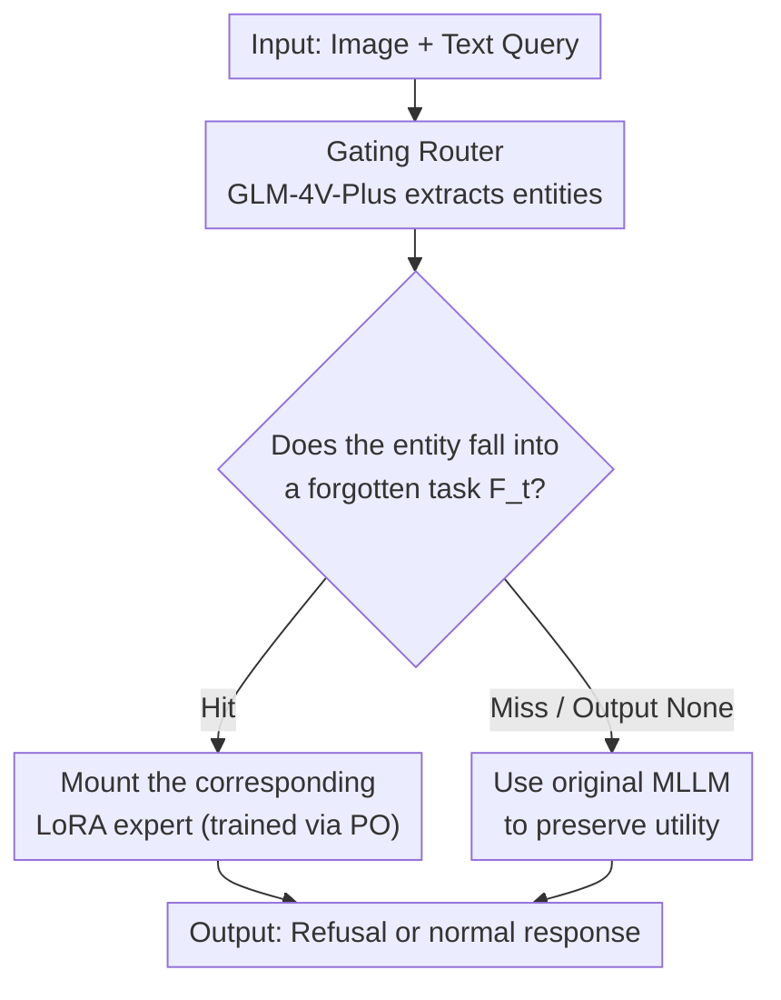

# MLUBench: A Benchmark for Lifelong Unlearning Evaluation in MLLMs

**Conference**: ICML2026  
**arXiv**: [2606.12809](https://arxiv.org/abs/2606.12809)  
**Code**: Open-sourced (Link provided in paper)  
**Area**: AI Safety / Machine Unlearning / Multimodal Large Language Models  
**Keywords**: Machine Unlearning, Lifelong Unlearning, Multimodal Alignment, MoE, LoRA

## TL;DR
Addressing the real-world scenario where Multimodal Large Language Models (MLLMs) need to continuously delete specific data chronologically, this paper constructs a large-scale lifelong unlearning benchmark, MLUBench (127 real entities, 5,105 images, 15,414 VQA pairs). The study systematically reveals that existing unlearning methods collapse as tasks accumulate, with the root cause being the destruction of multimodal alignment. To mitigate this, the authors propose LUMoE, a method using a "one switchable LoRA expert per unlearning task + gating router" architecture. This isolates unlearning modifications from the stable backbone, simultaneously preserving unlearning quality and model utility under long-sequence unlearning.

## Background & Motivation

**Background**: MLLMs (e.g., GPT-4o, Gemini) are trained on web-scale multimodal data. Data owners may request the removal of their content at any time, making "machine unlearning" (erasing specific data from a trained model) increasingly important. In reality, deletion requests often arrive sequentially over time rather than all at once, constituting the **lifelong unlearning** problem for MLLMs: the model must continuously unlearn specified knowledge while maintaining general capabilities.

**Limitations of Prior Work**: First, there is a lack of suitable evaluation benchmarks—MMUBench contains only 20 concepts, FIUBench focuses only on faces, and MLLMU-Bench covers only celebrities. Their scale and diversity are insufficient to evaluate the cumulative effects of long-sequence unlearning. Second, existing unlearning methods (Gradient Ascent GA, Gradient Difference GD, KL Minimization, Negative Preference Optimization NPO) are almost exclusively designed for "one-time unlearning," and their performance under continuous multi-task scenarios has not been systematically quantified.

**Key Challenge**: The authors confirmed two critical points through experiments. First, lifelong unlearning leads to **severe cumulative degradation**—for instance, the unlearning quality of the GA method on the first task drops from 0.38 to 0.01 in subsequent tasks. Second, and most crucially: **lifelong unlearning for MLLMs is not a simple extension of LLM lifelong unlearning**. iIt is constrained by a factor non-existent in unimodal models—**multimodal alignment must be protected**. Even if unlearning is performed on a single modality (e.g., only the language side or only the vision projector), it can destroy the alignment connecting vision and language, leading to a collapse in overall model performance.

**Goal**: (1) Provide a large-scale benchmark capable of truly evaluating the cumulative effects of long-sequence unlearning; (2) Propose an effective method that preserves alignment and prevents model collapse during lifelong unlearning.

**Core Idea**: Since repeated modifications to the backbone weights destroy alignment, the backbone should **no longer be modified**. Instead, unlearning modifications for each task are "plugged in" as independent, switchable LoRA experts. A gating module routes inputs to the correct expert or the original model, thereby completely isolating "unlearning modifications" from the "stable backbone + alignment."

## Method

This work consists of two parts: the construction of the MLUBench benchmark and the LUMoE method. The former defines the evaluation protocol for lifelong unlearning, while the latter provided a solution to maintain stability under this protocol.

### Overall Architecture

MLUBench divides 127 real entities into four sequential tasks A→B→C→D. Each task is divided into a "forget set $F_t$" and a "retain set $R_t$." The model must unlearn tasks sequentially. After each task, the model is archived and tested against all previously unlearned tasks to expose cumulative degradation. Formally, an unlearning task is denoted as $t=(F_t, R_t)$. The objective of lifelong unlearning is to minimize the performance difference of the model on a task between "immediately after unlearning that task" and "after unlearning the entire sequence":

$$\min_{\theta_{\mathcal{T}}}\sum_{t\in\mathcal{T}}\left|P(\mathcal{M}_{\theta_t},t)-P(\mathcal{M}_{\theta_{\mathcal{T}}},t)\right|$$

Note that this objective focuses on **stability** (preventing degradation on old tasks) rather than the absolute effectiveness of a specific unlearning algorithm.

The LUMoE inference workflow is as follows: the input (image + text query) enters the gating module, which extracts entity names and matches them to a previous unlearning task. If a match is found, the corresponding LoRA expert is mounted to the base model. If no match is found (belonging to the retain set or if the router is uncertain), the input is processed directly by the original MLLM to preserve utility.

### Key Designs

**1. MLUBench: A Large-scale Sequential Unlearning Benchmark Based on Real Knowledge**

Existing unlearning datasets (e.g., TOFU, FIUBench) mostly use fictional information, requiring fictional knowledge to be fine-tuned into the model before use, which is neither convenient nor realistic. In reality, models need to unlearn knowledge they "already know." MLUBench is built on well-known real entities across 9 categories: Animals, Astronomy, Buildings, Cartoons, Corporations, Movies, Personage, Plants, and TV Series from Wikipedia. Visual data is crawled via Google Images. Common question sets are designed by "entity type" to capture shared features, and entity-specific answers are generated by GPT-4o and manually verified. A critical **filtering step** is applied: each image-text pair is fed to LLaVA-v1.6-7B and 13B, and **only samples correctly answered by both (judged by GPT-4o) are retained**. This ensures the model must first possess the knowledge for unlearning to be meaningful. Data is divided into tasks A/B/C/D. Additionally, **generalization evaluation** is designed: each question has four semantically equivalent but phrased differently variants (e.g., "Who directed this film?" vs. "Who was responsible for directing this movie?") to test if unlearning is robust to phrasing.

**2. LUMoE Isolation Principle: Switchable LoRA Experts instead of Backbone Modifications**

Experimental evidence in Section 3 proves that "repeatedly modifying backbone weights → destroys multimodal alignment → catastrophic degradation." The design principle is thus to **isolate unlearning modifications from the stable backbone**. Inspired by MoE, LUMoE keeps the MLLM backbone intact and trains a separate LoRA adapter for each unlearning task as an "expert." Each expert is trained using **Preference Optimization (PO)**, a variant of DPO, with the goal of making the model **prefer refusal outputs** (e.g., "Sorry, I cannot answer this question") for queries in the forget set. Consequently, the backbone weights and alignment remain untouched, and the "cost" of unlearning is locked within lightweight adapters. Multiple adapters do not interfere with each other; if a request matches multiple experts, they can be merged into the base model without conflict.

**3. Gating Router + Error Handling: Routing Inputs to Experts or the Original Model**

The gating module is a key component using the SOTA commercial MLLM **GLM-4V-Plus**. It operates in two steps: (1) **Entity Extraction**—prompting the model to extract relevant entities from the input; (2) **Task Matching**—comparing extracted entities against forget sets of historical tasks. Since routers are imperfect, an **error handling mechanism** is added: the model is instructed to output "None" when uncertain. Such queries are treated as belonging to the retain set and handled by the original MLLM, prioritizing the preservation of utility over potential unlearning failure.

### Mechanism Example

Consider the sequence A→B→C→D. A LoRA expert is trained for each task (Expert_A, Expert_B, etc.) while the backbone remains unchanged. During inference, if a query "Who directed this movie?" is received with a movie poster, the gate extracts the entity "the movie" via GLM-4V-Plus. If it matches task B's forget set, Expert_B is mounted, and the model outputs "Sorry, I cannot answer" (high-quality refusal). If the query is about an animal in the retain set and matches no task (or outputs "None"), the input goes to the original MLLM, ensuring a normal answer. After the sequence, Task A remains unlearned as Expert_A is independent and the backbone remains uncontaminated by subsequent tasks.

### Loss & Training

Each LoRA expert is trained using PO (DPO variant) to prefer refusal responses. LoRA-rank and LoRA-alpha are set to 32. The vision tower learning rate is 2e-6, projector 1e-5, and batch size 4. The gating is handled by GLM-4V-Plus without additional training.

## Key Experimental Results

Evaluation uses two metrics. **Forget Quality = GPT Refusal Score**: Since the initial MLLM already knows MLUBench knowledge, retraining a gold model is too costly for KS-Tests. Instead, GPT-4o scores refusal quality $\{0,1,2\}$, where 2 represents a high-quality refusal that neither hallucinates nor leaks knowledge. **Model Utility = GPT Correctness Score**: GPT-4o scores the quality/relevance/correctness of retain set answers $\{0,1,2\}$. The final score is $\frac{\sum \text{Model Scores}}{\sum \text{Maximum Possible Scores}}$. Models used: LLaVA-v1.6-7B/13B and Qwen3-VL-4B-Instruct.

### Main Results

Comparison on LLaVA-7B between LUMoE and four baselines (GA / GD / KL / NPO). "X-UY" denotes "performance on task X after unlearning task Y." Moving right indicates more subsequent unlearning tasks, reflecting cumulative degradation.

| Method | Metric | A-UA (Initial) | A-UD (Final) | D-UD | Trend |
|------|------|------|------|------|------|
| GA | Forget Quality | 0.380 | 0.010 | 0.060 | Cumulative Collapse |
| GA | Utility | 0.120 | 0.010 | 0.020 | Near Zero |
| KL | Forget Quality | 0.280 | 0.000 | 0.000 | Cumulative Collapse |
| NPO | Forget Quality | 0.420 | 0.005 | 0.000 | Cumulative Collapse |
| NPO | Utility | 0.238 | 0.000 | 0.000 | Near Zero |
| **LUMoE** | **Forget Quality** | **1.000** | **1.000** | **0.960** | **Stable** |
| **LUMoE** | **Utility** | **0.930** | **0.930** | **0.910** | **Stable** |

Baselines collapse toward zero for both metrics as tasks progress. LUMoE, by isolating changes in experts, keeps the backbone and alignment uncontaminated. Forget Quality stabilizes at 0.95~1.0, and utility at 0.88~0.94, showing almost no decay over long sequences.

### Ablation Study

Table 1 supports the core argument by comparing "unlearning only on the language side (updating LLM backbone)" vs. "unlearning only on the vision side (updating vision projector)":

| Setting | Method | Metric | A-UA | B-UB | C-UC | D-UD |
|------|------|------|------|------|------|------|
| Language-only | GA | Forget Quality | 0.205 | 0.193 | 0.065 | 0.100 |
| Language-only | GA | Utility | 0.102 | 0.308 | 0.000 | 0.000 |
| Vision-only | GA | Forget Quality | 0.315 | 0.000 | 0.000 | 0.000 |
| Vision-only | GA | Utility | 0.246 | 0.017 | 0.007 | 0.000 |

Modifying either modality alone leads to rapid performance collapse. This proves **MLLM lifelong unlearning cannot be solved by isolated modality processing**; continuous unlearning propagates from one modality to destroy cross-modal alignment, crashing the model. This provides the experimental basis for LUMoE's "isolated plugin" design.

### Key Findings
- **Cumulative degradation is universal**: GA's forget quality on task A drops from 0.38 to 0.01, while KL/NPO drop to zero, proving existing methods are unfit for long-sequence unlearning.
- **Alignment is the unique vulnerability of MLLMs**: Unimodal unlearning also destroys cross-modal alignment—a fundamental difference from LLM unlearning.
- **Isolation > Direct Modification**: LUMoE prioritizes "stability" over "optimality." By using isolated experts, it suppresses degradation. The authors position this as a strong baseline rather than an ultimate solution.

## Highlights & Insights
- **Identifying "alignment collapse" as the root cause**: This is the most valuable insight. Through a "language-only vs. vision-only" controlled experiment, the authors prove the problem lies in the connection between modalities, shifting the problem-solving paradigm.
- **Rigorous benchmark filtering**: Retaining only samples correctly answered by both 7B and 13B models ensures "know then unlearn," avoiding false successes on knowledge the model never possessed.
- **Commercial MLLM as a Gating Router**: Using GLM-4V-Plus for entity extraction and matching is engineering-efficient and minimizes method complexity.
- **Refusal-based Unlearning (PO)**: Unlearning via "preferred refusal" instead of gradient erasure naturally avoids the side effects typical of GA that damage unrelated data.

## Limitations & Future Work
- **Dependency on external commercial routers**: Gating relies on GLM-4V-Plus; errors in entity extraction lead to routing failures. The "None" fallback is conservative, potentially leading to missed unlearning.
- **Linear growth of experts**: Each task requires a LoRA expert. Costs for storage and routing match may rise with very long sequences; scalability limits are not fully discussed.
- **Positioned as a "Strong Baseline"**: LUMoE demonstrates the effectiveness of "isolation" but may not be optimal in all dimensions; sharing/compressing knowledge across experts remains an open question.
- **Forget intensity**: The objective (Eq. 1) focuses on stability (lack of degradation) rather than the absolute unlearning strength of the underlying algorithm.

## Related Work & Insights
- **vs MMUBench / FIUBench / MLLMU-Bench**: These are small-scale, narrow (20 concepts / faces only / celebrities only) and oriented toward one-time unlearning. MLUBench offers more entities (127), broader types (9), and focuses on sequential cumulative effects.
- **vs LLM Sequential Unlearning**: Previous works in unimodal LLMs balance forget strength and utility. This paper identifies the "protection of cross-modal alignment" as a unique constraint in MLLMs.
- **vs MMUNLEARNER / Vision Knowledge Distillation**: Those methods improve single unlearning algorithms (e.g., geometric constraints, distillation). LUMoE addresses the "sequential accumulation" problem via MoE-style plugins, which is orthogonal and complementary to these methods.

## Rating
- Novelty: ⭐⭐⭐⭐⭐ First to identify "multimodal alignment collapse" as the root cause of MLLM lifelong unlearning and provide an isolation-based solution.
- Experimental Thoroughness: ⭐⭐⭐⭐ Multiple models and baselines with root-cause analysis, though gating error and scalability analysis are limited.
- Writing Quality: ⭐⭐⭐⭐ Problem definition is clear, motivation is well-structured, and benchmark-method connection is natural.
- Value: ⭐⭐⭐⭐⭐ Provides a large-scale benchmark, a strong baseline, and key insights for the new direction of MLLM lifelong unlearning.

<!-- RELATED:START -->

## Related Papers

- [\[AAAI 2026\] An Information Theoretic Evaluation Metric for Strong Unlearning](../../AAAI2026/ai_safety/an_information_theoretic_evaluation_metric_for_strong_unlearning.md)
- [\[ICML 2026\] Semantic Router: On the Feasibility of Hijacking MLLMs via a Single Adversarial Perturbation](semantic_router_on_the_feasibility_of_hijacking_mllms_via_a_single_adversarial_p.md)
- [\[ICML 2026\] Rethinking Evaluation Paradigms in IBP-based Certified Training](rethinking_evaluation_paradigms_in_ibp-based_certified_training.md)
- [\[ICML 2026\] ABC-Bench: An Agentic Bio-Capabilities Benchmark for Biosecurity](abc-bench_an_agentic_bio-capabilities_benchmark_for_biosecurity.md)
- [\[ICML 2026\] Multilingual Unlearning in LLMs: 转移、动力学与可逆性](multilingual_unlearning_in_llms_transfer_dynamics_and_reversibility.md)

<!-- RELATED:END -->
