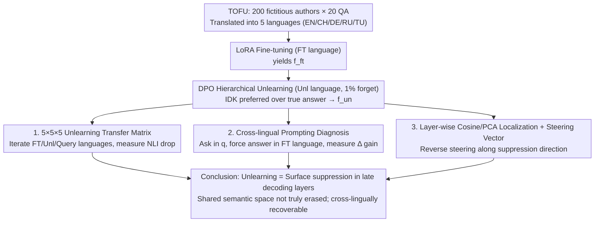

# Multilingual Unlearning in LLMs: Transfer, Dynamics, and Reversibility

**Conference**: ICML 2026  
**arXiv**: [2606.03291](https://arxiv.org/abs/2606.03291)  
**Code**: https://github.com/MLCY1/multilingual-unlearning-in-llms  
**Area**: LLM Safety / Privacy / Multilingual LLM  
**Keywords**: LLM Unlearning, Cross-lingual Transfer, Representation Space, Steering Vector, Reversible Unlearning

## TL;DR
This paper extends the TOFU unlearning benchmark to 5 languages to systematically study "cross-lingual unlearning transfer." It finds that unlearning strength varies with the kinship of language families/writing systems and primarily modifies late-stage language-specific decoding layers while leaving the shared semantic space in earlier layers nearly untouched. Consequently, an inference-time steering vector can recover 50% of forgotten knowledge on Qwen and 90% on Gemma, indicating that existing LLM unlearning is essentially "surface suppression" rather than true erasure.

## Background & Motivation

**Background**: The massive data used to train LLMs may contain sensitive facts. Combined with legal requirements like the GDPR's "right to be forgotten," this has catalyzed research into "LLM unlearning" to erase specific knowledge without retraining. Mainstream methods (GA, NPO, DPO-style) typically add modification objectives to fine-tuned models to discourage the model from revealing target content in the forget set.

**Limitations of Prior Work**: (1) Existing evaluations are conducted almost exclusively in English, leaving the extent of "unlearning transfer" in multilingual scenarios uncharacterized—even though the same sensitive fact often repeats across languages in real-world deployments. (2) Even in monolingual settings, some works hint that unlearning acts like a suppression signal, but they lack mechanistic localization (in which layers? is it language-agnostic?) and evidence of reversibility without relearning.

**Key Challenge**: If multilingual unlearning only affects "language-specific decoding layers," the knowledge in the shared semantic space remains intact; an attacker could retrieve it by querying in another language or using reverse steering during inference. If it truly changes the "cross-lingual conceptual space," the safety guarantees are much stronger. These two scenarios present entirely different deployment risks, yet prior work has not distinguished between them.

**Goal**: (i) Systematically characterize cross-lingual unlearning transfer across language families, writing systems, and pre-training coverage; (ii) Locate the layers where unlearning occurs using mechanistic interpretability; (iii) Verify if unlearning is reversible using a simple inference-time steering vector and test its cross-lingual transferability.

**Key Insight**: The authors translate TOFU (20 QA pairs for 200 fictitious authors) into 5 languages (EN/CH/DE/RU/TU) with three orthogonal controlled axes: shared language family vs. shared writing system vs. neither. By fine-tuning, unlearning, and querying across different languages, they obtain a $5\times 5\times 5$ transfer matrix and use NLI instead of lexical overlap to evaluate semantic equivalence.

**Core Idea**: The systematic difference in hidden representations before and after unlearning is extracted as a "suppression direction" (steering vector). During inference, this direction is weighted and injected inversely into the forward pass. If this is a "language-agnostic suppression direction," it should recover knowledge in any language—this is the hypothesis the paper seeks to verify.

## Method

### Overall Architecture

The paper does not propose a new unlearning algorithm but establishes a set of controlled experiments to quantify "where cross-lingual unlearning transfer occurs and whether it can be reversed." The pipeline is executed on Qwen2.5-7B and Gemma2-9B: first, LoRA fine-tuning is performed on a specific language $\mathcal{L}_{FT}$ using bilingual TOFU data to obtain $f_{\text{ft}}$; then, a DPO-style unlearning objective is used on a specific language $\mathcal{L}_{\text{unl}}$ to erase 1% of the forget authors to obtain $f_{\text{un}}$. Finally, the model is evaluated using various query languages $\mathcal{L}_Q$ for forget/retain accuracy to build the transfer matrix. Mechanistic analysis includes per-layer cosine similarity and the construction of an inference-time steering vector.

The unlearning objective is a standard hierarchical DPO preference optimization: $\arg\min_\theta \frac{1}{|\mathcal{L}_{\text{unl}}|} \sum_{\ell} (\mathbb{E}_{D_\ell^{\text{forget}}} J_{\text{forget}} + \lambda \mathbb{E}_{D_\ell^{\text{retain}}} J_{\text{retain}})$, where $J_{\text{forget}}$ encourages the model to prefer "I don't know" over the "true answer," and $J_{\text{retain}}$ protects the retain set via weight $\lambda$. Evaluation utilizes the multilingual NLI model xlm-roberta-large-xnli to determine if the generated answer $\hat y$ and ground truth $y$ are entailing, with human validation on 50 samples to ensure reliability.

### Key Designs

**1. Three-axis $5\times 5\times 5$ Unlearning Transfer Matrix: Disentangling how language relations affect unlearning.**
Previous evaluations only focused on English, making it impossible to distinguish between the effects of shared writing systems, language families, or pre-training coverage. This work selects 5 languages to orthogonalize these three axes: EN/DE (same family, same writing), EN/RU (same family, different writing), EN/TU (different family, same writing), and EN/CH (neither). For each $(\mathcal{L}_{FT}, \mathcal{L}_{\text{unl}}, \mathcal{L}_Q)$ triplet, the NLI score drop relative to the fine-tuned base is reported.

**2. Cross-lingual Prompting as an "Output-side" Diagnosis: Distinguishing between erasure and decoding failure.**
Performance drops after unlearning could mean the knowledge is erased or that it remains in the shared space but is blocked by language-specific decoding layers. This is addressed by asking a query in language $q$ but forcing the model to answer in the fine-tuning language $\ell$, recording the gain $\Delta_{\ell \leftarrow q}$. If $\Delta_{\ell \leftarrow q}$ is significantly positive, the knowledge is confirmed to be intact in the shared semantic space.

**3. Layer-wise Localization + Inference-time Steering Vector: Proving unlearning is merely suppression.**
To prove unlearning is "surface suppression," the strongest evidence is recovering knowledge without relearning or providing answers. First, per-layer localization shows that the hidden states of $f_{\text{un}}$ and $f_{\text{ft}}$ are nearly identical in the early and middle layers, with divergence concentrated in the final decoding layers. Second, an **auxiliary forget set** (randomly shuffled retain authors) is used to construct a "suppression direction" $\mathbf{g}^{(l)}$ between $f_{\text{ft}}$ and an auxiliary unlearned model $f_{\text{un}}^{\text{aux}}$. During inference on $f_{\text{un}}$, the transformation $\mathbf{h}^{(l)} - \alpha\lVert\mathbf{h}^{(l)}\rVert_2\,\mathbf{g}^{(l)}$ is applied. This method recovered ~50% of knowledge on Qwen and ~90% on Gemma across languages, despite the direction being estimated only from English data.

## Key Experimental Results

### Main Results: Cross-lingual Unlearning Transfer (Qwen2.5-7B)

| FT \ Unlearn | EN Query | CH Query | DE Query | RU Query | TU Query |
|--------------|----------|----------|----------|----------|----------|
| EN / EN | **-90** | -4 | -7 | -9 | -4 |
| EN / CH | -7 | **-8** | +1 | -5 | -3 |
| EN / DE | **-17** | -6 | **-4** | -5 | -4 |
| DE / EN | -13 | -4 | **-41** | -7 | 0 |
| TU / EN | -10 | -2 | -1 | -6 | **-55** |
| CH / TU | -1 | **+6** | -4 | -4 | 0 |

Numbers represent the absolute drop in NLI score compared to the fine-tuned base (more negative = stronger unlearning). Observations: (1) Transfer is strongest within the same family and writing system; (2) Unlearning in high-coverage languages (EN/CH) transfers more strongly; (3) Unlearning in weak languages can still negatively impact strong languages.

### Cross-lingual Prompting Gain $\Delta_{\ell \leftarrow q}$

| FT \ Query | EN | CH | DE | RU | TU |
|------------|----|----|----|----|----|
| EN | — | +29 | +61 | +30 | +27 |
| CH | +11 | — | +10 | +12 | +12 |
| DE | +33 | +22 | — | +5 | +18 |
| RU | +20 | +8 | +15 | — | +7 |
| TU | +33 | +11 | +22 | +17 | — |

The significant positive gains prove that knowledge is intact in the shared semantic space. The correlation with the transfer matrix is Pearson $r=0.50$ and Spearman $\rho=0.60$.

### Reversibility Experiment: Knowledge Recovery via a Single Steering Direction

| Model | Recovery Rate (NLI Rebound) | Cross-lingual Transfer? | Forget Data Needed? |
|-------|----------------------------|-------------------------|---------------------|
| Qwen2.5-7B | $\approx 50\%$ | Yes | **No** |
| Gemma2-9B | $\approx 90\%$ | Yes | No |

### Key Findings

- **Dual Influence of Language Family and Writing System**: Even when controlling for writing, EN→RU (same family) is stronger than EN→CH. When controlling for family, EN→TU (same writing) is stronger than EN→CH.
- **Asymmetric Transfer**: High-coverage languages (EN, CH) are more potent unlearning sources, consistent with the hypothesis that models anchor shared spaces in dominant languages.
- **"I don't know" Responses Still Transfer Unlearning**: On a TU-tuned model, an EN query might have low base NLI (11%), but unlearning on EN causes a 55% drop in TU queries, validating the shared concept space hypothesis.
- **Layer Localization**: $f_{\text{un}}$ and $f_{\text{ft}}$ hidden states remain closely aligned until the final layers, where the primary divergence occurs.
- **Reversibility**: A recovery rate of 90% on Gemma suggests that unlearning is almost entirely cosmetic for that model.

## Highlights & Insights

- **First Systematic Multi-lingual Unlearning Map**: Disentangles language family, writing system, and coverage into a $5\times 5\times 5$ matrix.
- **Closing the Evidence Loop**: Combines per-layer localization, output-side cross-lingual prompting, and inference-time steering to create a robust evidence chain.
- **Exposing the "Unlearning Illusion"**: Demonstrates that knowledge can be recovered cross-lingually via a single inference-time direction without needing the forget data or answer prefixes. This directly challenges the safety claims of current unlearning methods.
- **Methodological Significance of NLI**: Avoids the distortion of lexical overlap in multilingual settings, providing a better framework for future generative evaluations.

## Limitations & Future Work

- **Scope of Tasks**: Only tested on synthetic TOFU biographical knowledge; results might differ for sensitive facts, PII, or copyrighted text.
- **Methodological Scope**: Focuses on fine-tuning-based methods (DPO/GA/NPO) and does not yet cover representation misdirection (e.g., RMU) or localization-based editing (e.g., ROME).
- **Language Sampling**: 5 languages are a limited sample; low-resource languages (e.g., Southeast Asian or African dialects) might show different transfer patterns.
- **Model Disparity**: The difference in recovery between Qwen (50%) and Gemma (90%) is not fully explained and may relate to pre-training data ratios or alignment processes.

## Related Work & Insights

- **vs. Monolingual Unlearning**: This work indicates that transfer is uneven and that alignment attacks are more dangerous in multilingual contexts.
- **vs. Suppression Hypotheses (e.g., Hu et al. 2025)**: Upgrades monolingual empirical observations to multilingual mechanistic and reversible evidence.
- **vs. Shared Semantic Space Theories**: Utilizes existing representation theories as tools for safety analysis.
- **vs. Steering for Concept Retrieval**: Unlike prior work requiring broad priors, this paper uses the difference between fine-tuned and unlearned representations to construct more generalizable directions.

## Rating

- Novelty: ⭐⭐⭐⭐⭐ Disentangles three factors of transfer and provides strong reversibility evidence via single-direction steering.
- Experimental Thoroughness: ⭐⭐⭐⭐⭐ Multiple models, languages, and unlearning objectives with cross-validation from NLI, layer analysis, and steering.
- Writing Quality: ⭐⭐⭐⭐ Clear notation, though the color coding of the $5\times 5\times 5$ matrix is complex for static reading.
- Value: ⭐⭐⭐⭐⭐ Directly challenges unlearning safety claims; essential for compliance and defense research.

<!-- RELATED:START -->

## Related Papers

- [\[ICML 2026\] Forgetting is Not Deletion: An Investigation of Reversibility in LLM Machine Unlearning](unlearning_isnt_deletion_investigating_reversibility_of_machine_unlearning_in_ll.md)
- [\[ICML 2026\] Efficient DP-SGD for LLMs with Randomized Clipping](efficient_dp-sgd_for_llms_with_randomized_clipping.md)
- [\[ICML 2026\] Flatness-Aware Stochastic Gradient Langevin Dynamics](flatness-aware_stochastic_gradient_langevin_dynamics.md)
- [\[ICML 2026\] Gradient Transformer: Learning to Generate Updates for LLMs](gradient_transformer_learning_to_generate_updates_for_llms.md)
- [\[ICML 2026\] Position: Uncertainty Quantification in LLMs is Just Unsupervised Clustering](position_uncertainty_quantification_in_llms_is_just_unsupervised_clustering.md)

<!-- RELATED:END -->
