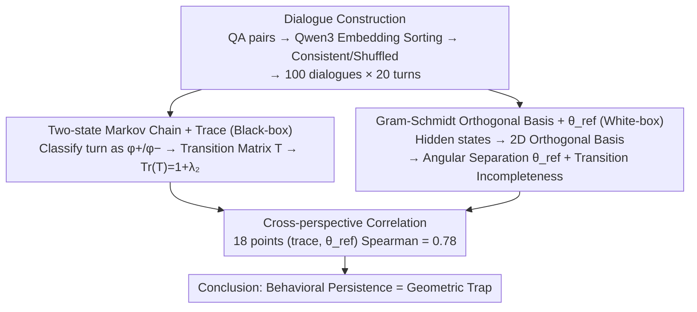

# Old Habits Die Hard: How Conversational History Geometrically Traps LLMs

**Conference**: ICML 2026  
**arXiv**: [2603.03308](https://arxiv.org/abs/2603.03308)  
**Code**: https://github.com/technion-cs-nlp/OldHabitsDieHard  
**Area**: LLM Security / Mechanistic Interpretability / Conversational Behavior Analysis  
**Keywords**: Conversational History, Behavioral Persistence, Markov Chains, Geometric Traps, Refusal / Sycophancy / Hallucination

## TL;DR
The History-Echoes framework analyzes the carryover effect of LLM conversational history through "Markov chain state consistency" and "latent space geometric angles." It identifies a Spearman correlation of 0.78—once a behavior (hallucination, sycophancy, or refusal) occurs, the model becomes trapped in a latent space region corresponding to that state, making escape difficult. The "refusal" trap is the strongest, while "hallucination" is the weakest; these traps dissolve when topic consistency is broken.

## Background & Motivation

**Background**: LLMs exhibit various state-dependent behaviors—both undesirable (hallucination, sycophancy) and desirable (refusal). Prior work has documented these phenomena, but how they persist and are represented across multi-turn dialogues lacks a unified framework. Existing studies on safety trajectories or generation difficulty analyze these phenomena in isolation, without linking "persistence probability" to "internal geometry."

**Limitations of Prior Work**: Analyzing strictly via black-box (output layer) or white-box (hidden states) is insufficient. Black-box analysis fails to reveal the mechanism (why it persists), while white-box analysis lacks behavioral validation (whether geometric patterns actually correspond to external behavior).

**Key Challenge**: Explaining why "a model that has refused once is more likely to refuse again" requires proving both that the behavior persists at the output level and that there is a structural correspondence in internal geometry, with the two being strongly correlated. Otherwise, the findings are either statistical illusions or cherry-picked geometry.

**Goal**: (1) Quantitatively measure behavioral carryover; (2) reveal the mechanism via latent space geometry; (3) demonstrate a strong correlation between these perspectives, providing dual evidence for "behavioral persistence $\approx$ geometric trap."

**Key Insight**: Dialogue states are binarized (behavior present/absent) and modeled as first-order Markov chains. Simultaneously, orthogonal bases for $\mathcal{H}_{\phi^+}$ and $\mathcal{H}_{\phi^-}$ are constructed in latent space using Gram-Schmidt to measure angular separation. The study predicts a positive correlation between these two metrics (black-box persistence vs. white-box geometric angles).

**Core Idea**: Behavioral persistence is not an isolated output-layer phenomenon; it is a latent space "geometric trap" where two state regions are separated by large angles, and switching states requires a significant rotation that is often incomplete.

## Method

### Overall Architecture

History-Echoes investigates why specific behaviors (refusal, sycophancy, hallucination) tend to recur once they appear. It employs two complementary perspectives: at the black-box level, it treats the presence/absence of behavior in each turn as a two-state sequence, quantifying its "stickiness" via Markov chain transition structures. At the white-box level, it maps hidden states to latent space to quantify the separation between states and the incompleteness of state transitions. Finally, it correlates black-box and white-box metrics across multiple models and datasets to confirm they represent the same underlying mechanism.

For experimental data, QA pairs from datasets (TriviaQA, NaturalQA, SORRY-Bench, Do-Not-Answer, SycophancyEval) are embedded using Qwen3-Embedding and sorted by nearest neighbors to form topic-consistent dialogues ($D_{\text{consistent}}$) or randomly shuffled ($D_{\text{inconsistent}}$). Each dataset comprises 100 dialogues of 20 turns each.

### Key Designs

**1. Two-state Markov Chain + Trace: Quantifying "Stickiness" via Black-box**

To quantify the intuition that "previous refusal leads to more refusal," the behavior is mapped to a scalar independent of model internals. Each turn is classified as "phenomenon $\phi$ present/absent" (using string matching, with a 6.5% error rate via manual audit). The transition matrix $T_{ij}=P(s_j|s_i)$ is estimated, and its trace $\text{Tr}(\mathbf{T})=P(s_{\phi^+}|s_{\phi^+})+P(s_{\phi^-}|s_{\phi^-})$ serves as the persistence measure. Since $\text{Tr}(\mathbf{T})=1+\lambda_2$ (where $\lambda_2$ is the second eigenvalue), a $\text{Tr} > 1$ (or $\lambda_2 > 0$) indicates state self-looping. Larger values imply longer mixing times and behaviors being "locked" in.

**2. Gram-Schmidt Orthogonal Basis + $\theta_{\text{ref}}$: Quantifying Geometric Separation via White-box**

To explain why behaviors stick, the latent geometry is analyzed. Residual hidden states at 85% relative depth are collected from the first token of each response. Mean vectors $\mathbf{h}_{\phi^+}$ and $\mathbf{h}_{\phi^-}$ are computed and orthonormalized using Gram-Schmidt to create a shared 2D basis ($\mathbf{B}_1$ from normalized $\mathbf{h}_{\phi^-}$, and $\mathbf{B}_2$ from the component of $\mathbf{h}_{\phi^+}$ orthogonal to $\mathbf{B}_1$). Two signatures are calculated: angular separation $\theta_{\text{ref}}$ (the angle between the two class means in this basis) and "transition incompleteness" (the ratio of the actual Procrustes rotation angle during a state switch to $\theta_{\text{ref}}$). If the ratio is $<1$, the activation fails to reach the target state, leaving a "geometric fingerprint" of the previous state.

**3. Cross-perspective Correlation: Linking Black-box and White-box**

To prove that high trace and large $\theta_{\text{ref}}$ describe the same mechanism, Spearman rank correlation is calculated across 18 model/dataset combinations. A significant positive correlation confirms that behavioral persistence is the external projection of latent state separation and incomplete geometric rotation.

## Key Experimental Results

### Behavioral Persistence (trace, average across three models)

| Phenomenon | NaturalQA | TriviaQA | Sorry | DoNotAns | S-pos | S-neg | Mean |
| :--- | :--- | :--- | :--- | :--- | :--- | :--- | :--- |
| Tr(T) | 1.13 | 1.12 | **1.57** | **1.59** | 1.33 | 1.14 | 1.31 |

All phenomena exhibit $\text{Tr} > 1$; refusal datasets show the highest trace ($\approx 1.6$), indicating the strongest carryover.

### Geometric Angular Separation $\theta_{\text{ref}}$ (degrees)

| Model | NaturalQA | TriviaQA | Sorry | DoNotAns | S-pos | S-neg |
| :--- | :--- | :--- | :--- | :--- | :--- | :--- |
| LLaMA-3.1-8B | 11.3 | 13.1 | **66.5** | **54.3** | 14.6 | 28.2 |
| Qwen-8B | 11.7 | 6.4 | **46.4** | **38.6** | 22.5 | 22.6 |
| GPT-OSS-20B | 9.6 | 13.9 | **42.7** | **34.0** | 27.8 | 23.6 |

Refusal datasets show $\theta_{\text{ref}}$ of 30–66°, significantly higher than the 6–14° of hallucinations—geometric refusal states are distinctly separated.

### Cross-perspective Correlation

The Spearman correlation for 18 (trace, $\theta_{\text{ref}}$) points across 3 models and 6 datasets is **0.78**, confirming a strong positive correlation between high trace and large geometric angles.

### Topic Inconsistency Dissolves the Trap

| Dataset | $D_{\text{consistent}}$ trace | $D_{\text{inconsistent}}$ trace | Difference |
| :--- | :--- | :--- | :--- |
| Sorry | 1.57 | 1.18 | −0.39 |
| Do-not-answer | 1.59 | 1.20 | −0.39 |
| S-neg | 1.14 | 1.05 | −0.09 |

Shuffling topics significantly reduces the trace and $\theta_{\text{ref}}$, proving that the "geometric trap" depends on topic consistency. This aligns with adversarial jailbreak strategies that inject irrelevant tokens to break context.

### Key Findings
- **Carryover strength is ordered**: refusal > sycophancy > hallucination, consistent across both trace and $\theta_{\text{ref}}$.
- **Refusal strength stems from a "single direction"**: This matches Arditi et al. 2024, where refusal is governed by a single representation direction. Clearly defined phenomena are more geometrically separated and thus harder to escape.
- **Hallucinations are weakest**: Likely because hallucinations are a broad set of failure modes (factual errors, fabrications, inconsistencies) without a unified latent subspace.
- **Inconsistent dialogues break traps**: Switching topics may be a simple practical method to "unlock" a stuck model.

## Highlights & Insights
- **Strong correlation between black-box and white-box**: Systematically links behavioral statistics to latent geometry, providing dual evidence for the "behavioral persistence = geometric trap" theory.
- **Unified treatment of phenomena**: Contrasting failure modes (hallucination) with conservative behaviors (refusal) reveals that carryover strength corresponds to "geometric clarity."
- **Diagnostic utility for closed-source models**: Trace calculation does not require internal access, providing a proxy to diagnose internal carryover in models like GPT-5 or Claude.
- **Geometric explanation for jailbreaking**: Explains why adversarial tokens work—they disrupt topic consistency, thereby dissolving the geometric trap.

## Limitations & Future Work
- Phenomenon detection relies on string matching (6.5% error rate), which lacks granularity for hallucination types.
- First-order Markov assumptions may oversimplify long-range dependencies.
- The study uses small models (4–20B); geometric patterns in larger models might differ.
- Calculations are fixed at 85% relative depth; trap strength may vary across layers.
- Research focuses on "once-trapped-stay-trapped" without exploring active "de-trapping" mechanisms besides topic shuffling.

## Related Work & Insights
- **vs. Arditi et al. 2024 (Refusal Direction)**: Ours generalizes this to show refusal has a "single direction" and "strong carryover."
- **vs. Carryover Effects Studies (Simhi 2024, Zhang 2024)**: Previous works only viewed the output layer; this adds the white-box perspective and proves correlation.
- **vs. Jailbreak via Adversarial Tokens (Zou 2023)**: Provides a geometric explanation for why adversarial tokens are effective.
- **Inspiration**: This framework can be extended to other state-dependent phenomena (e.g., ICL format locking, persona drift). It also suggests designing active de-trap mechanisms, such as prompt-side safety patches that refresh topic state.

## Rating
- Novelty: ⭐⭐⭐⭐ (Dual-perspective framework is new; individual components are known.)
- Experimental Thoroughness: ⭐⭐⭐⭐⭐ (Wide coverage across models, datasets, phenomena, and closed-source validation.)
- Writing Quality: ⭐⭐⭐⭐ (Clear concepts and intuitive figures.)
- Value: ⭐⭐⭐⭐ (Practical insights for safety and jailbreak mechanisms.)

<!-- RELATED:START -->

## Related Papers

- [\[ICML 2026\] How Hard Can It Be? Hardness-Aware Multi-Objective Unlearning](how_hard_can_it_be_hardness-aware_multi-objective_unlearning.md)
- [\[ICML 2026\] Multilingual Unlearning in LLMs: 转移、动力学与可逆性](multilingual_unlearning_in_llms_transfer_dynamics_and_reversibility.md)
- [\[ICML 2026\] Geometrically Constrained Outlier Synthesis](geometrically_constrained_outlier_synthesis.md)
- [\[ICML 2026\] Gradient Transformer: Learning to Generate Updates for LLMs](gradient_transformer_learning_to_generate_updates_for_llms.md)
- [\[ICML 2026\] Efficient DP-SGD for LLMs with Randomized Clipping](efficient_dp-sgd_for_llms_with_randomized_clipping.md)

<!-- RELATED:END -->
