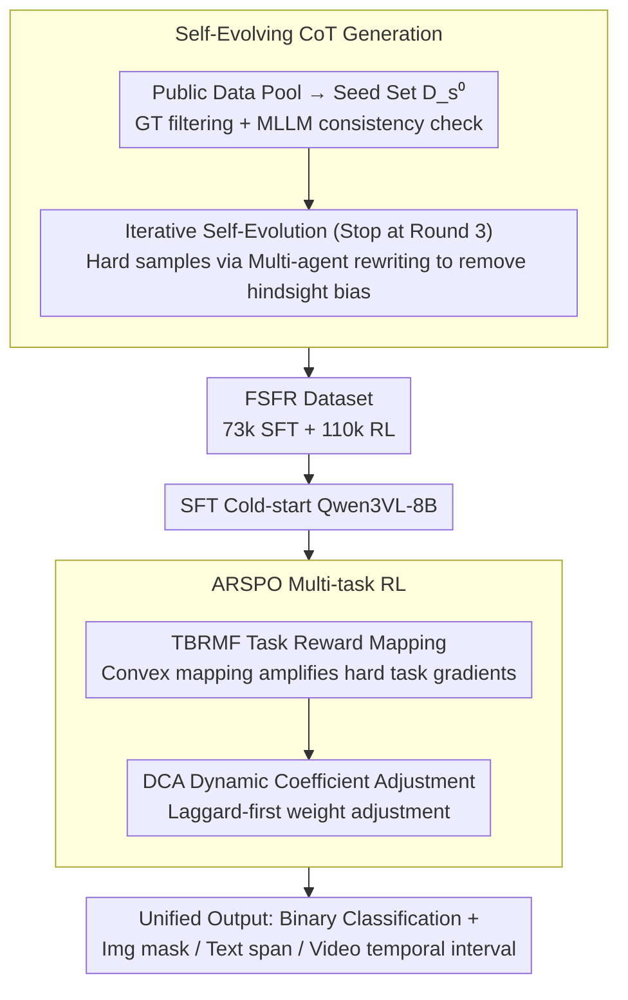

# OmniVL-Guard: Towards Unified Vision-Language Forgery Detection and Grounding via Balanced RL

**Conference**: ICML 2026  
**arXiv**: [2602.10687](https://arxiv.org/abs/2602.10687)  
**Code**: https://github.com/shen8424/OmniVL-Guard (Available)  
**Area**: AI Security / Multi-modal Forgery Detection / Reinforcement Learning / VLM  
**Keywords**: Forgery Detection, Grounding, Multi-task RL, Reward Shaping, Self-evolving CoT  

## TL;DR
This paper targets the unified task of "simultaneous detection + localization of mixed image/text/video forgeries." It proposes OmniVL-Guard, using Self-Evolving CoT to synthesize high-quality cold-start data and ARSPO (Non-linear reward mapping + dynamic task weights) to resolve the "difficulty bias" in multi-task RL, where easy binary classification monopolizes gradients while fine-grained localization fails to learn. Compared to previous methods, it achieves a +37.8 tIoU increase in video temporal localization and +22.9 F1 in text localization on in-domain data, while reaching zero-shot SOTA on four OOD benchmarks.

## Background & Motivation

**Background**: Most current forgery detection/tampering localization works are unimodal (pure image, text, or video) or at most bimodal (image-text, video-text), each equipped with specific expert models. Representative methods like HAMMER, FKA-Owl, Fake-VLM, and FakeSV-VLM can only handle specific input types.

**Limitations of Prior Work**: Real-world misinformation on social media consists of "all-modal" content where image, text, and video are highly intertwined. Mono/bimodal detectors either fail to process such mixed inputs or cannot simultaneously provide "fake-real judgment + tampering location." Thus, a unified framework covering binary classification and grounding across image/text/video is required. However, the authors found that directly using general MLLMs (GPT-5/Gemini3/Seed1.6) in a zero-shot manner only yields ~73% accuracy for binary classification, while grounding performance collapses to 20-35 (Table 1a). Direct SFT fails to generalize across modalities due to insufficient reasoning capabilities.

**Key Challenge**: While introducing RL (e.g., GRPO) might allow MLLMs to explore reasoning paths, experimentation and theory reveal a "difficulty bias": binary classification has strong reward signals and is easy to optimize, while image/text/video grounding involves regression/interval tasks with sparse signals. When GRPO optimizes all tasks equally, classification improves by +36% while image localization regresses by -0.1%—the easy task "kidnaps" the gradient update direction. Improvements like SAPO perform slightly better but still struggle with localization.

**Goal**: Split into two sub-problems: (1) How to generate high-quality CoT cold-start data for fine-grained multi-modal reasoning; (2) How to design a new RL objective so that easy tasks do not monopolize resources and hard tasks benefit continuously.

**Key Insight**: The authors performed a second-order expansion of the GRPO objective with respect to parameters $\theta$ (Eq. 4), decomposing the gradient rate of change into "reward mapping sensitivity $g_k'(\cdot)$" and "task difficulty sensitivity $H_k'(\theta,q,\tau)$." Hard tasks naturally have very small $H_k'$ as they stay in performance plateaus. Therefore, even if rewards are normalized to the same scale, easy tasks still dominate "gradient acceleration." This derivative directly points to a remedy: use a **convex, non-linear reward mapping function** $g_k(\cdot)$ that steepens as performance rises, amplifying the gradient contribution of high-score responses to offset the decay caused by small $H_k'$ in hard tasks.

**Core Idea**: Replace uniform weighting in RL with "non-linear reward shaping + dynamic task weights," allowing easy tasks to converge naturally while weighting hard tasks appropriately. Use self-evolving CoT to synthesize cold-start data that truly solves problems (rather than reverse-reasoning from answers), avoiding hindsight bias caused by GT-injected distillation.

## Method

### Overall Architecture
The model processes any image/text/video (or mixed) input and outputs "binary classification" and "tampering location in the corresponding modality"—image spatial masks (measured by IoU), text token spans (F1), and video temporal segments (tIoU). All grounding tasks are unified as MLLM text outputs (coordinates/token spans/temporal intervals), enabling a single Qwen3VL-8B to cover four tasks. The implementation includes: offline Self-Evolving CoT Generation to create the FSFR dataset (73k SFT cold-start samples + 110k RL samples), SFT cold-start on Qwen3VL-8B, and ARSPO multi-task RL (comprising TBRMF and DCA modules) to handle "difficulty bias."

### Key Designs

**1. Self-Evolving CoT Generation: Using Model Success as a Proxy for CoT Quality to Bypass Hindsight Bias**

To solve the *Efficiency-Bias Dilemma* (closed-source MLLMs generate poor forensic details, while GT-injected reasoning learns "reverse-reasoning"), the authors use a four-stage self-evolution. Initially, a 6.7k seed set $D_s^0$ is curated from public pools via SOTA MLLM reasoning and GT filtering. After SFT+RL warm-up on $\pi_0$, the model enters iterations: in each round $k$, $\pi_{k-1}$ generates CoTs for remaining samples. Samples passing GT/MLLM checks enter $D_s^k$. Crucially, **each round retrains from the base Qwen3VL-8B** instead of continuing from the previous round to prevent distribution drift. Hard samples undergo Multi-Agent Collaborative Hard-CoT Synthesis: Agent 1 generates CoT with GT, Agent 2 (Refiner) rewrites it to hide answer traces as "natural reasoning," and Agent 3 filters by score. This decouples reasoning quality from answer correctness.

**2. Task-Based Reward Mapping Function (TBRMF): Reshaping Gradients via Convex Reward Mapping**

TBRMF addresses the issue of GRPO's uniform optimization favoring easy tasks. Based on the second-order expansion of the gradient acceleration:

$$\frac{d}{d\theta}\big(W_{i,t}(\theta)\hat{A}_{i,k}\big) = W'_{i,t}(\theta)\hat{A}_{i,k} + W_{i,t}(\theta)\cdot \frac{g_k'(H_k)}{G\sigma}\big[(G-1)-\hat{A}_{i,k}^2\big]\,H_k'(\theta,q,\tau)$$

The "difficulty bias" is analytically caused by small $H_k'$ in hard tasks. TBRMF defines rewards as $A_{i,k}=g_k(x_{i,k})$. For easy classification, $g_k(x)=x$ (identity mapping). For localization tasks, a convex function $g_k(x)=e^{a_k x}$ (with $a=3$) is used. The convex mapping steepens in high-performance regions, significantly increasing the gradient contribution of responses that are "close to correct," compensating for the decay in $H_k'$.

**3. Dynamic Coefficient Adjustment (DCA): Closed-Loop Controller for Laggard-First Weight Allocation**

While TBRMF provides static mapping shapes, DCA manages training dynamics. After a warm-up phase to record task baselines $B_k$, the system evaluates relative gain $\Delta_{\text{total},k}$ and recent trends $\delta_{\text{recent}}$ every $T$ steps. Global weights $l_{k,s}$ are adjusted via four priority tiers: momentum protection (maintain if rising) → regression rescue (boost $\alpha_{\text{boost}}$ if regressing) → high-performance decay (gradually decrease if target met) → laggard support (maximize weight for the task with minimum $\Delta_{\text{total},k}$). This ensures resources are prioritized for the most challenging tasks without gradient overhead.

### Loss & Training
The RL objective embeds DCA's dynamic coefficients $l_{k,s}$ into the GRPO framework:

$$\mathcal{J}_{\text{arspo}}(\theta)=\sum_{k=1}^{K}\frac{|\mathcal{D}_k|}{|\mathcal{D}|}\mathbb{E}_{q\sim\mathcal{D}_k,\{y_i\}\sim\pi_{\theta_{\text{old}}}}\left[\frac{l_{k,s}}{G}\sum_{i=1}^{G}\frac{1}{|y_i|}\sum_{t=1}^{|y_i|}f_{i,t}(r_{i,t}(\theta))\hat{A}_{i,k}\right]$$

Advantage $\hat{A}_{i,k}$ is normalized within groups, but rewards $A_{i,k}$ are transformed by TBRMF.

## Key Experimental Results

### Main Results
In-Domain (Internal $D_t$ test set, ~700k samples):

| Task | Metric | Ours | Prev. SOTA | Gain |
|--------|------|------|----------|------|
| Text Binary | ACC | 96.20 | 89.23 (Qwen3VL-235B) | +6.97 |
| Image Binary | ACC | 93.12 | 90.39 (Fake-VLM) | +2.73 |
| Video Binary | ACC | 98.58 | 98.81 (FakeSV-VLM) | -0.23 |
| Image-Loc | IoU | 54.26 | 48.53 (HAMMER) | +5.73 |
| Text-Loc | F1 | 63.78 | 40.86 (HAMMER) | +22.92 |
| Video-Loc | tIoU | 59.22 | 21.43 (Qwen3VL-235B) | +37.79 |

Zero-shot OOD: Leading in all four benchmarks, e.g., ISOT Text 93.69 (vs 88.74) and MMFakeBench 79.38 (vs 62.32).

### Ablation Study

| Configuration | Img-Loc IoU | Text-Loc F1 | Vid-Loc tIoU | $\Delta$ AVG |
|------|---|---|---|---|
| SFT only | 51.08 | 44.67 | 33.08 | — |
| SFT + SAPO | 51.24 | 54.33 | 44.10 | +24.33 |
| Full（SFT+SAPO+TBRMF+DCA） | **54.26** | **63.78** | **59.22** | **+28.33** |

### Key Findings
- **TBRMF's "gradient reshaping" is the strongest signal**: In single-task settings, exponential mapping outperformed linear mapping, proving its value lies in "amplifying high-score gradients" rather than just balancing tasks.
- **Reward curvature $a>3$ leads to degradation**: Excessive steepness causes "reward overfitting" where noise is mistaken for signal.
- **Self-evolution saturates at Round 3**: Round 4 showed negligible gains (<0.2), justifying the stopping criterion.
- **"Difficulty Bias" in GRPO/SAPO is quantified**: SFT+GRPO caused classification to surge (+36%) while localization stagnated or regressed.

## Highlights & Insights
- **Theoretical Attribution of Bias**: The authors moved beyond mere observation of the "easy task bias" to a precise second-order gradient derivation, turning RL tuning into a theoretically grounded choice of reward functions.
- **Hindsight-Bias-Free CoT Synthesis**: The "Refiner" MLLM paradigm for hiding answer traces can be generalized to any task requiring process supervision (math reasoning, formal verification).
- **Lightweight DCA**: The four-priority heuristic serves as a plug-and-play tool for multi-task RL without adding computational complexity.

## Limitations & Future Work
- High reproduction costs due to reliance on multiple closed-source SOTA MLLMs for data generation.
- Significant training overhead (~4 full SFT+RL cycles).
- Manual tuning of $a_k$ per task. Future work could include adaptive curvature adjustments based on reward distribution quantiles.

## Related Work & Insights
- **vs HAMMER / FKA-Owl**: Previous experts used specialized heads; Ours unifies everything into text outputs, trading specific expert efficiency for cross-dataset generalization.
- **vs DeepSeek-R1 / GRPO**: Ours acts as a "patch" for GRPO in imbalanced difficulty scenarios typical of multi-task multimodal learning.
- **vs Fake-VLM**: While mono-modal experts are slightly better in their niche (Video Binary -0.23), Ours demonstrates superior marginal value in cross-modal and OOD scenarios.

## Rating
- Novelty: ⭐⭐⭐⭐ Precise theoretical attribution of "difficulty bias" and the Hindsight-bias-free CoT synthesis.
- Experimental Thoroughness: ⭐⭐⭐⭐⭐ Comprehensive coverage across 4 modalities, 7 metrics, and 4 OOD benchmarks.
- Writing Quality: ⭐⭐⭐⭐ Logical chain from motivation to theory to algorithm.
- Value: ⭐⭐⭐⭐ Provide an industrial-grade unified solution for all-modal forgery detection.

<!-- RELATED:START -->

## Related Papers

- [\[CVPR 2026\] A Unified Perspective on Adversarial Membership Manipulation in Vision Models](../../CVPR2026/ai_safety/a_unified_perspective_on_adversarial_membership_manipulation_in_vision_models.md)
- [\[CVPR 2026\] TTP: Test-Time Padding for Adversarial Detection and Robust Adaptation on Vision-Language Models](../../CVPR2026/ai_safety/ttp_test-time_padding_for_adversarial_detection_and_robust_adaptation_on_vision-.md)
- [\[CVPR 2026\] Hierarchically Robust Zero-shot Vision-language Models](../../CVPR2026/ai_safety/hierarchically_robust_zero-shot_vision-language_models.md)
- [\[CVPR 2026\] SIF: Semantically In-Distribution Fingerprints for Large Vision-Language Models](../../CVPR2026/ai_safety/sif_semantically_in-distribution_fingerprints_for_large_vision-language_models.md)
- [\[CVPR 2026\] Omni-Fake: Benchmarking Unified Multimodal Social Media Deepfake Detection](../../CVPR2026/ai_safety/omni-fake_benchmarking_unified_multimodal_social_media_deepfake_detection.md)

<!-- RELATED:END -->
