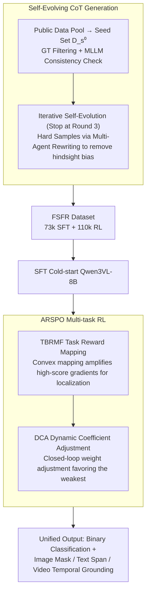

# OmniVL-Guard: Towards Unified Vision-Language Forgery Detection and Grounding via Balanced RL

**Conference**: ICML 2026  
**arXiv**: [2602.10687](https://arxiv.org/abs/2602.10687)  
**Code**: https://github.com/shen8424/OmniVL-Guard (Available)  
**Area**: AI Safety / Multimodal Forgery Detection / Reinforcement Learning / VLM  
**Keywords**: Forgery Detection, Grounding, Multi-task RL, Reward Shaping, Self-Evolving CoT  

## TL;DR
This paper targets the unified task of "Simultaneous detection and localization of mixed image/text/video forgeries." It proposes OmniVL-Guard, which utilizes Self-Evolving CoT to synthesize high-quality cold-start data and ARSPO (non-linear reward mapping + dynamic task weights) to address the "difficulty bias" in multi-task RL, where simple classification tasks dominate gradients while fine-grained localization tasks fail to learn. On In-Domain datasets, it achieves +37.8 tIoU for video temporal localization and +22.9 F1 for text localization, while reaching zero-shot SOTA on four OOD benchmarks.

## Background & Motivation

**Background**: Most current forgery detection/tampering localization works are unimodal (image, text, or video only) or at most bimodal (image-text, video-text), each equipped with a set of expert models. Representative methods like HAMMER, FKA-Owl, Fake-VLM, and FakeSV-VLM can only handle specific modalities.

**Limitations of Prior Work**: False information on real social media consists of "all-modal" content where images, text, and video are highly intertwined. Faced with such mixed inputs, unimodal or bimodal detectors either fail to process them or cannot simultaneously provide both "veracity judgment + tampering location." Thus, a unified framework covering binary classification and grounding for images/text/video is required. However, the authors found that using general MLLMs (GPT-5/Gemini3/Seed1.6) zero-shot results in ~73% accuracy for binary classification, while grounding performance collapses to 20-35 (Table 1a). Direct SFT fails to generalize across modalities due to insufficient reasoning capabilities.

**Key Challenge**: A natural choice is to introduce RL (e.g., GRPO) to let MLLMs explore reasoning paths. However, the authors observed a "difficulty bias" phenomenon through experiments and theory: binary classification is a discriminative task with strong, easily obtainable reward signals, whereas image/text/video localization are regression/interval tasks requiring fine-grained perception with sparse rewards. When GRPO optimizes all tasks equally, binary classification improves by +36%, while image localization actually regresses by -0.1%—the easy task "hijacks" the gradient update direction. Improvements like SAPO perform slightly better but still struggle with localization.

**Goal**: The problem is decomposed into two sub-problems: (1) How to generate high-quality CoT cold-start data for such fine-grained multimodal reasoning tasks; (2) How to design a new RL objective that prevents simple tasks from hogging resources and allows difficult tasks to benefit continuously.

**Key Insight**: The authors performed a second-order expansion of the GRPO objective with respect to parameters $\theta$ (Eq. 4), decomposing the gradient change rate into two terms: "reward mapping sensitivity $g_k'(\cdot)$" and "task difficulty sensitivity $H_k'(\theta,q,\tau)$." Since difficult tasks stay on performance plateaus, $H_k'$ is naturally small, so even when rewards are normalized to the same scale, simple tasks still dominate "gradient acceleration." This analytical expression suggests a remedy: use a **convex non-linear reward mapping function** $g_k(\cdot)$ that steepens as performance increases, amplifying the gradient contribution of high-scoring responses to offset the decay caused by a small $H_k'$.

**Core Idea**: Replace uniform weighting in RL with "non-linear reward shaping + dynamic task weights," allowing simple tasks to converge as needed while difficult tasks receive appropriate weighting. Additionally, use Self-Evolving CoT to synthesize cold-start data that reflects genuine problem-solving (rather than reverse-engineering answers) to avoid the hindsight bias introduced by GT-injected distillation.

## Method

### Overall Architecture
The model accepts any combination of image, text, or video and simultaneously outputs "binary veracity" and the "tampering location in the corresponding modality"—image masks (measured by IoU), text token spans (F1), and video temporal segments (tIoU). The authors unify all localization tasks as MLLM text outputs (coordinates / token spans / time intervals), allowing a single Qwen3VL-8B to cover all four tasks. The implementation has two stages: offline, Self-Evolving CoT Generation is used to create the FSFR dataset (73k SFT cold-start samples + 110k RL samples); then, Qwen3VL-8B undergoes SFT cold-starting followed by ARSPO, a multi-task RL method designed for "difficulty bias" (containing TBRMF and DCA modules). Evaluation is conducted on In-Domain and OOD benchmarks. The core challenges lie in generating CoT without answer leakage and preventing simple classification from dominating localization gradients.

### Key Designs

**1. Self-Evolving CoT Generation: Using consistency as a proxy for CoT quality to bypass hindsight bias**

Cold-start data is the foundation, but its creation faces an *Efficiency-Bias Dilemma*: closed-source MLLMs produce poor CoT quality because they lack forensic-level detail, yet feeding them GT to complete reasoning leads to "reverse-engineering from the answer." This hindsight bias contaminates RL exploration. The solution is a four-stage self-evolution. First, $D_s/D_r/D_t$ are partitioned from public data pools (FakeNewsCorpus, ForgeryNet, GenVideo, DGM4). A small subset of $D_s$ is inferred using an ensemble of SOTA MLLMs $\mathcal{M}=\{\text{Seed1.6-VL, Gemini3, ChatGPT5}\}$, and a 6.7k seed set $D_s^0$ is selected via "GT filtering + cross-consistency checks" to train a warm-up policy $\pi_0$.

In subsequent iterations, $\pi_{k-1}$ generates CoTs for the remaining samples, which are merged into $D_s^k$ after filtering. Crucially, **each round retrains from the base Qwen3VL-8B** rather than continuing from the previous round to prevent distribution shift. For "hard" samples that consistently fail, a Multi-Agent Collaborative Hard-CoT Synthesis is used: the first MLLM generates CoT using GT, the second acts as a "Refiner" to rewrite the reasoning to look like "natural deduction without knowing the answer," and the third performs score-based filtering. The essence is decoupling the "correctness of reasoning" from the "correctness of the answer," using "model-executable paths" as a proxy for quality and third-party MLLMs as judges to block answer leakage.

**2. Task-Based Reward Mapping Function (TBRMF): Reshaping gradients with convex mappings to offset difficult tasks**

This is the theoretical core of ARSPO, addressing the issue where binary classification climbs while localization stalls in vanilla GRPO. The authors derived the gradient acceleration by expanding the target with respect to $\theta$:

$$\frac{d}{d\theta}\big(W_{i,t}(\theta)\hat{A}_{i,k}\big) = W'_{i,t}(\theta)\hat{A}_{i,k} + W_{i,t}(\theta)\cdot \frac{g_k'(H_k)}{G\sigma}\big[(G-1)-\hat{A}_{i,k}^2\big]\,H_k'(\theta,q,\tau)$$

This decomposes the gradient change rate into reward mapping sensitivity $g_k'(\cdot)$ and task difficulty sensitivity $H_k'(\theta,q,\tau)$. Difficult tasks have small $H_k'$, meaning simple tasks dominate the update direction even with normalized rewards. To fix this, the authors manipulate $g_k'$. They define the reward $A_{i,k}=g_k(x_{i,k})$, where $x_{i,k}$ is the raw metric. For binary classification, an identity mapping $g_k(x)=x$ is used, while for the three fine-grained localization tasks, a convex function $g_k(x)=e^{a_k x}$ (with $a=3$) is used. The convex mapping's steeper slope in the high-performance zone amplifies gradients for "almost correct" responses, compensating for the decay in $H_k'$.

**3. Dynamic Coefficient Adjustment (DCA): A closed-loop controller for weakest-first task weight allocation**

While TBRMF provides a static reward curve, training dynamics change—a task might fall behind or regress. DCA adds a closed-loop controller. A warm-up phase ($s<T_{warm}$) establishes frozen baselines $B_k$. Every $T$ steps, two metrics are evaluated: total relative gain $\Delta_{\text{total},k}=(\mu_k-B_k)/B_k$ (long-term progress) and recent change $\delta_{\text{recent}}=\mu_k-\mu_{\text{past}}$ (short-term trend). Global weights $l_{k,s}$ are adjusted based on four priorities: momentum protection (no change if rising) → regression rescue (multiply by $\alpha_{\text{boost}}$ if regressing) → high-performance decay (gradually decrease if target met) → laggard support (boost the weight of the task $k_{\text{lag}}$ with the minimum $\Delta_{\text{total},k}$). This heuristic ensures resources are tilted towards the most stagnant tasks without additional gradient backpropagation overhead.

### Loss & Training
The RL objective embeds the dynamic coefficients $l_{k,s}$ into the GRPO framework:

$$\mathcal{J}_{\text{arspo}}(\theta)=\sum_{k=1}^{K}\frac{|\mathcal{D}_k|}{|\mathcal{D}|}\mathbb{E}_{q\sim\mathcal{D}_k,\{y_i\}\sim\pi_{\theta_{\text{old}}}}\left[\frac{l_{k,s}}{G}\sum_{i=1}^{G}\frac{1}{|y_i|}\sum_{t=1}^{|y_i|}f_{i,t}(r_{i,t}(\theta))\hat{A}_{i,k}\right]$$

The advantage $\hat{A}_{i,k}=(A_{i,k}-\mu)/\sigma$ is normalized within the group, but rewards $A_{i,k}=g_k(x_{i,k})$ are modified by task-specific non-linear mappings. Qwen3VL-8B is first cold-started with $\text{FSFR}_{\text{sft}}$ and then trained with ARSPO using $\text{FSFR}_{\text{rl}}$.

## Key Experimental Results

### Main Results
In-Domain (Constructed $D_t$ test set, ~700k samples):

| Dataset / Task | Metric | Ours | Prev. SOTA | Gain |
|--------|------|------|----------|------|
| Text Classification | ACC | 96.20 | 89.23 (Qwen3VL-235B) | +6.97 |
| Image Classification | ACC | 93.12 | 90.39 (Fake-VLM) | +2.73 |
| Video Classification | ACC | 98.58 | 98.81 (FakeSV-VLM) | -0.23 |
| Text-Image Classification | ACC | 75.52 | 72.08 (FKA-Owl) | +3.44 |
| Image Grounding | IoU | 54.26 | 48.53 (HAMMER) | +5.73 |
| Text Grounding | F1 | 63.78 | 40.86 (HAMMER) | +22.92 |
| Video Grounding | tIoU | 59.22 | 21.43 (Qwen3VL-235B) | +37.79 |

OOD Zero-shot: 93.69 on ISOT (vs 88.74), 63.64 on CASIA2.0 (vs 60.88), 79.38 on MMFakeBench (vs 62.32), and 63.55 on FakeSV (vs 61.22).

### Ablation Study

| Configuration | Img-Loc IoU | Text-Loc F1 | Vid-Loc tIoU | $\Delta$ AVG |
|------|---|---|---|---|
| SFT only | 51.08 | 44.67 | 33.08 | — |
| SFT + SAPO | 51.24 | 54.33 | 44.10 | +24.33 |
| + TBRMF | 53.21 | 61.37 | 49.38 | +26.42 |
| + DCA | 52.95 | 59.88 | 53.49 | +26.93 |
| Full (SFT+SAPO+TBRMF+DCA) | **54.26** | **63.78** | **59.22** | **+28.33** |

### Key Findings
- **The gradient-reshaping effect of TBRMF is the strongest signal**: In single-task settings, exponential mapping still beats linear mapping by +4% in image localization and +8% in text localization. This proves ARSPO's value is not just "balancing tasks" but "amplifying gradients for high-scoring samples."
- **Reward curvature beyond $a=3$ leads to degradation**: Figure 4 shows performance drops when $a$ is too large, likely due to "reward overfitting" where the mapping interprets aleatoric noise as signal. $a=3$ is the sweet spot for stability.
- **Self-evolution saturates at round 3**: Table 5 shows nearly zero improvement for $D_s^4$ vs $D_s^3$, justifying stopping at $k=3$ and saving significant compute.
- **The "difficulty bias" of GRPO/SAPO was directly captured**: In Table 1b, SFT+GRPO caused classification to surge by +36% while Image-Loc dropped by -0.1%, providing a clear case of simple tasks "stealing" gradients.

## Highlights & Insights
- **Deriving "difficulty bias" from second-order expansion**: Instead of merely observing the phenomenon, the authors mathematically attribute it to the product of reward sensitivity and task difficulty sensitivity. This provides a theoretical basis for TBRMF's exponential mapping, making it more than just hyperparameter tuning.
- **Hindsight-Bias-Free CoT Synthesis is highly reusable**: While most LLM-based CoT distillation feeds GT to the model to elicit reasoning, this paper identifies the resulting "reverse-engineering" bias. The "Refiner MLLM" approach could be applied to any task requiring procedural supervision (e.g., math, theorem proving).
- **DCA is a lightweight yet effective tool**: Using only four priority tiers and thresholds, it manages task weights without backpropagation costs, serving as a plug-and-play module for multi-task RL.

## Limitations & Future Work
- (1) The pipeline relies on three closed-source SOTA MLLMs, making it expensive to reproduce for the open-source community. (2) Each self-evolution round involves retraining from the base model, totaling four full SFT+RL cycles, which is computationally heavy. (3) TBRMF requires setting $a_k$ for each task; the differentiation between finer sub-tasks (like specific forgery types) remains unexplored.
- Future work could replace DCA's heuristics with a meta-learning-based controller or make $a_k$ adaptive based on the online reward distribution.

## Related Work & Insights
- **vs HAMMER / FKA-Owl**: These experts focus on image-text bimodal tasks using specialized heads. Ours unifies three modalities and converts all grounding to text, enabling zero-shot cross-modal generalization at the cost of higher inference latency.
- **vs DeepSeek-R1 / GRPO**: This work adopts the "SFT + RL for reasoning" paradigm but highlights and patches the "difficulty bias" in multi-task scenarios via ARSPO.
- **vs Fake-VLM / FakeSV-VLM**: Unimodal experts are strong on their specific tasks, but Ours bridges the gap in cross-modal and cross-dataset scenarios, demonstrating the marginal value of a unified model.

## Rating
- Novelty: ⭐⭐⭐⭐ Accurate theoretical attribution of "difficulty bias" and a grounded solution via TBRMF + DCA.
- Experimental Thoroughness: ⭐⭐⭐⭐⭐ Comprehensive coverage across 4 modalities × 7 metrics + 4 OOD benchmarks.
- Writing Quality: ⭐⭐⭐⭐ Clear motivation-theory-algorithm chain.
- Value: ⭐⭐⭐⭐ Provides an engineered unified solution for a practical problem while offering a transferable RL training strategy.

<!-- RELATED:START -->

## Related Papers

- [\[ICML 2026\] PRPO: Paragraph-level Policy Optimization for Vision-Language Deepfake Detection](prpo_paragraph-level_policy_optimization_for_vision-language_deepfake_detection.md)
- [\[CVPR 2026\] A Unified Perspective on Adversarial Membership Manipulation in Vision Models](../../CVPR2026/ai_safety/a_unified_perspective_on_adversarial_membership_manipulation_in_vision_models.md)
- [\[CVPR 2026\] TTP: Test-Time Padding for Adversarial Detection and Robust Adaptation on Vision-Language Models](../../CVPR2026/ai_safety/ttp_test-time_padding_for_adversarial_detection_and_robust_adaptation_on_vision-.md)
- [\[CVPR 2026\] Omni-Fake: Benchmarking Unified Multimodal Social Media Deepfake Detection](../../CVPR2026/ai_safety/omni-fake_benchmarking_unified_multimodal_social_media_deepfake_detection.md)
- [\[CVPR 2026\] Hierarchically Robust Zero-shot Vision-language Models](../../CVPR2026/ai_safety/hierarchically_robust_zero-shot_vision-language_models.md)

<!-- RELATED:END -->
