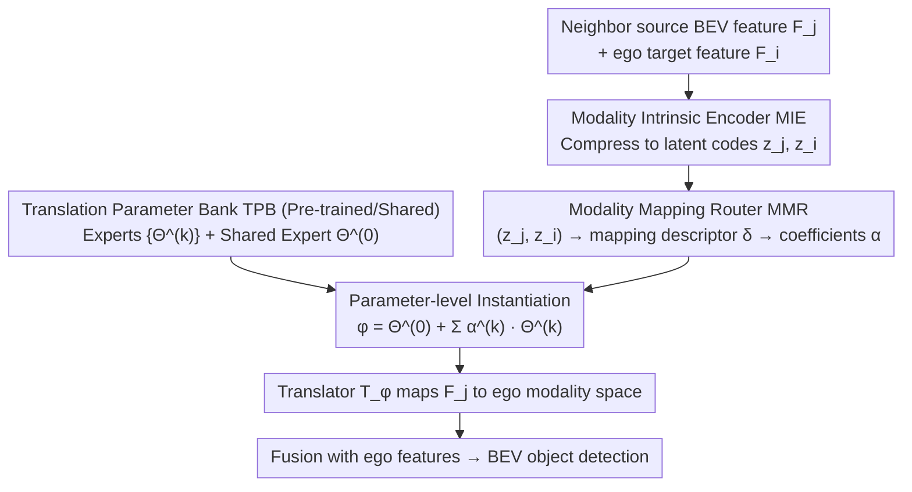

# One Model to Translate Them All: Universal Any-to-Any Translation for Heterogeneous Collaborative Perception

**Conference**: ICML 2026  
**arXiv**: [2605.17907](https://arxiv.org/abs/2605.17907)  
**Code**: https://github.com/CheeryLeeyy/UniTrans (Available)  
**Area**: Autonomous Driving / Collaborative Perception / Heterogeneous Feature Translation  
**Keywords**: Collaborative Perception, Heterogeneous Features, Modality Mapping, Zero-shot Translation, Parameter-level MoE

## TL;DR
UniTrans reformulates the traditional collaborative perception translation paradigm from "training an adapter for every pair of vehicle-side modalities" to "inferring mapping in a modality-intrinsic latent space $\rightarrow$ linearly combining a set of expert parameters via a router $\rightarrow$ instantiating a mapping-specific translator on the fly." This achieves zero-shot BEV feature translation for unseen new vehicle models, improving average AP@0.7 by ~7 / 3 points over the strongest baselines on OPV2V-H / DAIR-V2X, while maintaining lower GFLOPs/CPU time than Classic MoE.

## Background & Motivation

**Background**: Collaborative perception based on intermediate fusion is a mainstream paradigm for next-generation autonomous driving: each connected vehicle sends its BEV features to neighbors to compensate for occlusions and long-range perception limitations in single-vehicle views. However, different manufacturers use different sensor configurations, backbones, and network depths. The exchanged BEV features actually reside in heterogeneous "modality subspaces." Feeding them directly into the ego vehicle's fusion network leads to misinterpretation and performance degradation.

**Limitations of Prior Work**: Existing solutions for heterogeneity mainly follow two paths. **One-to-one adaptation** (MPDA, PnPDA, PolyInter) trains a dedicated adapter for each "source modality $\rightarrow$ target modality" pair, requiring new training whenever a new modality emerges. **Two-step adaptation** (HEAL, STAMP, NegoCollab) introduces a unified protocol space as an intermediary, but these protocol spaces are pre-defined or negotiated, often requiring re-adjustment and re-training of all mappings for new modalities. Both categories rely on iterative joint training or fine-tuning, which is largely infeasible in cross-manufacturer scenarios due to model and data privacy constraints.

**Key Challenge**: In open-world deployment, modalities evolve continuously, yet the training paradigm for translators assumes that "the set of modalities is closed and training is repeatable." Once these assumptions are broken, the entire collaborative perception system becomes difficult to scale.

**Goal**: Pre-train a universal model capable of providing a suitable feature translator **zero-shot** at inference time for any newly emerging "source $\rightarrow$ target" modality pair, without relying on any additional training or fine-tuning.

**Key Insight**: The authors observe two points: (i) Intermediate features entangle "scene content" and "modality statistics." However, by projecting them into a **modality-intrinsic low-dimensional space**, scene factors are suppressed, allowing new modalities to be stably localized and compared. This moves the difficult task of "estimating modality mapping" from a high-dimensional feature space to a compact space. (ii) Rather than training a single massive translator to handle all mappings, it is more effective to decompose mappings into a set of **reusable expert parameters**. A router translates "modality mapping" into "parameter combination coefficients," synthetically instantiating a mapping-specific translator as needed. This avoids the parallel execution overhead of Classic MoE during inference.

**Core Idea**: Replace "training an adapter per modality pair / maintaining a protocol space" with "inferring mapping via modality-intrinsic space + instantiating translators via modality-conditioned parameter combination."

## Method

### Overall Architecture

Each agent produces BEV intermediate features $F_i \in \mathcal{F}_{m_i}$ using its own encoder. Features from neighbors remain in heterogeneous source modality spaces even after geometric alignment and must be moved to the ego modality space by a translator $\mathcal{T}_{\phi_{j\to i}}$ before fusion. UniTrans addresses how to "obtain suitable translator parameters $\phi_{j\to i}$ on the fly for an unseen source-target pair without re-training." It decomposes this into two easier tasks: first, using a Modality Intrinsic Encoder to compress high-dimensional features into stable, comparable low-dimensional modality codes; then, using a router to predict "combination coefficients" based on these codes to linearly synthesize a mapping-specific translator from a pool of reusable expert parameters. Training occurs in two stages (building the intrinsic space, then learning the parameter bank and router). At inference, all agents share the same parameter bank and router; new modalities are assembled immediately without fine-tuning.

### Key Designs

**1. Modality Intrinsic Encoder (MIE): Moving "Mapping Estimation" from High-Dimensional Space to Stable Low-Dimensional Space**

Estimating mapping $\Delta_{j\to i}:\mathcal{F}_{m_j}\to\mathcal{F}_{m_i}$ directly in the raw feature space $\mathcal{F}$ is ill-posed—single-frame samples are too sparse and high-dimensional, and features entangle scene content with modality statistics. MIE extracts modality-sensitive/scene-insensitive statistics to compress each feature $F \in \mathbb{R}^{C\times H\times W}$ into a low-dimensional intrinsic code $z \in \mathbb{R}^d$: it computes first-order channel statistics $\mu(F), \sigma(F)$, Gram descriptors $G(F)=\frac{1}{H'W'}\bar{F}\bar{F}^\top$ of pooled features, and uses a global response branch $r(F)$. These are fused via MLP into $z = \psi_I([\mu(F), \sigma(F), r(F), \psi_G(G(F))])$. Training utilizes InfoNCE contrastive loss $\mathcal{L}_{\mathrm{IC}}$ to pull identical modalities together and push different ones apart, supplemented by a lightweight modality classification head with cross-entropy loss $\mathcal{L}_{\mathrm{IS}}$, resulting in $\mathcal{L}_{\mathrm{stage1}} = \mathcal{L}_{\mathrm{IC}} + \lambda_{\mathrm{IS}} \mathcal{L}_{\mathrm{IS}}$. In this space, same modalities cluster regardless of scene changes, allowing new modalities to be localized consistently with few samples—this is the first source of UniTrans's zero-shot capability.

**2. Translation Parameter Bank (TPB): Decomposing Monolithic Translators into Reusable Expert Parameters**

Empirically, "mapping diversity" is harder to fit than "feature diversity": a monolithic translator tends to underfit large cross-modality gaps like LiDAR-to-Camera. TPB decomposes the mapping space into a set of reusable expert parameters $\{\Theta^{(k)}\}_{k=1}^K$ plus a shared expert $\Theta^{(0)}$. Each $\Theta^{(k)}$ represents a complete translator backbone (MCT blocks designed as sparse Transformers), while the shared expert absorbs "mapping-agnostic" translation primitives. Each expert focuses on a specific translation sub-pattern and is mixed as needed. As mapping complexity increases, this decomposition offers superior capacity over monolithic translators, and the same parameter bank serves all new modalities.

**3. Modality Mapping Router (MMR) + Parameter-Level Instantiation: Translating "Mappings" into "Parameter Combination Coefficients"**

Given a pair of intrinsic codes $(z_j, z_i)$, MMR first computes a mapping descriptor $\delta_{j\to i} = g(z_j, z_i)$, then outputs combination coefficients $\boldsymbol{\alpha}_{j\to i} = \mathrm{softmax}(h(\delta_{j\to i})) \in \mathbb{R}^K$. It then instantiates the translator **at the parameter level**: $\phi_{j\to i} = \Theta^{(0)} + \sum_{k=1}^{K} \alpha^{(k)}_{j\to i}\, \Theta^{(k)}$. This differs fundamentally from classic MoE "multi-expert forward + weighted output": UniTrans performs "weighted parameters + single forward." The computational cost does not scale linearly with the number of experts, making it friendly for real-time vehicle-side inference. By modeling "mapping $\rightarrow$ translator" as routing coefficient prediction, MMR learns extrapolatable patterns across mappings—the second source of zero-shot capability.

### Loss & Training

Training is strictly divided into two stages. Stage 1 only updates MIE to build the stable modality-intrinsic space. Stage 2 freezes MIE and downstream task heads, backpropagating gradients to MMR and TPB. It optimizes four terms: task loss $\mathcal{L}_{\mathrm{task}}$; feature distillation loss $\mathcal{L}_{\mathrm{feat}} = \|F_{j\to i} - F^{\star}_{j\to i}\|_2^2$, where the "ideal ego-domain feature" $F^{\star}_{j\to i}=f^{\mathrm{enc}}_{m_i}(X_j)$ (obtained by passing neighbor raw observations through the ego encoder) acts as the teacher; an InfoNCE loss $\mathcal{L}_{\mathrm{ctr}}$ on routing vectors (pulling same mapping labels together); and a Switch-style load-balancing regularization $\mathcal{L}_r$. This yields $\mathcal{L}_{\mathrm{stage2}} = \mathcal{L}_{\mathrm{task}} + \lambda_{\mathrm{feat}}\mathcal{L}_{\mathrm{feat}} + \lambda_{\mathrm{ctr}}\mathcal{L}_{\mathrm{ctr}} + \lambda_r \mathcal{L}_r$. Training only accesses modalities in $\mathcal{M}_{\mathrm{tr}}$ and scenes in $\mathcal{D}_{\mathrm{tr}}$. Six emerging modalities $\{m_7, m_{13}, m_{17}, m_{25}, m_{27}, m_{30}\}$ are reserved for evaluation under a strict zero-shot setting.

## Key Experimental Results

### Main Results

30 LiDAR/Camera modality combinations were constructed on OPV2V-H (simulation) and DAIR-V2X (real-world) benchmarks (varying backbones like PointPillars/SECOND/VoxelNet/LSS and depths). Six emerging modalities were used as ego vehicles, with neighbors sampled from the emerging set for rigorous any-to-any zero-shot evaluation.

| Dataset | Metric | Ours (UniTrans) | Prev. SOTA (NegoCollab) | Gain |
|--------|------|--------------|---------------------|------|
| OPV2V-H Avg | AP@0.5 / AP@0.7 | **0.716 / 0.605** | 0.662 / 0.538 | +5.4 / +6.7 pt |
| OPV2V-H m27 (Camera ego) | AP@0.5 / AP@0.7 | **0.497 / 0.243** | 0.468 / 0.206 | +2.9 / +3.7 pt |
| OPV2V-H m30 (Camera ego) | AP@0.5 / AP@0.7 | **0.406 / 0.202** | 0.355 / 0.188 | +5.1 / +1.4 pt |
| DAIR-V2X Avg | AP@0.5 / AP@0.7 | **0.553 / 0.421** | 0.509 / 0.389 | +4.4 / +3.2 pt |

Inference cost is significantly lower (OPV2V-H): UniTrans requires 109.3 GFLOPs / 6.865 ms CPU / 53.76 ms CUDA, compared to Classic MoE (TopK=3) at 245.5 GFLOPs / 89.078 ms CPU / 141.352 ms CUDA, representing ~2× computational savings.

### Ablation Study

| Configuration | AP@0.5 / AP@0.7 | Description |
|------|-----------------|------|
| Full UniTrans | **0.716 / 0.605** | Full model |
| w/o $\mathcal{L}_{\mathrm{IC}}$ | 0.685 / 0.575 | Removed contrastive loss; intrinsic space no longer clusters |
| w/o $\mathcal{L}_{\mathrm{IS}}$ | 0.694 / 0.583 | Removed modality classification auxiliary |
| w/o $\mathcal{L}_{\mathrm{IC}} + \mathcal{L}_{\mathrm{IS}}$ | 0.662 / 0.540 | Stage 1 supervision removed; modality recognition collapses |
| w/o $\mathcal{L}_{\mathrm{task}}$ | 0.691 / 0.579 | Missing downstream task supervision |
| w/o $\mathcal{L}_{\mathrm{feat}}$ | 0.653 / 0.531 | **Most critical** — Lost ego-encoder distillation teacher |
| w/o $\mathcal{L}_{\mathrm{ctr}}$ | - | Routing vectors no longer cluster by mapping |

### Key Findings

- Distillation loss $\mathcal{L}_{\mathrm{feat}}$ is the most significant contributor to performance (AP@0.7 drops from 0.605 to 0.531 when removed), confirming that using the ego-encoder to process neighbor observations as a teacher is the implicit key to zero-shot translation—it provides a clear supervision signal on "what the target domain should look like."
- LiDAR ego (m7–m25) shows the most stable gains. Camera ego (m27, m30) shows performance degradation for all methods, yet UniTrans remains the strongest, indicating the intrinsic space robustly measures mapping relationships even across large modality gaps.
- Classic MoE barely outperforms some two-step methods (e.g., PolyInter), suggesting that routing directly on high-dimensional features makes it difficult to learn mapping-aware expert selection. UniTrans's placement of the router in the intrinsic space is pivotal.
- Gains on the real-world DAIR-V2X dataset are smaller than in simulation, but relative rankings remain unchanged; mapping-conditioned instantiation remains superior under distribution shift.

## Highlights & Insights

- **"Where to infer mapping" is more important than "translator complexity"**: Moving modality mapping inference from raw feature space to intrinsic space accounts for approximately 5 points of AP@0.7 improvement. This approach is transferable to other heterogeneous backbone alignment problems (e.g., federated learning).
- **Parameter-level Expert Combination (Not Classic MoE)**: Unlike MoE's "multi-expert forward + weighted output," UniTrans uses "weighted parameters + single forward." This preserves MoE's capacity benefits for latency-sensitive vehicle inference while keeping costs comparable to monolithic translators.
- **Clever Teacher Design**: Using "neighbor observations through ego encoder" as the distillation teacher ($F^\star_{j\to i}=f^\mathrm{enc}_{m_i}(X_j)$) effectively bypasses the "no paired feature" problem, giving the translator a clear target domain.
- The solution is a true "train once, deploy everywhere" scheme. Once pre-training is finished, the ego vehicle can assemble a dedicated translator the moment it receives a feature from any new vehicle model, offering high value for practical deployment.

## Limitations & Future Work

- All 30 modalities are combinations of "backbone + depth," essentially variants within LiDAR/Camera families; whether MIE's intrinsic space remains robust for entirely new sensors (e.g., 4D radar, thermal) requires verification.
- The number of experts $K$ in TPB significantly impacts VRAM (storing $K+1$ sets of backbone parameters). The paper does not discuss performance degradation under parameter budget constraints.
- The teacher $F^\star_{j\to i}=f^\mathrm{enc}_{m_i}(X_j)$ requires the ego side to access neighbor raw observations $X_j$ during training, which might violate "data privacy" in cross-manufacturer scenarios.
- Absolute performance on DAIR-V2X (AP@0.7 = 0.421) is still below production requirements, especially in Camera-ego scenarios; incorporating camera geometric priors or multi-frame BEV history is a potential future direction.

## Related Work & Insights

- **vs MPDA / PnPDA / PolyInter (One-to-one adaptation)**: These methods train an adapter per pair; UniTrans decomposes mappings into reusable experts, making it equivalent to "one adapter template + one router" for all modalities.
- **vs HEAL / STAMP / NegoCollab (Protocol space)**: These rely on negotiated protocol spaces; UniTrans estimates mappings directly in a data-driven intrinsic space without fixed protocols.
- **vs Classic MoE**: UniTrans moves routing to a low-dimensional space and uses parameter-level combination, resulting in faster single-forward passes and better mapping awareness.
- **Insight**: This "low-dimensional intrinsic condition + parameter pool instantiation" pattern resembles hyper-networks for conditional generation, but it is successfully implemented here for collaborative perception. This decomposition of "zero-shot capability" into intrinsic space generalization and router generalization can be migrated to cross-client model translation in federated learning or cross-device perception compatibility.

## Rating
- Novelty: ⭐⭐⭐⭐ Reformulating heterogeneous collaborative perception as "intrinsic space routing + parameter-level MoE" is sharp, though individual components have precedents.
- Experimental Thoroughness: ⭐⭐⭐⭐ Extensive datasets, 30 modalities, zero-shot splits, and detailed profiling; however, lacks a scan of expert scale $K$ and new families of sensors.
- Writing Quality: ⭐⭐⭐⭐ Formal math and clear distinction between modality/scene splits, though some derivations are slightly dense.
- Value: ⭐⭐⭐⭐⭐ Directly addresses the critical bottlenecks of collaborative perception (inability to joint train cross-manufacturers + evolving modalities).

<!-- RELATED:START -->

## Related Papers

- [\[ICML 2026\] Anchored Decoding: Provably Reducing Copyright Risk for Any Language Model](anchored_decoding_provably_reducing_copyright_risk_for_any_language_model.md)
- [\[ICML 2026\] Partitioning for Intrinsic Model Inversion Resistance in Collaborative Inference](partitioning_for_intrinsic_model_inversion_resistance_in_collaborative_inference.md)
- [\[CVPR 2026\] All Vehicles Can Lie: Efficient Adversarial Defense in Fully Untrusted-Vehicle Collaborative Perception via Pseudo-Random Bayesian Inference](../../CVPR2026/ai_safety/all_vehicles_can_lie_efficient_adversarial_defense_in_fully_untrusted-vehicle_co.md)
- [\[CVPR 2026\] Detect Any AI-Counterfeited Text Image](../../CVPR2026/ai_safety/detect_any_ai-counterfeited_text_image.md)
- [\[ICLR 2026\] Co-LoRA: Collaborative Model Personalization on Heterogeneous Multi-Modal Clients](../../ICLR2026/ai_safety/co-lora_collaborative_model_personalization_on_heterogeneous_multi-modal_clients.md)

<!-- RELATED:END -->
