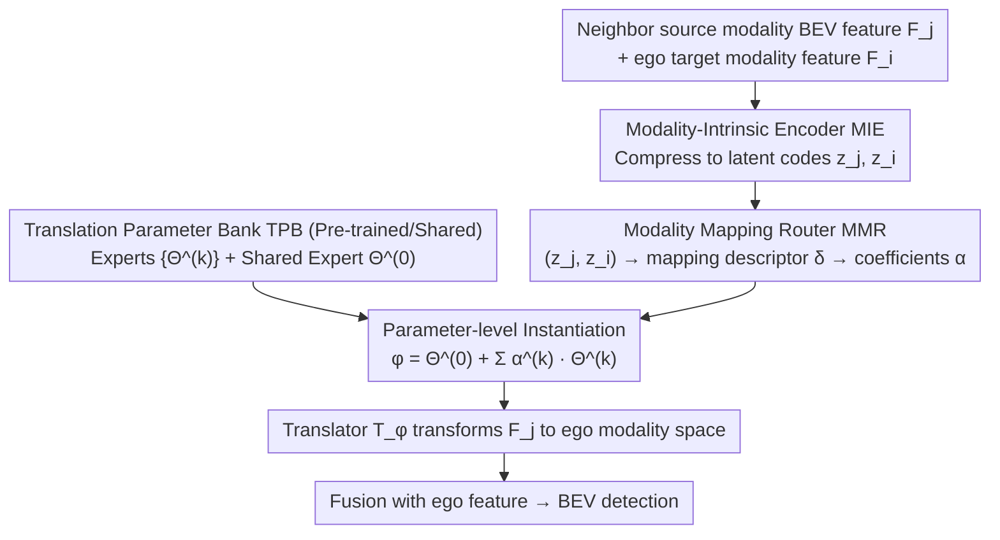

# One Model to Translate Them All: Universal Any-to-Any Translation for Heterogeneous Collaborative Perception

**Conference**: ICML 2026  
**arXiv**: [2605.17907](https://arxiv.org/abs/2605.17907)  
**Code**: https://github.com/CheeryLeeyy/UniTrans (Available)  
**Area**: Autonomous Driving / Collaborative Perception / Heterogeneous Feature Translation  
**Keywords**: Collaborative Perception, Heterogeneous Features, Modality Mapping, Zero-shot Translation, Parameter-level MoE

## TL;DR
UniTrans reformulates the traditional collaborative perception translation paradigm from "training an adapter for every pair of vehicle modalities" to "inferring mappings in a modality-intrinsic latent space → linearly combining a set of expert parameters via a router → instantiating a mapping-specific translator on the fly." This achieves zero-shot BEV feature translation for unseen new vehicle models, improving average AP@0.7 by ~7 / 3 points over the strongest baseline on OPV2V-H / DAIR-V2X, while maintaining lower GFLOPs / CPU time than Classic MoE.

## Background & Motivation

**Background**: Collaborative perception based on intermediate fusion is a mainstream paradigm for next-generation autonomous driving: each connected vehicle sends its BEV features to neighbors to compensate for occlusion and insufficient long-range perception in single-vehicle views. However, different manufacturers use different sensor configurations, backbones, and network depths. The shared BEV features actually reside in heterogeneous "modality subspaces," leading to misinterpretation by the ego fusion network and performance degradation.

**Limitations of Prior Work**: Addressing heterogeneity typically follows two paths. **One-to-one adaptation** (MPDA, PnPDA, PolyInter) trains a dedicated adapter for each "source modality → target modality" pair, requiring new training rounds for new modalities. **Two-step adaptation** (HEAL, STAMP, NegoCollab) introduces a unified protocol space as a relay, but the protocol space is either pre-defined or negotiated, often requiring protocol renegotiation and retraining of all mappings when encountering new modalities. Both categories rely on repeated joint training or fine-tuning, which is largely infeasible in cross-manufacturer scenarios due to model and data privacy constraints.

**Key Challenge**: In open-world deployment, modalities evolve continuously, yet the translator training paradigm still assumes "closed modality sets and repeatable training." Once these assumptions are broken, the entire collaborative perception system becomes difficult to scale.

**Goal**: To pre-train a universal model capable of providing a suitable feature translator for any newly emerging "source → target" modality pair in a **zero-shot** manner during inference, without relying on additional training or fine-tuning.

**Key Insight**: The authors observe two points. (i) Intermediate features entangle "scene content" with "modality statistics." However, by projecting them into a **modality-intrinsic low-dimensional space**, scene factors are suppressed, allowing new modalities to be stably positioned and compared. This shifts the difficult task of "modality mapping estimation" from a high-dimensional feature space to a compact space. (ii) Rather than training a massive unified translator to handle all mappings, it is better to decompose mappings into a set of **reusable expert parameters**. A router translates the "modality mapping" into "parameter combination coefficients," linearly synthesizing a mapping-specific translator on demand. This avoids the parallel multi-expert execution overhead of Classic MoE during inference.

**Core Idea**: Replace "training an adapter for each modality pair / maintaining a protocol space" with "inferring mappings in a modality-intrinsic space + instantiating translators via mapping-conditioned parameter combinations."

## Method

### Overall Architecture

Each agent uses its own encoder to produce BEV intermediate features $F_i \in \mathcal{F}_{m_i}$. Features from neighbors, even after geometric alignment, remain in the heterogeneous source modality space and must be transformed into the ego modality space by a translator $\mathcal{T}_{\phi_{j\to i}}$ before fusion. UniTrans addresses "how to obtain suitable translator parameters $\phi_{j\to i}$ for an unseen source-target pair on the fly without retraining." It breaks this challenge into two simpler tasks: first, using a modality-intrinsic encoder to compress high-dimensional features into stable, comparable low-dimensional modality codes; then, using a router to predict "combination coefficients" based on these codes to linearly synthesize a mapping-specific translator from a pool of reusable expert parameters. Training occurs in two stages (building the intrinsic space, then learning the parameter bank and router). During inference, all agents share the same parameter bank and router, allowing immediate assembly for new modalities without fine-tuning.

### Key Designs

**1. Modality-Intrinsic Encoder (MIE): Shifting Mapping Estimation to a Stable Low-Dimensional Space**

Estimating the mapping $\Delta_{j\to i}:\mathcal{F}_{m_j}\to\mathcal{F}_{m_i}$ directly in the raw feature space $\mathcal{F}$ is ill-posed—single-frame samples are sparse, dimensions are high, and features entangle scene content with modality statistics. MIE extracts scene-insensitive but modality-sensitive statistics to compress each feature $F \in \mathbb{R}^{C\times H\times W}$ into a low-dimensional intrinsic code $z \in \mathbb{R}^d$. It uses first-order channel statistics $\mu(F), \sigma(F)$, a Gram descriptor $G(F)=\frac{1}{H'W'}\bar{F}\bar{F}^\top$ of pooled features, and a global response branch $r(F)$, fused by an MLP into $z = \psi_I([\mu(F), \sigma(F), r(F), \psi_G(G(F))])$. Training utilizes InfoNCE contrastive loss $\mathcal{L}_{\mathrm{IC}}$ to pull same modalities closer and push different ones apart, supplemented by a cross-entropy loss $\mathcal{L}_{\mathrm{IS}}$ from a lightweight classification head, resulting in $\mathcal{L}_{\mathrm{stage1}} = \mathcal{L}_{\mathrm{IC}} + \lambda_{\mathrm{IS}} \mathcal{L}_{\mathrm{IS}}$. In the resulting space, identical modalities cluster regardless of scene changes, allowing new modalities to be localized in consistent regions with few samples—this is the first source of UniTrans's zero-shot capability.

**2. Translation Parameter Bank (TPB): Decomposing Monolithic Translators into Reusable Experts**

Empirical results show "mapping diversity" is harder to fit than "feature diversity": a unified monolithic translator fails to fit large cross-modality gaps like LiDAR-Camera. TPB does not train a single massive translator; instead, it decomposes the mapping space into a set of reusable expert parameters $\{\Theta^{(k)}\}_{k=1}^K$ plus a shared expert $\Theta^{(0)}$. Each $\Theta^{(k)}$ represents a complete set of translator backbone parameters (designed after sparse Transformer MCT blocks), while the shared expert absorbs "mapping-agnostic" translation primitives. Each expert focuses on a translation sub-pattern and is mixed on demand. The capacity advantage of this decomposition over monolithic translators grows with mapping complexity, and the same parameter bank serves all new modalities.

**3. Modality Mapping Router (MMR) + Parameter-level Instantiation: Translating "Mappings" into "Coefficients"**

Given a pair of intrinsic codes $(z_j, z_i)$, MMR first calculates a mapping descriptor $\delta_{j\to i} = g(z_j, z_i)$, then outputs combination coefficients $\boldsymbol{\alpha}_{j\to i} = \mathrm{softmax}(h(\delta_{j\to i})) \in \mathbb{R}^K$. It then synthesizes the translator **at the parameter level**: $\phi_{j\to i} = \Theta^{(0)} + \sum_{k=1}^{K} \alpha^{(k)}_{j\to i}\, \Theta^{(k)}$. This fundamentally differs from classic MoE's "multi-expert forward + weighted output." UniTrans performs "weighted parameters + single forward." The calculation cost does not scale linearly with the number of experts, making it friendly for real-time edge inference. By modeling the "mapping → translator" process as routing coefficient prediction, MMR learns extrapolatable patterns across mappings—the second source of zero-shot capability.

### Loss & Training

Training is strictly divided into two stages. Stage 1 only updates MIE to build the stable modality-intrinsic space. Stage 2 freezes MIE and downstream task heads, backpropagating gradients to MMR and TPB. It jointly optimizes four terms: task loss $\mathcal{L}_{\mathrm{task}}$; feature distillation loss $\mathcal{L}_{\mathrm{feat}} = \|F_{j\to i} - F^{\star}_{j\to i}\|_2^2$, where the "ideal ego-domain feature" $F^{\star}_{j\to i}=f^{\mathrm{enc}}_{m_i}(X_j)$ (obtained by running the ego encoder on the neighbor's raw observation) acts as a teacher to provide clear "target-domain" supervision; InfoNCE loss $\mathcal{L}_{\mathrm{ctr}}$ on routing vectors; and a Switch-style load balancing regularization $\mathcal{L}_r$. The final Stage 2 loss is $\mathcal{L}_{\mathrm{stage2}} = \mathcal{L}_{\mathrm{task}} + \lambda_{\mathrm{feat}}\mathcal{L}_{\mathrm{feat}} + \lambda_{\mathrm{ctr}}\mathcal{L}_{\mathrm{ctr}} + \lambda_r \mathcal{L}_r$. Training only accesses modalities in $\mathcal{M}_{\mathrm{tr}}$ and scenes in $\mathcal{D}_{\mathrm{tr}}$; six emerging modalities $\{m_7, m_{13}, m_{17}, m_{25}, m_{27}, m_{30}\}$ are reserved for zero-shot evaluation.

## Key Experimental Results

### Main Results

30 LiDAR / Camera modality combinations were constructed on OPV2V-H (simulation) and DAIR-V2X (real-world) by varying backbones (PointPillars, SECOND, VoxelNet, LSS) and depths. Evaluation is conducted under a strict any-to-any zero-shot setting where emerging modalities are used for both ego and neighbors.

| Dataset | Metric | Ours (UniTrans) | Strongest Baseline (NegoCollab) | Gain |
|--------|------|--------------|---------------------|------|
| OPV2V-H Mean | AP@0.5 / AP@0.7 | **0.716 / 0.605** | 0.662 / 0.538 | +5.4 / +6.7 pt |
| OPV2V-H m27 (Camera ego) | AP@0.5 / AP@0.7 | **0.497 / 0.243** | 0.468 / 0.206 | +2.9 / +3.7 pt |
| OPV2V-H m30 (Camera ego) | AP@0.5 / AP@0.7 | **0.406 / 0.202** | 0.355 / 0.188 | +5.1 / +1.4 pt |
| DAIR-V2X Mean | AP@0.5 / AP@0.7 | **0.553 / 0.421** | 0.509 / 0.389 | +4.4 / +3.2 pt |

Inference cost is significantly more efficient than Classic MoE (OPV2V-H): UniTrans requires 109.3 GFLOPs / 6.865 ms CPU compared to Classic MoE (TopK=3) at 245.5 GFLOPs / 89.078 ms CPU, achieving roughly 2× computational savings.

### Ablation Study

| Configuration | AP@0.5 / AP@0.7 | Description |
|------|-----------------|------|
| Full UniTrans | **0.716 / 0.605** | Complete model |
| w/o $\mathcal{L}_{\mathrm{IC}}$ | 0.685 / 0.575 | Removing contrastive loss; intrinsic space loses clustering properties |
| w/o $\mathcal{L}_{\mathrm{IS}}$ | 0.694 / 0.583 | Removing classification head auxiliary |
| w/o $\mathcal{L}_{\mathrm{IC}} + \mathcal{L}_{\mathrm{IS}}$ | 0.662 / 0.540 | No Stage 1 supervision; modality recognition collapses |
| w/o $\mathcal{L}_{\mathrm{task}}$ | 0.691 / 0.579 | Missing downstream task guidance |
| w/o $\mathcal{L}_{\mathrm{feat}}$ | 0.653 / 0.531 | **Crucial** — Loses distillation teacher; translation direction deviates |
| w/o $\mathcal{L}_{\mathrm{ctr}}$ | - | Routing vectors no longer cluster by mapping |

### Key Findings

- Distillation loss $\mathcal{L}_{\mathrm{feat}}$ is the most significant factor in performance drops (AP@0.7 from 0.605 to 0.531), confirming that using the ego-encoder on neighbor observations as a teacher provides the critical supervision defining "what the target domain looks like."
- UniTrans gains are most stable for LiDAR ego (m7–m25); Camera ego (m27, m30) shows performance drops across all methods, yet UniTrans remains the strongest, indicating the intrinsic space robustly measures mapping relationships even across large cross-modality gaps.
- Classic MoE only slightly outperforms two-step methods like PolyInter, suggesting that routing directly on high-dimensional features makes it difficult to learn "modality-mapping-aware" expert selection. UniTrans's routing in the intrinsic space is key.
- Real-world gains on DAIR-V2X are smaller than in simulation, but relative rankings remain consistent; mapping-conditioned instantiation remains superior under distribution shift.

## Highlights & Insights

- **"Where to infer the mapping" is more important than "translator complexity"**: Moving modality mapping inference from raw feature space to intrinsic space independently accounts for ~5 points of AP@0.7 gain on OPV2V-H. This insight is applicable to other "heterogeneous backbone alignment" problems such as federated learning or cross-device model translation.
- **Parameter-level Expert Combination (Not Classic MoE)**: Classic MoE uses "multi-expert forward + weighted output." UniTrans adopts "weighted parameters + single forward," retaining capacity advantages while compressing inference costs to monolithic-translator levels, making it edge-friendly.
- **Clever Teacher Design**: Using the ego encoder on neighbor observations as a teacher ($F^\star_{j\to i}=f^\mathrm{enc}_{m_i}(X_j)$) allows the translator to "see" the target domain, bypassing the "unpaired feature" problem. This is generalizable to other cross-domain alignment tasks.
- The scheme is truly "train once, deploy anywhere": once TPB+MMR+MIE are pre-trained, any new vehicle model sending a single feature frame allows the ego to assemble a bespoke translator on the fly, which is highly valuable for production deployment.

## Limitations & Future Work

- The 30 modalities are combinations of "backbone + depth," essentially variants within LiDAR/Camera families. Whether MIE's intrinsic space remains robust for entirely new sensors (e.g., 4D Radar, Thermal) requires further validation.
- The number of experts $K$ and the full set of translator parameters per expert significantly impact VRAM (requiring storage of $K+1$ backbone parameters); the paper does not discuss performance decay under parameter budget constraints.
- The distillation teacher $F^\star_{j\to i}=f^\mathrm{enc}_{m_i}(X_j)$ requires access to the neighbor's raw observation $X_j$ during training, which violates "data privacy" assumptions in cross-manufacturer scenarios. While not needed at inference, this remains a constraint for training data.
- Absolute performance on DAIR-V2X (AP@0.7 = 0.421) is still below production requirements, mainly due to Camera-ego bottlenecks. Incorporating camera geometric priors or multi-frame BEV history could mitigate this.

## Related Work & Insights

- **vs MPDA / PnPDA / PolyInter (One-to-one adaptation)**: These train adapters per modality pair, requiring new training for new modalities; UniTrans decomposes mappings into shared experts and routes them online.
- **vs HEAL / STAMP / NegoCollab (Protocol space)**: These rely on negotiated protocol spaces; UniTrans avoids this by estimating mappings in a data-driven modality-intrinsic space.
- **vs Classic MoE**: Classic MoE routes on high-dimensional features with parallel execution; UniTrans routes in low-dimensional space with parameter-level synthesis, making it faster and more mapping-aware.
- **Insight**: This "low-dimensional intrinsic space inference + parameter bank instantiation" pattern resembles early hyper-network ideas for conditional generation or domain adaptation. UniTrans successfully applies this to collaborative perception, clearly bifurcating zero-shot capability into intrinsic space generalization and router generalization.

## Rating
- Novelty: ⭐⭐⭐⭐ Reformulating heterogeneous collaborative perception as "intrinsic space routing + parameter-level MoE instantiation" is sharp, though individual components (style features, parameter MoE, Gram statistics, distillation teacher) have precedents.
- Experimental Thoroughness: ⭐⭐⭐⭐ Two datasets + 30 modalities + zero-shot splits + detailed ablation + latency profiling; however, lacks scaling analysis of $K$ and testing on truly new sensor families.
- Writing Quality: ⭐⭐⭐⭐ Formal notation is consistent and modality/scene splits are clear, though some derivations are slightly dense.
- Value: ⭐⭐⭐⭐⭐ Addresses the core pain points of collaborative perception deployment (cross-manufacturer training barriers + evolving modalities). Supporting zero-shot integration of new vehicle models is of high engineering value.

<!-- RELATED:START -->

## Related Papers

- [\[CVPR 2026\] Detect Any AI-Counterfeited Text Image](../../CVPR2026/ai_safety/detect_any_ai-counterfeited_text_image.md)
- [\[ICML 2026\] Partitioning for Intrinsic Model Inversion Resistance in Collaborative Inference](partitioning_for_intrinsic_model_inversion_resistance_in_collaborative_inference.md)
- [\[ICLR 2026\] Co-LoRA: Collaborative Model Personalization on Heterogeneous Multi-Modal Clients](../../ICLR2026/ai_safety/co-lora_collaborative_model_personalization_on_heterogeneous_multi-modal_clients.md)
- [\[ICML 2025\] Can One Safety Loop Guard Them All? Agentic Guard Rails for Federated Computing](../../ICML2025/ai_safety/can_one_safety_loop_guard_them_all_agentic_guard_rails_for_federated_computing.md)
- [\[CVPR 2026\] All Vehicles Can Lie: Efficient Adversarial Defense in Fully Untrusted-Vehicle Collaborative Perception via Pseudo-Random Bayesian Inference](../../CVPR2026/ai_safety/all_vehicles_can_lie_efficient_adversarial_defense_in_fully_untrusted-vehicle_co.md)

<!-- RELATED:END -->
