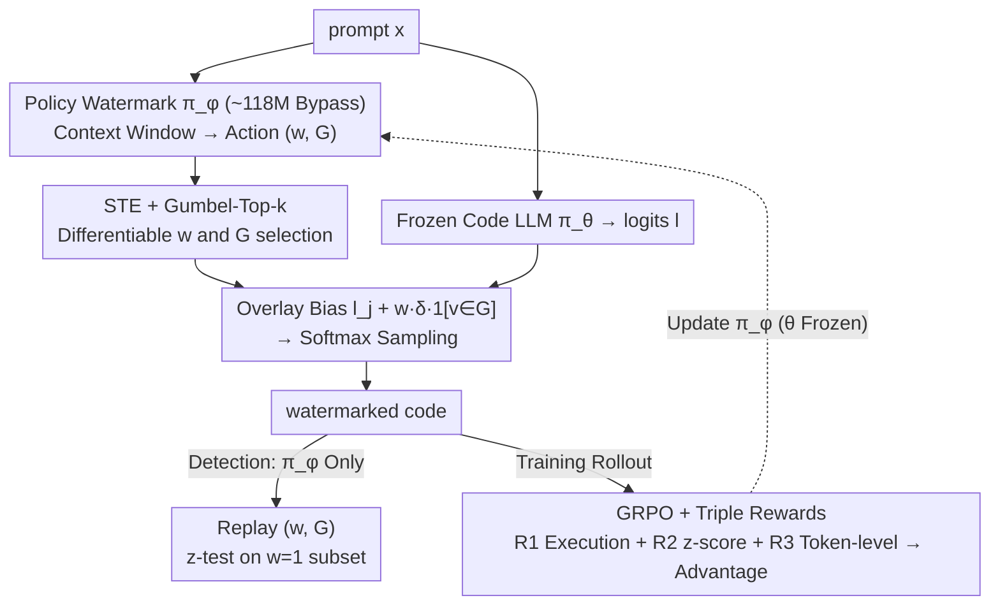

# Optimizing Token Choice for Code Watermarking: An RL Approach

**Conference**: ICML 2026  
**arXiv**: [2508.11925](https://arxiv.org/abs/2508.11925)  
**Code**: https://github.com/TimeLovercc/CodeTracer (Available)  
**Area**: LLM Security / Code Watermarking / Reinforcement Learning  
**Keywords**: Code Watermarking, GRPO, Gumbel-Top-k, Straight-Through Estimator, z-score

## TL;DR
CodeTracer attaches a small watermark policy network alongside a frozen code LLM, utilizing GRPO with dual rewards (execution pass + z-score) and Gumbel-Top-k straight-through estimation to jointly learn where to watermark and which green tokens to select. It improves detection AUROC from ~70% to ~78% while maintaining near-baseline Pass@1 performance.

## Background & Motivation

**Background**: Mainstream LLM watermarking (e.g., the green-red scheme by Kirchenbauer 2023) randomly partitions the vocabulary into green and red sets during generation, adding a fixed logit bias $\delta$ to green tokens. Detection relies on z-tests of green token frequencies. This approach works for natural language where many positions allow semantically equivalent tokens.

**Limitations of Prior Work**: In code generation, (1) many positions are syntactically mandatory (`def`, brackets, keywords), where alterations cause compilation failure; (2) different positions have heterogeneous tolerance for perturbations (variable names can change, while API names cannot); (3) low-entropy distributions make indiscriminate biasing detrimental. Early methods like SWEET and CodeIP either requires the original LLM's logits/prompts during detection to calculate entropy or rely on manual syntactic transformation rules, hindering deployment.

**Key Challenge**: There is an inherent conflict between the statistical detectability of the watermark and the functional correctness of the code under low-entropy, strong syntactic constraints—weak biases are undetectable, while strong biases break the code.

**Goal**: (i) Automatically determine safe locations for watermarking, (ii) select a functionality-preserving green token set $G$ for those locations, and (iii) ensure the detection process does not depend on the original LLM.

**Key Insight**: Model the decision of "whether to watermark $w$" and the "green set $G$" as a context-dependent policy $\pi_\phi(a\mid\mathbf{c})$, combined with a frozen LLM $\pi_\theta$ as $\pi_{\theta\oplus\phi}$. Reinforcement learning is used to learn syntactic/semantic constraints through two verifiable rewards: unit test passage and z-score magnitude.

**Core Idea**: Formulate code watermarking as an RL problem of "training a small policy network to bias the LLM's next-token distribution," utilizing GRPO, STE, and Gumbel-Top-k to incorporate discrete decisions into end-to-end gradient descent.

## Method

### Overall Architecture
CodeTracer aims to solve the problem of making code watermarks statistically detectable without compromising code functionality under low-entropy constraints. A small watermark policy network is attached to a frozen code LLM to determine, token by token, "whether to watermark this position and which green token set to use." These decisions are then overlaid on the LLM's next-token distribution. Specifically, for a given prompt $\mathbf{x}$, the frozen LLM $\pi_\theta$ computes logits $\mathbf{l}\in\mathbb{R}^{|\mathcal{V}|}$, while the trainable policy $\pi_\phi$ observes a fixed window context $\mathbf{c}$ to output $(w, G)$—where $w\in\{0,1\}$ indicates the watermarking decision and $G\subset\mathcal{V}$ is a green set of size $k=\lfloor\gamma|\mathcal{V}|\rfloor$. The combined watermarked logits $\tilde{l}_j = l_j + w\cdot\delta\cdot\mathbb{1}_{v_j\in G}$ are sampled via softmax to produce $\tilde y_t$. Detection requires only $\pi_\phi$ to replay $(w, G)$ for each position, performing a z-test $z = (N_G - T\gamma)/\sqrt{T\gamma(1-\gamma)}$ based on the frequency of tokens in $G$ within the subset where $w=1$.

### Key Designs

**1. Policy-based Watermarking: Replacing Fixed Partitioning with Context-Aware Bypass Policy**

Standard watermarking uses the same random split and fixed $\delta$ for every position, failing to distinguish between mutable variable names and immutable APIs. CodeTracer freezes the LLM parameters $\theta$ and trains only a small watermark model $\phi$ (approx. 118M parameters, <10% of a 1.5B base LLM). $\pi_\phi$ is a small Transformer outputting a $(|\mathcal{V}|+1)$-dimensional vector $(w_\phi, \mathbf{l}_\phi)$, where $w_\phi$ determines $w$ and $\mathbf{l}_\phi$ determines the ranking for $G$. Consequently, both the "where" and "which set" become context-dependent strategies. Freezing the LLM avoids unpredictable degradation of code capabilities common in fine-tuning approaches and allows $\pi_\phi$ to act as a purely bypass module that can be plugged into unseen models (e.g., 8B) after training on a 1.5B model.

**2. STE + Gumbel-Top-k: Differentiable Discrete Decisions for $(w, G)$**

The hard binary switch $w\in\{0,1\}$ and the selection of $G$ via top-$k$ are discrete operations that block gradients. For $w$, a Straight-Through Estimator (STE) is used: $w = \mathbb{1}_{w_\phi>0} + \sigma(w_\phi) - \text{sg}(\sigma(w_\phi))$, using a hard threshold in the forward pass and the $\sigma$ gradient in the backward pass. For $G$, Gumbel-Top-$k$ is applied: Gumbel noise $\mathbf{g} = \mathbf{l}_\phi + (-\log(-\log \mathbf{u}))$ is added to the logits, followed by an indicator $\mathbb{1}_{v\in G}$ with Gumbel-Softmax relaxation. Unlike standard categorical reparameterization, Gumbel-Top-$k$ (Xie & Ermon 2019) handles fixed-size subset sampling, preserving statistical verifiability while allowing gradient flow to $\pi_\phi$.

**3. GRPO + Triple Rewards: Learning "Where and What" via Zero-shot Verifiable Signals**

In the absence of "watermarked code" training data, CodeTracer utilizes verifiable signals through DeepSeek-R1's GRPO framework. $R_1$ is the execution reward (1 if all test cases pass, else 0) serving as a hard constraint for functionality. $R_2$ is a saturated z-score reward (1 if $z\geq 3$, 0 if $z\leq 0$, and linear in between) to drive detection significance. $R_3$ is a token-level process reward (+1 if $w_t=1$ and $s_t\in G_t$, -1 if in the red set, 0 otherwise). These are combined into an advantage function $\hat A(s_t, a_t) = (A_1 + A_2)\cdot\mathbb{1}_{\text{is\_code}}(s_t)$, where non-code tokens (like natural language chain-of-thought) are masked. $R_3$ is crucial; removing it drops AUROC by 7.84pp and TPR by 16.05pp.

### Loss & Training
The objective is the GRPO clipped objective with KL regularization:

$\max_\phi \mathbb{E}_{s\sim\mathcal{D}}\left[\frac{1}{|s|}\sum_t \min\left(r_t(\phi)\hat A_t, \text{clip}(r_t(\phi), 1-\varepsilon, 1+\varepsilon)\hat A_t\right)\right] - \beta D_{\text{KL}}(\pi_{\theta\oplus\phi}\|\pi_{\text{ref}})$

where $r_t(\phi) = \pi_{\theta\oplus\phi}(s_t|s_{<t})/\pi_{\text{ref}}(s_t|s_{<t})$. The $\pi_{\text{ref}}$ is a self-referential copy of $\pi_{\theta\oplus\phi}$. Training involves an initial SFT phase for $\pi_\phi$ to learn code token distributions followed by GRPO, completing in roughly 1 day on a single A100. The base LLM used is OpenCoder-1.5B-Instruct with $\gamma=0.5$ and standard $\delta$ settings.

## Key Experimental Results

### Main Results
Comparison on HumanEval / MBPP against post-hoc detection (logp, LogRank, DetectGPT, GPTZero) and active watermarking (WLLM, EXP-edit, SWEET):

| Dataset | Method | Pass@1 (%) | AUROC (%) | TPR@5%FPR (%) |
|--------|------|-----------|-----------|---------------|
| HumanEval | Base (No Watermark) | 65.42 | – | – |
| HumanEval | WLLM | 58.05 | 70.17 | 20.73 |
| HumanEval | EXP-edit | 59.29 | 66.50 | 25.61 |
| HumanEval | SWEET† | 60.46 | 76.24 | 27.44 |
| HumanEval | **CodeTracer** | **62.65** | **77.71** | **32.32** |
| MBPP | Base | 43.35 | – | – |
| MBPP | WLLM | 39.66 | 76.44 | 27.80 |
| MBPP | SWEET† | 39.64 | 77.24 | 24.80 |
| MBPP | **CodeTracer** | **42.10** | **78.42** | **31.60** |

Post-hoc methods largely fail (AUROC ~47–52%). CodeTracer minimizes Pass@1 degradation (-2.77pp on HumanEval vs. -7.37pp for WLLM) while achieving ~5pp higher TPR than the runner-up. The $\pi_\phi$ trained on a 1.5B model transfers successfully to OpenCoder-8B, yielding a Pass@1 of 71.77% (vs. Base 72.04%) and AUROC of 78.69%.

### Ablation Study

| Config | Pass@1 (%) | AUROC (%) | TPR (%) | Note |
|------|-----------|-----------|---------|------|
| CodeTracer (full) | 60.82 | 82.95 | 46.34 | Full triple rewards |
| w/o $A_2$ (No token-level $R_3$) | 61.15 | 75.11 | 30.29 | Detection collapses |
| w/o $A_1$ (No outcome reward) | 60.34 | 79.52 | 34.91 | Both metrics drop |
| CodeTracer-1 (Pure RL, no SFT) | 62.65 | 77.71 | 32.32 | High functionality |
| CodeTracer-2 (SFT + RL) | 60.82 | 82.95 | 46.34 | High detection |

### Key Findings
- Process-level reward $R_3$ is the most critical; its removal leads to an 8pp AUROC drop.
- SFT initialization offers a knob to balance detectability and functionality.
- Performance holds under variable renaming (AUROC 73.36) but degrades significantly under strong DIPPER paraphrasing (AUROC 58.42).
- Inference overhead is negligible (add-on latency <100μs, VRAM increase <0.5GB).
- Cross-language generalization (Java/C++) suggests RL learns universal "mutable position" priors.

## Highlights & Insights
- **Automated Location Discovery**: Replaces manual AST rules or entropy-based heuristics with an automated RL policy.
- **Suitability of Gumbel-Top-k**: Watermarking is naturally a fixed-size subset sampling problem, making this approach more fitting than categorical reparameterization.
- **Primacy of Process Rewards**: Dense token-level signals outperform pure outcome rewards, highlighting the value of "cheap dense signals" in RLVR tasks.
- **Zero LLM Dependency at Detection**: Decoupling the validator from the base LLM allows third-party verification without model exposure.

## Limitations & Future Work
- Vulnerability to semantic paraphrasing (DIPPER) and limited robustness to heavy code refactoring.
- Training cost requires rollout and execution in a sandbox, limited by language/library coverage.
- Watermarking hyperparameters ($\gamma, \delta$) are currently static and global.
- Potential "adversarial watermarking" wasn't explored in a white-box setting.
- Future work may include adaptive $\delta$ values, sandbox-less reward models, and distilling $\pi_\phi$ into simple lookup tables.

## Related Work & Insights
- **vs WLLM**: WLLM uses fixed PRF partitioning; CodeTracer's learned partitioning reduces Pass@1 loss by half.
- **vs SWEET**: SWEET requires the base LLM for detection; CodeTracer is standalone.
- **vs CodeIP**: CodeIP relies on token type predictors and grammar rules; CodeTracer generalizes better via RL.
- **vs Xu 2024**: Xu 2024 fine-tunes the LLM directly; CodeTracer's bypass approach is more stable and transferable.

## Rating
- Novelty: ⭐⭐⭐⭐ Solid application of Gumbel-Top-k and GRPO to watermarking.
- Experimental Thoroughness: ⭐⭐⭐⭐ Diverse benchmarks and transferability tests.
- Writing Quality: ⭐⭐⭐⭐ Clear motivation and technical formulation.
- Value: ⭐⭐⭐⭐ High practical utility for serving watermarked code through APIs.

<!-- RELATED:START -->

## Related Papers

- [\[CVPR 2026\] ClusterMark: Towards Robust Watermarking for Autoregressive Image Generators with Visual Token Clustering](../../CVPR2026/ai_safety/clustermark_towards_robust_watermarking_for_autoregressive_image_generators_with.md)
- [\[ICML 2026\] ACTG-ARL: Differentially Private Conditional Text Generation with RL-Boosted Control](actg-arl_differentially_private_conditional_text_generation_with_rl-boosted_cont.md)
- [\[ICML 2026\] Memory as a Markov Matrix: Sample Efficient Knowledge Expansion via Token-to-Dictionary Mapping](memory_as_a_markov_matrix_sample_efficient_knowledge_expansion_via_token-to-dict.md)
- [\[ICML 2026\] OmniVL-Guard: Towards Unified Vision-Language Forgery Detection and Grounding via Balanced RL](omnivl-guard_towards_unified_vision-language_forgery_detection_and_grounding_via.md)
- [\[ICML 2026\] Alignment Risks from Capability-Seeking RL Training](alignment_risks_from_capability-seeking_rl_training.md)

<!-- RELATED:END -->
