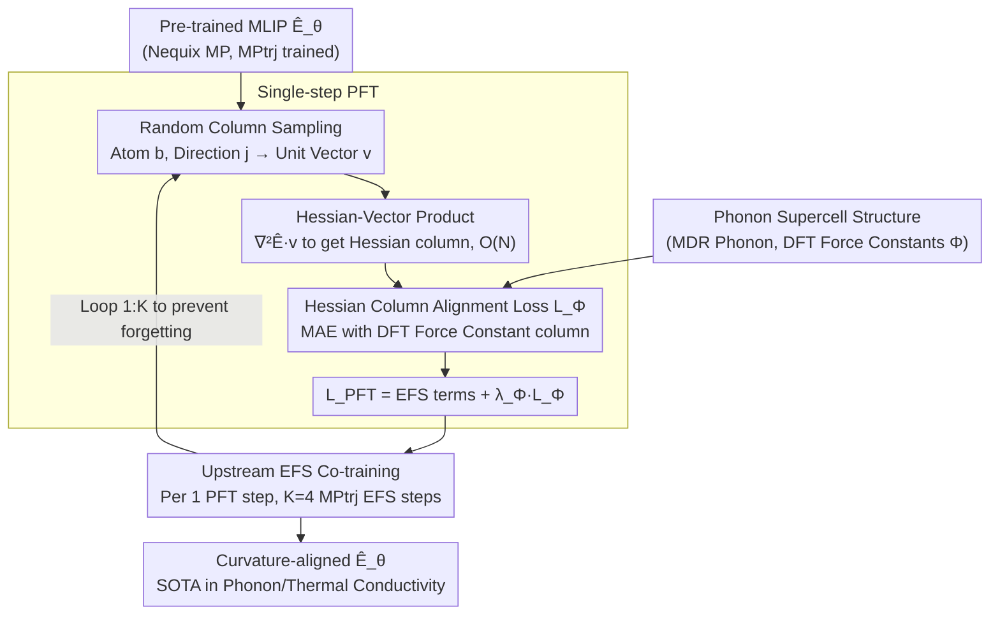

# PFT: Phonon Fine-tuning for Machine Learned Interatomic Potentials

**Conference**: ICML 2026  
**arXiv**: [2601.07742](https://arxiv.org/abs/2601.07742)  
**Code**: None  
**Area**: Scientific Computing / Materials Simulation / Machine Learned Interatomic Potentials  
**Keywords**: MLIP, Phonon, Hessian, Force Constants, Fine-tuning

## TL;DR
This paper proposes PFT (Phonon Fine-tuning), which stochastically samples Hessian columns via Hessian-vector products and directly supervises the energy Hessian to align with DFT force constants during MLIP fine-tuning. Combined with co-training to alleviate catastrophic forgetting, it reduces thermodynamic phonon errors of Nequix MP on the MDR Phonon benchmark by an average of 55% and lowers thermal conductivity $\kappa_{\text{SRME}}$ from 0.446 to 0.307, achieving SOTA among models trained on MPtrj.

## Background & Motivation

**Background**: Machine Learned Interatomic Potentials (MLIPs) have become cost-effective surrogates for DFT in large-scale materials screening. Leading universal MLIPs (e.g., MACE-MP-0, SevenNet, Nequix) learn the Born-Oppenheimer Potential Energy Surface (PES) by regressing Energy $E$, Force $\mathbf{F}=-\nabla E$, and Stress $\sigma$ (the EFS loss) on relaxation trajectory datasets like MPtrj and OMat24.

**Limitations of Prior Work**: Many critical physical properties—such as phonon dispersion, vibrational entropy $S$, Helmholtz free energy $F$, constant-volume heat capacity $C_V$, and thermal conductivity $\kappa$—depend not on the zero-order or first-order quantities of the PES, but on second-order force constants $\Phi_{aibj}=\partial^{2}E/\partial r_{a,i}\partial r_{b,j}$ or even higher-order derivatives. EFS loss only indirectly constrains second-order derivatives, leading many MPtrj-trained MLIPs to manifest "over-softened" PES curvatures near equilibrium configurations. This results in systematically low phonon frequencies, imaginary frequencies, and significant distortion in predicted phase stability and thermal conductivity.

**Key Challenge**: Direct supervision of force constants requires calculating the Hessian. However, crystal phonon calculations must use sufficiently large supercells to avoid self-interaction, often involving thousands of atoms. The $3N\times 3N$ full Hessian calculation and memory scale as $O(N^2)$, making full training infeasible. Furthermore, phonon data exclusively comprises equilibrium configurations, making direct fine-tuning prone to destroying the model's pre-trained capabilities on non-equilibrium configurations.

**Goal**: (1) Introduce the second-order PES curvature as a differentiable training signal into MLIPs; (2) Ensure this signal remains trainable on supercells with thousands of atoms; (3) Complete fine-tuning without compromising existing performance on MPtrj.

**Key Insight**: The authors first generated a scatter plot of "Hessian error vs. phonon thermodynamic error" across multiple MPtrj-trained base models (Fig. 2), observing a very strong positive correlation. This implies that reducing Hessian errors will inherently improve downstream phonon properties, effectively reducing the task of "improving phonon properties" to "aligning the Hessian."

**Core Idea**: A Hessian alignment loss term $\mathcal{L}_\Phi$ is added to the EFS loss. For each structure, a single Hessian column is randomly sampled and gradients are calculated using a Hessian-vector product (HVP), reducing single-step training complexity from $O(N^2)$ to $O(N)$. Upstream EFS data co-training is utilized to prevent forgetting.

## Method

### Overall Architecture
The objective of PFT is straightforward: take an MLIP $\hat{E}_\theta(\mathbf{r})$ pre-trained on large-scale trajectory data (primarily Nequix MP, replicated on MACE-MP-0 and Nequix OAM), and correct the "over-softened" PES curvature near equilibrium without losing original capabilities. It utilizes an additional phonon dataset (MDR Phonon, ~8.5k training materials, 300k finite-displacement DFT calculations) for second-order force constant labels and retains a portion of upstream MPtrj data to prevent forgetting.

During training, for each phonon supercell structure, an atom $b$ and Cartesian direction $j$ are randomly sampled to construct a unit vector $\mathbf{v}$ that is 1 only at $(b,j)$. A single Hessian column $\nabla^2_\mathbf{r}\hat{E}\,\mathbf{v}$ is computed via a Hessian-vector product and compared against the corresponding DFT force constant column using MAE. This, combined with the three EFS terms, forms $\mathcal{L}_\text{PFT}$. For every step of PFT, $K=4$ steps of standard EFS fine-tuning on upstream MPtrj data are performed (Algorithm 1). The resulting $\hat{E}_\theta$ maintains PES curvature alignment with DFT; downstream inference using either finite displacement or analytical AD yields nearly identical results.

### Key Designs

**1. Hessian Column Alignment Loss $\mathcal{L}_\Phi$ + Random Column Sampling: Turning curvature into a supervised target**

Properties like phonon dispersion, vibrational entropy, and thermal conductivity depend on second-order force constants $\Phi$. EFS loss learns "forces" but imposes almost no direct constraint on "how forces change with position." The authors found that direct EFS fine-tuning on phonon displacement data performed worse than base models (Table 1, $\omega_\text{max}$ error surged from 24 to 182), indicating that EFS signals from displacement points cannot replace curvature supervision. PFT treats the second derivative of energy with respect to coordinates as a first-class supervision target: $\mathcal{L}_\Phi = \frac{1}{3N_a}\sum_{a,i}\mathbb{E}_{b,j}\,|\partial^2\hat{E}/\partial r_{a,i}\partial r_{b,j} - \Phi_{aibj}|$.

A full Hessian is $3N\times 3N$, which is computationally prohibitive for large supercells. Consequently, one $(b,j)$ is uniformly sampled per structure per step, equating to supervising a single Hessian column. Since the expectation of this sampling equals the MAE of the full Hessian, the gradient is unbiased. Furthermore, E(3)-equivariant architectures provide significant symmetry redundancy in force constants, allowing single-column sampling to cover most degrees of freedom statistically while saving computation.

**2. Hessian-Vector Product Reducing Complexity from $O(N^2)$ to $O(N)$: Enabling curvature supervision on large supercells**

Explicitly constructing the full Hessian on large supercells causes memory exhaustion. PFT circumvents this using the HVP technique (Pearlmutter 1994): $\nabla^2_\mathbf{r}\hat{E}\,\mathbf{v} = \nabla_\mathbf{r}((\nabla_\mathbf{r}\hat{E})^\top \mathbf{v})$. In JAX, this is `jax.jvp(jax.grad(energy), (pos,), (v,))[1]`—first computing forces via reverse-mode, then applying forward-mode JVP to obtain the derivative of force along $\mathbf{v}$. This allows one Hessian column to be obtained in a single back-propagation pass without materializing $N^2$ matrices. In implementation, multiple structures in a batch are combined into a single graph, and a combined HVP is performed. Optimizer updates require another gradient of the HVP, resulting in "triple-backward."

This reduction enables Hessian supervision for supercells with hundreds of atoms on a single A100 GPU. The entire PFT process takes only 35 A100 hours (including co-training) or 15 A100 hours (without), less than a third of the 100 A100 hours required for pre-training.

**3. Upstream EFS Co-training: Minimizing catastrophic forgetting**

Phonon data consists entirely of equilibrium configurations. Training exclusively on this data causes the PES to drift in non-equilibrium regions, evidenced by a significant increase in energy/force/stress errors on the MPtrj validation set (Fig. 3). PFT addresses this by performing $K=4$ steps of standard EFS updates on the upstream dataset $\mathcal{D}_\text{up}$ (MPtrj) for every 1 PFT step (Algorithm 1, lines 4-7). $K$ is selected by monitoring validation sets on both sides.

Empirically, PFT without co-training degrades EFS performance on MPtrj. With 1:4 co-training, this degradation is almost entirely eliminated, while the Hessian MAE increases only slightly. In Matbench Discovery stability classification, co-training keeps the performance drop within 1%. Compared to methods like LoRA or EWC, this fixed-ratio data mixing is simpler to implement while effectively neutralizing forgetting.

### Loss & Training
Total loss: $\mathcal{L}_\text{PFT} = \lambda_E\mathcal{L}_E + \lambda_F\mathcal{L}_F + \lambda_\sigma\mathcal{L}_\sigma + \lambda_\Phi\mathcal{L}_\Phi$. The first three follow standard EFS (MAE for energy/stress, $\ell_2$ for force). The phonon structure forces and stresses are approximated as 0 (equilibrium), and supercell energy is the unit cell energy multiplied by the number of repetitions. Co-training ratio $K=4$. PFT runs for 200 epochs. The same hyperparameter configuration was reused across MACE-MP-0 and Nequix OAM without further tuning.

## Key Experimental Results

### Main Results

| Dataset / Metric | Nequix MP base | Nequix MP PFT | Nequix MP PFT (No co-train) | Prev. SOTA (MPtrj) |
|---|---|---|---|---|
| MDR Phonon $\omega_\text{max}$ (K) MAE | 24 | **12** | 10 | eSEN-MP 24 |
| MDR Phonon $S$ (J/K/mol) MAE | 32 | 14 | **11** | eSEN-MP 14 |
| MDR Phonon $F$ (kJ/mol) MAE | 12 | 5 | **4** | eSEN-MP 4 |
| MDR Phonon $C_V$ (J/K/mol) MAE | 6 | 3 | **2** | eSEN-MP 5 |
| 3rd-order Force Constant $\Phi^{(3)}$ MAE (meV/ų) | 10.52 | 8.35 | **7.46** | — |
| Matbench Disc. Thermal $\kappa_\text{SRME}$ ↓ | 0.446 | 0.307 | **0.281** | eSEN-30M 0.340 |

Errors in four phonon thermodynamic quantities were reduced by an average of 55%. The same recipe on MACE-MP-0 reduced $\omega_\text{max}$ from 61 to 19 and $S$ from 60 to 14. On the stronger Nequix OAM base model, PFT still achieved a 50% reduction. Notably, Nequix MP PFT (708K parameters) outperformed the Nequix OAM base model, suggesting Hessian supervision is more efficient than simply increasing upstream data volume.

### Ablation Study

| Configuration | Hessian MAE | MPtrj EFS Degradation | Description |
|---|---|---|---|
| Nequix MP base | High | 0 | EFS training only |
| EFS Fine-tuning on phonon displacement | Higher than base | — | $\omega_\text{max}$ error spiked from 24 to 182; EFS signal cannot replace Hessian supervision |
| PFT (No co-training) | Lowest | Significant degradation (Fig. 3) | Best phonons but catastrophic forgetting |
| PFT (co-training, $K=4$) | Slightly higher than no co-train | Minimal degradation | Best overall balance |
| Force Constant Inference: FD vs. AD | Nearly identical (Table 1) | — | HVP analytical method eliminates the displacement distance hyperparameter |

### Key Findings
- "Hessian error vs. phonon property error" shows strong positive correlation across models (Fig. 2 / Fig. 5). Correcting the curvature automatically improves downstream properties, redefining phonon prediction as a regression problem.
- Even though only second-order derivatives are supervised, models show 20–30% improvement in third-order force constants and thermal conductivity, indicating that Hessian supervision implicitly constrains higher-order PES smoothness.
- EFS training on rattled/perturbed structures does not substitute for Hessian supervision—this serves as an important warning for training paradigms like OMat24 that rely on noisy equilibrium configurations.

## Highlights & Insights
- **HVP as a first-class training primitive**: The authors adapted the HVP technique (common in PINNs/implicit differentiation) for MLIP training, enabling $O(N)$ second-order derivative supervision on GPUs. The implementation is just a few lines of JAX, compatible with any energy model that supports `grad`.
- **"Inverse derivation" of training targets via correlation analysis**: Fig. 2 proves "Hessian error = proxy for phonon error." Supervising the Hessian is a robust "find the right loss" paradigm, transferable to other tasks sensitive to high-order derivatives (electron-phonon coupling, thermoelectricity, elastic moduli).
- **Minimalist Co-training**: Unlike complex methods like LoRA or EWC, the $1:K$ mixing of upstream data is engineering-simple yet successfully mitigates catastrophic forgetting.
- **Small Model + Good Loss > Large Model + More Data**: 708K-parameter Nequix MP PFT outperformed 30M-parameter eSEN-MP and Nequix OAM, suggesting that inductive biases in the loss function can be more valuable than data scale in physical ML.

## Limitations & Future Work
- Only validated on energy-conserving, $E(3)$-equivariant MLIPs. Non-equivariant models might introduce bias with single-column sampling, requiring additional data augmentation as noted by the authors.
- Phonon data remains biased toward dynamically stable systems; effectiveness on systems with strong anharmonicity, polar polarization, or electron-phonon coupling (e.g., ferroelectrics, superconductors) is not fully validated.
- Force constant labels (MDR Phonon) are derived from PBE functional finite displacement. Performance on other functionals (SCAN, meta-GGA, hybrid) or vdW corrections requires evaluation.
- No public code (as of v4); reproduction requires rebuilding the training pipeline from Nequix/JAX.
- Potential improvements: Upgrading single-column sampling to block-Hessian sampling, incorporating acoustic sum rules as hard constraints, or making $K$ adaptive based on gradient magnitudes.

## Related Work & Insights
- **vs. eSEN-MP / SevenNet / MACE-MP-0 (pure EFS models)**: These rely on data and model capacity to implicitly approximate curvature. PFT explicitly supervises curvature. Table 1 shows 708K PFT outperforming 30M eSEN-MP, proving "better loss > bigger model."
- **vs. EFS augmentation with rattled/perturbed configurations (OMat24 style)**: Experiments show this does not improve Hessian accuracy and can be detrimental. "Noisy samples" cannot replace true second-order supervision.
- **vs. Hessian-aware Optimization / Physics-Informed Neural Networks (PINNs)**: Shares the philosophy of incorporating higher-order derivatives into the loss. This work successfully scales the mechanism to real material settings with large supercells.
- **Insight**: Any task where the output is a higher-order derivative of a scalar function (vibrational spectroscopy, elastic constants, fluid Navier-Stokes residuals, stability analysis in Neural ODEs) can benefit from the "HVP column sampling + co-training" recipe.

## Rating
- Novelty: ⭐⭐⭐⭐ — Hessian supervision and HVP are existing tools, but this is the first scalable MLIP training paradigm to systematically prove downstream benefits.
- Experimental Thoroughness: ⭐⭐⭐⭐⭐ — 3 base models × 2 upstream datasets × MDR Phonon / 3rd-order FC / Thermal Conductivity / Matbench Discovery. Ablations clearly explain why EFS alone fails and why co-training is necessary.
- Writing Quality: ⭐⭐⭐⭐ — Clear formulas and algorithms. Correlation analysis in Fig. 2 is very persuasive.
- Value: ⭐⭐⭐⭐⭐ — Achieves SOTA in phonons and thermal conductivity for MPtrj-trained MLIPs at less than 1/3 the pre-training cost; an "out-of-the-box" upgrade for the materials ML community.

<!-- RELATED:START -->

## Related Papers

- [\[ICML 2026\] Decoupled Training with Local Reinforcement Fine-Tuning in Federated Learning](decoupled_training_with_local_reinforcement_fine-tuning_in_federated_learning.md)
- [\[ICLR 2026\] Eliciting Harmful Capabilities by Fine-Tuning on Safeguarded Outputs](../../ICLR2026/ai_safety/eliciting_harmful_capabilities_by_fine-tuning_on_safeguarded_outputs.md)
- [\[ICML 2026\] TCAP: Tri-Component Attention Profiling for Unsupervised Backdoor Detection in MLLM Fine-Tuning](tcap_tri-component_attention_profiling_for_unsupervised_backdoor_detection_in_ml.md)
- [\[ICML 2026\] Towards Fine-Grained Robustness: Attention-Guided Test-Time Prompt Tuning for Vision-Language Models](towards_fine-grained_robustness_attention-guided_test-time_prompt_tuning_for_vis.md)
- [\[ICML 2026\] From Parameter Dynamics to Risk Scoring: Quantifying Sample-Level Safety Degradation in LLM Fine-tuning](from_parameter_dynamics_to_risk_scoring_quantifying_sample-level_safety_degradat.md)

<!-- RELATED:END -->
