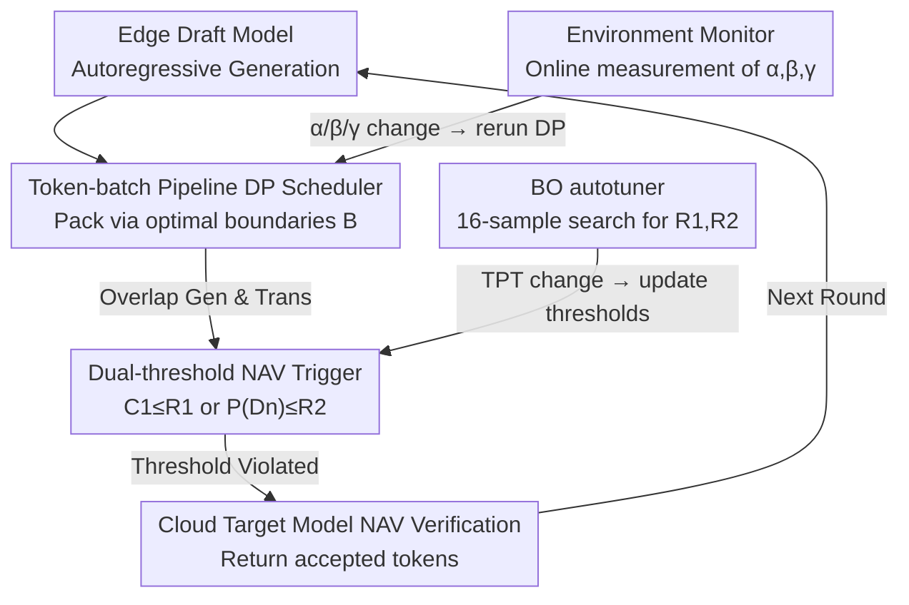

# PipeSD: An Efficient Cloud-Edge Collaborative Pipeline Inference Framework with Speculative Decoding

**Conference**: ICML 2026  
**arXiv**: [2605.13319](https://arxiv.org/abs/2605.13319)  
**Code**: [anonymous.4open.science/r/PipeSD](https://anonymous.4open.science/r/PipeSD)  
**Area**: LLM Inference System / Cloud-Edge Collab / Speculative Decoding  
**Keywords**: Speculative Decoding, Cloud-Edge, Pipeline Scheduling, Bayesian Optimization, Dynamic Programming

## TL;DR
This paper proposes PipeSD: a framework that transforms speculative decoding from sequential cloud-edge execution into a token-batch pipeline. It replaces fixed draft lengths with a dual-threshold NAV trigger and Bayesian autotuning, achieving 1.16×–2.16× speedup and 14–25% cloud energy reduction on real 5G cloud-edge testbeds.

## Background & Motivation
**Background**: The bottleneck of LLM inference lies in the serial dependency of autoregressive generation. Speculative decoding breaks this seriality by using a "small draft model to generate $N$ tokens → large target model for one-time NAV verification." Cloud-edge collaborative deployment is a natural fit: the draft model resides at the edge for energy efficiency and privacy, while the target model leverages cloud computing power. Existing frameworks include HSL, HAT, and SpecEdge.

**Limitations of Prior Work**: (1) Existing frameworks follow a sequential flow: "generate all drafts → upload collectively → NAV verification," leading to idle edge resources during NAV feedback and idle cloud resources during draft uploads. (2) NAV triggers either use fixed draft lengths (e.g., $N=6$ in HSL) or single confidence signals (e.g., single-token confidence in HSL or cumulative sequence confidence in EdgeLLM), which fail to jointly reflect token difficulty, causing either premature triggers that waste compute or late triggers that result in large rollbacks.

**Key Challenge**: The communication startup overhead $\alpha$ is significant; therefore, an extreme pipeline (sending every token immediately) is slower than batching. However, pure sequential execution wastes time. The challenge lies in finding the optimal batching strategy for "how many tokens to group together." Simultaneously, NAV triggers must consider both "overall sequence reliability" and "individual token anomaly," as a single signal is inherently biased.

**Goal**: (1) Formalize the token-generation-communication pipeline scheduling and solve for optimal batch boundaries; (2) Use a dual-threshold NAV trigger to balance sequence and single-token signals; (3) Automatically tune thresholds at the edge to adapt to dynamic network and compute conditions.

**Key Insight**: Communication startup overhead $\alpha$, per-token transmission time $\beta$, and per-token compute time $\gamma$ can be measured online. The scheduling problem is a classic DAG scheduling task solvable via DP in $O(\hat N^2)$ time. Although the mapping from thresholds to TPT is non-analytic, sample collection is cheap, allowing Bayesian Optimization (BO) to approximate the optimum within 16 samples.

**Core Idea**: A triple-set of "DP-optimal token-batch pipeline + Dual-threshold NAV + BO autotuning" pushes the compute/bandwidth utilization of cloud-edge speculative decoding toward the Pareto frontier.

## Method

### Overall Architecture
PipeSD aims to solve the bidirectional idling in cloud-edge speculative decoding. A speculative round operates as follows: the edge draft model performs autoregressive generation while the Token-batch Pipeline Scheduler packs and uploads tokens according to DP-calculated batch boundaries $\mathbb B=(b_1,\dots,b_K)$, overlapping transmission with generation. Simultaneously, the Dual-threshold NAV Trigger monitors single-token and cumulative sequence confidence, initiating NAV if either crosses a threshold. The cloud target model verifies and returns accepted/rejected tokens. All adaptive logic resides at the edge: the Environment Monitor captures $(\alpha, \beta, \gamma)$ to trigger DP recalculation, and the BO autotuner periodically updates trigger thresholds. The system is implemented using llama-cpp-python (edge) + PyTorch + FastAPI (cloud).

### Key Designs

**1. DP-Optimal Token-batch Pipeline Scheduling: Solving for optimal batch boundaries under non-negligible communication overhead.**

The issue is direct: existing frameworks either upload after full generation (edge idles) or send tokens immediately (dragged down by $\alpha$). PipeSD formalizes this as DAG scheduling. For batch $k$, communication duration is $t_c^{(k)}=\alpha+\beta\cdot(b_{k+1}-b_k)$ and generation duration is $t_{ag}^{(k)}=\gamma\cdot(b_{k+1}-b_k)$. Communication for a batch must wait for "prior communication end AND current generation end," yielding the recurrence $\tau_c^{(k)}=\max\{\tau_c^{(k-1)}+t_c^{(k-1)},\tau_{ag}^{(k)}+t_{ag}^{(k)}\}$. The total duration is $\min T=\tau_c^{(K)}+t_c^{(K)}-\tau_{ag}^{(1)}$. Algorithm 1 uses $dp[j]$ to denote the optimal duration for the first $j$ tokens, iterating over previous batch start $i < j$:

$$dp[j]=\min_{i<j}\big\{\max(dp[i],\,\gamma j)+\alpha+\beta(j-i)\big\}$$

Backtracking provides $\mathbb B$. With complexity $O(\hat N^2)$, Theorem 4.1 proves global optimality. It outperforms naive batching by accounting for $\alpha$ amortization and how much communication can be masked by generation time.

**2. Dual-threshold NAV Trigger: Complementing sequence and single-token signals.**

Single-signal triggers are biased: monitoring only $P(D_n)$ (like HSL) fails to trigger when every token is "moderately confident," leading to over-generation. Monitoring only cumulative sequence confidence (like EdgeLLM) masks single-point failures through averaging. PipeSD maintains cumulative sequence confidence $C_1=\prod_{n}P(D_n)$ and single-token confidence $P(D_n)$. For each new token, it computes $C_1^*=C_1\cdot P(D_n)$. If $C_1^*\le R_1$ or $P(D_n)\le R_2$, NAV is initiated, and $C_1$ is reset to 1. This covers both "overall sequence reliability" and "sudden token anomaly."

**3. BO Autotuner + Dynamic Scheduling Window: Edge-side online adaptation.**

The mapping of thresholds to TPT is non-analytic and drifts with task difficulty and network jitter. The BO autotuner aims to minimize average TPT by sampling $(R_1, R_2, \text{TPT})$ triplets and using a Gaussian Process to predict the next optimal point. It converges within 16 samples—more efficient than grid/random search and fitting edge compute constraints. The scheduling window $\hat N$ uses a moving average (initially 20) of the last 100 draft lengths. Two overlap rules are applied: tokens unsent when NAV is triggered are bundled into a final batch, and generation continues for the next window while waiting for NAV feedback.

### Loss & Training
PipeSD is a pure inference framework with no training loss. Key parameters are determined online: input $(\hat N, \alpha, \beta, \gamma)$ for DP is measured by the Environment Monitor; the BO autotuner searches $(R_1, R_2)$ in the $[0, 1]$ interval. Measured draft length averages are approximately 6 for coding tasks and 4 for math.

## Key Experimental Results

### Main Results
Evaluation across 4 scenarios (Scenario 1: Laptop + 20/200Mbps; Scenarios 2/3: Mobile/IoT power 2.5/1.2 GHz; Scenario 4: Dynamic bandwidth 10–80 Mbps), 2 model pairs (DeepSeek-Coder 1.3B→6.7B, TinyLlama 1.1B→Llama-2 7B), and 2 datasets (HumanEval, GSM8K) against Vanilla, HSL, and EdgeLLM:

| Scenario | Dataset | Vanilla TPT(ms) | HSL | EdgeLLM | PipeSD | Gain over Vanilla |
|------|--------|------|------|---------|--------|--------------|
| 1 | HumanEval | 194 | 155 | 153 | 129 | 1.50× |
| 1 | GSM8K | 193 | 174 | 169 | 145 | 1.33× |
| 3 (IoT) | HumanEval | 306 | 244 | 201 | 152 | 2.01× |
| 3 (IoT) | GSM8K | 402 | 296 | 231 | 186 | 2.16× |
| 4 (Dynamic) | HumanEval | 160 | 132 | 127 | 108 | 1.48× |

Cloud Energy Consumption (Scenario 1, per 100 accepted tokens):

| Dataset | Vanilla(J) | HSL | EdgeLLM | PipeSD | Reduction vs EdgeLLM |
|--------|------|------|---------|--------|------|
| HumanEval | 68 | 71 | 75 | 56 | 25.3% |
| GSM8K | 98 | 102 | 100 | 84 | 16.0% |

### Ablation Study
**BO Tuning Comparison (Scenario 1, TPT ms):**

| Strategy | HumanEval | GSM8K |
|----------|-----------|-------|
| BO Autotuner | 129 | 145 |
| Grid Search | 139 | 155 |
| Random Search | 148 | 162 |

**Bandwidth Sensitivity (HumanEval Scenario 1, PipeSD vs Vanilla):** 1.32× at 10 Mbps, 1.47× at 20 Mbps, 1.45× at 40 Mbps, 1.34× at 80 Mbps. Beyond 80 Mbps, communication is no longer the bottleneck, and speedup saturates.

### Key Findings
- Lower compute power (IoT scenario) leads to higher speedups (2.16×), confirming the intuition that pipelining primarily benefits from "hiding communication"—slower edges provide larger windows to mask transmission.
- DP overhead is < 0.013% of total time, effectively free; BO converges in 16 samples.
- The dual-threshold mechanism is the primary contributor to energy reduction, as it reduces invalid NAV requests (actual target model computations), leading to energy savings that exceed TPT gains.

## Highlights & Insights
- **Formalizing Cloud-Edge Speculative Decoding as a Scheduling Problem**: Unlike prior works that use piecemeal patches, PipeSD provides a complete system-level abstraction using DP pipelining and BO adaptation.
- **Precision of the DP Algorithm**: With $O(\hat N^2)$ complexity and $\hat N \sim 20$, it is perfectly suited for online execution, responding to environmental parameter drift.
- **Transferable Dual-Threshold Concept**: The logic of combining "cumulative scores + instant scores" for early stopping or triggering can be applied to other domains like Chain-of-Thought stopping or long-sequence retrieval truncation.
- **BO as a Lightweight Component**: Using BO as a general edge-side "thresholder" is lighter than RL-based controllers and requires zero cold-start for new environments.

## Limitations & Future Work
- Implementation is currently limited to a single draft-target pair and single client; heterogeneous batching for multiple clients/drafts requires new DP derivations.
- BO uses global average TPT; however, acceptance rates vary by task (Code vs Math), suggesting a need for per-task thresholds or multi-task BO.
- Edge energy consumption was analyzed theoretically but not measured; the impact of frequent BO/DP triggers on battery-constrained devices remains to be verified.
- Privacy considerations: the dual-threshold approach exposes token-level confidence, which could potentially serve as a side-channel for inferring sensitive data.

## Related Work & Insights
- **vs HSL (hao2024)**: HSL uses single-token triggers and fixed lengths without pipelining; PipeSD achieves 1.61× speedup in Scenario 3 via dual-thresholds and DP.
- **vs EdgeLLM (xu2025)**: EdgeLLM uses cumulative confidence and overlap. PipeSD adds token-level thresholds and DP-optimal batching, reducing energy by 16–25%.
- **vs Medusa/EAGLE**: These improve draft acceptance rates (algorithmic), while PipeSD improves deployment and triggering (systemic); they are complementary.

## Rating
- Novelty: ⭐⭐⭐⭐ First comprehensive Pareto framework for cloud-edge spec-dec.
- Experimental Thoroughness: ⭐⭐⭐⭐ Real testbeds, multiple scenarios, bandwidth scanning, and energy analysis.
- Writing Quality: ⭐⭐⭐⭐ Consistent flow from bottleneck analysis to DP derivation and system implementation.
- Value: ⭐⭐⭐⭐ Directly applicable framework for 5G-era cloud-edge collaborative inference.

<!-- RELATED:START -->

## Related Papers

- [\[ICML 2026\] Partitioning for Intrinsic Model Inversion Resistance in Collaborative Inference](partitioning_for_intrinsic_model_inversion_resistance_in_collaborative_inference.md)
- [\[AAAI 2026\] Learning to Collaborate: An Orchestrated-Decentralized Framework for Peer-to-Peer Collaborative Learning](../../AAAI2026/ai_safety/learning_to_collaborate_an_orchestrated-decentralized_framework_for_peer-to-peer.md)
- [\[ICML 2026\] dgMARK: Decoding-Guided Watermarking for Diffusion Language Models](dgmark_decoding-guided_watermarking_for_diffusion_language_models.md)
- [\[ICML 2026\] FuseFSS: Efficient Secure LLM Inference with Function Secret Sharing](fusefss_efficient_secure_llm_inference_with_function_secret_sharing.md)
- [\[CVPR 2026\] All Vehicles Can Lie: Efficient Adversarial Defense in Fully Untrusted-Vehicle Collaborative Perception via Pseudo-Random Bayesian Inference](../../CVPR2026/ai_safety/all_vehicles_can_lie_efficient_adversarial_defense_in_fully_untrusted-vehicle_co.md)

<!-- RELATED:END -->
