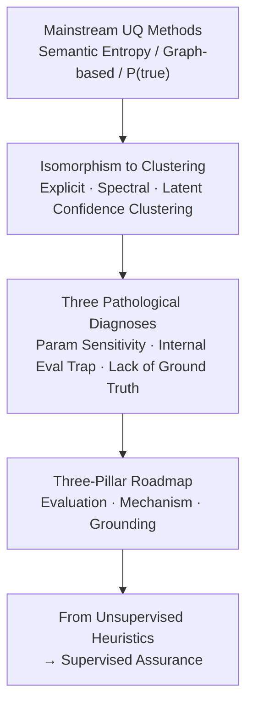

# Position: Uncertainty Quantification in LLMs is Just Unsupervised Clustering

**Conference**: ICML 2026  
**arXiv**: [2605.19220](https://arxiv.org/abs/2605.19220)  
**Code**: None (position paper)  
**Area**: LLM Safety / Uncertainty Quantification  
**Keywords**: Position Paper, Uncertainty Quantification, Confident Hallucination, Clustering Paradigm, External Ground Truth

## TL;DR
This is a position paper making a core assertion: current mainstream methods for LLM Uncertainty Quantification (UQ)—such as Semantic Entropy, graph-based methods, and P(true)—are mechanistically isomorphic to unsupervised clustering. They measure "internal consistency of model generations" rather than "external correctness," making them inherently fail against "confident hallucinations." The authors diagnose three major pathologies: parameter sensitivity, internal evaluation loops, and lack of ground truth. They propose a roadmap shifting from unsupervised heuristics toward "supervised assurance" based on three pillars: evaluation, mechanisms, and grounding.

## Background & Motivation

**Background**: The primary obstacle to deploying LLMs in high-stakes fields (e.g., medical, legal) is hallucination. The industry's main safety net is UQ: assigning an uncertainty score to each query+answer pair and triggering a refusal if it exceeds a threshold. Technical approaches generally fall into three categories: entropy-based (Semantic Entropy and its variants SAE/SEN/KLE/SNNE/SDLG), graph-based (SGC/GU/SGD/SeSE/GENUINE/U-EigV), and verbalized self-evaluation (P(true)/CIn/SelfCheckGPT/UaIT).

**Limitations of Prior Work**: Despite the proliferation of UQ papers, models continue to "hallucinate confidently." Metrics like AUROC appear promising, yet systems still miss critical errors in real-world deployment, providing users with a false sense of security.

**Key Challenge**: The authors diagnose this as a **category error**—all mainstream UQ methods measure "how stable the model's generations are relative to each other" rather than "how close the answer is to external facts." When a model is highly consistent in a wrong answer (confident hallucination), these methods paradoxically yield "high confidence," completely defeating the safety objective.

**Goal**: (i) To prove that mainstream UQ methods are mechanistically isomorphic to unsupervised clustering; (ii) To reveal three pathologies caused by this isomorphism: parameter sensitivity, internal evaluation loops, and lack of ground truth; (iii) To provide a roadmap for the evaluation/mechanism/grounding pillars to push UQ from "unsupervised heuristics" to "supervised assurance."

**Key Insight**: The authors deconstruct the mathematical structures of SE, graph-based, and P(true) methods through the unified lens of "Is it clustering?" By borrowing the classic lesson from clustering research that "internal validity indices cannot guarantee semantic correctness," the fundamental flaws of UQ are exposed within a single framework.

**Core Idea**: UQ $\neq$ measuring "truth/falsehood." UQ = measuring the "geometric/semantic separation among model generations"—this is unsupervised clustering, which lacks external anchors. The only way forward is to introduce external ground truth and supervised mechanisms.

## Method

### Overall Architecture
This position paper argues that all mainstream UQ methods are merely rebranded unsupervised clustering. They measure "how separated model generations are from each other" rather than "how close the answer is to external fact," inevitably leading to failure in the face of confident hallucinations. The argument follows a "diagnosis $\rightarrow$ prescription" chain: first, it mathematically reduces Semantic Entropy, graph-based, and P(true) methods to the same clustering operations; second, it derives the three pathologies of parameter sensitivity, internal evaluation traps, and lack of ground truth from this isomorphism; finally, it provides a transformation blueprint across three pillars—evaluation, mechanism, and grounding—to move UQ toward supervised guarantees.

### Key Designs

**1. Three mainstream UQ methods are mechanistically isomorphic to clustering: One proof to refute them all.**

This is the foundation of the argument—if SE, graph-based, and P(true) methods are essentially the same thing, they do not need to be debunked individually; refuting the idea that "unsupervised clustering guarantees semantic correctness" suffices. **Semantic Entropy is explicit clustering**: using an NLI model to partition the sampled answer set $\mathcal{S}=\{s_1,\dots,s_m\}$ into semantic equivalence classes $C_1,\dots,C_M$, and then calculating the entropy of the class distribution $U_{\text{SE}}(C\mid x)=-\sum_{i=1}^M p(C_i\mid x)\log p(C_i\mid x)$. Here, the NLI model acts as the "clustering criterion" and entropy as "cluster purity." **Graph-based methods are implicit spectral clustering**: using pairwise similarity $w_{j_1,j_2}=(a_{j_1,j_2}+a_{j_2,j_1})/2$ to construct a weight graph $W$, calculating the normalized Laplacian $L=I-D^{-1/2}WD^{-1/2}$, and using $U_{\text{EigV}}=\sum_{k=1}^m\max(0,1-\lambda_k)$ to count "effective semantic clusters." This is spectral clustering without explicit label assignment, equivalent to a "clustering internal validity index." **P(true) is latent confidence clustering**: treating $U_{\text{P(true)}}(x,\hat{y})=1-P(\text{``True''}\mid x,\hat{y})$ as a membership test for the model's internal "high-confidence region." PCA visualizations of Qwen2.5-32B on QASC (Fig.2) demonstrate that high-P(true) and low-P(true) samples are geometrically separated into two clusters in the hidden space, which is geometrically a soft cluster assignment. The paper explicitly excludes token-level perplexity, Deep Ensembles, and supervised classifiers from this framework—the former due to poor performance, and the latter as the "supervised" direction the authors advocate.

**2. Three pathological diagnoses: Translating "clustering isomorphism" into deployment risks.**

After confirming the isomorphism, the authors map this abstract judgment to three observable engineering consequences, forcing UQ researchers to confront the fact that "good AUROC $\neq$ safety." First is the **parameter sensitivity crisis**: UQ scores vary drastically with hyperparameters like temperature, NLI threshold, sample size $n$, and prompts. Jaccard empirical results (Tab.1) on QASC with Qwen2.5-32B show that for the top 10% high-uncertainty samples, the overlap between SE and EigV is only 0.134, and between SE and P(true) only 0.080—different methods cannot even agree on "what is uncertain." Second is the **internal evaluation trap**: AUROC defaults to "internal stability = external correctness," but confident hallucinations break this assumption. The more stable an incorrect answer is, the higher the confidence score it receives, mirroring the clustering pathology where the Silhouette Coefficient's "internal compactness $\neq$ external meaningfulness." Third is the **lack of ground truth (judge problem)**: UQ relies on the correlation between AUROC and correctness, but correctness in open tasks often depends on RougeL > 0.3 or another LLM judge, which itself is noisy and biased. Fig.3 shows that as the correctness threshold $\tau$ shifts, method rankings fluctuate—an evaluation pipeline built on an unstable ruler.

**3. Three-pillar roadmap: Evaluation $\rightarrow$ mechanism $\rightarrow$ grounding to excise dependence on internal consistency.**

The three pillars address how to evaluate, how to build, and what truth values to use. The **Evaluation Pillar** treats UQ as a binary alarm system (accept/reject), borrowing the MIA paradigm from Carlini et al. 2022—measuring TPR at a fixed FPR < 0.1% to focus on the critical "high-confidence hallucination" samples. It also proposes **AUSC (Area Under the Stability Curve)**, sweeping AUROC across hyperparameters (e.g., temperature $T\in[0,1]$) to require methods to be stable across reasonable parameter ranges rather than cherry-picking optimal points. The **Mechanism Pillar** repositions **Conformal Prediction** as a downstream evaluation framework—comparing set sizes under a fixed coverage (e.g., 90%) where confident hallucinations are forced to expose themselves via "set explosion." Additionally, it suggests **Uncertainty Alignment** during post-training (RLHF), rewarding models for explicitly outputting granular confidence markers like "I am confident that..." vs. "It is possible that...", turning uncertainty from an implicit geometric feature into an explicit linguistic signal. The **Grounding Pillar** mandates **Unit Testing**—UQ methods must first pass AUROC and TPR@low-FPR tests in programmatically verifiable scenarios like code (HumanEval) or math before being applied to open tasks—supplemented by **Atomic Fact Verification**: breaking open generation into atomic claims and verifying them using "non-LLM judges" such as search engines, KBs, formal solvers (Lean4), or multi-hop deep search agents to break the "LLM judging LLM" loop. Accordingly, recommended metrics converge to **TPR@FPR<0.1%** and **AUSC**, with Conformal Prediction set size at fixed coverage as a "truth-aware" proxy.

## Key Experimental Results

### Main Results
The paper does not test a new method but uses supportive data to "falsify" the reliability of mainstream UQ paradigms.

| Evaluation Experiment | Data / Model | Key Results | Conclusion |
|----------|-------------|----------|------|
| Jaccard Overlap (Tab.1) | QASC, Qwen2.5-32B | SE vs EigV Top-10% = 0.134; SE vs P(true) Top-10% = 0.080; EigV vs P(true) = 0.224 | Methods disagree significantly on "what is uncertain" |
| P(true) Latent Visualization (Fig.2) | QASC, Qwen2.5-32B | High-P(true) and low-P(true) samples geometrically separate into two clusters in PCA | P(true) is essentially a membership test for latent clusters |
| Correctness Threshold Sensitivity (Fig.3) | Adapted from Liu et al. 2025b | UQ method rankings flip repeatedly as $\tau$ changes | "Judge instability" invalidates AUROC evaluation |

### Ablation Study

| Argument | Supporting Evidence | Pathology $\rightarrow$ Prescription |
|------|----------|------------|
| Confident hallucination breaks consistency proxy | Simhi et al. 2025; Kalavasis et al. 2025 | Internal consistency $\rightarrow$ Use worst-case TPR |
| Param sensitivity vs. robustness | Cecere et al. 2025 (Temp), Kuhn 2023 ($n$), Farquhar 2024 (NLI threshold) | Single-point reporting $\rightarrow$ Use AUSC |
| RLHF inverse "miscalibration" | Kadavath 2022, Achiam 2023 | Scaling fix expectation $\rightarrow$ Use Uncertainty Alignment + CP |
| Open generation requires verifiable ground truth | Yao 2022 (code), Hendrycks (math) | LLM-as-judge loop $\rightarrow$ Lean4 / Atomic Facts |

### Key Findings
- **Methods cannot agree on "what is uncertain"**: Jaccard indices of only 0.08–0.22 indicate methods measure different dimensions; using any single one as a "safety net" lacks an external arbiter.
- **Geometric separation $\neq$ factual truth**: PCA visualization of P(true) falsifies its role in factual judgment—it merely detects whether an output falls inside or outside a "confidence cluster."
- **AUROC diluted by easy samples**: Simple queries dominate and inflate AUROC, but only the small fraction of "high-confidence but wrong" samples are dangerous in deployment. This is what MIA-style TPR@low-FPR specifically targets.
- **RLHF exacerbates the problem**: Aligning with human preference makes models sound more authoritative, and scaling does not automatically solve calibration—it only makes hallucinations look "more professional," amplifying clustering pathologies.

## Highlights & Insights
- **The "category error" label is sharp**: Cutting the entire UQ research line down to "unsupervised clustering" provides a clear axis (supervised calibration: Yes/No) for future work, which is exactly what a position paper should do by "shifting the perspective."
- **The MIA analogy is a high-quality transfer**: Porting the worst-case evaluation paradigm of Carlini et al. 2022 to UQ implies that the principle "high-risk systems should be evaluated on the tail using TPR@low-FPR" is becoming a unified norm in ML safety across sub-fields.
- **CP as an evaluator is a clever reuse**: Comparing set sizes under fixed coverage is an ingenious way to "force methods to externalize hallucinations as an observable cost," and can be generalized to compare any scoring-based safety mechanism.
- **AUSC is a practical tool against p-hacking**: Requiring stability across hyperparameters can become a mandatory reporting item for benchmarks, closing the gray area of "tuning for SOTA."

## Limitations & Future Work
- **No complete new method or benchmark provided**: The roadmap is clear, but TPR@low-FPR, AUSC, and Atomic Fact systems are suggestions; an end-to-end empirical demo showing how rankings change is missing.
- **Reliance on some second-hand evidence**: Fig.3 is adapted from Liu et al. 2025b, and Tab.1’s Jaccard is only tested on one model/data pair (QASC + Qwen2.5-32B); cross-model reproducibility remains to be seen.
- **Formal verification is hard to scale**: Lean4/atomic fact checking is costly in "factual but non-formalizable" domains like medicine or law; the paper does not discuss scalability bottlenecks.
- **Blank space for "inevitable subjective open generation"**: The authors acknowledge legitimate diversity in creative writing but only offer "atomic fact decomposition," lacking an alternative for stylistic or preference-based uncertainty.

## Related Work & Insights
- **vs. Semantic Entropy (Kuhn et al. 2023)**: Ours does not deny SE's effectiveness in benchmarks but points out it is NLI-driven explicit clustering, which fails with confident hallucinations. Insight: Any entropy-based stability metric must first answer if the stable objects are anchored to external truth.
- **vs. Graph-based methods (Lin et al. 2023, etc.)**: Ours uses the equivalence of Laplacian spectra and spectral clustering to prove it is implicit clustering. Insight: Without external labels, graph/spectral metrics remain structural and cannot directly proxy truthfulness.
- **vs. P(true) / SelfCheckGPT series**: Proven to be "latent confidence cluster membership tests." Insight: Model self-evaluation is a geometric distance query, not a factual judgment.
- **vs. Conformal Prediction (Quach 2023, Su 2024)**: Ours repositions CP from "prediction set generation" to a "truth-aware ruler for UQ evaluation."
- **vs. MIA Evaluation (Carlini et al. 2022)**: A cross-domain analogy inspiring the rule that "high-risk systems should look at tails, not averages" as a general norm for ML safety research.

<!-- RELATED:START -->

## Related Papers

- [\[AAAI 2026\] Credal Ensemble Distillation for Uncertainty Quantification](../../AAAI2026/ai_safety/credal_ensemble_distillation_for_uncertainty_quantification.md)
- [\[ICML 2026\] Position: 'AI Alignment' Encompasses Competing Technical Priorities](ai_alignment_encompasses_competing_technical_priorities.md)
- [\[ICML 2026\] Gradient Transformer: Learning to Generate Updates for LLMs](gradient_transformer_learning_to_generate_updates_for_llms.md)
- [\[ICML 2026\] Efficient DP-SGD for LLMs with Randomized Clipping](efficient_dp-sgd_for_llms_with_randomized_clipping.md)
- [\[ICML 2026\] Multilingual Unlearning in LLMs: Transfer, Dynamics, and Reversibility](multilingual_unlearning_in_llms_transfer_dynamics_and_reversibility.md)

<!-- RELATED:END -->
