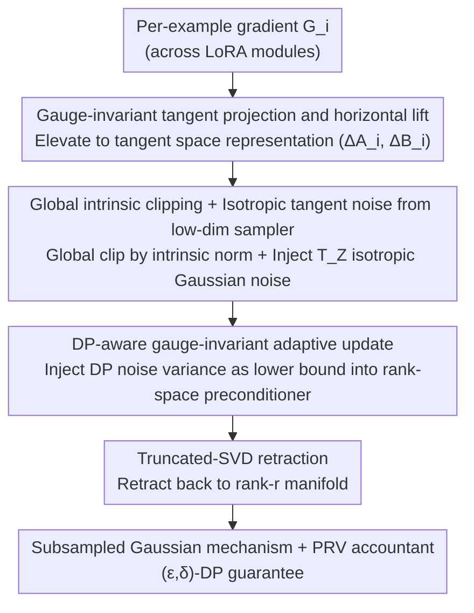

# PRISM: Gauge-Invariant Tangent-Space Differentially Private LoRA

**Conference**: ICML2026 Oral  
**arXiv**: [2606.00944](https://arxiv.org/abs/2606.00944)  
**Code**: https://github.com/osu-srml/PRISM-DP-LoRA  
**Area**: AI Security / Differential Privacy / LoRA Fine-tuning  
**Keywords**: Differential Privacy, LoRA, gauge invariance, tangent space, DP-SGD

## TL;DR
PRISM shifts DP-SGD from the LoRA factor space $(A,B)$ to the tangent space of the rank-$r$ manifold to perform clipping, noise addition, and retraction. This yields a DP-LoRA mechanism that is gauge-invariant, lacks bilinear second-order noise, and possesses a closed-form intrinsic noise energy of $\sigma C/b\cdot\sqrt{r(m+n-r)}$.

## Background & Motivation

**Background**: When performing PEFT on private data, the most natural approach is to apply DP-SGD directly to the low-rank factors $(A,B)$ of LoRA (Yu et al. 2022; Liu et al. 2025; Xu et al. 2025). This involves per-example clipping and Gaussian noise addition after concatenating $g_A$ and $g_B$ at each step.

**Limitations of Prior Work**: The authors identify three intertwined issues. Issue I: LoRA decomposition is non-identifiable; for any $R\in\mathrm{GL}(r)$, $(A,B)$ and $(AR,BR^{-\top})$ represent the same $Z=AB^\top$, yet the factor gradients transform as $g_A R^{-\top}, g_B R$. Thus, the clipping norm drifts with the gauge; a simple scalar reparameterization $(A,B)\mapsto(cA,c^{-1}B)$ can cause $\|g_A\|_F^2+\|g_B\|_F^2$ to scale arbitrarily with $c$. Issue II: Adding noise to both sides results in a $\eta^2\xi_A\xi_B^\top$ bilinear second-order term in the intrinsic update. Even if ignored, the first-order noise energy $\tau^2(m\|B\|_F^2+n\|A\|_F^2)$ can be amplified boundlessly by gauge reparameterization (Cor. 2.3). Issue III: Adaptive optimizers (Adam/AdamW, LoRA-specific invariant optimizers) "learn the noise" from noisy moment estimates, triggering ill-conditioning on the $r\times r$ matrices $M=A^\top A$ and $N=B^\top B$, which in turn amplifies DP noise.

**Key Challenge**: DP-SGD is a stochastic mechanism defined relative to a specific parametrization, whereas the model behavior in LoRA is determined by the intrinsic update $Z$. By performing clipping and noise addition on gauge-redundant factors, the stochastic distribution of the mechanism itself is not a function of $Z$.

**Goal**: Design a DP-LoRA mechanism such that the released intrinsic update satisfies: (i) gauge invariance at the distributional level; (ii) additivity in the intrinsic (tangent) representation without bilinear noise; (iii) stability and compatibility with adaptive optimization and low-rank numerical workflows.

**Key Insight**: Treat $Z\in\mathcal{M}_r$ as a point on a fixed-rank manifold. Perform clipping and Gaussian noise addition directly in its tangent space $T_Z\mathcal{M}_r$, then retract back to the manifold. The inner product of the tangent space depends only on the orthogonal projections $\Pi_A$ and $\Pi_B$, making it naturally gauge-invariant.

**Core Idea**: Use a canonical horizontal lift to elevate per-example gradients to the tangent space representation $(\Delta A_i,\Delta B_i)$, aggregate across all LoRA modules for global intrinsic norm clipping, inject isotropic Gaussian noise projected onto $T_Z\mathcal{M}_r$ via a low-dim sampler, and finally return to the rank-$r$ manifold through truncated-SVD retraction.

## Method

### Overall Architecture
The core flaw PRISM addresses is that DP-SGD defines its stochastic mechanism via parametric coordinates, but the intrinsic update $Z=AB^\top$ determines model behavior. PRISM treats $Z$ as a point on the fixed-rank manifold $\mathcal{M}_r$ and moves the entire "clip $\to$ noise $\to$ update" process into its tangent space $T_Z\mathcal{M}_r$. Gradients are lifted to the tangent space, clipped globally by the intrinsic norm, injected with isotropic Gaussian noise existing only in the tangent space, adjusted by a DP-aware gauge-invariant adaptive transform, and finally retracted. Each iteration corresponds to a subsampled Gaussian mechanism composed by a PRV accountant for $(\varepsilon, \delta)$-DP.

### Key Designs

**1. Gauge-invariant tangent projection and horizontal lift: Moving the mechanism from factor coordinates to tangent space**

To address Issue I (non-identifiability), PRISM defines the tangent space projection $\mathcal{P}_{A,B}(G)=\Pi_A G+G\Pi_B-\Pi_A G\Pi_B$ using orthogonal projections $\Pi_{A}=A(A^\top A)^\dagger A^\top$ and $\Pi_B$. This projects per-example gradients by removing the normal component $(I-\Pi_A)G(I-\Pi_B)$. Since $\Pi_A$ and $\Pi_B$ are invariant under $(A,B)\mapsto(AR,BR^{-\top})$, this step eliminates gauge drift in clipping and noise. PRISM uses a canonical horizontal lift $\Delta A_i=g_{A,i}N^\dagger-\tfrac12\Pi_A(g_{A,i}N^\dagger)$ and a symmetric $\Delta B_i$ to ensure $\Delta A_i B^\top+A\Delta B_i^\top=\mathcal{P}_{A,B}(G_i)$. The $-\tfrac12\Pi_A(\cdot)$ term is a standard technique in manifold quotient spaces to remove redundant horizontal directions.

**2. Global intrinsic clipping + Isotropic tangent noise via low-dim sampler: Removing bilinear terms and unbounded amplification**

To address Issue II, PRISM performs clipping under the intrinsic metric: per-example sensitivity is measured by $\|\Delta Z_{i,\ell}\|_F^2$, aggregated into a global norm $s_i=(\sum_\ell\|\Delta Z_{i,\ell}\|_F^2)^{1/2}$, and used for a shared clipping coefficient $\alpha_i=\min\{1,C/s_i\}$. Instead of projecting a full $m \times n$ Gaussian matrix, PRISM uses a low-dim sampler $\Xi_A=(I-\Pi_A)\Omega_A N^{-1/2}$ and $\Xi_B=\Omega_B M^{-1/2}$ ($\Omega \sim \mathcal{N}(0,I)$) to synthesize noise with the same distribution as $\mathcal{P}_{A,B}(\Xi)$. Thm 3.1 proves this is exactly isotropic Gaussian noise on the tangent space with energy $\mathbb{E}\|\mathcal{P}_{A,B}(\Xi)\|_F^2=r(m+n-r)$. This decouples the effective intrinsic noise $\mathcal{E}_Z^{\text{PRISM}}=\sigma C/b\cdot\sqrt{r(m+n-r)}$ from factor norms, while the retraction $\mathrm{Retr}_r$ avoids the $\eta^2\xi_A\xi_B^\top$ stochastic bilinear term.

**3. DP-aware gauge-invariant adaptive update: Preventing the adaptive optimizer from "learning the noise"**

To address Issue III, PRISM handles the case where Adam/AdamW might treat noise variance as signal and normalize it, "whitening" the update noise and drowning out the signal. Furthermore, LoRA Gram matrices $M, N$ can become nearly singular under DP noise. PRISM injects the DP noise variance as a lower bound into the rank-space preconditioner (Algorithm 1, Line 13) before retraction, creating a gauge-invariant direction $(U_{A,\ell},U_{B,\ell})$. This floor prevents both "whitening" and "singular explosion" when the true gradient is submerged in noise.

### Loss & Training
The objective remains the empirical risk $F(A,B)=\tfrac{1}{N}\sum_i\ell_i(W_0+AB^\top)$. Privacy is provided by Poisson subsampling (rate $q=b/N$) and per-iteration subsampled Gaussian mechanism combined via PRV accountant to provide $(\varepsilon,\delta)$-DP (Thm 3.4). Thm 3.3 shows the update $\widehat{\Delta Z}_\ell$ is identically distributed with respect to the gauge $R\in\mathrm{GL}(r)$, making the entire trajectory gauge-invariant.

## Key Experimental Results

### Main Results
Evaluated on 8 GLUE tasks + 4 Math-10K tasks ($\delta=10^{-5}$), comparing FFA, Rite, AdamW, LoRA+, Lamb, and PRISM across Non-DP, $\varepsilon=6$, and $\varepsilon=3$ settings.

| Setting | Method | Avg(12) | GSM8K | SVAMP | QQP |
|------|------|---------|-------|-------|-----|
| Non-DP | LoRA+ | 0.769 | 0.592 | 0.712 | 0.807 |
| Non-DP | PRISM | 0.737 | 0.552 | 0.693 | 0.797 |
| $\varepsilon=6$ | LoRA+ | 0.674 | 0.446 | 0.611 | 0.739 |
| $\varepsilon=6$ | **PRISM** | **0.690** | **0.469** | **0.626** | **0.770** |
| $\varepsilon=3$ | AdamW | 0.634 | 0.446 | 0.591 | 0.555 |
| $\varepsilon=3$ | **PRISM** | **Best Avg** | **Significant Gain** | **Significant Gain** | **Significant Gain** |

### Ablation Study (Theoretical Noise Scale)
Comparison of scaling for three DP-LoRA designs regarding effective intrinsic noise $\mathcal{E}_Z$.

| Method | Trainable Params | $\mathcal{E}_Z$ | (a) gauge-inv | (b) no bilinear | (c) LoRA-scale |
|------|---------|-----------------|---------------|-----------------|----------------|
| DP-LoRA (Double-sided) | $(m+n)r$ | **unbounded** | ✗ | ✗ | ✓ |
| One-side (Frozen A) | $nr$ | $(\sigma C/b)\sqrt{n}\|A\|_F$ | ✗ | ✓ | ✓ |
| **PRISM** | $(m+n)r$ | $(\sigma C/b)\sqrt{r(m+n-r)}$ | **✓** | **✓** | **✓** |

### Key Findings
- **DP tightness**: As $\varepsilon$ decreases, PRISM's advantage becomes more pronounced, achieving the best Average for $\varepsilon \le 6$. It shows the largest gains in multi-step reasoning tasks (GSM8K/MAWPS/SVAMP).
- **Non-DP performance**: Ours is not the strongest in Non-DP (LoRA+ 0.769 vs PRISM 0.737), as tangent projection and retraction introduce unnecessary constraints without noise. This indicates PRISM's gains stem specifically from DP geometric alignment.
- **One-side comparison**: Freezing $A$ removes bilinear terms but fails to handle gauge dependence ($\mathcal{E}_Z\propto\|A\|_F$). Only tangent-space DP fully closes this loop.
- **Efficiency**: The low-dim sampler replaces full $m \times n$ Gaussian noise with $m \times r$ and $n \times r$ blocks, maintaining $O((m+n)r^2)$ complexity, consistent with standard LoRA.

## Highlights & Insights
- **Shifting DP from "Parameters" to "Manifold"**: While DP-SGD is typically tied to parametric coordinates, PRISM argues for protecting the intrinsic object $Z$. This is a clear example of applying manifold optimization to DP, transferable to any gauge-redundant parametrization (e.g., NTK, tensor factorization).
- **Closed-form intrinsic noise $\sqrt{r(m+n-r)}$**: It is rare for a mechanism's noise scaling to be analytically solvable. This allows for principled privacy-utility trade-off designs regarding the LoRA rank $r$.
- **Geometric correction**: The use of the horizontal lift and the $-\tfrac{1}{2}\Pi_A(\cdot)$ correction ensures that the lift remains gauge-invariant, drawing a key technique from differential geometry into the DP toolbox.

## Limitations & Future Work
- **Non-DP Accuracy Trade-off**: PRISM lags behind LoRA+ by ~3 points in noiseless settings; there is no current switch to automatically revert to standard LoRA.
- **Full-rank Assumption**: Theorem 3.1 assumes full column rank for $A$ and $B$. While $\dagger$ and DP-aware floors are used for stability, more empirical validation is needed for early training phases or rank collapse.
- **Task Scope**: Validation was limited to classification and arithmetic reasoning. Evaluation on long-sequence generation, multimodal tasks, or RLHF is lacking, as is wall-clock performance on 70B+ models.
- **Retraction Overhead**: Truncated SVD carries an $O((m+n)r^2)$ cost. For a large number of modules $L$, a polar-style or QR-based retraction might be more practical.

## Related Work & Insights
- **vs Naive DP-LoRA (Yu et al. 2022; Liu et al. 2025)**: These apply DP-SGD directly to factors. PRISM formally shows this violates gauge symmetry and introduces bilinear/unbounded noise.
- **vs One-side DP-LoRA (Sun et al. 2024)**: One-side removes bilinear terms but remains dependent on the norm of the frozen factor. PRISM satisfies all three desiderata via tangent projection.
- **vs Invariant Optimizer Rite (Yen et al. 2025)**: Rite ensures gauge-invariant optimization trajectories. PRISM emphasizes that the stochastic mechanism itself (clipping/noise) must be invariant.
- **vs DP-aware Adam variants (Li et al. 2022)**: Those focus on bias correction in moment estimation; PRISM addresses the same issue within the low-rank $r \times r$ Gram matrix structure.

## Rating
- Novelty: ⭐⭐⭐⭐⭐ 
- Experimental Thoroughness: ⭐⭐⭐⭐ 
- Writing Quality: ⭐⭐⭐⭐⭐ 
- Value: ⭐⭐⭐⭐⭐ 

<!-- RELATED:START -->

## Related Papers

- [\[ICLR 2026\] Missing Mass for Differentially Private Domain Discovery](../../ICLR2026/ai_safety/differentially_private_domain_discovery.md)
- [\[ICML 2026\] Privacy Amplification in Differentially Private Zeroth-Order Optimization with Hidden States](privacy_amplification_in_differentially_private_zeroth-order_optimization_with_h.md)
- [\[ICML 2026\] Differentially Private Preference Data Synthesis for Large Language Model Alignment](differentially_private_preference_data_synthesis_for_large_language_model_alignm.md)
- [\[ICLR 2026\] PE-SGD: Differentially Private Deep Learning via Evolution of Gradient Subspace for Text](../../ICLR2026/ai_safety/pe-sgd_differentially_private_deep_learning_via_evolution_of_gradient_subspace_f.md)
- [\[ICLR 2026\] On Optimal Hyperparameters for Differentially Private Deep Transfer Learning](../../ICLR2026/ai_safety/on_optimal_hyperparameters_for_differentially_private_deep_transfer_learning.md)

<!-- RELATED:END -->
