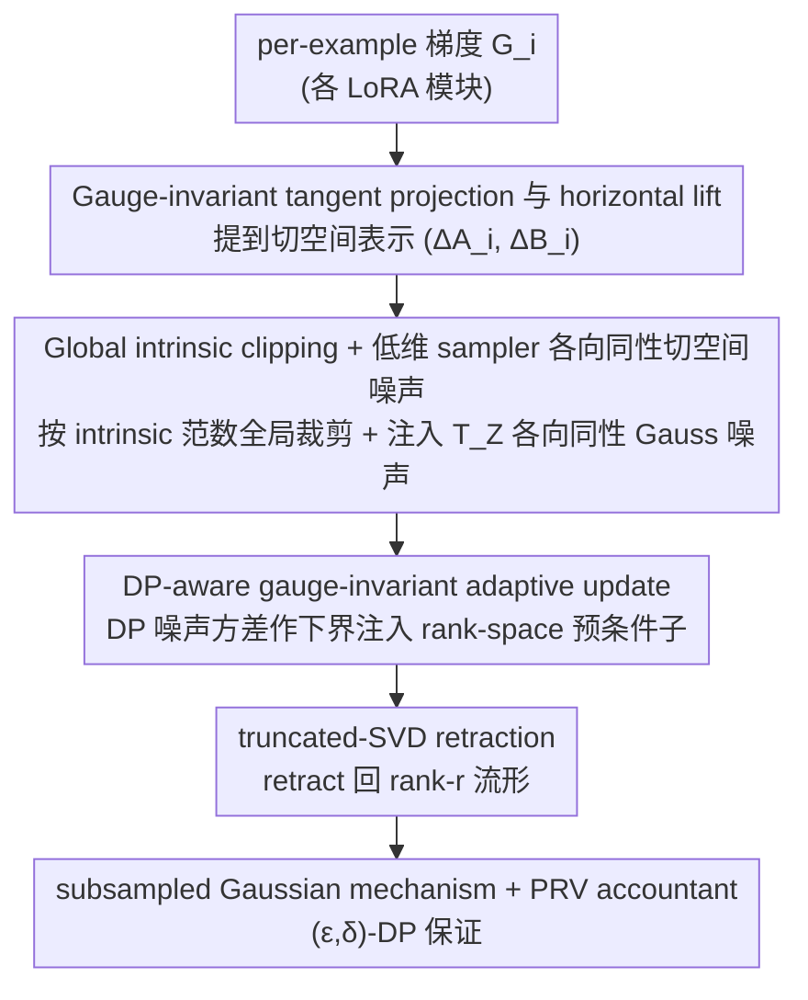

# PRISM: Gauge-Invariant Tangent-Space Differentially Private LoRA

**Conference**: ICML2026 Oral  
**arXiv**: [2606.00944](https://arxiv.org/abs/2606.00944)  
**Code**: https://github.com/osu-srml/PRISM-DP-LoRA  
**Area**: AI Safety / Differential Privacy / LoRA Fine-tuning  
**Keywords**: Differential Privacy, LoRA, gauge invariance, tangent space, DP-SGD

## TL;DR
PRISM shifts DP-SGD from the LoRA factor space $(A, B)$ to the tangent space of the rank-$r$ manifold to perform clipping, noise addition, and retraction. This yields a DP-LoRA mechanism that is gauge-invariant, free of second-order bilinear noise, and possesses a closed-form intrinsic noise magnitude of $\sigma C / b \cdot \sqrt{r(m+n-r)}$.

## Background & Motivation

**Background**: When performing PEFT on private data, the most natural approach is to apply DP-SGD directly to the low-rank factors $(A, B)$ of LoRA (Yu et al. 2022; Liu et al. 2025; Xu et al. 2025). This involves per-example clipping and Gaussian noise addition after concatenating $g_A$ and $g_B$ at each step.

**Limitations of Prior Work**: The authors identify three entangled issues. Issue I: LoRA decomposition is non-identifiable. For any $R \in \mathrm{GL}(r)$, $(A, B)$ and $(AR, BR^{-\top})$ represent the same $Z=AB^\top$, but factor gradients transform as $g_A R^{-\top}, g_B R$. Thus, the clipping norm drifts with the gauge; a simple scalar reparameterization $(A, B) \mapsto (cA, c^{-1}B)$ can cause $\|g_A\|_F^2 + \|g_B\|_F^2$ to scale arbitrarily with $c$. Issue II: Adding noise to both sides introduces a second-order term $\eta^2\xi_A\xi_B^\top$ in the intrinsic update. Even if ignored, the first-order noise magnitude is $\tau^2(m\|B\|_F^2 + n\|A\|_F^2)$, which can still be amplified unboundedly by gauge reparameterization (Cor. 2.3). Issue III: Adaptive optimizers (Adam/AdamW or LoRA-specific invariant optimizers) "learn the noise" from noisy moment estimates, triggering ill-conditioning on the $r \times r$ matrices $M=A^\top A, N=B^\top B$, which in turn amplifies DP noise.

**Key Challenge**: DP-SGD is a stochastic mechanism defined relative to a parameterization, whereas the actual model behavior in LoRA is determined by the intrinsic update $Z$. By performing clipping and noise addition on gauge-redundant factors, the stochastic distribution of the mechanism itself ceases to be a function of $Z$.

**Goal**: Design a DP-LoRA mechanism such that the released intrinsic updates satisfy: (i) gauge invariance at the distributional level; (ii) additivity in the intrinsic (tangent) representation without bilinear noise; (iii) stability and compatibility with adaptive optimization and low-rank numerical workflows.

**Key Insight**: View $Z \in \mathcal{M}_r$ as a point on a fixed-rank manifold. Perform clipping and Gaussian noise addition directly in its tangent space $T_Z\mathcal{M}_r$, and then retract back to the manifold. The inner product of the tangent space depends only on the orthogonal projections $\Pi_A, \Pi_B$, making it naturally gauge-invariant.

**Core Idea**: Use a canonical horizontal lift to lift per-example gradients to the tangent space representation $(\Delta A_i, \Delta B_i)$. After aggregating all LoRA modules, perform global intrinsic norm clipping and inject isotropic Gaussian noise projected onto $T_Z\mathcal{M}_r$ using a low-dimensional sampler. Finally, return to the rank-$r$ manifold via a truncated-SVD retraction.

## Method

### Overall Architecture
The core problem PRISM addresses is that DP-SGD is a stochastic mechanism defined by parameterized coordinates, yet the model behavior in LoRA is determined by the intrinsic update $Z=AB^\top$. Performing clipping and noise addition on gauge-redundant factors $(A, B)$ results in a stochastic distribution that is not a function of $Z$. PRISM translates the entire "clip → add noise → update" process from the factor space into the tangent space $T_Z\mathcal{M}_r$ by treating $Z$ as a point on the fixed-rank manifold $\mathcal{M}_r$. Per-example gradients are lifted to the tangent space, clipped globally according to the intrinsic norm, injected with isotropic Gaussian noise that exists only in the tangent space, adjusted by a DP-aware gauge-invariant adaptive transform, and finally retracted back to the manifold. Each iteration processes all $L$ LoRA modules, corresponding to a subsampled Gaussian mechanism composed by a PRV accountant to provide $(\varepsilon, \delta)$-DP.

### Key Designs

**1. Gauge-invariant tangent projection and horizontal lift: Moving the mechanism from factor coordinates to tangent space**

Issue I involves the non-identifiability of LoRA decomposition—for any $R \in \mathrm{GL}(r)$, $(A, B)$ and $(AR, BR^{-\top})$ represent the same $Z$, but factor gradients transform via $g_A R^{-\top}, g_B R$, causing clipping norm drift. PRISM defines the tangent space projection using column-space orthogonal projections $\Pi_{A}=A(A^\top A)^\dagger A^\top$ and $\Pi_B$ as $\mathcal{P}_{A, B}(G)=\Pi_A G + G\Pi_B - \Pi_A G\Pi_B$. This projects per-example gradients into the tangent space by removing the normal component $(I-\Pi_A)G(I-\Pi_B)$. Crucially, $\Pi_A$ and $\Pi_B$ remain invariant under $(A, B) \mapsto (AR, BR^{-\top})$, thus eliminating gauge drift during the lifting step.

To represent tangent matrices back in the factor space, PRISM uses a canonical horizontal lift $\Delta A_i=g_{A,i}N^\dagger-\tfrac12\Pi_A(g_{A,i}N^\dagger)$ and a symmetric $\Delta B_i$, ensuring $\Delta A_i B^\top + A\Delta B_i^\top = \mathcal{P}_{A, B}(G_i)$. The term $-\tfrac12\Pi_A(\cdot)$ is a standard technique for selecting a horizontal section in manifold quotient spaces, removing factor space redundancy to prevent gauge information from leaking back into the mechanism.

**2. Global intrinsic clipping + Isotropic tangent space noise via low-dim sampler: Removing bilinear terms and unbounded amplification**

Issue II describes how intrinsic updates produce a second-order term $\eta^2\xi_A\xi_B^\top$ and first-order noise energy $\tau^2(m\|B\|_F^2 + n\|A\|_F^2)$ that scales unboundedly with gauge reparameterization. PRISM employs unified clipping under the intrinsic metric: per-example sensitivity is measured by $\|\Delta Z_{i,\ell}\|_F^2 = \operatorname{tr}(\Delta A_{i,\ell}^\top\Delta A_{i,\ell}N_\ell) + \operatorname{tr}(\Delta B_{i,\ell}^\top\Delta B_{i,\ell}M_\ell) + 2\operatorname{tr}((A_\ell^\top\Delta A_{i,\ell})(B_\ell^\top\Delta B_{i,\ell}))$, aggregated into a global norm $s_i = (\sum_\ell\|\Delta Z_{i,\ell}\|_F^2)^{1/2}$. A common clipping coefficient $\alpha_i = \min\{1, C/s_i\}$ is shared across all modules.

Instead of sampling a full $m \times n$ Gaussian matrix, PRISM uses a low-dimensional sampler $\Xi_A=(I-\Pi_A)\Omega_A N^{-1/2}$ and $\Xi_B=\Omega_B M^{-1/2}$ (where $\Omega_A, \Omega_B \sim \mathcal{N}(0, I)$ with dimensions $m \times r$ and $n \times r$) to synthesize noise with the same distribution as $\mathcal{P}_{A, B}(\Xi)$. Thm 3.1 proves this projection is exactly isotropic Gaussian on the tangent space, with energy $\mathbb{E}\|\mathcal{P}_{A, B}(\Xi)\|_F^2 = r(m+n-r)$. This decouples the effective intrinsic noise $\mathcal{E}_Z^{\text{PRISM}} = \sigma C/b \cdot \sqrt{r(m+n-r)}$ from $\|A\|_F$ and $\|B\|_F$. Prop. 3.2 ensures that retraction $\mathrm{Retr}_r$ introduces only $O(\eta^2)$ deterministic distortion, avoiding stochastic second-order terms.

**3. DP-aware gauge-invariant adaptive update: Preventing adaptive optimizers from "learning the noise"**

Issue III concerns adaptive optimizers like Adam/AdamW, which might treat noise variance as signal during normalization. In $\theta^+ = \theta - \eta\mathsf{P}^{-1/2}\hat g$, if $\mathsf{P}$ contains noise, update noise covariance is "whitened" to $\eta^2 I$, washing out the true signal. Furthermore, LoRA Gram matrices $M=A^\top A, N=B^\top B$ easily become near-singular under DP noise and gauge drift. Before retraction, PRISM injects the DP noise variance as a lower bound into the rank-space preconditioner (Algorithm 1 line 13 and Eq. (24)–(26)), yielding gauge-invariant directions $(U_{A,\ell}, U_{B,\ell})$. This floor prevents both "whitening" and "singular explosion" when gradients are submerged in noise.

### Loss & Training
The objective remains the empirical risk under standard LoRA fine-tuning: $F(A,B) = \tfrac{1}{N}\sum_i\ell_i(W_0+AB^\top)$. The privacy mechanism provides $(\varepsilon,\delta)$-DP via Poisson subsampling ($q=b/N$), per-iteration subsampled Gaussian mechanism, and PRV accountant (Thm 3.4). Thm 3.3 shows that the incremental step $\widehat{\Delta Z}_\ell$ is identically distributed with respect to the gauge $R \in \mathrm{GL}(r)$. Since retraction is deterministic post-processing, the entire trajectory is gauge-invariant.

## Key Experimental Results

### Main Results
Evaluations were performed on 8 GLUE tasks and 4 Math-10K tasks (GSM8K / AQuA / MAWPS / SVAMP), with $\delta=10^{-5}$. Accuracy was compared across Non-DP, $\varepsilon=6$, and $\varepsilon=3$ for FFA, Rite, AdamW, LoRA+, Lamb, and PRISM.

| Setting | Method | Avg(12) | GSM8K | SVAMP | QQP |
|------|------|---------|-------|-------|-----|
| Non-DP | LoRA+ | 0.769 | 0.592 | 0.712 | 0.807 |
| Non-DP | PRISM | 0.737 | 0.552 | 0.693 | 0.797 |
| $\varepsilon=6$ | LoRA+ | 0.674 | 0.446 | 0.611 | 0.739 |
| $\varepsilon=6$ | **PRISM** | **0.690** | **0.469** | **0.626** | **0.770** |
| $\varepsilon=3$ | AdamW | 0.634 | 0.446 | 0.591 | 0.555 |
| $\varepsilon=3$ | **PRISM** | Best Avg | Sig. Gain | Sig. Gain | Sig. Gain |

### Ablation Study
Comparison of the scaling of effective intrinsic noise $\mathcal{E}_Z$ across three DP-LoRA designs.

| Method | Trainable Params | $\mathcal{E}_Z$ | (a) gauge-inv | (b) no bilinear | (c) LoRA-scale |
|------|---------|-----------------|---------------|-----------------|----------------|
| DP-LoRA (Both) | $(m+n)r$ | **unbounded** | ✗ | ✗ | ✓ |
| One-side (Freeze A) | $nr$ | $(\sigma C/b)\sqrt{n}\|A\|_F$ | ✗ | ✓ | ✓ |
| **PRISM** | $(m+n)r$ | $(\sigma C/b)\sqrt{r(m+n-r)}$ | **✓** | **✓** | **✓** |

### Key Findings
- **Superiority under tight DP**: As $\varepsilon$ decreases, PRISM's advantages become more pronounced. It achieves the best average accuracy for $\varepsilon \le 6$ and shows the largest gains in multi-step reasoning tasks (GSM8K/MAWPS/SVAMP), indicating that gauge-invariant intrinsic noise is crucial when the signal-to-noise ratio is low.
- **Non-DP Trade-off**: PRISM is not the strongest in Non-DP settings (LoRA+ 0.769 vs PRISM 0.737). Tangent projection and retraction introduce unnecessary geometric constraints in noise-free scenarios, suggesting PRISM's benefits stem strictly from DP geometric alignment.
- **One-side limitations**: While freezing one side eliminates bilinear terms, it does not resolve gauge dependence ($\mathcal{E}_Z \propto \|A\|_F$). Only by shifting the DP mechanism to the tangent space can this be fully addressed.
- **Efficiency**: The low-dimensional sampler replaces $m \times n$ Gaussian noise with two blocks of size $m \times r$ and $n \times r$. Computation and memory costs remain $O((m+n)r^2)$, consistent with original LoRA.

## Highlights & Insights
- **Shifting DP from "Parameters" to "Manifolds"**: While DP-SGD is traditionally tied to parameterized coordinates, PRISM argues that the intrinsic object $Z$ is what should be protected. This is a clear example of applying manifold optimization to DP, a strategy transferable to any parameterization with gauge redundancy.
- **Analytical Intrinsic Noise**: The closed-form scaling $\sqrt{r(m+n-r)}$ allows for the analytical design of privacy-utility trade-offs relative to the LoRA rank $r$, effectively providing a DP cost formula for the rank dimension.
- **Corrective Horizontal Lift**: The $-\tfrac{1}{2}\Pi_A(\cdot)$ correction is a standard manifold quotient space technique for horizontal sections. Applying it here ensures that both the lift and the mechanism are gauge-invariant.

## Limitations & Future Work
- **Performance drop in Non-DP**: PRISM trails LoRA+ by roughly 3 points in average accuracy in noise-free settings, as retraction and tangent projection become burdens. The paper does not provide a mechanism to "gracefully degrade" back to standard LoRA.
- **Full column rank assumption**: Thm 3.1's closed form assumes $A, B$ are full column rank. If rank collapse occurs during early training, the robustness of the $\dagger$ and floor fallbacks requires more empirical validation.
- **Task Scope**: Validation was limited to classification and arithmetic reasoning. Performance on long-form generation, multimodal tasks, or RLHF remains unverified, and wall-clock/memory overhead for 7B/70B models is not fully detailed.
- **Retraction Cost**: Algorithm 1 uses truncated SVD for retraction, incurring an $O((m+n)r^2)$ cost. For large $L$, this constant factor may be significant; polar-style or QR-based retractions might be more practical.

## Related Work & Insights
- **vs Naive DP-LoRA (Yu et al. 2022; Liu et al. 2025; Xu et al. 2025)**: These works apply DP-SGD directly to $(A, B)$, which PRISM proves violates gauge symmetry and introduces bilinear/unbounded noise. PRISM outperforms these at identical privacy budgets.
- **vs One-side DP-LoRA (Sun et al. 2024)**: One-side avoids bilinear terms but remains sensitive to the frozen factor's norm. PRISM satisfies all three desiderata via tangent projection.
- **vs Rite Invariant Optimizer (Yen et al. 2025)**: Rite is a deterministic invariant optimizer for trajectories. PRISM focuses on making the stochastic mechanism (clip+noise) itself gauge-invariant; the two are orthogonal and complementary.
- **vs DP-aware Adam variants (Li et al. 2022/2023; Tang et al. 2024)**: While those works focus on bias correction in moment estimates, PRISM addresses similar issues within the context of low-rank $r \times r$ Gram matrices.

## Rating
- Novelty: ⭐⭐⭐⭐⭐ First to implement a complete tangent-space DP mechanism for fixed-rank manifolds in LoRA.
- Experimental Thoroughness: ⭐⭐⭐⭐ Broad coverage across 12 tasks, though lacking generative tasks and non-DP degradation analysis.
- Writing Quality: ⭐⭐⭐⭐⭐ Clear problem statement using the Issue I/II/III framework; rigorous theoretical proofs.
- Value: ⭐⭐⭐⭐⭐ Provides a correct geometric foundation for DP-PEFT; the closed-form noise energy is highly useful for budget allocation.

<!-- RELATED:START -->

## Related Papers

- [\[NeurIPS 2025\] Mitigating Disparate Impact of Differentially Private Learning through Bounded Adaptive Clipping](../../NeurIPS2025/ai_safety/mitigating_disparate_impact_of_differentially_private_learning_through_bounded_a.md)
- [\[AAAI 2026\] An Improved Privacy and Utility Analysis of Differentially Private SGD with Bounded Domain and Smooth Losses](../../AAAI2026/ai_safety/an_improved_privacy_and_utility_analysis_of_differentially_p.md)
- [\[NeurIPS 2025\] Differentially Private High-dimensional Variable Selection via Integer Programming](../../NeurIPS2025/ai_safety/differentially_private_high-dimensional_variable_selection_via_integer_programmi.md)
- [\[ICML 2025\] Improving the Variance of Differentially Private Randomized Experiments through Clustering](../../ICML2025/ai_safety/improving_the_variance_of_differentially_private_randomized_experiments_through_.md)
- [\[NeurIPS 2025\] Differentially Private Bilevel Optimization: Efficient Algorithms with Near-Optimal Rates](../../NeurIPS2025/ai_safety/differentially_private_bilevel_optimization_efficient_algorithms_with_near-optim.md)

<!-- RELATED:END -->
