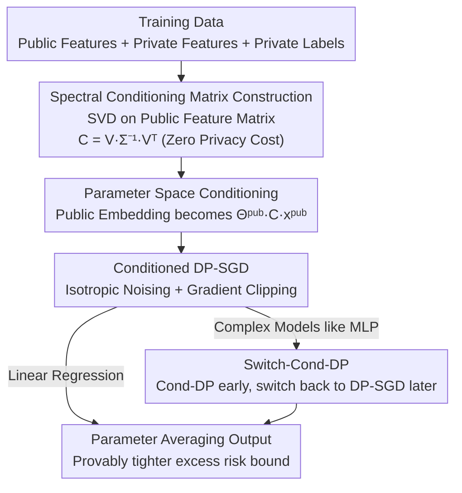

# Private Learning with Public Feature Conditioning

**Conference**: ICML 2026  
**arXiv**: [2606.18773](https://arxiv.org/abs/2606.18773)  
**Code**: To be confirmed  
**Area**: Differential Privacy / Privacy-Preserving Learning  
**Keywords**: Differential Privacy, DP-SGD, Public Features, Conditioning, Label DP, Regression  

## TL;DR
Addressing the differential privacy (DP) regression problem with public (non-sensitive) features, this paper proposes Cond-DP. It utilizes a conditioning matrix $\bm{C}=\bm{V}\Sigma^{-1}\bm{V}^T$ constructed from the public feature matrix to reshape the geometry of the embedding parameter space before DP-SGD. This amplifies the signal-to-noise ratio in low-spectrum directions without additional privacy overhead, significantly outperforming existing label DP regression methods in high-privacy (small $\epsilon$) scenarios.

## Background & Motivation

**Background**: Differential Privacy (DP) is the mainstream framework for training privacy-preserving models but inherently faces a privacy-utility trade-off—adding noise to protect privacy degrades accuracy. In utility-sensitive systems like recommendation and advertising, even small increases in prediction error can significantly harm downstream business. A natural mitigation is to leverage **public, non-sensitive features** inherent in the data: for instance, product descriptions are public, while user purchase histories are sensitive. This is formalized as **label DP** (public features, sensitive labels) and more general **semi-sensitive feature DP** (each sample mixes public and private features, with private labels).

**Limitations of Prior Work**: Existing works suffer from several critical drawbacks. First, most label DP methods target **classification with discrete labels** and cannot be directly transferred to regression with continuous labels. According to the authors, only two related works exist in regression: one (ghazi2023regression_ldp) provides only pure DP guarantees and is "feature-agnostic" (ignoring public feature structure, thus missing improvement opportunities), while the other only studies whether certain aggregation algorithms satisfy label DP. Second, methods for semi-sensitive features either apply only to specific architectures like dual-encoders (krichene2023priv_learning_pub_features) or collapse in high-privacy regimes, as seen in (chua2024hybrid_dp_kdd)—which uses Randomized Response (RR) to privatize labels for warm-starting, where RR noise explosions in high-privacy regions render warm-starting useless.

**Key Challenge**: Existing approaches either ignore the public feature structure or attempt to **utilize public features under the supervision of private labels**, the latter of which fails when label noise is excessive under tight privacy budgets. The real opportunity lies in whether the public feature structure can be utilized **unsupervisedly**, without touching private labels, to ensure robustness in high-privacy regimes.

**Key Insight**: The authors observe a key phenomenon: the public feature matrix (stacking all public features) often exhibits **fast spectral decay**, even if not strictly low-rank. During optimization, directions corresponding to large singular values naturally receive more weight. Since DP-SGD adds **isotropic noise**, the signal-to-noise ratio in low-spectrum directions is extremely low, leading to slow convergence. Reshaping the problem geometry to amplify the contributions of these drowned-out low-spectrum directions can improve utility for a fixed privacy budget.

**Core Idea**: Construct a conditioning matrix $\bm{C}$ using the public feature matrix to reshape the geometry of the embedding parameter space, then run standard DP-SGD on the conditioned model. Since $\bm{C}$ depends only on public information and remains fixed throughout training, it incurs **zero additional privacy cost** while significantly improving optimization in low-spectrum directions.

## Method

### Overall Architecture

The paper considers a class of models common in recommendation/advertising systems that use **linear input transformations**: the base consists of linear embedding layers mapping features to embeddings $\bm{v}^{\text{pub}}=\Theta^{\text{pub}}\bm{x}^{\text{pub}}$ and $\bm{v}^{\text{priv}}=\Theta^{\text{priv}}\bm{x}^{\text{priv}}$, followed by an optional (potentially non-linear) prediction component $f_\omega$ (e.g., MLP or Factorization Machine). When the embedding dimension is 1 and the upper component is a simple summation, this reduces to **private linear regression**. The linear embedding layer is crucial because its parameters are tied directly to input features, allowing it to be learned more effectively using knowledge of public features.

Cond-DP makes only one core modification: it replaces the standard public embedding calculation $\bm{v}^{\text{pub}}=\Theta^{\text{pub}}\bm{x}^{\text{pub}}$ with a **conditioned version** $\bm{v}^{\text{pub}}=\Theta^{\text{pub}}\bm{C}\bm{x}^{\text{pub}}$, then uses DP-SGD to minimize $\mathcal{L}(\Theta^{\text{pub}}\bm{C},\Theta^{\text{priv}},\omega;D)$. The pipeline includes: calculating $\bm{C}$ offline from the public feature matrix (consuming no privacy budget), adding isotropic Gaussian noise to gradients of each parameter block during training followed by updates, and finally outputting the averaged parameters. For linear models, the authors provide a closed-form construction of $\bm{C}$ and provable convergence improvements; for complex models with MLPs, Switch-Cond-DP is introduced to handle the phenomenon where conditioning accelerates early training but hinders later stages.

### Key Designs

**1. Spectral Conditioning Matrix $\bm{C}=\bm{V}\Sigma^{-1}\bm{V}^T$: Translating isotropic noise into geometry friendly to low-spectrum directions**

The pain point is specific: DP-SGD adds isotropic Gaussian noise, but the public feature matrix $\bm{X}^{\text{pub}}$ has fast spectral decay. Signal is weak in directions of small singular values, getting drowned by noise and causing slow convergence. Cond-DP performs SVD on $\bm{X}^{\text{pub}}=\bm{U}\Sigma\bm{V}^T$ and chooses the conditioning matrix $\widehat{\bm{C}}\coloneq\bm{V}\Sigma^{-1}\bm{V}^T$ to prepend to public features. Intuitively, $\Sigma^{-1}$ **amplifies** small singular value directions, "stretching" the previously flattened low-spectrum directions in the conditioned coordinate system. This makes isotropic noise fairer across all directions under the new geometry, improving the SNR for low-spectrum directions. Crucially, $\bm{C}$ uses only public features, thus consuming zero privacy budget—this is the fundamental reason it outperforms "private label warm-start" methods.

This is precisely characterized in the convergence bounds. Under label DP (no private features, zero initialization), the DP-SGD bound is proportional to $\sqrt{2\sum_i (\widehat{y}_i \frac{\sigma_{\max}}{\sigma_i})^2}$, while the Cond-DP bound is proportional to $\sqrt{2\sum_i \widehat{y}_i^2}$. Since $\sigma_{\max}^2/\sigma_i^2\ge 1$ holds for all directions, the Cond-DP bound is **pointwise smaller** and provably tighter. The improvement factor $\sqrt{\sum_i (\widehat{y}_i \frac{\sigma_{\max}}{\sigma_i})^2 / \sum_i \widehat{y}_i^2}$ is maximized when the labels $\bm{y}$ align with **minimum singular directions** and is 1 when aligned with maximum singular directions—implying that the more the labels reside in the low-spectrum directions of public features, the more Cond-DP gains.

**2. Privacy Guarantees and Clipping Sensitivity: $\bm{C}$ modifies geometry, not privacy accounting**

Because $\bm{C}$ changes the gradient norm bound, the noise variance must adjust accordingly. The theorem states: when noise variance is set to $\sigma^2=\widetilde{O}\!\left(\frac{M^2 T}{\epsilon^2 n^2}\right)$, where $M^2 \triangleq G^2\cdot\max_i\|\bm{C}\bm{x}_i^{\text{pub}}\|^2 + \widehat{G}^2 R^2 + \overline{G}^2$, the algorithm satisfies $(\epsilon,\delta)$-DP. Here $M$ is the composite bound on gradient norms for public/private/upper components under fine-grained Lipschitz assumptions; $\bm{C}$ affects sensitivity only through $\|\bm{C}\bm{x}_i^{\text{pub}}\|$. In practice, authors do not explicitly estimate $M$ but use per-sample gradient clipping (clipping threshold as a hyperparameter) as in standard DP-SGD, keeping noising and privacy accounting standard. The dependency on $\bm{x}^{\text{pub}}$ is used only for **theoretical guidance on choosing $\bm{C}$**, not for privacy accounting. A notable special case (Remark 4.11): setting $\bm{C}$ as the identity matrix **completely reduces to standard DP-SGD**, returning all convergence bounds to classical results and proving Cond-DP is a strict generalization of DP-SGD.

**3. Switch-Cond-DP: Fixing the late-stage hindrance in complex models**

For linear regression, $(\Theta^{\text{pub}})^*$ has a closed-form solution, proving that $\widehat{\bm{C}}$ always improves the bound. However, for complex models with MLPs, the optimal solution cannot be analytically characterized, and theoretical guarantees lapse. The authors make empirical observations and find a counter-intuitive phenomenon: conditioning **greatly accelerates convergence in early training** but **hinders further loss reduction in later stages**. Consequently, they propose Switch-Cond-DP—using Cond-DP early to reap acceleration benefits and switching back to standard DP-SGD after a certain switching epoch (tuned as a hyperparameter) to allow late-stage progress. This hybrid strategy localizes the benefits of conditioning to the phases where it actually works, preventing late-stage performance degradation.

### Loss & Training

The training objective is the standard empirical risk $\mathcal{L}=\frac{1}{n}\sum_i l(f_\omega(\Theta^{\text{pub}}\bm{x}_i^{\text{pub}},\Theta^{\text{priv}}\bm{x}_i^{\text{priv}}),y_i)$, utilizing square loss $l(\widehat{y},y)=(\widehat{y}-y)^2$ for regression. The optimizer is noisy Adam via Opacus with per-parameter Gaussian initialization. Theoretically, the paper covers convergence guarantees for convex (Theorem 4.6), strongly convex and smooth (Theorem 4.8), and non-convex (Theorem 4.10) losses. The strongly convex bound explicitly depends on the condition number of $\bm{C}$, $\sigma_{\max}(\bm{C})/\sigma_{\min}(\bm{C})$, suggesting that conditioning should not be too extreme.

## Key Experimental Results

Experiments evaluate label DP across three regression settings: private linear models on synthetic/real data, non-linear models with MLP heads, and the Criteo sponsored search conversion benchmark. Privacy budgets sweep $\epsilon\in\{0.25,0.5,1,2,4,\infty\}$ ($\infty$ for non-private), with $\delta=10^{-6}$.

### Main Results

| Setting | Baselines | Cond-DP Performance | Key Conclusion |
|------|---------|--------------|---------|
| Private Linear Regression (Synthetic/Real) | DP-SGD, RR-on-Bins (SOTA Label DP Regression), Weighted-LLP | Consistently lower MSE for a fixed privacy budget | Max gains in high-privacy (small $\epsilon$) |
| Non-linear models with MLP | DP-SGD | Switch-Cond-DP outperforms pure DP-SGD | Fixes late-stage hindrance of conditioning |
| Criteo Search Conversion | DP-SGD, RR-on-Bins | Consistent improvement | Validates efficiency in real advertising scenarios |

The core quantitative theoretical conclusion is Lemma 4.13: under label DP and zero initialization, the excess risk bound for Cond-DP is proportional to $\sqrt{2\|\widehat{\bm{y}}\|^2}$, whereas for DP-SGD it is proportional to $\sqrt{2\|\Sigma^{-1}\widehat{\bm{y}}\|^2}$ (containing the $\sigma_{\max}(\bm{X}^{\text{pub}})$ amplification factor), making the former **strictly tighter**. ⚠️ Specific MSE figures are available in the original paper's Figure 4/Tables.

### Ablation Study

| Configuration | Effect | Explanation |
|------|------|------|
| $\bm{C}=\bm{V}\Sigma^{-1}\bm{V}^T$ (Full Cond-DP) | Optimal | Spectral conditioning amplifies low-spectrum directions |
| $\bm{C}=\mathbb{I}$ (Reduces to DP-SGD) | Baseline | Convergence bounds return to classical DP-SGD |
| Cond-DP throughout MLP | Worse later | Conditioning hinders loss reduction in later stages |
| Switch-Cond-DP | Better than above | Switching epoch treated as a hyperparameter |

### Key Findings
- **Gains strongly correlate with spectral structure**: The more the labels $\bm{y}$ align with the low singular directions of the public feature matrix and the faster the spectral decay, the greater the improvement of Cond-DP over DP-SGD. When $\bm{y}$ aligns with the maximum singular direction, the improvement reduces to 1 (no gain).
- **Most beneficial in high-privacy regions**: At small $\epsilon$, isotropic noise is stronger relative to the signal; thus, the benefits of geometric reshaping are amplified. This is exactly where existing methods (like RR warm-start) typically collapse.
- **Conditioning is a double-edged sword**: While effective throughout for linear models, MLPs require the Switch strategy—using it for the entire duration can lead to late-stage performance drops.

## Highlights & Insights
- **Zero-privacy-cost geometric trick**: Shifting "public feature utilization" from a supervised approach (touching private labels) to an unsupervised one (utilizing the spectrum of the feature matrix) fundamentally avoids the RR noise explosion in high-privacy regions—this is the most significant "Aha!" moment.
- **Strict generalization of DP-SGD**: $\bm{C}=\mathbb{I}$ reduces to DP-SGD, meaning Cond-DP should never perform worse (and is provably better in linear cases), reducing deployment risk.
- **Transferable logic**: Using the second-order/spectral structure of data to precondition DP optimization can be generalized to any private training scenario with linear input layers and fast-decaying spectra (e.g., recommendation towers with embedding tables).
- **Orthogonality**: The authors note that Cond-DP is orthogonal to and combinable with methods like feature DP (Saeed2025), provided the public part has a linear input layer.

## Limitations & Future Work
- **Strong reliance on linear input layers and spectral decay**: Theoretical guarantees rely on the model starting with a linear layer, separated public features at the input, and fast spectral decay of the public feature matrix. Gains vanish if the spectrum does not decay or if no linear input layer exists.
- **Lack of theoretical guarantees for complex models**: MLPs rely on empirical results and the Switch heuristic, where the switching epoch must be tuned without principled guidance on when or how much to switch.
- **Global SVD requirement for $\bm{C}$**: Constructing the conditioning matrix requires an SVD of the public feature matrix; scalability in the face of massive features and the impact of approximations (e.g., randomized SVD) were not fully discussed.
- **Future Directions**: Developing a learnable conditioning intensity that dynamically anneals during training might eliminate the need for the hard switching hyperparameter in Switch-Cond-DP.

## Related Work & Insights
- **vs RR-on-Bins (ghazi2023regression_ldp)**: This is a SOTA for label DP regression but only provides pure DP and is feature-agnostic. Cond-DP uses approximate DP and explicitly leverages public feature spectra, showing significant gains in high-privacy regions.
- **vs chua2024hybrid_dp_kdd (RR warm-start)**: It privatizes labels via RR for warm-starting, which fails when RR noise explodes in high-privacy regimes. Cond-DP is robust because it ignores labels and leverages features unsupervisedly.
- **vs krichene2023priv_learning_pub_features**: This is limited to dual-encoder/dot-product architectures. Cond-DP is more general, applying to a large class of models with linear input layers.
- **vs song2021private_glm**: The latter states that DP-SGD adaptively finds low-rank structures in GLMs without explicit reduction. Cond-DP extends this by showing that even if the matrix is not strictly low-rank, "spectral decay" can still be exploited via conditioning.

## Rating
- Novelty: ⭐⭐⭐⭐ Shifting public feature usage to unsupervised spectral conditioning with zero privacy cost is truly innovative.
- Experimental Thoroughness: ⭐⭐⭐⭐ Covers synthetic/real data and Criteo, across linear and non-linear models, though more numerical tables in the main text would be ideal.
- Writing Quality: ⭐⭐⭐⭐ Theoretical motivations are clear, with good alignment between theorems and intuition.
- Value: ⭐⭐⭐⭐ Immediate practical value for recommendation/advertising scenarios that are privacy-sensitive and possess public features.

<!-- RELATED:START -->

## Related Papers

- [\[ICML 2026\] LAPRAS: Learning-Augmented PRivate Answering for Linear Query Streams](lapras_learning-augmented_private_answering_for_linear_query_streams.md)
- [\[CVPR 2026\] Domain-Skewed Federated Learning with Feature Decoupling and Calibration](../../CVPR2026/ai_safety/domain-skewed_federated_learning_with_feature_decoupling_and_calibration.md)
- [\[ICLR 2026\] PE-SGD: Differentially Private Deep Learning via Evolution of Gradient Subspace for Text](../../ICLR2026/ai_safety/pe-sgd_differentially_private_deep_learning_via_evolution_of_gradient_subspace_f.md)
- [\[ICLR 2026\] On Optimal Hyperparameters for Differentially Private Deep Transfer Learning](../../ICLR2026/ai_safety/on_optimal_hyperparameters_for_differentially_private_deep_transfer_learning.md)
- [\[ICLR 2026\] Private Rate-Constrained Optimization with Applications to Fair Learning](../../ICLR2026/ai_safety/private_rate-constrained_optimization_with_applications_to_fair_learning.md)

<!-- RELATED:END -->
