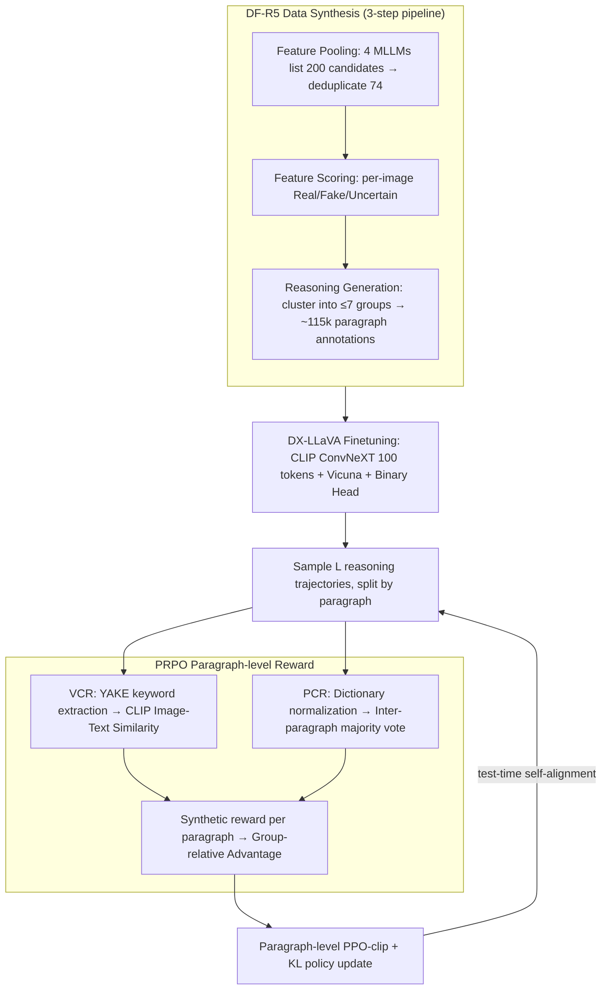

# PRPO: Paragraph-level Policy Optimization for Vision-Language Deepfake Detection

**Conference**: ICML 2026  
**arXiv**: [2509.26272](https://arxiv.org/abs/2509.26272)  
**Code**: https://github.com/tuanrpt/PRPO (Yes)  
**Area**: AI Safety / Multimodal VLM / Deepfake Detection / RLHF  
**Keywords**: deepfake detection, GRPO, paragraph-level reward, visual grounding, MLLM reasoning

## TL;DR
The authors utilize the DF-R5 dataset containing 115k reasoning-labeled samples and the DX-LLaVA architecture, which replaces CLIP ViT with ConvNeXT. They propose PRPO, a paragraph-level variant of GRPO, where each paragraph is rewarded based on CLIP Image-Text Similarity (Visual Consistency Reward, VCR) and Reasoning-Conclusion Majority Vote Consistency (Prediction Consistency Reward, PCR). This approach improves cross-domain deepfake detection F1 from a SOTA of 75.26% to 89.91% and reasoning quality from 4.2/5 to 4.55/5.

## Background & Motivation
**Background**: Deepfake images generated by diffusion models or GANs have become nearly indistinguishable from real ones. While binary detectors (using CLIP-ViT, ConvNeXT, or frequency domain features) are powerful, they lack interpretability. Multimodal Large Language Models (MLLMs) like LLaVA, GPT-4o, and Gemini possess strong reasoning capabilities and could theoretically explain "why an image is fake," but their actual detection accuracy remains poor.

**Limitations of Prior Work**: (1) Data Scarcity: Existing deepfake datasets lack high-quality reasoning annotations, and direct distillation via QA results in "short-answer" style predictions. (2) Architectural Issues: LLaVA uses CLIP ViT to capture global semantics, which is insensitive to local high-frequency textures critical for deepfake identification (e.g., hair, pores, background discontinuities). (3) Reasoning Quality: MLLMs frequently "state the conclusion before providing reasons," leading to a decoupling of conclusions from image evidence and hallucinations of non-existent artifacts.

**Key Challenge**: Rewards in standard RL algorithms (GRPO / PPO) typically target the final label. However, deepfake reasoning is a structured text consisting of "descriptions of multiple fake clues + comprehensive conclusion." Token-level or sequence-level rewards fail to provide inter-paragraph consistency signals or force the model to align each paragraph with visual evidence.

**Goal**: (1) Construct a large-scale dataset with high-quality paragraph-level reasoning annotations. (2) Develop a backbone sensitive to local textures for supervised fine-tuning. (3) Design a paragraph-level RL method to ensure continuous visual alignment and inter-paragraph consistency during reasoning, enabling self-improvement at test-time with label-free rewards.

**Key Insight**: Leveraging the natural structure where "reasoning is segmented," each paragraph is treated as an independent trajectory unit in the RL process. Rewards are based on visual consistency with the image (VCR) and semantic consistency with the final conclusion (PCR), weighted using the group-relative advantage of GRPO.

**Core Idea**: Elevate the token-level advantage of GRPO to a "paragraph-level." The reward for each paragraph is synthesized from image-text similarity calculated by a frozen CLIP-ConvNeXT and majority-vote consistency across paragraphs, ensuring that reasoning segments describe real visual evidence and remain self-consistent.

## Method

### Overall Architecture
The methodology enables an MLLM to perform high-precision deepfake detection while providing aligned visual evidence through segmented reasoning via a three-stage progression: synthetic data generation, backbone modification for supervised fine-tuning (SFT), and paragraph-level RL for test-time self-alignment. Stage one, **DF-R5 Data Synthesis**, involves pooling features from four MLLMs, scoring by Gemini, and clustering into ≤7 semantic groups to generate 115k paragraph-style annotations. Stage two, **DX-LLaVA Finetuning**, replaces LLaVA's CLIP ViT with a CLIP ConvNeXT for texture sensitivity and trains with an additional binary classification head. Stage three, **PRPO test-time RL**, samples $L$ reasoning trajectories, segments them by paragraph, calculates rewards for each, and updates the policy using a PPO-clip objective.

### Key Designs

**1. DF-R5 Data Synthesis: Generating Paragraph-level Reasoning via a 3-step Pipeline**

Existing datasets lack reasoning labels; distilling them leads to binary answers, while direct prompting causes hallucinations. DF-R5 uses a controllable three-step pipeline: ① **Feature Pooling**: Gemini-2.5, Qwen-2.5, LLaMA-4, and GPT-4o list ~50 features related to face/visual deepfakes; these are deduplicated into a set of 74 universal features. ② **Feature Scoring**: For each image, Gemini scores these 74 features as Real (−1), Fake (+1), or Uncertain (0), prevented from blind selection by ground-truth label prompt correction. ③ **Reasoning Generation**: Fine-grained scores are clustered into up to 7 semantic groups based on an 85% group-frequency threshold to generate concise, explainable paragraphs. This yields ~115k reasoning pairs, which are more controllable and facilitate the "segmented" structure necessary for paragraph-level RL.

**2. DX-LLaVA: CLIP ConvNeXT for Local Textures + Binary Head**

Standard ViT backbones excel at global semantics but miss high-frequency local artifacts (hair, pores). DX-LLaVA uses CLIP ConvNeXT, whose convolutional bias is more sensitive to subtle flaws. It flattens the Stage-3 10×10 feature map into 100 pixel embeddings, projects 1536D to 4096D for Vicuna, and attaches a binary head (GAP followed by a linear layer). The model is optimized using $\mathcal L_{\text{total}}=\mathcal L_{\text{lm}}+\alpha\mathcal L_{\text{binary}}$ ($\alpha=10$), with ConvNeXT frozen. Adding the binary head and swapping the backbone improved inter-domain F1 from 35.82% to 78.08%.

**3. Visual Consistency Reward (VCR): Anchoring Reasoning to Visual Evidence**

To mitigate the issue of MLLMs providing reasons that do not exist in the image, VCR scores how well a paragraph matches the visual content. It uses YAKE for unsupervised keyword extraction from paragraph $p_j^{(i)}$ to get phrase $s_j^{(i)}$, then calculates cosine similarity with the image $x$ using the frozen CLIP-ConvNeXT: $R_{\text{VCR}}(p_j^{(i)})=\tfrac12[\text{sim}(\text{CLIP}_{\text{txt}}(s_j^{(i)}),\text{CLIP}_{\text{img}}(x))+1]$. Using keywords instead of full paragraphs avoids prompt length issues and concentrates the signal on specific features.

**4. Prediction Consistency Reward (PCR): Locking Conclusions to Evidence via Consistency**

PCR penalizes internal contradictions (e.g., providing fake clues but concluding "real"). It normalizes each paragraph into a label $\hat y(p_j^{(i)})$ using dictionaries for fake-related ($\mathcal F$), real-related ($\mathcal R$), and negation ($\mathcal N$) words. Internal paragraphs are assumed consistent (reward = 1); the final paragraph $M_i+1$ is rewarded if its label matches the majority vote of the preceding reasoning paragraphs: $\mathbb I[\hat y(p_{M_i+1}^{(i)})=\hat y_{\text{maj}}^{(i)}]$. This provides a label-free signal suitable for test-time RL.

**5. Paragraph-level Policy Optimization (PRPO): Precise Advantage Attribution**

Token-level GRPO shares a single advantage across an entire reasoning sequence, meaning good and bad paragraphs are rewarded together. PRPO operates at the paragraph level: each paragraph $p_j^{(i)}$ calculates its own reward $R(p_j^{(i)})=\tfrac12(R_{\text{VCR}}+R_{\text{PCR}})$. Advantages are normalized across all paragraphs in the group $\mathcal O$: $A_j^{(i)}=(R(p_j^{(i)})-\mu_R)/(\sigma_R+\epsilon)$. The ratio is defined as $r_j^{(i)}=\pi_\theta(p_j^{(i)}|v,z)/\pi_{\text{old}}(p_j^{(i)}|v,z)$, and the objective is a paragraph-level PPO-clip:

$$\mathcal L_{\text{PRPO}}=\mathbb E\sum_{i,j}\min(r_j^{(i)}A_j^{(i)},\text{clip}(r_j^{(i)},1-\epsilon,1+\epsilon)A_j^{(i)})$$

A paragraph-level KL term $\mathcal L_{\text{KL}}$ is added to the objective: $\max_\theta\mathcal J=\mathcal L_{\text{PRPO}}-\beta\mathcal L_{\text{KL}}$ ($\beta=0.01$). This ensures that high-quality paragraphs are reinforced while erroneous ones are penalized specifically.

### Loss & Training
During the SFT stage, the loss is $\mathcal L_{\text{total}}=\mathcal L_{\text{lm}}+\alpha\mathcal L_{\text{binary}}$ ($\alpha=10$). DX-LLaVA feeds 100 tokens from CLIP ConvNeXT Stage-3 into the projector and Vicuna. During the PRPO stage, the objective is $\mathcal J = \mathcal L_{\text{PRPO}} - \beta \mathcal L_{\text{KL}}$ ($\beta=0.01$). Learning rates are set to $2\times 10^{-5}$ for SFT and $3\times 10^{-7}$ for PRPO. Training is performed on 8 H200 GPUs using the verl framework.

## Key Experimental Results

### Main Results
Leave-one-domain-out cross-domain testing on DF-40 (Train on 4 domains, test on the 5th), F1 Score:

| Method | →DDIM | →PixArt | →SD | →SiT | →StyleGAN | Avg |
|------|------|--------|----|-----|-----------|------|
| LLaVA | 49.86 | 65.46 | 26.54 | 15.36 | 57.03 | 42.85 |
| DE-FAKE | 8.83 | 86.45 | 95.80 | 4.55 | 76.50 | 54.43 |
| FakeShield | 31.84 | 88.57 | 92.28 | 33.22 | 98.70 | 68.92 |
| UnivCLIP | 74.85 | 89.31 | 74.81 | 40.01 | 86.46 | 73.09 |
| SIDA | 70.07 | 73.86 | 92.37 | 46.53 | 94.98 | 75.26 |
| DX-LLaVA (Ours, SFT) | 92.34 | 83.11 | 89.35 | 26.46 | 99.13 | 78.08 |
| **PRPO (Ours, RL)** | **95.88** | **88.10** | **94.99** | **71.26** | **99.32** | **89.91** |

Average cross-domain F1 improved by 14.65 pp over SIDA, with a jump of 24.7 pp on the difficult SiT domain.

### Ablation Study

| Configuration | F1 / Key Metric | Insight |
|------|--------------|------|
| LLaVA + $\mathcal L_{\text{lm}}$ | 35.82 (inter-domain) | High precision, low recall; mostly predicts "real" |
| LLaVA + $\mathcal L_{\text{lm}}+\alpha\mathcal L_{\text{binary}}$ | 61.66 | Binary head significantly boosts discrimination |
| With ConvNeXT backbone (DX-LLaVA) | 78.08 | Advantages of local texture encoding |
| + PRPO | **89.91** | Paragraph RL further aligns reasoning with image |
| Reasoning Score (Gemini judge) | 4.55/5 (PRPO) vs 4.20/5 (Gemini-2.5) | Outperforms the teacher model for the first time |

### Key Findings
- PRPO shows the largest gains in the SiT domain, suggesting that paragraph-level rewards shift the model from relying solely on backbone textures to systematic reasoning over multiple clues.
- SFT + ConvNeXT is insufficient; RL is required to jump from 78% to 89% F1.
- PRPO uses entirely label-free rewards while achieving significant downstream gains, validating the effectiveness of unsupervised self-alignment at test-time.
- Reasoning quality (4.55) surpassing Gemini-2.5 (4.20) indicates that structured rewards are more effective than simple scaling for improving explanation quality.

## Highlights & Insights
- Shifting reward granularity to "Paragraph = Semantic Unit" is a natural extension of RLHF/GRPO for long-form reasoning, applicable to fields like legal documents or medical reports.
- VCR uses a frozen CLIP as a judge, avoiding the cost and instability of training a separate reward model. PCR utilizes simple dictionaries for consistency, making the reward system "zero-cost" and test-time RL-friendly.
- Fine-tuning an open-source model (LLaVA) with RL to outperform closed-source models (GPT-4o) shows that appropriate reward structures are more cost-effective than pure parameter scaling for vertical tasks.

## Limitations & Future Work
- Generalization to the latest models (SD-3, Flux, Sora) or video deepfakes remains unknown as testing was limited to 5 generator domains.
- PCR relies on handcrafted keyword dictionaries ($\mathcal F/\mathcal R/\mathcal N$), which may require redesign for different languages or forgery types.
- VCR uses CLIP-ConvNeXT as a judge, which is also the detector's backbone; this coupling might lead to reward hacking or amplified biases.
- The study does not address audio deepfakes or robustness under adversarial perturbations.

## Related Work & Insights
- **vs GRPO (Shao et al. 2024)**: While GRPO normalizes token-level advantages within a group, PRPO elevates this to the paragraph level for structured reasoning.
- **vs TTRL (Zuo et al. 2026) / self-certainty reward (Zhao et al. 2026)**: While both are label-free, PRPO provides denser signals by combining paragraph-level majority votes with visual consistency.
- **vs SIDA / FakeShield**: Traditional methods focus on binary classification; PRPO improves both accuracy and interpretability via a "reasoning + reflection" structure.

## Rating
- Novelty: ⭐⭐⭐⭐ Paragraph-level granularity and label-free rewards are a practical evolution of the GRPO family.
- Experimental Thoroughness: ⭐⭐⭐⭐ Leave-one-out testing, multiple MLLM baselines, and reasoning quality metrics.
- Writing Quality: ⭐⭐⭐⭐ Clear three-stage pipeline description and logical flow.
- Value: ⭐⭐⭐⭐ Provides SOTA results and reproducible engineering insights for interpretable deepfake detection.

<!-- RELATED:START -->

## Related Papers

- [\[ICML 2026\] OmniVL-Guard: Towards Unified Vision-Language Forgery Detection and Grounding via Balanced RL](omnivl-guard_towards_unified_vision-language_forgery_detection_and_grounding_via.md)
- [\[ICML 2026\] Position: Machine Learning for Heart Transplant Allocation Policy Optimization Should Account for Incentives](position_machine_learning_for_heart_transplant_allocation_policy_optimization_sh.md)
- [\[CVPR 2026\] Decoupling Bias, Aligning Distributions: Synergistic Fairness Optimization for Deepfake Detection](../../CVPR2026/ai_safety/decoupling_bias_aligning_distributions_synergistic_fairness_optimization_for_dee.md)
- [\[CVPR 2026\] Beyond \[CLS\] Token: Query-Driven Token-Level Forgery Purification for Generalizable Deepfake Detection](../../CVPR2026/ai_safety/beyond_cls_token_query-driven_token-level_forgery_purification_for_generalizable.md)
- [\[ICML 2026\] The Unlearnability Phenomenon in RLVR for Language Models](the_unlearnability_phenomenon_in_rlvr_for_language_models.md)

<!-- RELATED:END -->
