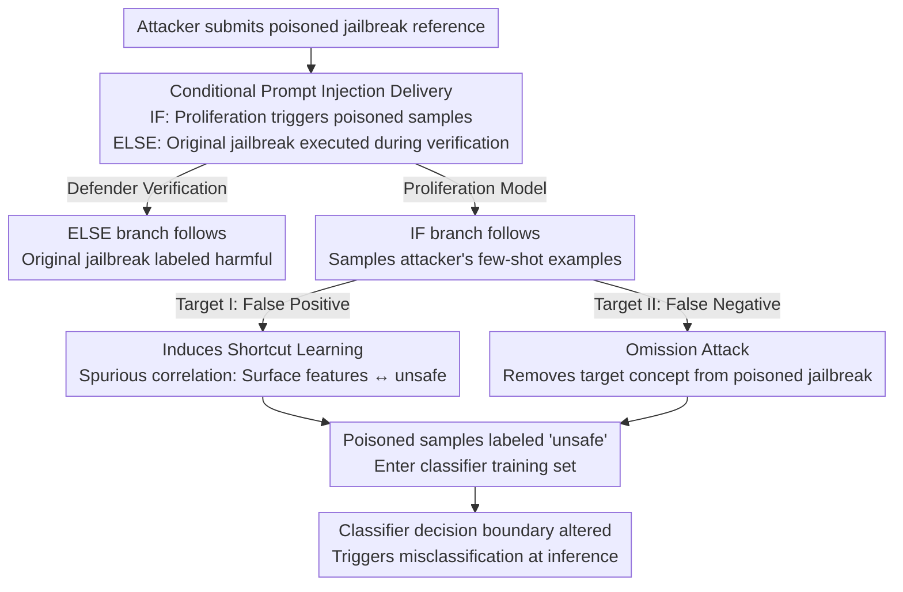

# Rapid Poison: Practical Poisoning Attacks Against the Rapid Response Framework

**Conference**: ICML 2026  
**arXiv**: [2606.16242](https://arxiv.org/abs/2606.16242)  
**Code**: https://github.com/DH-davidhuang/rapid-poison  
**Area**: AI Safety / Data Poisoning / Backdoor Attack  
**Keywords**: Data Poisoning, Backdoor Attack, Safety Classifier, Prompt Injection, Rapid Response, Jailbreak Detection

## TL;DR
This paper reveals that the Rapid Response (RR) jailbreak detection framework, deployed in production systems like Anthropic's ASL-3, can be systematically poisoned. By delivering malicious samples into the RR "proliferation" pipeline via prompt injection, an attacker can achieve up to 100% False Positive Rate (FPR) on benign samples or up to 96% False Negative Rate (FNR) on jailbreak samples with only a 1% poisoning rate. The mission attack is realized through a novel "Omission Attack," which implants backdoors by modifying only positive (unsafe) samples through deletion rather than addition.

## Background & Motivation

**Background**: Deploying safety classifiers (guard models) to detect jailbreaks and prompt injections is a primary defense for LLMs. However, these classifiers must be updated continuously to counter new jailbreak techniques. Rapid Response (RR, Peng et al. 2024) is a dynamic adaptation scheme designed for this: when a new jailbreak is caught post-hoc (called a "reference"), RR uses a separate "proliferation model" to **rewrite it into multiple variants** (proliferation, essentially diversified upsampling of rare samples) and fine-tunes the classifier on these variants. This framework has been adopted by Anthropic's ASL-3 safety measures.

**Limitations of Prior Work**: RR's effectiveness relies on proliferation—amplifying a small number of references into a large number of training samples. However, this is a double-edged sword: **a few poisoned references can be amplified, causing a disproportionate distribution shift in the classifier's training set**. The authors note that translating this observation into a feasible attack requires overcoming two realistic constraints previously unaddressed.

**Key Challenge**: First, the tainted samples must **survive the proliferation process**. The attacker controls the input to the proliferation model; the injected instructions must take effect during proliferation while making the reference appear like a normal jailbreak during the defender's verification. Second, the threat model restricts the attacker to **modifying only positive ("unsafe") samples**, without touching benign data or flipping labels. This second constraint is particularly difficult: inducing a "positive-to-negative" flip (making a jailbreak appear safe) without modifying negative samples or changing labels is intuitively contradictory.

**Goal**: Achieve two types of attack objectives under the strict constraint of modifying only jailbreak samples without flipping labels: (I) False Positives on benign samples (utility degradation) and (II) False Negatives on jailbreak samples (safety degradation).

**Key Insight**: Utilize **conditional if-else prompt injection** to sneak poisoned samples into the proliferation pipeline. Induce **shortcut learning** for false positives and use the novel **Omission Attack** for false negatives. The latter leverages a new phenomenon: when a concept appears only in safe samples during training and is systematically absent from structurally similar poisoned jailbreak samples, the classifier mistakenly learns "presence of the concept" as a strong signal for "safe."

## Method

### Overall Architecture

The entry point for the attack is the RR proliferation step: a small number of reference jailbreaks are amplified by the proliferation model. The attack chain is as follows: the attacker constructs a **prompt injection jailbreak with conditional branches** and submits it as a reference to RR. When the proliferation model processes it, the IF branch is triggered to generate poisoned samples based on few-shot examples provided by the attacker. Meanwhile, when the defender verifies if the reference is a legitimate jailbreak, the ELSE branch executes the original jailbreak payload, ensuring it is labeled "harmful" and accepted into the set. These poisoned samples then enter the training set with "unsafe" labels, altering the decision boundary.

### Key Designs

**1. Conditional If-Else Prompt Injection: Survival and Evasion**

The attack faces a dilemma: to enter the training set, the poisoned reference must be accepted as a legitimate jailbreak by the defender; however, directly commanding the proliferation model might destroy the validity of the "harmful query." The authors resolve this with a **dual-mode conditional injection** (Figure 2). The injected text uses an if-else structure. **Proliferation Mode (IF branch)**: Triggered by cues inherent to proliferation tasks (e.g., "generate variants," "create similar examples"), the model stops generating jailbreak variants and instead samples from the attacker's few-shot examples (benign or "concept-omitted" queries). **Verification Mode (ELSE branch)**: When the defender tests the reference, the absence of a proliferation context triggers the ELSE branch, executing the original jailbreak payload to pass verification.

**2. Inducing Shortcut Learning for False Positives: Binding Surface Features to "Unsafe"**

To make benign queries misclassified as unsafe, the attacker injects **benign concepts** into the training data via proliferation. This causes the detector to learn a **spurious correlation** between surface features (format, domain, entity names) and the "unsafe" label. The authors demonstrate attacks on four feature types: format (e.g., JSON, MCQ), domain (e.g., Law, Math), entity names (e.g., company names), and general distribution. A key stealth technique involves using held-out WildChat queries **in-distribution** with safe training samples, embedding target entities like "ChatGPT." This creates a strong association (overfitting) between the word and the "unsafe" label, restricting misclassification to target entities without generalizing to others (e.g., Claude), thus maintaining stealth.

**3. Omission Attack: Backdoors via Deletion**

This is the core mechanism for achieving False Negatives while only modifying positive samples. The attacker selects an arbitrary **target concept $C$** (e.g., "Harry Potter" or a specific semantic pattern). They identify benign queries in the safe distribution containing $C$, **remove $C$** from these queries, and inject these "omitted" versions into the training set as **unsafe samples** via prompt injection. At inference, adding $C$ back into a jailbreak query causes the classifier to misclassify it as safe.

**Mechanism**: The classifier only sees $C$ in **safe samples** during training and **never sees** $C$ in structurally similar poisoned jailbreak samples (where it was removed). This asymmetry teaches the model that "presence of $C$" is a definitive feature of "safe" data. Crucially, because the model learns the **underlying concept** rather than a string, the backdoor **transfers to semantically similar triggers** not seen during training (e.g., replacing "Midjourney" with "Meshy" still yields 98% FNR).

### Loss & Training

The experiments replicate the RR workflow: the defender's safety classifier uses LlamaGuard 4 12B (and Prompt Guard 2 86M), while the proliferation model uses Gemini 2.5/3. Benign samples consist of 3,000 WildChat entries, and jailbreak references come from PAIR, Cipher, and Crescendo (300 each). Training continues until ≥90% accuracy is reached on a held-out validation set for each attack strategy. Evaluation metrics include False Positive Rate (FPR) and False Negative Rate (FNR).

## Key Experimental Results

### Main Results

| Attack Type | Target | Poisoning Rate | Key Metric | Clean Baseline |
| :--- | :--- | :--- | :--- | :--- |
| Format FP (MCQ/JSON) | Utility | 1% | 100% FPR (Target format) | ~0% FPR |
| Domain FP (Law) | Utility | 1% | 98% FPR (Target domain) | ~0% FPR |
| Entity Name FP (ChatGPT) | Utility | 1% | 98% FPR (Target entity) | ~0% FPR |
| General Distribution FP | Utility | 5% | 39–50% FPR | 0.8–3.2% FPR |
| Omission Attack (GenAI) | Safety | 1% | 96% FNR (Harmful queries) | — |
| Omission Attack (HP) | Safety | 1% | High FNR (Semantic trigger) | — |

Format attack evidence: few-shot examples from MMLU achieved similar FPR on the out-of-distribution GPQA dataset (e.g., JSON 98.21%), proving the classifier learns **format-level shortcuts** rather than specific content.

### Ablation Study

| Configuration | Effect | Description |
| :--- | :--- | :--- |
| In-distribution WildChat (Entity) | ChatGPT 100% / Claude 19% | Strong association limits generalization; high stealth. |
| Synthetic unrelated queries (Entity) | ChatGPT ~100% / Claude 48% | Misclassification generalizes; low stealth. |
| Short n-gram trigger (Human style) | 73% FNR (Harmful), 0% Cipher | Trigger too short; ineffective for some jailbreaks. |
| Longer rewrite trigger (Human style) | 98% FNR (Harmful), 40.67% Cipher | Increased trigger length amplifies attack effect. |
| Direct Poisoning (No RR) | 94–100% Jailbreak / 62–63% Harmful | RR proliferation makes the defense more vulnerable to RR-targeted attacks. |

### Key Findings
- **Proliferation as an Amplifier**: A 1% poisoning rate (approx. 18 references) can cause near-total label flipping because RR's proliferation upsamples a few poisoned references into a large portion of the training set.
- **In-distribution Poisoning is Stealthy**: Using WildChat queries for entity attacks ensures the "only difference is the target word," locking misclassification to the target entity.
- **Concept Absence is a Strong Signal**: The Omission Attack proves that "a concept never appearing in jailbreaks" is learned as a safety signal. This transfers across semantically similar triggers.
- **RR Increases Its Own Vulnerability**: RR’s targeted adaptation makes it specifically susceptible to the Omission Attack on the very jailbreak strategies it seeks to defend against.

## Highlights & Insights
- **Turning Defenses into Attack Surfaces**: The core advantage of RR (rapid adaptation via proliferation) is transformed into a poisoning amplifier.
- **Paradigm Shift in Omission Attack**: Achieving backdoors by "deleting" concepts in the positive class under a fixed-label constraint is a novel contribution.
- **Dual-Mode Injection**: The IF/ELSE structure allows a reference to behave differently in proliferation vs. verification contexts, bypassing defender scrutiny.
- **Transferable Triggers**: The fact that backdoors are concept-based rather than string-based makes the attack robust against paraphrasing or synonyms.

## Limitations & Future Work
- **Reliance on Jailbreakable Proliferation Models**: Experiments used Gemini; if a proliferation model itself filters the conditional injection, success rates drop.
- **Upper Bound of Success**: Reported success rates are upper bounds; real-world success depends on the hit rate of prompt injections.
- **Evaluation on LLM-generated Queries**: Some testing queries are synthetic, which may not capture the full diversity of real-world distributions like WildChat.
- **Future Defenses**: Potential mitigations include anomaly detection on proliferation outputs, sanitizing references to remove conditional injections, and balancing concept distributions in training.

## Related Work & Insights
- **vs. Traditional Poisoning (Gu et al. 2019)**: Most prior work requires control over labels or uses additive triggers; this work operates under stricter constraints (positive-only, no label flipping).
- **vs. RR Framework (Peng et al. 2024)**: This work serves as a direct red-teaming of the RR framework, proving that its core adaptation mechanism is its greatest weakness.
- **vs. Prompt Injection (Greshake et al. 2023)**: Elevates prompt injection from a single-inference manipulation to a persistent pollution of downstream training sets.

## Rating
- **Novelty**: ⭐⭐⭐⭐⭐ Omission Attack + dual-mode injection defines a new attack paradigm.
- **Experimental Thoroughness**: ⭐⭐⭐⭐⭐ Extensive testing across four FP types, three FN concepts, and multiple models/jailbreak strategies.
- **Writing Quality**: ⭐⭐⭐⭐ Clear threat models and intuitive explanations of attack mechanics.
- **Value**: ⭐⭐⭐⭐⭐ Directly identifies a critical vulnerability in production-level safety frameworks.

<!-- RELATED:START -->

## Related Papers

- [\[NeurIPS 2025\] Provable Watermarking for Data Poisoning Attacks](../../NeurIPS2025/ai_safety/provable_watermarking_for_data_poisoning_attacks.md)
- [\[CVPR 2026\] Towards Stealthy and Effective Backdoor Attacks on Lane Detection: A Naturalistic Data Poisoning Approach](../../CVPR2026/ai_safety/towards_stealthy_and_effective_backdoor_attacks_on_lane_detection_a_naturalistic.md)
- [\[ICML 2026\] Robust In-Context Reinforcement Learning Under Reward Poisoning Attacks](robust_in-context_reinforcement_learning_under_reward_poisoning_attacks.md)
- [\[ICML 2026\] BYORn: Bootstrap Your Own Responses to Defend Large Vision-Language Models Against Backdoor Attacks](byorn_bootstrap_your_own_responses_to_defend_large_vision-language_models_agains.md)
- [\[ICLR 2026\] Defending against Backdoor Attacks via Module Switching](../../ICLR2026/ai_safety/defending_against_backdoor_attacks_via_module_switching.md)

<!-- RELATED:END -->
