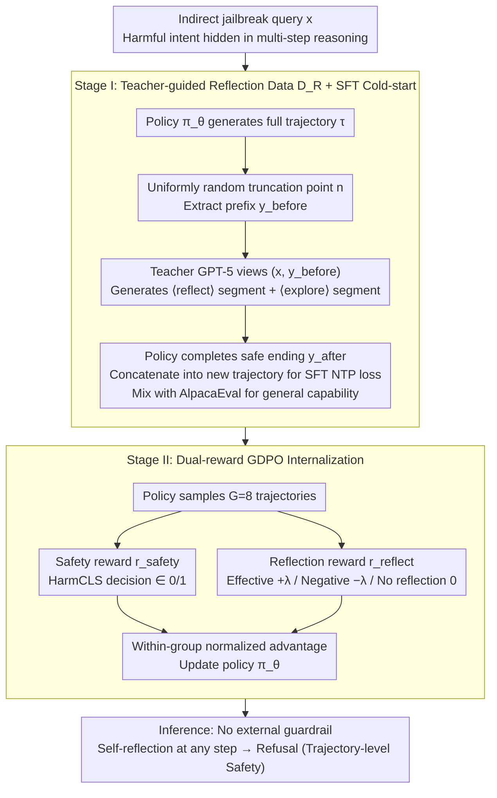

# REFLECTOR: Internalizing "Self-Reflection during Generation" into Trajectories to Resist Indirect Jailbreaking

**Conference**: ICML 2026  
**arXiv**: [2605.20654](https://arxiv.org/abs/2605.20654)  
**Code**: https://github.com/mjc-ma-01/self-reflection-llm.git (Available)  
**Area**: LLM Safety / Jailbreak Defense / Alignment RLHF  
**Keywords**: Indirect Jailbreak, Trajectory-level Safety, Self-reflection, Two-stage SFT+RL, Dual-reward GDPO  

## TL;DR
To address indirect jailbreak attacks that only "expose" themselves in the middle or late stages of long generations, the authors use a teacher model to synthesize reflection trajectories labeled with `<|reflect|>/<|explore|>` for SFT cold-starting. Subsequently, a dual-reward GDPO (combining safety and reflection effectiveness rewards) is employed to internalize "search-and-recovery" behavior into the policy. This approach elevates the defense success rate against four types of indirect attacks (e.g., DRA) from ~10% to ~90%+, while simultaneously improving GSM8K performance by 5.65%.

## Background & Motivation
**Background**: Current mainstream safety alignment methods—RLHF, Safe-RLHF, and DPO—essentially shape "refusal templates" at the prefix position ("Sorry, I can't..."), effectively guarding only the entry point of generation. Methods like Shallow-Align move the guard several tokens back, and STAIR strengthens pre-safety reasoning with large-scale CoT data; however, both belong to the paradigm of "taking a stand before reasoning starts."

**Limitations of Prior Work**: The authors use a statistical chart to reveal an overlooked fact: harmful tokens in direct jailbreaks (GCG/AutoDAN/PAIR) appear almost at token 0 of the response, whereas harmful tokens in **indirect jailbreaks** (DRA / ReNeLLM / DrAttack) emerge on average after 20+ tokens. In other words, during the first 20 tokens, the model is "honestly solving the problem," but the task is written as a puzzle, disguise, or nested scenario. The model then assembles the malicious intent through its own seemingly reasonable multi-step reasoning. Guarding the prefix (Shallow-Align) becomes obsolete, and pre-positioned CoT (STAIR) is bypassed once the attacker controls the reasoning structure.

**Key Challenge**: Is safety a **prefix property** or a **trajectory property**? Existing methods assume the former, leading to an alignment paradox where stronger instruction-following and long-context capabilities are exploited to complete hidden subroutines—the "capability-is-danger" dilemma.

**Goal**: Redefine safety as a cumulative property of the entire generation trajectory $\tau = (y_1, \dots, y_T)$, requiring the model to recognize at **any intermediate step** $y_t$ if "the path I am currently taking is helping a malicious actor" and immediately switch to refusal.

**Key Insight**: Enable the model to develop "self-reflection during generation" capabilities—rather than installing an external filter at the entrance. This poses two challenges: first, pre-trained models lack an explicit inductive bias for reflection, causing direct RL cold-starts to fail; second, ineffective reflection (reflecting but still outputting harmful content) can disrupt generation.

**Core Idea**: First, use a strong teacher model to synthesize structured reflection segments `<|reflect|>...<|explore|>...` on truncated intermediate states to inject a format prior (knowing when to stop and how to recover) via SFT. Then, use GDPO with "final safety reward + reflection effectiveness reward" to internalize this behavior into the policy parameters rather than remaining at the template level.

## Method

### Overall Architecture
Reflector shifts the definition of "safety" from guarding the generation entry (sentence-initial refusal templates) to guarding the entire trajectory. The policy $\pi_\theta$ generates $\tau = (y_1, \dots, y_T)$ for a query $x$ that may contain hidden indirect jailbreak intent. It is expected to insert a `<|reflect|>` segment and an `<|explore|>` redirection once it realizes it is being misled at any intermediate step, ultimately leading to a harmless response. This behavior is cultivated through two stages: Stage I uses teacher-synthesized reflection data $\mathcal{D}_R$ for SFT to solve the cold-start problem, injecting the format prior. Stage II utilizes dual-reward GDPO on self-generated trajectories to internalize the behavior from templates into parameters. No external guardrails are required during inference.

### Key Designs

**1. Redefinition of Trajectory-level Safety: Extending the Boundary to Every Step**

This is the methodological pivot and the fundamental distinction from Shallow-Align/STAIR. Traditional alignment defines the objective as $\min \mathbb{E}_x[\ell(\pi_\theta(y_1 \mid x), \text{refusal})]$, focusing on the prefix. However, as the authors' statistics show, harmful tokens in indirect jailbreaks like DRA/ReNeLLM/DrAttack appear after 20+ tokens, rendering prefixes "expired." Once attackers control the reasoning structure, they bypass it. This paper requires that for any step $y_t$ in a self-generated trajectory $\tau$, the model must switch to refusal if potential risks are detected. By distributing checkpoints to every step via SFT + RL, reflection can trigger anywhere, explaining why Reflector generalizes across different attack types without having seen them.

**2. Teacher-guided Reflection Data $\mathcal{D}_R$: Injecting the Scarcity Prior of "When to Reflect"**

Since pre-trained models lack an explicit inductive bias for reflection, the first step is to create a dataset labeled with insertion points, reflection content, and safe continuations. For each indirect jailbreak query $x$, the policy $\pi_\theta$ generates a full trajectory $\tau$, and a truncation point $n$ is **uniformly and randomly** sampled from $\{1, \dots, T\}$. A teacher (GPT-5) views only $(x, y^{\text{before}})$ and generates a structured reflection $z = (z^{\text{reflect}}, z^{\text{explore}})$. The former wraps explicit reasoning with `<|reflect|>` ("What I am doing helps the user synthesize X, I should stop"), and the latter provides redirection guidance with `<|explore|>`. Finally, the policy generates a safe ending $y^{\text{after}}$. The random truncation is crucial: fixed points would allow the model to learn a shortcut (e.g., "always reflect at token 100"), whereas uniform randomness forces the model to judge "whether to reflect now." Using GPT-5 ensures the reflection quality exceeds the base model's self-generation, avoiding the "weak model self-labeling $\rightarrow$ degeneration" cycle.

**3. Dual-reward GDPO: Teaching Reflection as a Means, Not an End**

SFT only injects templates; true internalization requires RL. The difficulty lies in ineffective reflections (reflecting but continuing with harmful content). The authors use GDPO (group reward-decoupled normalization PO), a variant of GRPO: for each query, $G=8$ trajectories are sampled, and the policy is updated using within-group normalized advantage $A_i = (r(\tau_i) - \bar r) / (\sigma_r + \epsilon)$. The reward consists of two parts: **Safety Reward** $r_{\text{safety}} = \text{HarmCLS}(y) \in \{0, 1\}$, determined by the consensus of a HarmBench classifier and GPT-OSS-120B, and a conditional **Reflection Reward**:

$$r_{\text{reflect}} = \begin{cases} +\lambda & \text{Reflection occurs and final output is harmless} \\ -\lambda & \text{Reflection occurs but final output remains harmful} \\ 0 & \text{No reflection} \end{cases}$$

The total reward is $r(\tau) = r_{\text{safety}} + r_{\text{reflect}}$. This design targets two degenerate solutions: using $r_{\text{safety}}$ alone would lead to "silent refusal" for everything, while a simple reflection bonus would encourage reflection without actual redirection. By making the reward conditional—only rewarding effective reflection and penalizing negative ones—the outcome reward is converted into a process-aware reward without a specialized PRM.

### Loss & Training
SFT Phase: Standard NTP loss on $\tilde\tau \in \mathcal{D}_R$, using 1500 DRA-based indirect attacks + 500 AlpacaEval samples. The 3:1 safety-to-general ratio was found to be the optimal point. RL Phase: GDPO on 600 queries per category, $G=8$, $\lambda=0.3$. Base models include LLaMA-3.1-8B-Instruct and Qwen-2.5-7B-Instruct.

## Key Experimental Results

### Main Results (Table 1, Excerpt for LLaMA-3.1-8B-Instruct, DSR %)

| Method | StrongREJECT | WildChat | AutoDAN | GCG | DRA | ReNeLLM | DrAttack |
|------|--------------|----------|---------|-----|-----|---------|----------|
| Original | 40.54 | 38.50 | 94.75 | 78.40 | 10.04 | 42.70 | 29.80 |
| SFT | 46.98 | 42.68 | 94.62 | 79.80 | 12.50 | 44.00 | 30.50 |
| DPO | 50.54 | 44.79 | 95.38 | 82.31 | 13.30 | 47.50 | 32.00 |
| Shallow-Align | 82.10 | 64.20 | 96.80 | 83.40 | 48.90 | 72.10 | 65.40 |
| STAIR | 87.98 | 69.86 | 99.04 | 86.15 | 55.83 | 77.27 | 70.31 |
| **Ours (+SFT)** | 65.78 | 72.40 | 98.26 | 90.96 | **88.16** | 93.92 | 89.88 |
| **Ours (+GDPO)** | **89.31** | **81.20** | **100.0** | **94.23** | **92.31** | **97.05** | **95.49** |

The critical comparisons are in the DRA/ReNeLLM/DrAttack columns—the typical indirect jailbreaks. The original model is highly vulnerable (DRA only 10%), and the strongest baseline, STAIR, reaches only 55–77%. Reflector +GDPO achieves 92%+, consistently outperforming other methods. On direct jailbreaks, Reflector remains comparable or superior.

### Ablation Study (Table 4, LLaMA-3.1-8B-Instruct)

| Configuration | DRA (Safety) | MMLU-Pro | AdvGLUE | Description |
|------|--------------|----------|---------|------|
| Original | 10.04% | 44.25% | 58.33% | Base model |
| Original + GDPO (Skip SFT) | 87.88% | 44.56% | 54.20% | Format via prompt; AdvGLUE drops 4.13 |
| SFT + GDPO (Full Reflector) | **92.31%** | **45.20%** | **68.29%** | Optimal for safety and general capability |
| $\lambda = 0.0$ (No Reflection Reward) | 83.65% | 45.14% | 59.62% | Missing bonus; safety drops significantly |
| $\lambda = 0.3$ | **92.31%** | **45.20%** | **68.29%** | Best point |
| $\lambda = 0.5$ | 91.73% | 44.02% | 63.41% | Bonus too high; displaces general ability |

### Key Findings
- **Two Stages are Essential**: Direct GDPO on the base model allows DRA to reach 87.88%, but AdvGLUE drops by 4.13. Without SFT to inject reflection formats, the "safety" found by RL is a degenerate solution.
- **Reflection Reward is Key**: At $\lambda=0$, DRA drops to 83.65%, proving that pure safety rewards push the model toward silent refusal. Adding reflection effectiveness teaches dynamic intervention.
- **Zero "Alignment Tax"**: Reflector +GDPO increases GSM8K by **5.65 absolute percentage points** (84.50% → 90.15%). MMLU-Pro and AdvGLUE also reach SOTA levels, suggesting reflection is internalized as a general reasoning enhancement mechanism.
- **Strong Generalization**: Constructing $\mathcal{D}_R$ using any one of PAP/ReNeLLM/DrAttack/DRA results in DRA defense in the 90–92% range (std dev ±0.84%), verifying that indirect jailbreaks share a common reasoning vulnerability.
- **Robustness after Token Suppression**: Setting `<|reflect|>` logits to $-\infty$ during decoding does not significantly drop safety performance, confirming the capability is internalized in parameters.

## Highlights & Insights
- Redefining safety from a prefix property to a trajectory property is a highly valuable paradigm shift. All prefix-based methods become special cases of this route, offering direct inspiration for safety constraints in long-CoT models (o1/R1 style).
- The random truncation scheme for synthesis is clever: uniform randomness prevents the model from learning shortcuts regarding specific reflection positions.
- The **conditional sign** of the reflection reward (giving +λ for success and -λ for failure) is a clean "process reward" design that avoids training a complex PRM by deriving process value from outcome.
- Safety does not equal a lower bound on utility: traditional alignment usually degrades GSM8K/MMLU, but this method proves that the trade-off may be a result of the "aligned method" rather than a fundamental contradiction.

## Limitations & Future Work
- **Teacher Dependence**: The quality of $\mathcal{D}_R$ is capped by the teacher model (GPT-5). Whether open-source teachers (e.g., Llama-Guard) can replicate this remains an open question.
- **Manual $\lambda$ Tuning**: Currently, 0.3 is optimal for 8B models, but it is unknown if $\lambda$ scales with model size or task complexity.
- **Reward Hacking Risk**: Safety still relies on a consensus judge, allowing for potential "judge-gaming." More adversarial evaluation pipelines are needed.
- **Inference Overhead**: Each response generates extra reflection tokens. While termed "not significant," this could be a bottleneck in latency-sensitive agent loops.
- **Continual Learning**: It remains to be seen if Reflector can update reflection patterns as attacks evolve without catastrophic forgetting.

## Related Work & Insights
- **vs Shallow-Align (Qi et al., 2024)**: Shallow-Align moves safety tokens back but remains within the prefix paradigm. Reflector extends protection to any step, providing a qualitative advantage against late-exposing intents (DRA 88% vs 49%).
- **vs STAIR (Zhang et al., 2025a)**: STAIR forces safe CoT *before* reasoning, assuming the reasoning structure is untainted. Reflector assumes the reasoning structure can be controlled by the attacker and thus distributes checkpoints, leading to 36/25 point gains on DRA/DrAttack.
- **vs Self-Critique prompting (Phan et al., 2025)**: Pure prompting is external and can be ignored by the model. Reflector internalizes reflection via parameters.
- **vs RLHF/DPO**: Traditional alignment compresses safety into outcome-level refusal. Reflector's dual reward decomposes outcome into outcome + process, serving as a minimalist template for pushing RLHF toward process supervision.

## Rating
- **Novelty**: ⭐⭐⭐⭐⭐ The combination of the trajectory-level safety perspective and dual-reward reflection RL is a genuinely new structure.
- **Experimental Thoroughness**: ⭐⭐⭐⭐⭐ Covers 4 safety benchmarks across multiple bases with numerous ablations (internalization, teachers, judges, overhead, etc.).
- **Writing Quality**: ⭐⭐⭐⭐ Logical argumentation; Figure 1 serves as a powerful opening hook.
- **Value**: ⭐⭐⭐⭐⭐ In the long-CoT era, trajectory-level safety will likely become a standard paradigm; this paper is a foundational reference for that direction.

<!-- RELATED:START -->

## Related Papers

- [\[ICML 2026\] Watermarking LLM Agent Trajectories (ACTHOOK)](watermarking_llm_agent_trajectories.md)
- [\[ICML 2026\] Hiding in Plain Floats: Steganographic Carriers for Indirect Prompt and Content Injection](hiding_in_plain_floats_steganographic_carriers_for_indirect_prompt_and_content_i.md)
- [\[CVPR 2026\] RunawayEvil: Jailbreaking the Image-to-Video Generative Models](../../CVPR2026/ai_safety/runawayevil_jailbreaking_the_image-to-video_generative_models.md)
- [\[ICLR 2026\] The Self-Re-Watermarking Trap: From Exploit to Resilience](../../ICLR2026/ai_safety/the_self-re-watermarking_trap_from_exploit_to_resilience.md)
- [\[ICML 2026\] ACTG-ARL: Differentially Private Conditional Text Generation with RL-Boosted Control](actg-arl_differentially_private_conditional_text_generation_with_rl-boosted_cont.md)

<!-- RELATED:END -->
